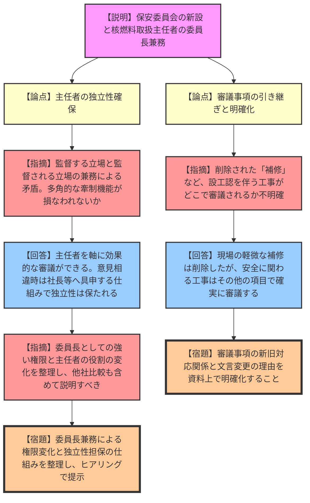
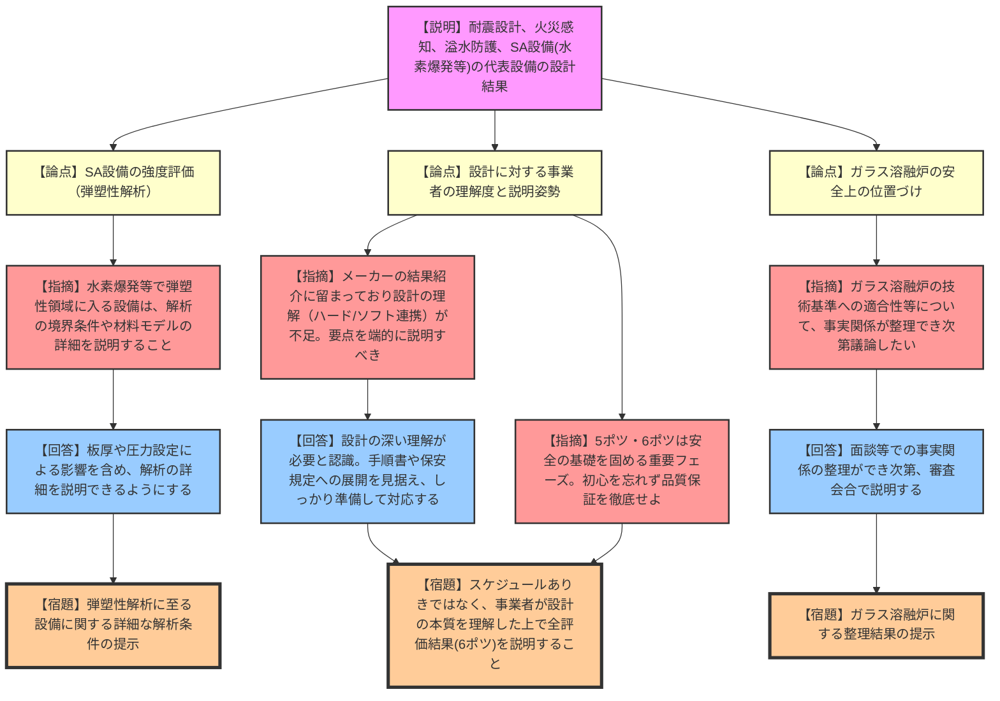

# 第574回核燃料施設等の新規制基準適合性に係る審査会合（令和8年3月9日）
> 出典 : https://youtube.com/live/FRSx1uJHtM8?si=DvaVMqyRMT-uTfao

## 1. 会合の概要
*   **最大の争点:**
    *   【三菱原子燃料】保安規定変更における、核燃料取扱主任者の独立性確保の妥当性。
    *   【日本原燃】再処理施設等の設工認申請における、耐震設計（大口径配管の検査間隔見直し等）と重大事故等対処設備の強度評価（弾塑性解析の詳細確認等）の妥当性。および、設計結果に対する事業者の理解度。
*   **審査の進捗状況:**
    *   【三菱原子燃料】保安に関する審議体を変更し、核燃料取扱主任者が委員長を兼務することについて、合理化のメリットは示されたものの、独立性や牽制機能の担保に関する説明が不十分であり、次回以降のヒアリングで整理・再説明することとなった。
    *   【日本原燃】代表設備の設計結果が提示され、現時点では大きな論点はないとされた。しかし、事業者側の設計に対する技術的理解が「結果の紹介レベル」に留まっているとの厳しい指摘があり、今後は設計の中身（ハード・ソフト両面）を深く理解した上での丁寧な説明が求められた。
*   **規制側の納得度:**
    *   三菱原子燃料に対しては、主任者の独立性が損なわれる懸念が払拭されておらず、納得には至っていない。
    *   日本原燃に対しては、評価結果そのものよりも、事業者の「設計への理解度」と「端的に要点を説明する姿勢」に対して強い不満が示され、体制の引き締めが要求された。

---

## 2. 議題の詳細整理

### 【議題1】三菱原子燃料株式会社の保安規定変更認可申請について

*   **議論の背景と論点:**
    保安組織の変更として、安全衛生委員会から保安審議を分離し「原子力保安委員会」を新設、その委員長に「核燃料取扱主任者」を充てる変更が申請された。委員長を兼務することで、主任者としての「独立性（牽制機能、他委員の意見へのバイアス、自己監督の矛盾）」が損なわれないかが争点となった。

*   **質疑応答（詳細）:**
    *   **【論点：核燃料取扱主任者の独立性】**
        *   【規制側（鈴木）】: 主任者が委員長を兼務することで、監督される立場（委員長）を監督する立場（主任者）が務める矛盾が生じる。また、審議の合理化を理由に、独立性や多角的な視点（QMS上のプロセス）が損なわれるのではないか。
        *   【説明者側（三菱原子燃料 近野・齋藤）】: 委員長を務めることで主任者の意見を軸に効果的な審議ができるメリットがある。意見の相違があれば議事録を分け、管理総括者や社長へ意見具申する仕組みがあるため独立性は失われない。業務負荷も補佐部門が担うため問題ない。他社事例も参考にしている。
        *   【規制側（金城）】: 委員長は委員会を総理する強い権限を持つ。主任者が単なる委員から委員長に変わることで、その権限と役割がどう変わるのか、他社事例との比較も含めてしっかり整理し、ヒアリング等で事実関係を説明すべき。
        *   【説明者側（三菱原子燃料 齋藤）】: 指摘を踏まえ、より適切な内容で認可いただけるよう調整し説明する。

    *   **【論点：審議事項の引き継ぎ（補修の扱い）】**
        *   【規制側（鈴木）】: 旧委員会から新委員会へ審議事項が不足なく引き継がれるか。特に「補修」という文言が削除されているが、設工認を伴う補修はどこで審議されるのか不明確である。
        *   【説明者側（三菱原子燃料 近野）】: 現場の作業員が行う軽微な補修は文言から削除したが、安全に関わる設工認対象の工事は「その他の保安に関する審議事項」等で確実に審議される仕組みを二次文書で維持する。
        *   【規制側（澤田）】: 審議事項が減っていないことは理解したが、文言変更の理由や新旧対応関係が資料上で確認できるよう整理して提示すること。

*   **結論と宿題事項:**
    *   **結論:** 保安規定変更の合理化メリットは理解されたが、主任者の独立性や権限の変化に関する説明が不足しているため、持ち越しとなった。
    *   **宿題事項:**
        1. 主任者が委員長を兼務することによる役割・権限の変化、および独立性の担保の仕組み（他社比較を含む）を整理し、ヒアリングで提示すること。
        2. 委員会の審議事項の新旧対応関係（削除された「補修」の扱い等）を資料上で明確にすること。

---

### 【議題2】日本原燃株式会社再処理事業所再処理施設及び廃棄物管理施設の設計及び工事の計画の認可申請について

*   **議論の背景と論点:**
    設工認申請のうち、耐震設計、火災感知、溢水・化学薬品防護、重大事故等対処設備の材料・構造（水素爆発時の強度評価等）について、代表設備の具体的な設計結果が説明された。評価手法の妥当性とともに、膨大な資料に対する事業者の「設計への理解度」と「説明の質」が厳しく問われた。

*   **質疑応答（詳細）:**
    *   **【論点：耐震設計（建物・構築物、機器・配管系）】**
        *   【規制側（浜杉・小野）】: 建物・構築物について1.2Ss評価以外は特段の論点はない。機器・配管系も含め、未提示の施設や隣接影響・水平2方向の影響評価を計画的に提示すること。
        *   【説明者側（日本原燃）】: 承知した。順次提示していく。

    *   **【論点：重大事故等対処設備の材料・構造（水素爆発の強度評価）】**
        *   【規制側（安田）】: 円筒形槽の水素爆発評価（0.5MPa、1.0秒）は、再処理施設の爆燃レベルの比較的小さな圧力荷重に限定してLS-DYNA等による弾塑性解析が適用可能であることを確認した。今後、他の設備で弾塑性領域に入るものが出てきた場合、非線形領域に入った理由や入力条件、材料モデル、境界条件等の解析の詳細を追加で説明すること。
        *   【説明者側（日本原燃 玉内）】: 0.5MPaは再処理工場を対象とした保守的な設定である。弾塑性領域に入る条件（板厚や圧力など）については、詳細を説明できるようにする。

    *   **【論点：設計結果に対する事業者の理解度と説明姿勢】**
        *   【規制側（長谷川）】: 現時点で論点はないものの、事業者の説明が「メーカーがやった結果の紹介」レベルに留まっており、設計の中身（機器がどう判断し稼働するか等）の理解が不足している。要点を端的にまとめることもできていない。今後、手順書や保安規定への展開を見据え、ハードとソフト両面の理解を深めた上で、質問にその場で答えられるよう準備すること。
        *   【説明者側（日本原燃 結城・長谷川）】: 指摘の通り、設計をしっかり理解する技術ベースが必要と認識している。丁寧に理解を深めた上で説明できるよう準備する。
        *   【規制側（熊谷）】: 5ポツ・6ポツの段階は原子力安全上の基礎を固める非常に重要なフェーズである。福島第一原発事故の教訓（初心）を忘れず、品質保証体制を効かせて対応すること。また、ガラス溶融炉の安全上の位置づけ等についても、事実関係の整理ができ次第議論したい。

*   **結論と宿題事項:**
    *   **結論:** 各代表設備の具体的な設計結果（5ポツ）については現時点で特段の論点はないとされたが、今後提示される全評価結果（6ポツ）に向けて、事業者の技術的理解度の向上が強く求められた。
    *   **宿題事項:**
        1. 耐震設計において、未提示の施設や隣接影響等の評価結果を順次提示すること。
        2. 水素爆発等の評価で弾塑性解析を用いる設備について、非線形領域に至る解析条件の詳細を説明すること。
        3. メーカー任せにせず、事業者自身が設計の要点（ハード・ソフトの連携）を深く理解し、的確に説明できる準備を整えること。
        4. ガラス溶融炉の技術基準への適合性等について、事実関係の整理がつき次第説明すること。

---

## 3. 論理構造の可視化（Mermaid）

### 議題1: 三菱原子燃料 保安規定の変更

### 議題2: 日本原燃 設工認申請の対応状況

