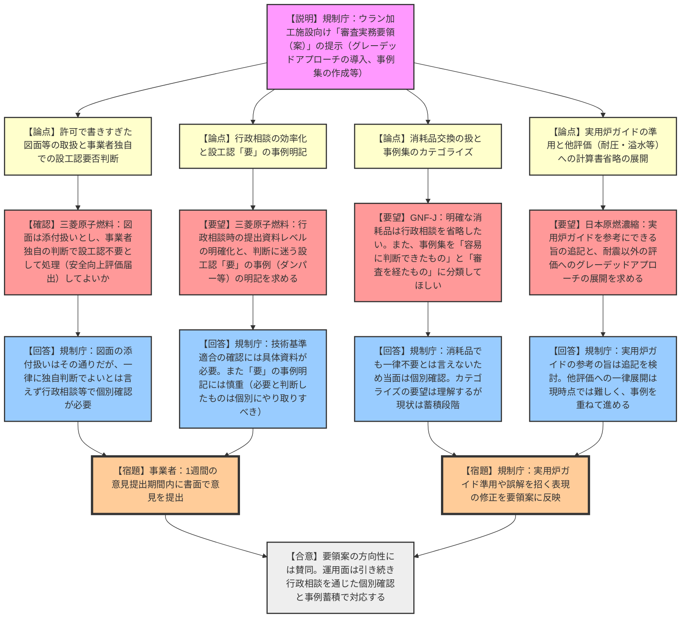

# 第2回ウラン加工事業者との意見交換会（令和8年3月10日）
> 出典 : https://youtube.com/live/hkf-XlMxEL8?si=QEsRpqs7pR6vTqw7

## 1. 会合の概要
*   **最大の争点:** 規制庁が新たに提示した「審査実務要領（案）」における、設工認（設計及び工事の計画の認可）申請の要否判断の明確化と、過去の事業許可で「詳細に書きすぎた事項」の合理的な取扱い（グレーデッドアプローチの適用）。
*   **審査の進捗状況:** IAEAのIRRS（総合規制評価サービス）からの提言を受け、安全上重要な施設を有しないウラン加工施設向けの審査実務要領案が示された。事業者からは規制の合理化に向けた本取り組みへの歓迎と期待が示される一方、現場の運用をスムーズにするための多数の要望（事例のカテゴライズ、実用炉ガイドの準用、要否判断の「微妙な事例」の明記など）が提出された。
*   **規制側の納得度:** 規制庁は事業者の要望（行政相談の円滑化や判断基準の言語化）に理解を示しつつも、現時点では「事例の蓄積段階」であるとし、一律の基準化や事業者の独自判断による処理（行政相談の省略）には慎重な姿勢を崩さなかった。「行政相談を通じた個別確認」を原則として安全性を担保するスタンスを維持している。
*   **特筆すべき決定事項:** 今後、設備図面等は原則として「添付資料扱い」とすること、判断に迷う際は実用炉の設工認ガイド等を参考にできる旨を要領に追記検討すること、および本日から1週間の意見提出期間を設けることが確認された。

---

## 2. 議題の詳細整理

**【議題1】「ウラン加工施設における炉規法第16条の２に基づく設計及び工事計画の認可に係る審査実務要領（案）」の制定について**

*   **議論の背景と論点:**
    約3年半前の意見交換会での事業者からの要望（安全上の重要度に応じた合理的な規制）や、IAEA（IRRS）からのガイダンス策定の提言を受け、規制庁が審査実務要領（案）を作成した。設工認の要否判断（技術基準への適合性に影響を及ぼさないことが明らかな場合）の基準、許可段階で詳細に書きすぎた記載の適正化プロセス、および事例集の効果的な活用方法が技術的・手続き的な争点となった。

*   **質疑応答（詳細）:**
    *   **【論点：許可で「書きすぎた」事項（図面等）の取扱と事業者独自判断】**
        *   【説明者側（三菱原子燃料 齊藤・長俊）】: 許可本文に書きすぎてしまった図面等について、今後は「添付資料扱い」となり、軽微な変更等について改めての設工認申請は不要になるという解釈でよいか。また、事業者独自に設工認不要と判断し、安全性向上評価の届出の中で処理してよいか。
        *   【規制側（吉田・澤田）】: 図面を添付資料扱いと明確にするのは本要領の要素の一つであり、基本的な考え方はその通り。しかし、一律に事業者独自の判断で完結してよいとは言えず、一つ一つ確認する必要がある。
    *   **【論点：行政相談のレベル感と「微妙な事例」の明記】**
        *   【説明者側（三菱原子燃料 齊藤・長俊）】: 行政相談をスムーズに行うため、開示情報の程度を明確にしてほしい。また、設工認「不要」だけでなく、「要」と判断された微妙な事例（ダンパー等）も事例集に入れてほしい。
        *   【規制側（澤田・吉田）】: 事前相談の資料の程度を一律に示すのは難しい。技術基準に影響がないことを示すには具体的な資料が必要。設工認「要」の微妙な事例を載せることについては現時点では慎重。必要と判断したものは個別にやり取りして認可対象とすべきと考えている。
    *   **【論点：消耗品の交換と事例のカテゴライズ】**
        *   【説明者側（GNF-J 磯部）】: フィルター交換のようにスペックが明確な消耗品は、行政相談なしで設工認不要と判断してよいか。また、事例集の中で、判断が容易だったもの（消耗品）と審査を経て不要となったもの（竜巻防護フェンス等）をカテゴライズして軽重をつけてはどうか。
        *   【規制側（吉田・澤田）】: 消耗品という共通認識はあるが、材質の違い等もあるため一律に不要とは言い切れない。当面は行政相談で「保全の中でやる」と伝える等、一つ一つ確認していく。明らかになれば将来的に規定化していく。カテゴライズの要望は理解するが、現状は共通認識のもと行政相談の中で考えていく段階である。
    *   **【論点：実用炉ガイドの準用とグレーデッドアプローチの他分野への展開】**
        *   【説明者側（日本原燃濃縮 坂本）】: 要領6ページの記載が強制的と読めるため修正してほしい。また、判断に悩む際、実用炉のガイドや別表を参考にできる旨を記載してほしい。さらに、耐震Sクラス以外の設備で計算書添付不要とする整理を、耐圧強度や溢水等にも展開してほしい。
        *   【規制側（吉田・澤田）】: 表現は検討する。実用炉のガイドを参考にできる旨を追記することは前向きに検討する。他の評価（耐圧、溢水等）へのグレーデッドアプローチの一律展開は、行政相談等で出たものを詰め込んでいる段階であり、すぐには難しい。事例を重ねて進める。
    *   **【論点：事例集の今後のメンテナンス】**
        *   【説明者側（原子燃料工業 土内）】: 事例集のメンテナンスについて、規制側リードか、事業者が考え方をまとめて提案する事業者主導の形にするか、実効的な方法を考えたい。
        *   【規制側（澤田）】: 事例集は少なくとも年1回はHPで公表・更新する予定。事業者主導で考え方をまとめて我々に提案いただくのも一つの良い方法である。

*   **結論と宿題事項（アクションアイテム）:**
    *   **結論:** 「審査実務要領（案）」の導入による規制の合理化方針については双方が合意。ただし、設工認要否の具体的な判断は、引き続き行政相談を通じて個別に確認し、事例を蓄積していく方針が維持された。
    *   **宿題事項（規制庁）:**
        *   実用炉の設工認ガイド等を参考にできる旨の記載追加を検討する。
        *   許可の添付資料における設工認不要の考え方について、許可本文との違いが明確になるよう文言を修正する。
        *   要領6ページの「強制」と受け取られかねない表現の修正を検討する。
    *   **宿題事項（全事業者）:**
        *   本日から1週間（来週月曜まで）の意見提出期間内に、要領案に対する書面での具体的な意見・要望を事務局へ提出する。

---

## 3. 論理構造の可視化（Mermaid）

