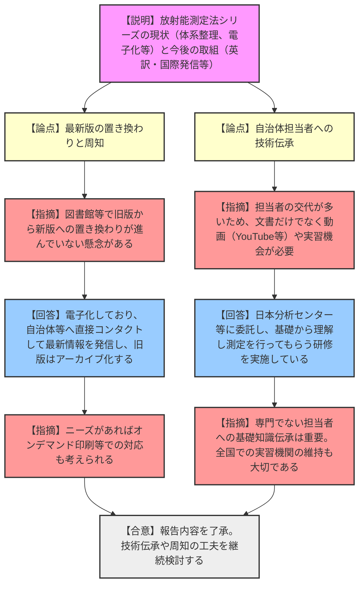
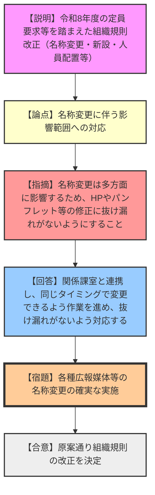
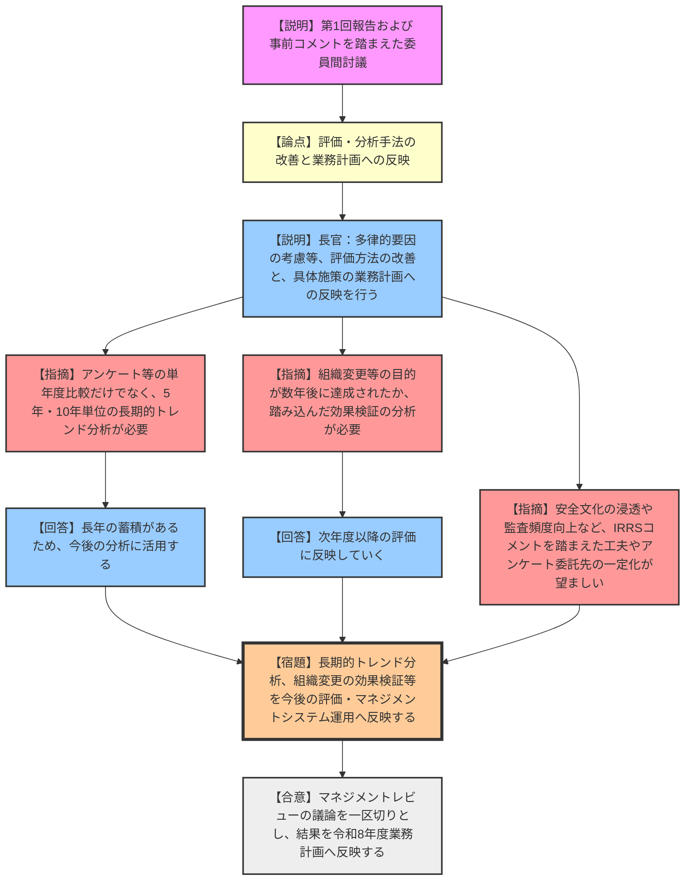

# 第65回原子力規制委員会（令和8年3月11日）
> 出典 : https://youtube.com/live/r6Swrln7dJk?si=uk4xCm648SqDBe5v

## 1. 会合の概要
*   **会合のハイライト:**
    *   **放射能測定法シリーズの現状と今後の取組:** 同シリーズの体系的な整理や英訳化による国際発信の方針が報告されました。委員からは、自治体担当者の技術伝承の課題に対し、動画の活用や実践的な実習機会の維持を求める具体的な提案がなされました。
    *   **組織規則の改正:** 令和8年度の定員要求等を踏まえた組織改編（「監査・マネジメント推進室」への名称変更、「環境放射線企画室」の新設等）が原案通り決定されました。委員長からは、名称変更に伴うホームページやパンフレット等の広報媒体の修正漏れ防止が強く指示されました。
    *   **令和7年度マネジメントレビュー(第2回):** 第1回報告を踏まえた委員間討議が行われました。アンケートの長期的トレンド分析や、組織改編の数年後の効果検証など、マネジメントシステムの改善に向けた本質的な要望が各委員から提示され、令和8年度業務計画へ反映されることが合意されました。
*   **現場の緊張感・規制側の納得度:**
    各報告や提案に対し、規制側（委員）は単なる了承にとどまらず、「実効性の担保（自治体への技術伝承の実態）」「変更管理の徹底（広報媒体の修正）」「評価分析の深化（長期的トレンドや因果関係の検証）」といった、地に足の着いた組織運営を強く求める姿勢を示し、事務局もそれらを真摯に受け止め次年度計画へ反映する構えを見せました。

---

## 2. 議題ごとの詳細整理

### 【議題1】放射能測定法シリーズの現状と今後の取組

*   **議論の背景と論点:**
    環境放射線モニタリングの標準的な分析・測定法マニュアルである「放射能測定法シリーズ」について、近年の改定状況（品質保証の別冊化、緊急時対応、最新技術の導入など）や体系整理、および英訳版の公開等によるIAEA等への国際発信方針が報告された。自治体等における技術伝承の在り方が論点となった。

*   **質疑応答（詳細）:**
    *   **【説明者側（監視情報課 河野）】:** これまでの経緯、最近の取り組み（品質保証の別冊化、緊急時モニタリング対応、最新技術の反映、ツリー構造での体系整理と旧版のアーカイブ化）、および今後の活動（IAEAのILCへの対応、優先度の高いものから年3冊程度の英訳化・国際発信）について報告する。
    *   **【規制側（委員）】:** 改定と英語化のペースはどの程度か。
    *   **【説明者側（監視情報課 河野）】:** 改定は大体年3冊程度、英語化も正改定が完了したものから優先度が高いものを選び年間3冊程度行っている。
    *   **【規制側（委員）】:** 旧版から新版への置き換わりが図書館等で進んでいない懸念があるが、どう考えているか。
    *   **【説明者側（監視情報課 河野）】:** 完全に電子書籍化しているため、自治体や関係機関に直接コンタクトして最新情報を発信するとともに、過去の重要な知見もアーカイブとして残している旨を説明していく。
    *   **【規制側（委員）】:** ニーズがあれば、オンデマンド印刷等で冊子化するやり方もあるのではないか。
    *   **【説明者側（監視情報課 河野）】:** 重要な指摘として受け止める。
    *   **【規制側（長﨑委員）】:** 自治体の担当者は数年で交代することが多く、文書を読むだけでは技術伝承のハードルが高い。動画（YouTube等）の活用や、具体的な実習等のやり方を工夫すべきではないか。
    *   **【説明者側（監視情報課 河野）】:** 日本分析センター等に委託して自治体向け研修を行っており、そこで基礎から理解し測定を行っていただく仕組みとしている。いただいた意見も踏まえ検討していく。
    *   **【規制側（山中委員長）】:** 専門でない自治体担当者への基礎知識の伝承は非常に重要である。日本全国で実習を行える機関を維持していくことも大切である。
    *   **【説明者側（監視情報課 河野）】:** コメントに感謝する。現在取り組んでいる研修も踏まえて考えていきたい。

*   **結論と宿題事項（アクションアイテム）:**
    *   **結論:** 放射能測定法シリーズの現状と今後の取組報告は了承された。
    *   **宿題事項:** 電子化された最新版の確実な周知と、自治体等への技術伝承（動画活用や実習機会の維持・充実）について継続的に検討・実施すること。

---

### 【議題2】原子力規制委員会組織規則の改正

*   **議論の背景と論点:**
    令和8年度の機構定員要求の結果等を踏まえ、実態に即した名称変更（「監査・マネジメント推進室」）や体制強化（「環境放射線企画室」の新設、企画官・調査官等の配置変更等）を行うため、組織規則を改正するもの。

*   **質疑応答（詳細）:**
    *   **【説明者側（総務課 松木）】:** 監査・マネジメント推進室への名称変更、システム安全研究部門への企画官配置、放射線環境対策室を環境放射線企画室へ改組、放射線規制部門への安全管理調査官の増員などを行う。令和8年度予算成立日以降に公布・施行する予定であり、決定を求める。
    *   **【規制側（山中委員長）】:** 組織の名称変更は多方面（ホームページ、パンフレットなど人の目に触れやすいところ）に影響が出るため、情報共有と修正の抜け漏れがないようにしてほしい。
    *   **【説明者側（総務課 松木）】:** 関係課室と連携し、同じタイミングで変更できるよう作業を進めており、抜け漏れがないようしっかりと対応する。

*   **結論と宿題事項（アクションアイテム）:**
    *   **結論:** 原案通り、原子力規制委員会組織規則の改正が決定された。
    *   **宿題事項:** 組織名称の変更に伴う、広報媒体（ホームページ、パンフレット等）および各種関連文書の修正を漏れなく確実に実施すること。

---

### 【議題3】令和7年度マネジメントレビュー(第2回)

*   **議論の背景と論点:**
    前回の第1回会合（3月4日）でのマネジメントシステムの実施状況報告を踏まえ、各委員から事前に提出されたコメントをベースに委員間討議を行い、次年度の業務計画やマネジメントシステム運営に反映させるための議論が行われた。

*   **質疑応答（詳細）:**
    *   **【説明者側（政策立案参事官 新田）】:** 事前提出のコメントを踏まえ、委員間討議をお願いしたい。本日の結果は令和8年度の年度業務計画やマネジメントシステム運営に反映する。
    *   **【説明者側（長官 金子）】:** 事前の委員コメントに対する事務局の受け止めを説明する。評価の分析手法や根拠の明確化、多律的要因で目標と異なる状況になった場合の評価方法の工夫などは、今後の評価運用の改善に反映する。また、具体的な施策の進め方への指摘は、令和8年度の業務計画に位置づけていく。
    *   **【規制側（山岡委員）】:** 職員アンケート等において、過去3年程度の比較だけでなく、5年・10年といった長期的なトレンド分析も意識の変化を捉える上で必要ではないか。
    *   **【説明者側（政策立案参事官 新田）】:** 例年継続しており蓄積もあるため、長期の分析も可能になってきている。今後の分析に活用する。
    *   **【規制側（長﨑委員）】:** 組織変更等を行った際、目的を持って体制を強化したはずである。1年後、2年後、3年後にその意図した目的が本当に達成されたのか、踏み込んだ分析が必要である。
    *   **【説明者側（政策立案参事官 新田）】:** 次年度以降の評価に反映していく。
    *   **【規制側（神田委員）】:** 安全文化の浸透や監査の頻度等について、IRRSのコメントも踏まえた工夫が必要。アンケート委託会社の一定化による変化の正確な追跡や、委員による課室との対話の頻度向上など、組織改善に役立てる工夫を求める。
    *   **【規制側（山中委員長）】:** 本日の議論でマネジメントレビューは一区切りとする。事務局において、本日の議論も含めて令和8年度の業務計画およびマネジメントシステムの運営にしっかりと反映してほしい。

*   **結論と宿題事項（アクションアイテム）:**
    *   **結論:** 委員間討議を終了し、各委員から提示された改善要望（長期的トレンド分析、組織変更の効果検証の徹底等）を事務局が受け止めた。
    *   **宿題事項:** 本日の議論および事前の委員コメントを、令和8年度の原子力規制委員会年度業務計画の策定、および今後のマネジメントシステムの運用改善に確実に反映させること。

---

## 3. 論理構造の可視化（Mermaid）

### 議題1: 放射能測定法シリーズの現状と今後の取組

### 議題2: 原子力規制委員会組織規則の改正

### 議題3: 令和7年度マネジメントレビュー(第2回)

