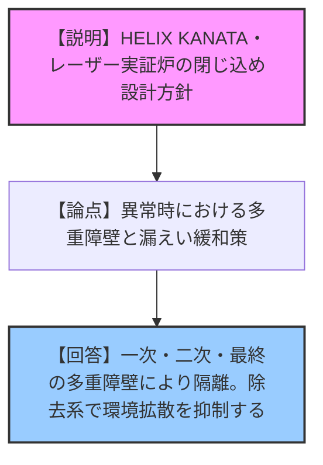
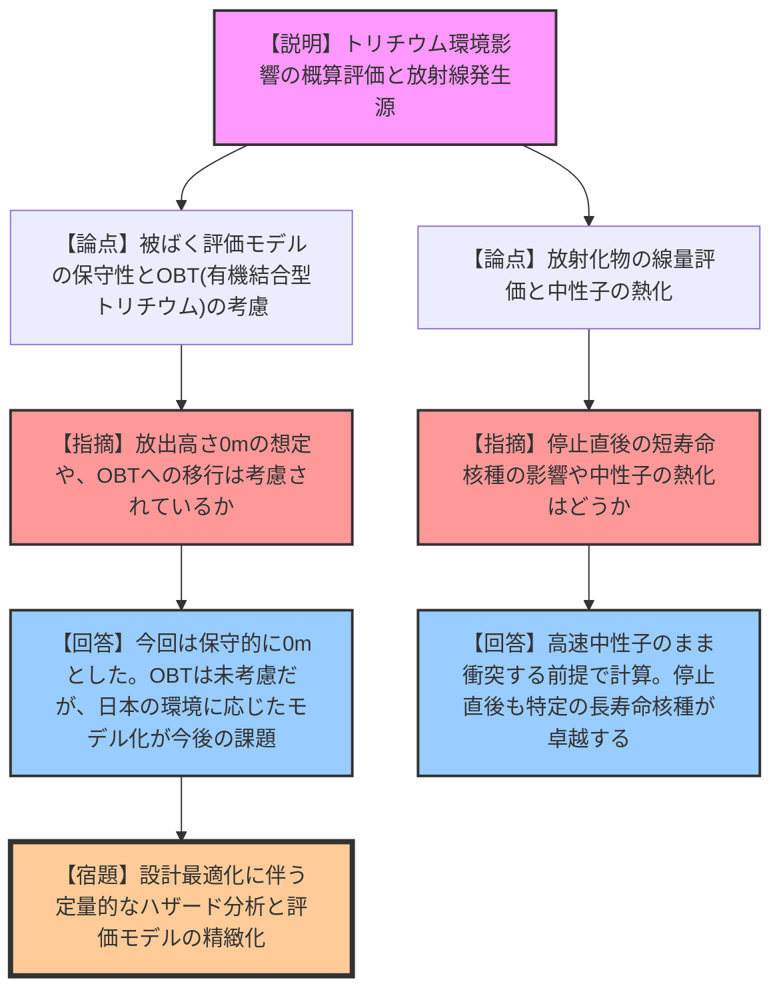
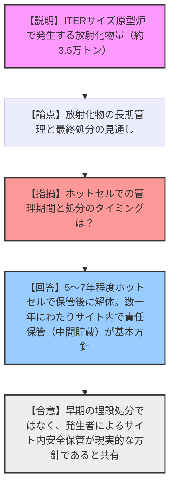
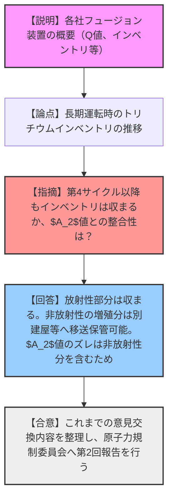

# 第6回フュージョン装置の開発を進める事業者等との意見交換会合（令和8年3月13日）
> 出典 : https://youtube.com/live/_8rPo6rXCAw?si=c3zUWzmUWIv2bR3H

# 会合の概要
* **最大の争点:** フュージョン装置（核融合炉）におけるトリチウム環境影響評価の精緻化（HTとHTOの挙動、OBTの考慮など）と、放射化物の長期的な保管・管理方針（早期の埋設処分を前提としないこと）。
* **審査の進捗状況:** 事業者等からのハザード分析、閉じ込め設計、線量評価、放射性廃棄物管理に関する具体例が提示され、規制側は評価手法の保守性や限界について詳細な確認を行った。これまでの意見交換の成果を踏まえ、原子力規制委員会への第2回報告を取りまとめる段階に至った。
* **現場の緊張感と規制側の納得度:** 規制側は、トリチウムの環境移行モデルや放射化物の最終処分の見通しについて鋭い質問を投げかけた。これに対し、研究者や事業者側が最新の研究動向や、実機における「数十年にわたる発生者責任でのサイト内保管」という現実的な方針を説明したことで、規制側はフュージョン装置特有の安全確保の考え方に対する理解を深め、一定の納得を得て議論が収束した。

---

# 議題ごとの詳細整理

## 【議題1】事業者等において開発中のフュージョン装置の閉じ込め設計方針等について
* **議論の背景と論点:**
  フュージョン装置における放射性物質（主にトリチウム）の閉じ込めに関する基本方針の確認。多重障壁の構成と、通常時および異常時における漏えい防止・緩和対策が論点となった。

* **質疑応答（詳細）:**
  * **【説明者側】Helical Fusion（中村氏）**: HELIX KANATAのトリチウム閉じ込め方針について説明。トリチウムインベントリを必要最低限とし、一次障壁（機器・配管）、二次障壁（グローブボックス）、最終障壁（建屋）による多重閉じ込めを行う。異常時は漏えい検知とトリチウム除去系（浄化処理）により環境への拡散を抑制する。
  * **【説明者側】EX-Fusion**: レーザー方式フュージョン発電実証炉のトリチウムプロセスと閉じ込め方針について説明。特に完成閉じ込め特有の「燃料充填・ペレット入射システム」における極低温下の金属二重壁による一次閉じ込めの強化と、異常時の緊急遮断・バッファータンクへの移送・水素吸蔵合金への吸蔵による緩和策を示した。

* **結論と宿題事項（アクションアイテム）:**
  * 基本的な閉じ込めの考え方（多重障壁、負圧管理、トリチウム除去系の作動）については共通認識が得られた。
  * より定量的なハザード分析と詳細な安全設計は今後の開発の進捗に応じて更新される。

---

## 【議題2】事業者等において開発中のフュージョン装置の線量評価について
* **議論の背景と論点:**
  異常事象発生時のトリチウム環境放出量とそれに伴う被ばく線量の評価手法の妥当性。特に大気拡散モデル（ACUTRIコード等）の適用限界と、有機結合型トリチウム（OBT）の扱いや放出高さの前提が論点となった。

* **質疑応答（詳細）:**
  * **【説明者側】Helical Fusion（中村氏）**: 燃料貯蔵系の異常事象を起因としたトリチウム環境影響の概算評価を報告。保守的に放出高さを0m、大気安定度F、HTからHTOへの変換を考慮し評価。
  * **【説明者側】LINEAイノベーション（野尻氏）**: 放射線の発生源として中性子線、X線（制動放射）、放射化物からのガンマ線等があるとし、遮蔽を考慮しない数値で線量率を見積もった結果を報告。
  * **【規制側】鈴木氏**: Helical Fusionに対し、OBTの考慮の有無、評価期間、放出高さを0mとしない場合の現実的な想定について質問。
  * **【説明者側】Helical Fusion（中村氏）**: 今回の評価は1週間の短期被ばくを想定し、OBTは含めていない（欧州のUFOTRIコード等にはあるが日本の環境への適用は今後の課題）。放出高さは実際には排気筒や建屋のウェイクエフェクトにより実質的に10mオーダーの高さが形成される。
  * **【規制側】森下氏**: Helical Fusionに対し、最大のトリチウム放出シナリオは燃料貯蔵系の全破損か？また、隔離弁による漏えい遮断は計算に入っているか？
  * **【説明者側】Helical Fusion（中村氏）**: 燃料貯蔵系が最大インベントリを持つため選定した。すべての障壁が破損するシナリオは設計基準を超える事象であるが、今回は場合分けの一つとして保守的に評価した。隔離弁の効果は明示的には入れていない。
  * **【規制側】上谷氏**: LINEAイノベーションに対し、遮蔽を考慮しない値を出しているが、いずれ遮蔽設計を反映した値も出てくるか？
  * **【説明者側】LINEAイノベーション（野尻氏）**: 具体的な装置設計の中で遮蔽設計を行い、その数値をもって相談する。
  * **【規制側】沖田氏**: LINEAイノベーションに対し、放射化物の線量評価において中性子の熱化の考慮と、停止直後における短寿命核種の影響はどうか？
  * **【説明者側】LINEAイノベーション（野尻氏）**: FRCプラズマ外側のチャンバーには高速中性子のまま衝突する前提。計算上、停止直後においても特定の2核種が卓越することを確認している。
  * **【規制側】山岡氏？**: ACUTRIコードなど、トリチウムの環境移行挙動に関する最新の研究動向はどうか？
  * **【有識者】九州大学 片山氏 / 京都フュージョニアリング 小西氏**: 物理モデル（ガウスプルーム）は20年来同じだが、環境挙動（コンパートメントモデル）については、日本の環境（水田など）や食生活に応じたパラメータの補正が現在も活発に研究されている。

* **結論と宿題事項（アクションアイテム）:**
  * トリチウムの環境影響評価においては、HT/HTOの移行特性や日本の植生・食生活（OBTへの移行）を適切に考慮する必要があることが確認された。
  * 異常時の事象進展シナリオと設計基準事象の設定については、今後の設計最適化の中で精査する。

---

## 【議題3】事業者等において開発中のフュージョン装置の放射性廃棄物について
* **議論の背景と論点:**
  原型炉等における炉内機器（ブランケット等）の交換に伴う放射化物の発生量と、その長期的な管理・処分の見通し。

* **質疑応答（詳細）:**
  * **【説明者側】QST（染谷氏）**: ITERサイズ原型炉の多段階実証に伴う金属放射化物量を報告。全運転機器を通じて約3.5万トンの発生を見込む。浅地中処分の目安線量（10μSv/年）を下回る見通し。
  * **【規制側】**: 第1期終了直後の設備の表面線量と、ITERにおける交換方法は？
  * **【説明者側】QST（染谷氏）**: 直後の表面線量は数千Svレベル。ITERでは真空容器内のレールとロボットで2年かけて交換するが、原型炉では稼働率確保のため18個のポートから取り出し、古いものはホットセルで保守・解体する。
  * **【規制側】上谷氏**: ホットセルでの管理期間と、処分までの期間は？
  * **【説明者側】QST（染谷氏）**: 5〜7年程度ホットセルで保管し、表面線量が下がった段階で解体する。廃棄体化の際は残留熱による水蒸気発生を防ぐ区切りを考慮する。
  * **【有識者】京都フュージョニアリング（小西氏）**: 「廃棄物」という呼称について補足。原型炉や実証炉は研究開発装置であり、発生した放射化物は発生者がサイト内で数十年責任を持って保管・管理・除染する。直近で最終的な廃棄・埋設を考える段階ではなく、中間貯蔵が基本となる。
  * **【規制側】**: 解体物の安全なサイト内保管と、取り出し時の被ばく・外部影響がないことを確認したかった。数十年の保管管理方針について理解した。

* **結論と宿題事項（アクションアイテム）:**
  * フュージョン装置から発生する放射化物は、早期の埋設処分ではなく、発生者責任によるサイト内での長期的な安全保管・管理（中間貯蔵）を基本方針とすることが確認・共有された。

---

## 【議題4】事業者等において開発中のフュージョン装置の概要について
* **議論の背景と論点:**
  各社が開発中のフュージョン装置の性能（Q値、運転時間）、安全機能、インベントリ等の諸元一覧の確認。

* **質疑応答（詳細）:**
  * **【説明者側】QST（大山氏）**: ITERサイズ原型炉の概念設計に基づく暫定値を報告。
  * **【説明者側】三菱総合研究所（富永氏）**: フュージョンエネルギー産業協議会として各社の情報をとりまとめた表を提示。
  * **【規制側】森下氏**: Helical Fusionに対し、第4運転サイクル以降も最大のインベントリは示された値（放射性部分）で収まるか？
  * **【説明者側】Helical Fusion（中村氏）**: 放射性トリチウムインベントリは収まる。増殖により増加する非放射性部分は、サイト内の別建屋やサイト外へ移送して保管することが可能。
  * **【規制側】鈴木氏**: EX-Fusionの$A_2$値が他のインベントリとずれているように見えるが？
  * **【説明者側】EX-Fusion**: 初期インベントリ（500g）には非放射性部分も含まれているためである。

* **結論と宿題事項（アクションアイテム）:**
  * 各装置の諸元とインベントリの概要が確認された。
  * これまでの意見交換の内容を整理し、原子力規制委員会への第2回報告を実施する。今後の進め方については委員会の見解を踏まえて決定される。

---

# 論理構造の可視化

