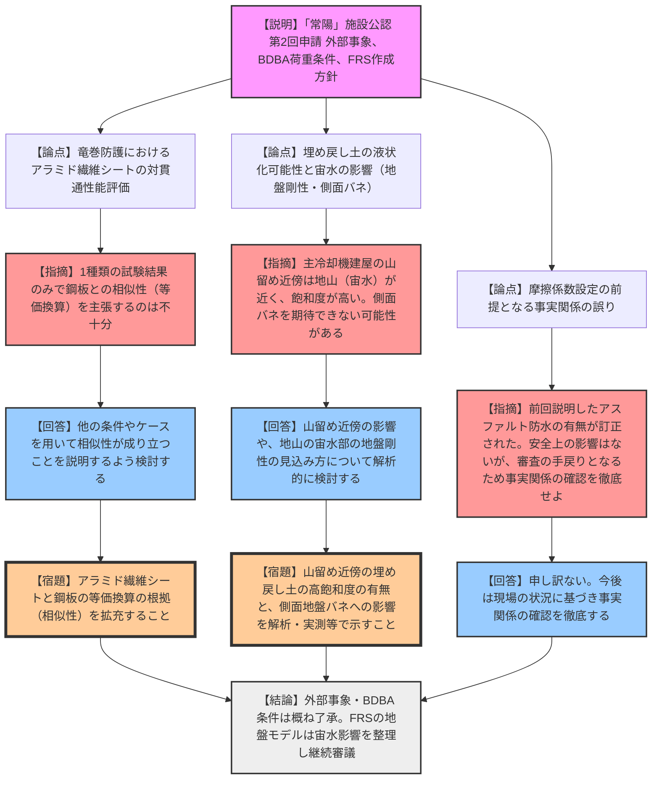

# 第575回核燃料施設等の新規制基準適合性に係る審査会合（令和8年3月16日）
> 出典 : https://youtube.com/live/nRTxgNAmvlQ?si=Gdk1YTEQjo6y1mIn

## 1. 会合の概要
*   **最大の争点:** 高速実験炉「常陽」の施設工認第2回申請における、外部事象（落雷、有毒ガス、竜巻、火山、外部火災）への防護設計の妥当性と、設計用床応答スペクトル（FRS）作成に向けた基礎地盤モデル（埋め戻し土の液状化可能性と宙水の影響）の適正な設定。
*   **審査の進捗状況:** 外部事象およびBDBA資機材の耐震性評価条件については、事業者の説明が概ね了承された。FRS作成に向けた地盤モデルについては、埋め戻し土の「宙水」の扱いと、山留め近傍における地盤バネの評価方法に課題が残り、次回以降へ持ち越しとなった。
*   **現場の雰囲気と規制側の納得度:** 規制側は、外部事象の評価手法については納得を示した。一方で、地盤モデルの質疑において、事業者から前回会合（アスファルト防水の有無）と異なる事実説明がなされたことに対し、規制側から「事実関係の確認徹底」を求める厳しい注意（苦言）が呈された。
*   **特筆すべき決定事項:** BDBA（設計基準外事象）資機材の耐震評価において、事象継続時間に応じた荷重条件（温度等）がDBA（設計基準事象）を下回る場合は、DBAの評価結果で代表可能とする整理が承認された。

---

## 2. 議題の詳細整理

### 【議題1】日本原子力研究開発機構 大洗原子力工学研究所（南地区） 高速実験炉原子炉施設（「常陽」）の変更に係る設計及び工事の計画の認可申請について

#### (1) 外部からの衝撃による損傷の防止に係る措置等の整備について（資料1）
*   **議論の背景と論点:** 新規制基準（技術基準規則第8条）に基づく自然現象および人為事象に対する防護設計の確認。
*   **質疑応答（詳細）:**
    *   **【落雷・有毒ガス・竜巻】**
        *   【事業者（原子力機構）】: 落雷はJIS A 4201-2003の保護レベル1に適合する避雷設備を設置。有毒ガスは中央制御室の閉回路循環と空気呼吸器配備で対応。竜巻はガイド構成材やコンクリートブロックの飛来を想定し、アラミド繊維シート（ケブラー）等を用いた貫通・裏面剥離防止対策を講じる。
        *   【規制側（加藤）】: アラミド繊維シートと鋼板の等価厚さ換算について、1種類の試験結果（内閣府実験）のみから相似性を主張するのは不十分。他の条件でも相似性が成り立つことを示す必要がある。
        *   【事業者】: コメントを理解した。他のケース等を用いて相似性が成り立つことを説明するよう検討する。
    *   **【火山の影響・外部火災・その他】**
        *   【事業者】: 火山（降下火砕物）は層厚50cmを想定し、建屋構造・空調フィルタ等の健全性を確認。外部火災（森林火災、近隣工場火災、航空機墜落火災）は、防火帯の設置や離隔距離により外壁温度が許容温度（200℃）を下回ることを確認。

#### (2) BDBA資機材の耐震性評価において考慮する荷重条件（温度、圧力）の整理（資料2）
*   **議論の背景と論点:** 前回会合の指摘を踏まえ、BDBA時の荷重条件をSD（弾性設計用地震動）とSS（基準地震動）の組み合わせで整理。
*   **質疑応答（詳細）:**
    *   【事業者】: 炉心損傷防止措置（ULOF等）および格納容器破損防止措置において、温度等の事象継続時間（3.65日/73日）の基準を下回る場合は、DBAの荷重条件を用いた耐震性評価で代表できることを確認した。
    *   【規制側】: （特段の質疑・異論なし）

#### (3) 設計用床応答スペクトル（FRS）の作成方針について（資料3）
*   **議論の背景と論点:** 建屋側面地盤（埋め戻し土）の剛性評価において、地山から浸出する「宙水」が液状化や地盤バネ設定に与える影響の有無。
*   **質疑応答（詳細）:**
    *   **【論点：埋め戻し土の液状化と宙水の影響】**
        *   【事業者】: 埋め戻し土は透水性の良い砂質土であり、飽和度やPS検層（P波速度）の結果から宙水は存在せず、液状化の恐れはない。地山（MUC層）の宙水についても、非圧状態ではなく液状化の恐れはないため、全応力解析を実施する。
        *   【規制側（小前）】: 主冷却機建屋の南側・西側はオープンカットではなく山留め工法であり、地山（宙水あり）が近接している。この埋め戻し土部分で飽和度が高くなっており、地盤バネが期待できない可能性がある。浸透流解析や実測等で、地盤バネを期待できないほどの高飽和度層が存在しないことを示すべき。
        *   【事業者】: 山留め近傍の影響について、今後の対応を検討する。また、地山（MUS1層等）に部分的に存在する宙水部の地盤剛性の見込み方についても、解析的に併せて検討する。
    *   **【論点：摩擦係数と事実関係の訂正】**
        *   【事業者】: 建屋側面の摩擦係数は0.27を設定。なお、前回「主冷却機建屋の地下にアスファルト防水がある」と説明したが、再確認の結果「防水層はない」ことが判明したため訂正する。
        *   【規制側（小前）】: 防水の有無は摩擦係数0.27の妥当性に大きく影響しないため安全上の問題はないが、事実関係の説明が食い違うと審査の手戻りになる。今後は現場状況に基づいた事実関係の確認を徹底すること。
        *   【事業者】: 申し訳ない。今後気をつける。

*   **結論と宿題事項（アクションアイテム）:**
    *   **結論:** 外部事象およびBDBAの荷重条件整理は概ね了承。FRS作成方針（地盤モデル）は、山留め近傍の宙水影響の検討が必要として継続審議となった。
    *   **宿題事項（原子力機構）:**
        1. アラミド繊維シートと鋼板の等価厚さ換算における相似性の根拠を拡充し、説明すること。
        2. 主冷却機建屋の山留め近傍の埋め戻し土における高飽和度（宙水影響）の有無と、それによる側面地盤バネへの影響を解析・実測等で示し、地山の宙水部の剛性評価と併せて次回以降説明すること。
        3. 事実関係（建屋地下の防水の有無など）の確認を徹底し、審査資料の品質を担保すること。

---

## 3. 論理構造の可視化（Mermaid）

