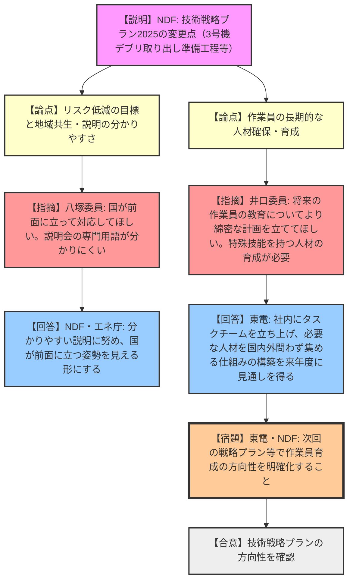
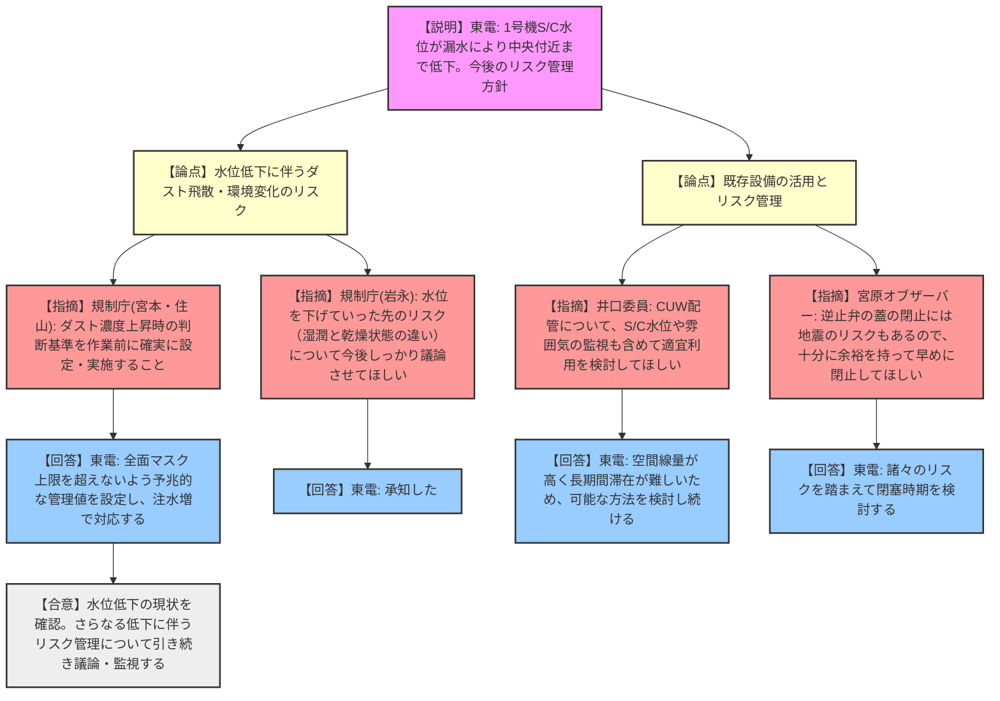
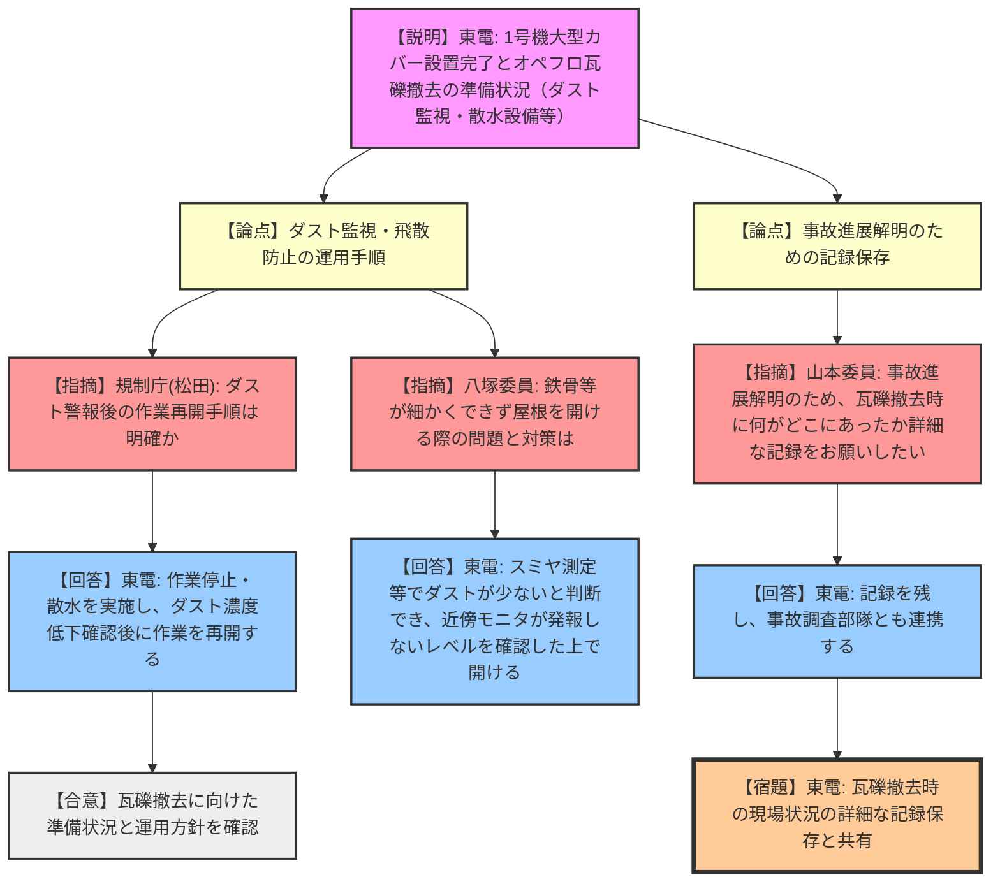
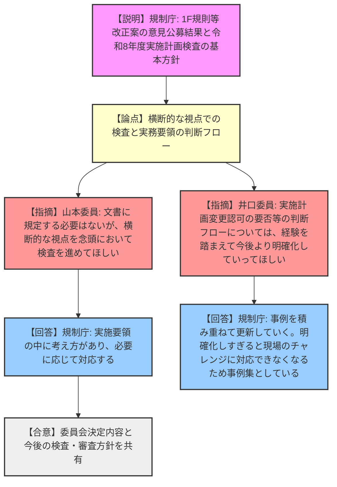
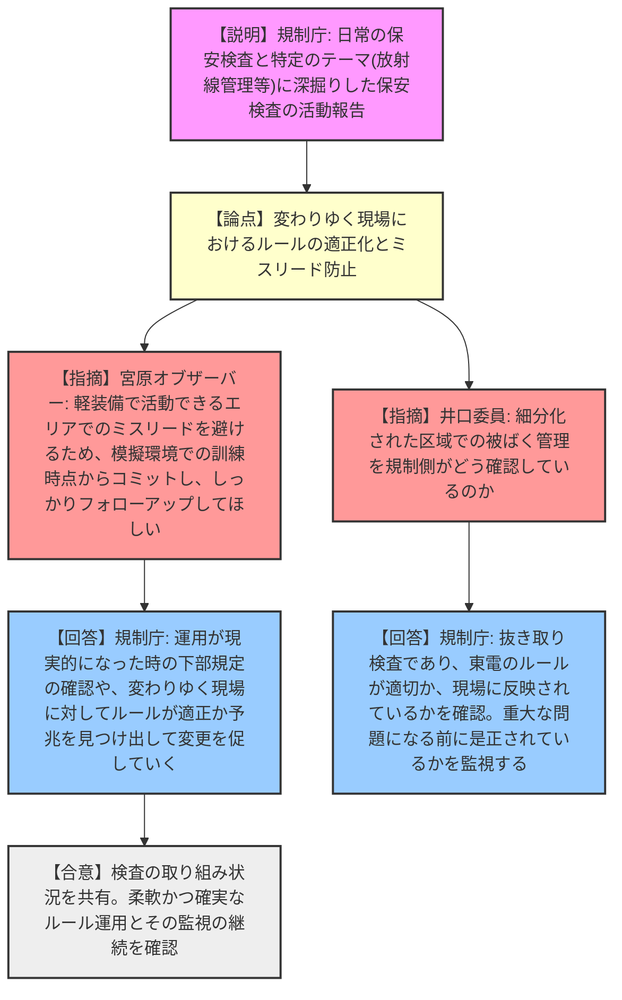

# 第121回特定原子力施設監視・評価検討会（令和8年3月16日）
> 出典 : https://youtube.com/live/_5kmUbK7-88?si=VeLpuBzyR5iSksmM

## 1. 会合の概要
*   **会合のハイライト:**
    *   **NDF 技術戦略プラン 2025:** 3号機燃料デブリの大規模取り出しに向けた準備工程や支持構造物の検討状況が示された。委員からは、国が前面に立つ姿勢の可視化や、長期にわたる廃炉作業を担う作業員の確実な人材育成計画の立案が強く求められた。
    *   **1号機 S/C（サプレッションチェンバー）水位低下:** 2024年末からの自然な水位低下により、目標としていたS/C中央付近までの水位低下が概ね達成された。今後のさらなる水位低下に伴うダスト飛散や可燃性ガス等のリスク管理について、規制庁と東電の間で認識が擦り合わされた。
    *   **1号機燃料取り出しに向けた工事の進捗:** 大型カバーの設置が完了し、オペレーティングフロアの瓦礫撤去作業に向けたダスト監視や散水設備等の具体的な運用手順が確認された。また、事故進展解明に向けた瓦礫撤去時の詳細な記録の重要性が指摘された。
    *   **実施計画検査の取組:** 規制庁から、日常の保安検査と放射線管理等に深掘りした保安検査の具体的な活動内容が報告され、変わりゆく現場状況に対するルールの適正化や、軽装備エリアにおけるミスリード防止の重要性が共有された。
*   **現場の緊張感と規制側の納得度:**
    *   東電およびNDFによるリスク低減の取り組みに対して、規制側は一定の評価を与えつつも、今後の作業に伴う新たなリスク（ダスト飛散、水素滞留、水封破れ等）の予測と管理について鋭い指摘を重ねた。特に、未知の領域での作業が続く1F廃炉において、ルールの陳腐化を防ぎ、現場の状況変化に柔軟かつ確実に対応できる体制構築を強く求める緊張感のある議論が行われた。

---

## 2. 議題の詳細整理

**【議題1】NDF 技術戦略プラン 2025 について**
*   **議論の背景と論点:**
    NDF（原子力損害賠償・廃炉等支援機構）により策定された「技術戦略プラン2025」の昨年度からの変更点（3号機デブリ大規模取り出しの準備工程、支持構造物案等）が報告された。リスク低減の考え方と、長期的な廃炉作業を支える人材育成や地域共生のあり方が論点となった。
*   **質疑応答（詳細）:**
    *   【規制庁 岩永】: リスク低減マップの色分けの優先順位と、規制側とのリスク認識のギャップをどう埋めるか。
    *   【NDF 中村】: ロードマップをベースに、プール内燃料や建屋内滞留水を優先的に取り組むべき赤色としている。左側の「安定管理」領域へ移行させることが目標。
    *   【規制庁 岩永】: 技術的に難しく不確かさが大きい部分もあるが、リスク低減の議論を深めていきたい。
    *   【八塚委員】: 地域共生が実行段階に至っていない印象。ロードマップの30〜40年で終わるのか疑問であり、国が前面に立って対応してほしい。また、説明会の専門用語が分かりにくい。
    *   【NDF 中村】: 対話会の工夫を続ける。ロードマップの期間については、まずはデブリ準備工程の時間を詰め、見極めていく。
    *   【エネ庁 加賀】: 分かりやすい説明に努め、国が前面に立つ姿勢が見えるよう工夫する。
    *   【井口委員】: 3号機取り出し規模拡大で、横アクセスと上アクセスの準備工程が同時進行となっているがバッティングしないか。
    *   【NDF 中村】: 横は1階、上はオペフロからのアクセスであり並行可能と想定しているが、今後の現場検証で見極める。
    *   【井口委員】: 作業員の人材育成について、将来に向けたより綿密な計画を立ててほしい。特殊技能を持つオペレーター等の育成をどう進めるか。
    *   【NDF 中村】: 現在は元請・下請企業に委ねているのが実情。今後の戦略プランで明確に記載し前進させる。
    *   【エネ庁 加賀】: 関係省庁による教育会を立ち上げ、現場人材も含めて検討している。
    *   【宮原オブザーバー】: 第5次総合特別事業計画にある人材等の抜本強化をどう具体的に進めるのか。
    *   【NDF 中村】: 東電社長とNDF理事長以下で議論を進めており、次回の戦略プランで方向性を示したい。
    *   【東電 小野】: 社内にタスクチーム（廃炉推進カンパニーの権限明確化、処遇、人材確保・仕組みの3ワーキング）を立ち上げ、必要な人材を国内外問わず集める仕組みを来年度に見通しを得たい。
*   **結論と宿題事項（アクションアイテム）:**
    *   戦略プランの方向性は確認されたが、作業員の長期的な人材確保・育成や、分かりやすい情報発信についてさらなる具体化が求められた。

**【議題2】1号機 S/C 水位の低下の状況について**
*   **議論の背景と論点:**
    1号機の耐震性向上のためS/C（サプレッションチェンバー）水位の低下を進めており、2024年末からの自然な漏水により目標の中央付近まで低下した。今後のさらなる水位低下に伴うリスク（ダスト、水素、水処理）の管理が論点となった。
*   **質疑応答（詳細）:**
    *   【東電 新井】: S/Cからの漏水が北東三角コーナーに溜まり、それを汲み上げることで水位が低下している。今後も自然に水位を下げ、ダスト濃度上昇時は注水増で対応する。
    *   【規制庁 宮本】: ダスト濃度上昇時の判断基準は決まっているか。
    *   【東電 新井】: 全面マスク上限を超えないよう、予兆的な管理値を今後設定する。
    *   【規制庁 住山】: 有意な変化の判断は難しいので、作業前に確実に基準を設けて実施すること。
    *   【規制庁 岩永】: 水位を下げていった先の湿潤・乾燥状態におけるリスクについて、東電としっかり議論したい。
    *   【徳永委員】: 2024年末から水位が下がり始めた理由と、そこから得られる教訓は何か。
    *   【東電 新井】: 過去の海水注入等による腐食の可能性がある。気中・水中での腐食防止策をとっているが、滞留水箇所はコントロールが効かず腐食の可能性を否定できない。
    *   【規制庁 岩永】: 時空間で状況が変わってくる観点が重要。検査でも状況を見ながら対応する。
    *   【東電 伊藤】: 状況の変化は常に監視しており、変化があれば捉えられるようにしている。
    *   【山本委員】: 給水ライン切り替え時のダスト上昇の原因と影響は。
    *   【東電 新井】: 注水箇所が変わり、シャワー状に落ちたショックでダストが舞い上がった。格納容器外への影響はない。
    *   【井口委員】: CUW配管について、S/C水位や雰囲気の監視も含めて適宜利用を検討してほしい。
    *   【東電 新井】: 活用したい意図はあるが、空間線量が高く長期間滞在が難しいため検討を続ける。
    *   【宮原オブザーバー】: 逆止弁の蓋の閉止には地震等による水封破れのリスクもあるので、十分に余裕を持って早めに閉止してほしい。
    *   【東電 新井】: 諸々のリスクを踏まえて閉塞時期を検討する。
*   **結論と宿題事項（アクションアイテム）:**
    *   水位低下の現状は確認されたが、さらなる低下に伴うダストや腐食等のリスクについて、引き続き監視と評価を行うことが求められた。

**【議題3】1号機燃料取り出しに向けた工事の進捗について**
*   **議論の背景と論点:**
    1号機大型カバーの設置が完了し、オペレーティングフロアの瓦礫撤去に向けた準備が進んでいる。カバー内のダスト監視や散水設備の運用、瓦礫の撤去手順が論点となった。
*   **質疑応答（詳細）:**
    *   【東電 野田】: 大型カバー設置完了、瓦礫撤去天井クレーン試運転中。ダスト監視をカバー外部等へ変更し、4月末から瓦礫撤去を開始予定。
    *   【規制庁 松田】: 散水設備はろ過水か。ダスト警報後の作業再開手順は。
    *   【東電 野田】: ろ過水を使用。警報時は作業停止・散水し、ダスト濃度低下確認後に作業再開する。
    *   【規制庁 住山】: 瓦礫撤去中、下の階での作業は立ち入り禁止にするか。
    *   【東電 野田】: 作業内容によって並行実施可否を判断し、調整する。
    *   【規制庁 宮本】: 警報は現場で聞こえるか。
    *   【東電 野田】: 中央監視に鳴り、現場には速やかに退避指示を出す。
    *   【八塚委員】: 鉄骨などが細かくできない時に屋根を開ける際の問題とは何か。
    *   【東電 野田】: ダスト拡散が懸念されるため、スミヤ測定等でダストが少ないと判断でき、モニタが発報しないレベルを確認した上で開ける。
    *   【山本委員】: 事故進展解明のため、瓦礫撤去時に何がどこにあったか詳細な記録をお願いしたい。
    *   【東電 野田】: 記録を残し、事故調査部隊とも連携する。
    *   【宮原オブザーバー】: 大型カバーのダストサンプリング（4点）の冗長性の考え方は。
    *   【東電 野田】: 構内のモニタリングポスト等でカバーし、排気設備のモニタは2重化して冗長性を持たせている。
*   **結論と宿題事項（アクションアイテム）:**
    *   瓦礫撤去に向けた準備状況は確認された。事故調査に資する詳細な記録の保存と、ダスト飛散防止の確実な運用が求められた。

**【議題4】1F 規則の一部を改正する規則等の委員会決定内容について**
*   **議論の背景と論点:**
    1F規則等の改正案に対する意見公募結果と、それを踏まえた令和8年度実施計画検査の基本方針（施設管理の追加等）の委員会決定内容が報告された。
*   **質疑応答（詳細）:**
    *   【規制庁 本島】: 意見公募結果および「施設運用上の基準」という用語や検査削減への懸念に対する回答を説明。令和8年度検査基本方針についても報告。
    *   【山本委員】: 文書に規定する必要はないが、横断的な視点を念頭において検査を進めてほしい。
    *   【規制庁 本島・小金谷】: 実施計画検査の実施要領の中に横断的な視点での検査の考え方があり、規制検査の状況も踏まえ適切に対応する。
    *   【井口委員】: 審査実務要領の「記載の適正化」の判断基準はガイドライン等で決まっているのか。経験を踏まえて今後より明確化していってほしい。
    *   【規制庁 政岡・岩永】: 現状は実務要領の補足に記載している程度であり、行政面談の中で確認している。明確化しすぎると現場のチャレンジに対応できなくなるため事例集という形をとっており、今後事例を積み重ねていく。
*   **結論と宿題事項（アクションアイテム）:**
    *   委員会決定内容の報告が了承された。審査実務要領の判断フローについては、今後の経験を踏まえた明確化が期待された。

**【議題5】原子力規制庁による1F に対する実施計画検査の取組について**
*   **議論の背景と論点:**
    規制事務所による「日常の保安検査」と、本庁主導の「特定のテーマに深掘りした保安検査（放射線管理）」の具体的な活動内容が報告され、現場の状況変化に応じたルールの適正化が論点となった。
*   **質疑応答（詳細）:**
    *   【規制庁 山本・松田】: 日常の保安検査（朝の会議傍聴、現場巡視等）および深掘りした保安検査（2号機高台の区域管理、個人被ばく管理等）の内容と、ダスト管理や軽装備エリアでのミスリード防止等の注意すべき点を報告。
    *   【東電 伊藤】: ダスト管理について、発電所全体としてルールを決めて対応している。
    *   【井口委員】: 細分化された区域での被ばく管理を規制側がどう確認しているのか。
    *   【規制庁 松田・山本・宮本・小金谷】: 保安検査は抜き取りであり、東電のルールが適切か、現場に反映されているか（今回は2号機高台を代表として）を確認している。CAP活動等で重大な問題になる前に是正措置がなされているかを監視している。
    *   【宮原オブザーバー】: 2号機高台等の軽装備エリアでのミスリードを避ける取り組みが重要。模擬環境での訓練時点からのコミットをお願いしたい。
    *   【規制庁 松田・今野】: 運用が現実的になった時に下部規定でどう定められるかを確認し、変わりゆく現場に対してルールが適正か、予兆を見つけ出して変更を促していく。
*   **結論と宿題事項（アクションアイテム）:**
    *   検査の取り組み状況が共有された。変化する現場状況に合わせた柔軟かつ確実なルール運用と、その監視の継続が確認された。

**【議題6】その他**
*   **議論の背景と論点:**
    2026年2月版のリスクマップの配付と、本日の議論における主な指摘・確認事項のまとめが行われた。
*   **質疑応答（詳細）:**
    *   【規制庁 大橋】: 本日の各委員・オブザーバーからの主な指摘事項を読み上げ、認識の共有を図った。
    *   【各委員】: 八塚委員、井口委員、宮原オブザーバーのコメントについて、発言の真意（将来に向けた計画の必要性、適宜利用の検討、余裕を持った閉止等）が正確に反映されるよう微修正が行われた。
*   **結論と宿題事項（アクションアイテム）:**
    *   修正された指摘事項のまとめを当日作成資料としてホームページに掲載することが合意された。

---

## 3. 論理構造の可視化（Mermaid）

### 【議題1】NDF 技術戦略プラン 2025 について

### 【議題2】1号機 S/C 水位の低下の状況について

### 【議題3】1号機燃料取り出しに向けた工事の進捗について

### 【議題4】1F 規則の一部を改正する規則等の委員会決定内容について

### 【議題5】原子力規制庁による1F に対する実施計画検査の取組について

