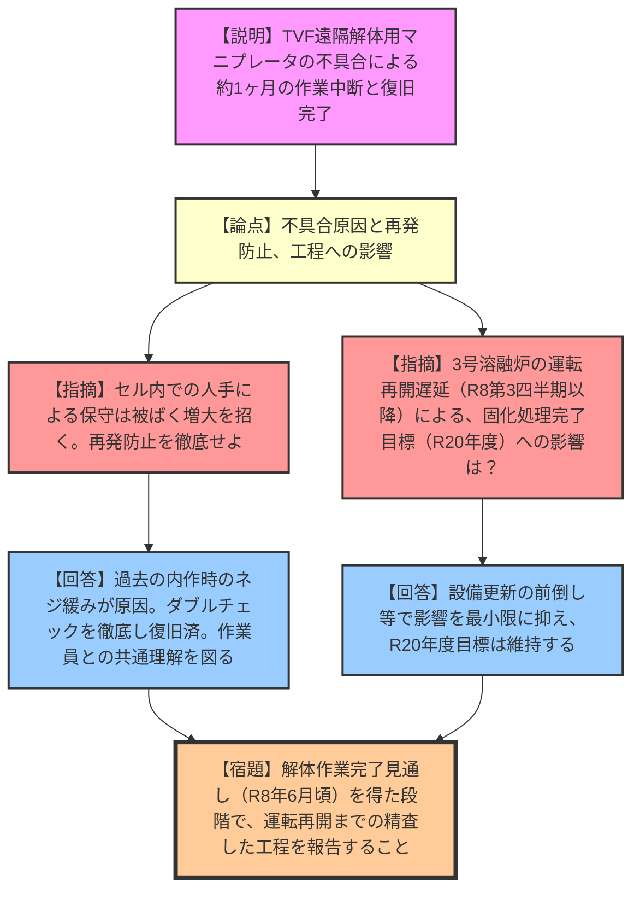
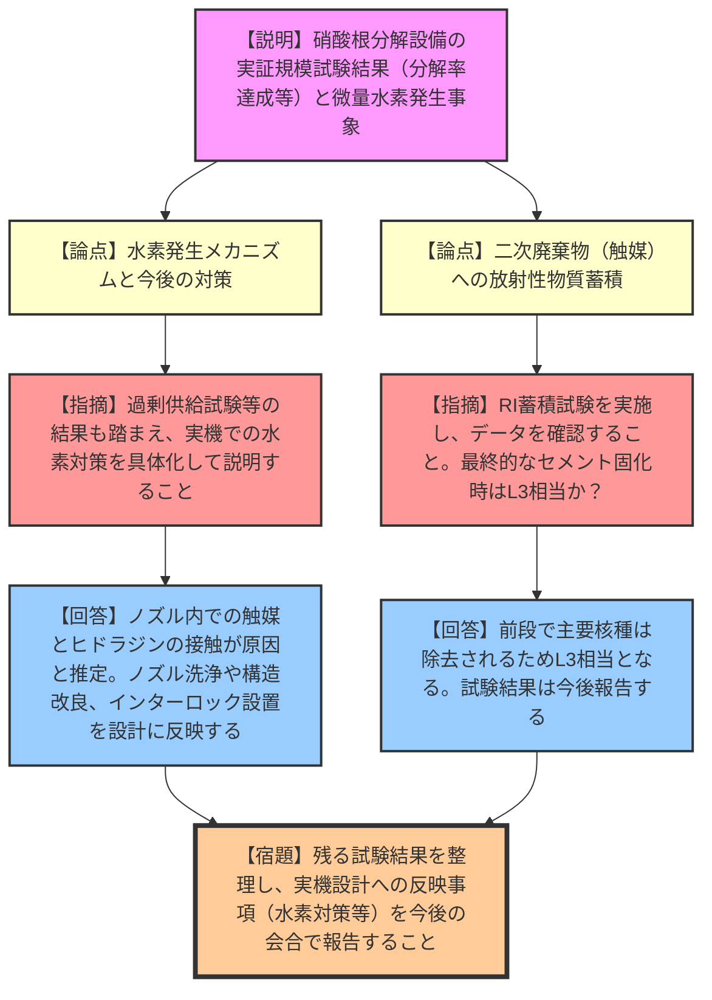
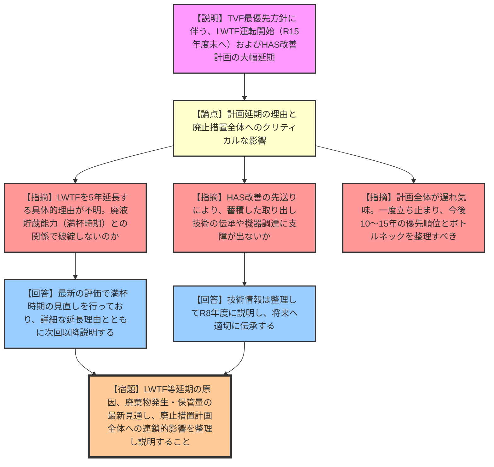

# 第83回東海再処理施設安全監視チーム（令和8年3月16日）
> 出典 : <https://youtube.com/live/wIJPrPBZZ78?si=emFVhcFyynFtpZOI>

## 1. 会合の概要

* **最大の争点:** ガラス固化処理施設（TVF）における遠隔解体用パワーマニプレータの不具合による工程遅延（約1ヶ月）と、それに伴う3号溶融炉の運転再開時期の後ろ倒し。および、低放射性廃棄物処理技術開発施設（LWTF）の運転開始時期の大幅な延期（令和11年度から15年度へ）が廃止措置計画全体に与える影響。
* **審査の進捗状況:** LWTFの実証プラント規模試験（硝酸根分解）は概ね想定通りの結果を得ており、水素発生等の課題に対する安全対策の検討へと進んでいる。一方、廃止措置全体のスケジュールにおいては、ガラス固化処理最優先のしわ寄せ等により、LWTFや高放射性固体廃棄物貯蔵庫（HAS）の改善計画に遅れが生じていることが明らかになった。
* **規制側の納得度:** TVFの不具合対応やLWTFの試験結果自体については一定の理解が示されたものの、LWTFの5年という大幅な計画延長に対しては「具体的に何があったのか」「廃液の貯蔵能力（満杯時期）との関係で破綻しないのか」と強い懸念と不満が示された。
* **特筆すべき決定事項:** 次回以降の会合において、LWTFおよびHASの計画遅延の要因、廃棄物発生量と保管容量の見通し、廃止措置計画全体への影響（クリティカルパスの整理）について、原子力機構が詳細な全体整理を行い、改めて説明することが決定した。

---

## 2. 議題の詳細整理

### 【議題1】ガラス固化処理に向けた準備状況

* **議論の背景と論点:**
    TVFにおける2号溶融炉撤去に向けた固化セル内大型廃棄物の遠隔解体作業中、パワーマニプレータ（スレーブアーム第2軸）のポテンショメータに不具合が発生し、作業が中断した。この復旧対応に伴う3号溶融炉の運転再開スケジュールの遅延影響が論点となった。

* **質疑応答（詳細）:**
  * **【論点：パワーマニプレータ不具合の原因と再発防止】**
    * 【説明者側（原子力機構 森川）】: 不具合の原因は、過去（令和3年頃）の内作によるポテンショメータ交換時の取り付け不良（ネジの緩み）により、ギアが噛み合わなくなったことと推定。予備品と交換し、ダブルチェック（目視・触手・写真・作動確認）を徹底して復旧した。
    * 【規制側（石井）】: セル内での人手による保守は作業員の被ばく増大を招く。再発防止を徹底し、余計な手間がかからないよう慎重に作業を進めること。
  * **【論点：スケジュールへの影響】**
    * 【説明者側（原子力機構 森川）】: 復旧に約1ヶ月を要し、現在解体作業を再開した。形状が複雑なキャリッジ等の解体に想定以上の時間を要しており、3号溶融炉の運転再開は令和8年度第3四半期から遅れる見込み。ただし、設備更新の一部前倒し等により、令和20年度の固化処理完了目標に変更はない。
    * 【規制側（上野）】: 令和20年度目標に変わりはないことを確認した。
  * **【論点：3号溶融炉付帯配管の製作と3D計測】**
    * 【規制側（上野）】: 3D計測前に配管製作をどのように進めているのか。
    * 【説明者側（原子力機構 森川）】: 配管とフランジは7〜8割方製作を進めておき、セル内搬入・据え付け後の3D計測データに基づき、最終的なフランジの取り付け角度等を微調整する計画である。

* **結論と宿題事項:**
  * 不具合の復旧と再発防止策は確認された。
  * **宿題事項:** 解体作業完了（令和8年6月頃）の見通しが得られた段階で、運転再開までの精査した工程を次回以降の会合で報告すること。

---

### 【議題2】低放射性廃棄物処理技術開発施設（LWTF）実証プラント規模試験の取組状況

* **議論の背景と論点:**
    LWTFに導入予定の硝酸根分解設備について、実証プラント規模試験（スケールアップ影響、安定運転、条件変動影響）の結果と、ヒドラジン供給開始時に確認された微量な水素発生のメカニズムおよび対策が論点となった。

* **質疑応答（詳細）:**
  * **【論点：試験結果の妥当性（温度保持と分解率）】**
    * 【説明者側（原子力機構 中崎）】: 温度制御（80℃保持）や攪拌性能は設計通りであり、分解率も目標の90%以上（実測ではほぼ100%）を達成した。
    * 【規制側（佐野田）】: 温度保持データは問題ないと判断。設計に反映すること。
  * **【論点：水素発生メカニズムと対策】**
    * 【説明者側（原子力機構 中崎）】: ヒドラジン供給開始時の微量な水素発生（0.6%以下で爆発下限界未満）は、液位変動によりノズル内に付着した触媒とヒドラジンが直接接触し、自己分解反応が起きたことが原因と推定。実機ではノズル洗浄や構造改良を検討する。
    * 【規制側（上野）】: ヒドラジン過剰供給試験の結果も踏まえ、水素対策を具体化して改めて説明すること。
  * **【論点：二次廃棄物（触媒）への放射性物質の蓄積】**
    * 【説明者側（原子力機構 中崎）】: 前段のろ過吸着設備で主要核種は除去されるため、触媒への放射性物質の蓄積影響は小さいと想定。次年度以降にRIを用いた蓄積試験を実施し、データを確認する。
    * 【規制側（佐野田）】: 試験結果を整理し、監視チーム会合で報告すること。最終的なセメント固化時はL3相当レベルになるという理解でよいか。
    * 【説明者側（原子力機構 中崎）】: その通りである。

* **結論と宿題事項:**
  * 試験結果は概ね良好と評価され、水素対策等への反映方針が確認された。
  * **宿題事項:** 残る試験（触媒回収、過剰供給、RI蓄積試験等）の結果を整理し、実機設計への反映事項（水素対策やノズル詰まり対策等）を今後の会合で報告すること。関連データはテクニカルレポート等で公表し、知見を伝承すること。

---

### 【議題3】東海再処理施設の廃止措置の進捗状況

* **議論の背景と論点:**
    TVFの固化処理最優先の方針のもと、LWTFの運転開始時期が令和11年度から令和15年度末へ5年間延長される方針が突如示され、それに伴う高放射性固体廃棄物貯蔵庫（HAS）の改善計画の先送りを含め、廃止措置計画全体への影響が重大な論点となった。

* **質疑応答（詳細）:**
  * **【論点：LWTF運転開始の大幅延期と全体計画への影響】**
    * 【規制側（佐野田）】: LWTFの運転開始を5年も延長する理由が、資料の数行の記載では全く分からない。廃液の貯蔵能力（満杯時期）との関係で破綻しないのか。廃止措置計画全体にクリティカルな影響を及ぼすのではないか。
    * 【説明者側（原子力機構 小杉）】: 延長に至った要因や、最新の評価による保管施設の満杯時期の見直し結果を含め、次回以降改めて詳細に説明する。
  * **【論点：HAS貯蔵状態改善の先送りと技術伝承】**
    * 【規制側（勘定）】: HASに関する設計がLWTF完了後へ先送りされることで、これまで蓄積した水中ROV等の取り出し技術の伝承や、海外製機器の将来的な入手性に懸念がある。廃止措置計画への影響を整理して説明すること。
    * 【説明者側（原子力機構 小杉）】: 令和8年度に技術情報の整理結果を説明し、将来の取り出しに向けて適切に反映・伝承していく。
  * **【論点：規制側の全体的な懸念と指示】**
    * 【規制側（大島）】: 制約条件があるにせよ、全体的に計画が遅れ気味である。一度立ち止まり、優先順位と影響（ボトルネック）を整理すべき段階に来ている。低レベル廃棄物についても、系統除染が進む中でどのように保管・処理していくのか、今後10〜15年の見通しを共通理解として持つ必要がある。来年度以降、順次議論していきたい。
    * 【説明者側（原子力機構 山口）】: TVFを最優先に進める方針は維持しつつ、施設整備や廃棄物発生量が廃止措置計画全体にどう影響するか、順次説明させていただきたい。

* **結論と宿題事項:**
  * 計画遅延に対する強い懸念が示され、全体計画の再整理が求められた。
  * **宿題事項:** LWTFおよびHASの計画延長の具体的原因、廃棄物の発生量と保管容量（満杯時期）の最新見通し、およびそれらが廃止措置計画全体に与える連鎖的な影響（クリティカルパス）を詳細に整理し、次回以降の会合で説明すること。

---

## 3. 論理構造の可視化（Mermaid）

### 議題1: ガラス固化処理に向けた準備状況

### 議題2: LWTF実証プラント規模試験の取組状況

### 議題3: 東海再処理施設の廃止措置の進捗状況

