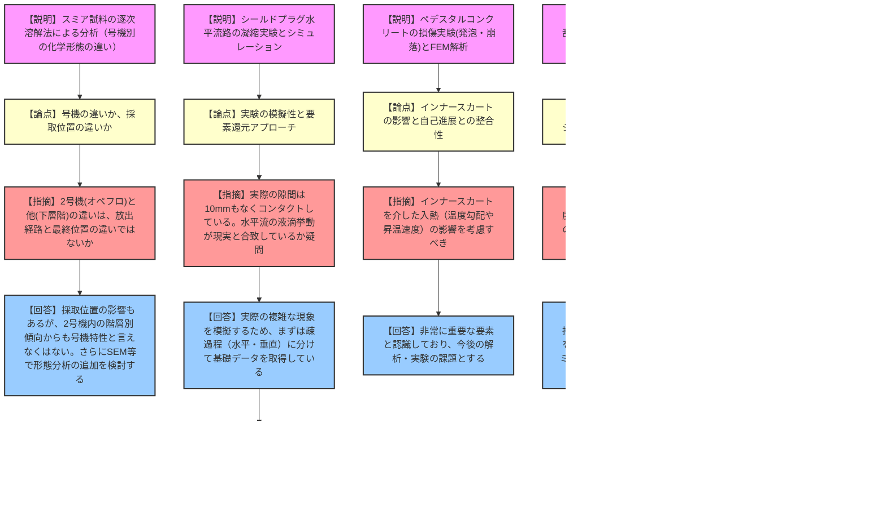

# 第54回東京電力福島第一原子力発電所における事故の分析に係る検討会（令和8年3月17日）
> 出典 : https://youtube.com/live/epWIocXrb3I?si=dqY34MLqsOaBS0wr

## 1. 会合の概要
*   **最大の争点:**
    *   **シールドプラグの汚染メカニズム:** 狭隘流路における水蒸気の水平・垂直方向の凝縮とエアロゾルのトラップ挙動をどう実験で模擬・解明するか。
    *   **ペデスタルコンクリートの損傷解析:** インナースカートの剛性や曲率がコンクリートの破壊（水平ひび割れや表面剥落）に与える影響と、高温・低温環境下における材料科学的変化（発泡・崩落）のメカニズム。
    *   **3号機水素爆発メカニズム:** 乱流環境下や不活性ガス（水蒸気・窒素）・可燃性ガス（メタン）添加条件における水素爆発の最大圧力および火炎伝播速度への影響評価。
*   **審査の進捗状況:** 各委託研究（JAEA、公立小松大学、東京大学、長岡技術科学大学等）から、実験やシミュレーションの初期結果が報告された。各事象の要素還元（疎過程）的なアプローチによる基礎データの取得が進んでおり、今後はこれらの知見を統合して実際の事故シナリオとの整合性を検証するフェーズへ移行する。
*   **現場の緊張感・規制側の納得度:** 委員からは「実験体系が実際の現場（シールドプラグの接触状態等）を反映しているか」「乱流実験の目的とシミュレーションへの適用パラメータが明確か」など、実験の模擬性や目的意識を問う鋭い指摘が相次いだ。研究者側は要素還元的なアプローチの必要性を説きつつ、今後の課題として真摯に受け止める姿勢を示し、活発かつ建設的な議論が行われた。

---

## 2. 議題の詳細整理

### 【議題1】福島第一原子力発電所で取得したスミア試料の分析状況
*   **議論の背景と論点:** JAEAが開発した「逐次溶解法」（超純水、硝酸過酸化水素、硝酸フッ化水素酸の順に溶解）を用いてスミア試料を分析し、1〜3号機におけるセシウム等の化学形態の違いを推定する。
*   **質疑応答（詳細）:**
    *   **【説明者側（JAEA 島田）】**: 2号機（オペフロ）は水溶性のモリブデン酸セシウム等の割合が高く、3号機はケイ酸塩等と随伴する割合が高い。号機による化学形態の違いが示唆された。
    *   **【規制側（福田委員）】**: 号機の違いというより、採取位置（オペフロか下層階か）の違いではないか。トップヘッドフランジからの放出経路を考えると採取位置が効いてくるはず。
    *   **【説明者側（JAEA 島田・丸山）】**: 採取位置の違いも影響していると認識している。一方で、2号機内の階層の違いによる傾向も確認できており、号機（炉心に近いか離れているか等）の違いとも言えなくはない。
    *   **【規制側（岩永）】**: 化学特性からアプローチする本手法は非常に有用。さらに電子顕微鏡（SEM）等で形態分析も追加し、情報量を増やせないか。
    *   **【説明者側（JAEA 丸山）】**: Cs-137の量が極微量のためSEM-EDXでの元素分析は厳しいかもしれないが、形態分析等ができるか関係者で検討する。

### 【議題2】1～3号機シールドプラグの汚染メカニズムの検討状況
*   **議論の背景と論点:** シールドプラグの隙間（階段状流路）をセシウム含む水蒸気が通過する際の凝縮・トラップ挙動の解明。公立小松大学による水平流路の凝縮実験および二次元シミュレーション結果が報告された。
*   **質疑応答（詳細）:**
    *   **【説明者側（公立小松大 宇多野原）】**: 水平流路（高さ10mm）の凝縮実験を実施。液滴が成長し流下する様子や、堰（高さ5mm）を設けた場合の手前の熱流速低下（液膜による熱抵抗増）を確認。シミュレーションでも実験の温度分布や熱流速を概ね再現できた。
    *   **【規制側（宮野委員・浦田委員）】**: 実際のシールドプラグは10mmも開いておらず、基本はコンタクトしているはず。実験の隙間設定（10mm）や、水平面上での液滴スイープアウト挙動が実際の現象と合致しているのか疑問。毛細管現象等の考慮が必要ではないか。
    *   **【規制側（岩永）】**: JAEAの解析で、自重や歪みにより隙間（数mm）が生じることが確認されている。実際の複雑な現象をいきなり模擬するのは困難なため、要素還元的に水平・垂直の疎過程から解明を進めている。
    *   **【規制側（杉山委員・前川委員）】**: 疎過程からアプローチする手法は理解する。今後は、天井側からの凝縮（上下逆の実験）や、プラグ上面・下面での挙動の違いなど、より現実に近づけた検証を期待する。

### 【議題3】1号機原子炉建屋格納容器ペデスタルコンクリートの基本特性に係る検討状況及び損傷解析（続報）
*   **議論の背景と論点:** 1号機ペデスタルの損傷メカニズムについて、高温（MCCI等）および低温（熱・雰囲気・水による化学変化）シナリオでの実験（東京大・大阪大・島根大）と、インナースカートの剛性や曲率を考慮したFEM解析（規制庁）の続報。
*   **質疑応答（詳細）:**
    *   **【説明者側（東大 村上、阪大 牟田、規制庁 入江）】**: 
        *   **実験**: 高温（1100℃）で特定の骨材が発泡・膨張する現象や、水蒸気加圧後の再加熱で多孔質化する現象を確認（軽石形成メカニズムと類似）。
        *   **解析**: FEM解析により、インナースカートの剛性差に起因して天端付近に水平ひび割れが入ることや、曲率の影響で内側から外側へひび割れが進展することを確認した。
    *   **【規制側（前川委員）】**: FEM解析において、コンクリートのひび割れ判定基準や、インナースカートとの境界のすべりはどうモデル化しているか。
    *   **【説明者側（規制庁 入江）】**: ひずみのクライテリアを設定し、高温による強度低下（構成則）を反映。インナースカートとの境界は付着強度を持たせつつ剥離可能なモデルとしている。
    *   **【規制側（山地委員・福田委員）】**: インナースカートを介した入熱（温度勾配や昇温速度の影響）が自己進展上重要。この点も考慮すべき。
    *   **【説明者側（規制庁 入江・東大 村上）】**: インナースカートからの入熱は非常に重要な要素と認識しており、今後の解析・実験の課題として取り組む。

### 【議題4】3号機水素爆発に関する検討状況
*   **議論の背景と論点:** 3号機4階の梁の損傷（塑性ヒンジ）から推定された爆発圧力（300〜500kPa）を再現する混合ガス条件の特定。不活性ガス（窒素、水蒸気）や可燃性ガス（メタン）の添加、および乱流が燃焼に与える影響について、長岡技科大と仏IRSNの実験結果が報告された。
*   **質疑応答（詳細）:**
    *   **【説明者側（長岡技科大 門脇）】**: 窒素を20%添加すると火炎伝播が遅くなり圧力も上がらない（全体が燃えない）領域が増える。一方、乱流環境下では火炎面が乱れ、伝播速度と最大圧力が上昇することを確認した。今後は乱流下でのメタン添加影響を調べる。
    *   **【規制側（浦田委員・丸山委員）】**: 乱流実験の目的は何か。密閉容器内でファンを回すことで、燃焼速度の相関式を作るためのデータ取りという理解でよいか。
    *   **【説明者側（長岡技科大 門脇）】**: その通り。乱流により火炎伝播速度が上がり熱損失が減ることで最大圧力が上がる。濃度・乱流強度・伝播速度の相関データを取得し、次年度以降のシミュレーション（RANSやLES）に活用するための基礎データ取得が目的である。
    *   **【規制側（岩永）】**: 乱流やメタン添加の実験も重要だが、まずは1Fの実際の環境（水素・水蒸気・酸素濃度）において火がつくか・つかないかの境界を見極めることに注力したい。

### 【議題5】4号機鉄筋コンクリートの損傷から水素爆発の位置及び規模の推定
*   **議論の背景と論点:** 4号機3階北西部の床および梁の損傷状況（床の抜け落ち、梁端部の塑性ヒンジ）から、水素爆発の位置と規模を逆算的に推定するアプローチの紹介。
*   **質疑応答（詳細）:**
    *   **【説明者側（規制庁 入江）】**: 3階北西部の床が大きく抜け落ちている一方、周囲の梁は塑性ヒンジが生じているのみで無傷に近い。この剛性の差による破壊形態から、爆発の領域と規模を今後推定していく。
    *   **【規制側（前川委員）】**: 床の沈下と相対する天井の変形度合いも考慮して検討してほしい。
    *   **【説明者側（規制庁 入江）】**: 天井は一度上へ変形しても重力で落ちてくるため変形が残りにくい可能性があり、損傷形態から力の方向を見極める必要がある。今後総合的に評価する。

### 【議題7】その他（1F事故分析の調査・分析に係る今後の取組方針）
*   **議論の背景と論点:** 今後の中長期的な事故分析の取り組み方針と、次年度から着手予定の「中性子を用いた燃料デブリ分布の把握（Eu-154, Cm-244の活用）」についての報告。
*   **質疑応答（詳細）:**
    *   **【規制側（福田委員・山中委員長）】**: これまでの4年間の調査の総括（何が残っていて何が重要か）をすべき。特にRCICのバルブロジック、インターロックの問題、水素爆発の着火源、スタックの共有問題などは、他の炉の安全向上や国際的なニーズ（新型炉等への反映）からも急いで結論を出すべき。
    *   **【説明者側（規制庁 宮本・小金谷）】**: 今年度いっぱいでこれまでの調査を総括し、取り残されているニーズや課題を明確にして委員会へ報告する。

---

## 3. 論理構造の可視化（Mermaid）

