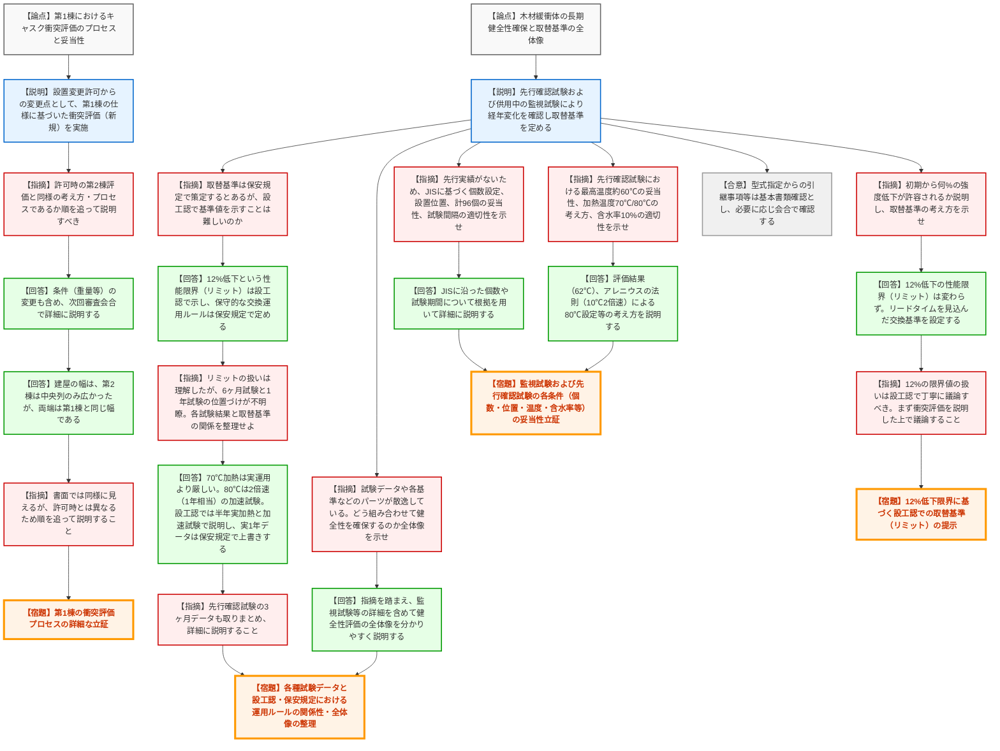

# 第1399回原子力発電所の新規制基準適合性に係る審査会合（令和8年3月17日）
> 出典 : https://youtube.com/live/uSPN8ZEuP3E?si=t23ekIFE5-kiVhM_

## 会合の概要作成
* **最大の争点:** 設置変更許可時から変更となった「第1棟」のキャスク衝突評価の妥当性と、先行実績のない「木材緩衝体の長期健全性」を担保するための各種試験条件および取替基準の全体像の整理が最大の争点となりました。
* **審査の進捗状況:** 今回は設工認申請に関する初回の概要説明であり、規制庁側から多くのデータ提示と論理の精緻化を求める宿題が提示されました。型式指定からの引き継ぎ事項等については概ね書類確認へと移行しました。
* **特筆すべき決定事項:** 取替基準の法的位置づけについて、「性能限界（リミット）」は設工認で明確に定め、「リードタイムを考慮した運用上の交換基準」は保安規定で定めるという切り分けの方針が確認されました。
* **現場の雰囲気:** 規制庁側は、事業者が提示した試験計画（温度、含水率、JIS適用の妥当性）やデータの位置づけが散逸していることに対し、厳しい姿勢で「全体像の再整理と詳細な立証」を強く要求しており、事業者側もそれに全面的に応じる形で次回会合への持ち越しとなりました。

---

## 議題ごとの詳細整理（テキスト）

**【議題1】女川原子力発電所第2号機の使用済燃料乾式貯蔵施設の設置の工事に係る設計及び工事計画認可申請の審査について**

* **議論の背景と論点:**
  女川原発2号機の乾式貯蔵施設（当面は第1棟、6基）の設工認申請に関する概要説明。設置変更許可時（第2棟の評価）から変更となった第1棟のキャスク衝突評価のプロセスが同様であるかの確認、および、キャスクを保護する木材緩衝体の60年間にわたる長期健全性（先行確認試験、供用中の定期監視試験、取替基準の設定）がいかに論理的に構築されているかが技術的な争点となった。

* **質疑応答（詳細）:**

  **＜論点1：第1棟におけるキャスク衝突評価の妥当性＞**
  * **【説明者側（東北電力: 藤田）】:** 設置変更許可からの変更点として、第2棟ではなく第1棟の寸法・仕様に基づいたキャスクの落下・衝突評価（新規評価）を実施した。結果はわずかに変更されたが基準に対し十分な余裕がある。
  * **【規制側（規制庁: 藤川）】:** 形状変更は軽微と理解するが、本申請の第1棟評価は新規評価である。次回審査会合で、第2棟の評価と同様の考え方・プロセスで評価していることを順を追って説明すべき。
  * **【説明者側（東北電力: 藤田）】:** 了承した。重量等の条件が変わっていることも含め説明する。
  * **【説明者側（東北電力: 佐藤）】:** 補足として、建屋の幅は第2棟が給排気機構の関係で中央列のみ広かったが、両端は第1棟と同じ幅（6,750mm）である。
  * **【規制側（規制庁: 藤川）】:** 申請書を見る限り同様のプロセスに則っていると思われるが、許可段階では第2棟しか見ていないため、第1棟の評価についても順を追ってしっかり説明すること。

  **＜論点2：木材緩衝体の許容強度低下と取替基準＞**
  * **【規制側（規制庁: 藤川）】:** 許可段階（第2棟）では木材緩衝体の強度が初期から約12%低下しても安全機能が維持されると説明された。本申請（第1棟）において強度低下が初期から何%程度まで許容されるかを説明した上で、取替基準策定の考え方を示すべき。
  * **【説明者側（東北電力: 藤田）】:** 12%低下という干渉性能の限界（リミット）は基本的に変わらない。このリミットに到達する前に交換を実施するため、緩衝体の製造等のリードタイムを含めた交換基準を設定する。設工認で何%に該当するかも含め説明する。
  * **【規制側（規制庁: 藤川）】:** 12%の限界値の扱いは設工認の断面で丁寧に議論すべき。まず第1棟の衝突評価を説明した上で、木材緩衝体の議論を行うこと。

  **＜論点3：監視試験および先行確認試験の妥当性＞**
  * **【規制側（規制庁: 松野）】:** 木材緩衝体の試験は先行実績がない。JIS規格に基づく試験片の個数設定、容器の設置位置、合計96個という個数で十分か、および試験間隔（初期5年間は1年おき、以降3年ごと）が適切であるか、根拠を用いて詳細に説明せよ。
  * **【説明者側（東北電力: 藤田）】:** JISに沿った個数や期間設定の根拠について詳細に説明する。
  * **【規制側（規制庁: 松野）】:** 先行確認試験の条件設定について、木材最高温度を約60℃とした評価温度の妥当性、加熱温度を70℃および80℃とした考え方、含水率10%の適切性を詳細に説明せよ。
  * **【説明者側（東北電力: 藤田）】:** 評価結果（62℃）に対する70℃設定、アレニウスの法則（10℃で反応速度2倍）に基づく80℃設定、含水率の考え方について今後詳細に説明する。

  **＜論点4：各種試験データの位置づけと全体像の整理＞**
  * **【規制側（規制庁: 松野）】:** 取替基準は保安規定で策定するとあるが、設工認で基準値を示すことは難しいのか。
  * **【説明者側（東北電力: 藤田）】:** 12%低下等の「性能リミット」については設工認で明確に示す。それに到達する前の実際の交換運用（指示から納入までの期間を含む）については保安規定段階で定める方針である。
  * **【規制側（規制庁: 松野）】:** リミットを設工認で示すことは理解した。しかし6ヶ月試験と1年試験の位置づけが分かりづらい。各試験結果と取替基準の関係を整理して次回説明せよ。
  * **【説明者側（東北電力: 佐藤）】:** 実運用では夏場を考慮しても最高約60℃であり、冷却に伴い低下するため、70℃一定の加熱試験は厳しい設定である。80℃はアレニウスの法則を適用した加速試験（2倍速＝1年相当）である。設工認段階では半年間の実加熱試験と加速試験（1年相当）の結果で交換基準を説明し、1年経過後の実データが得られた段階で保安規定にて上書き説明を行う。
  * **【規制側（規制庁: 松野）】:** 先行確認試験の3ヶ月データも取りまとめ、結果を踏まえて詳細に説明すること。
  * **【規制側（規制庁: 皆川）】:** 長期健全性確保について、供用期間中の試験、設工認でのリミット、保安規定での取替基準など、様々なパーツが並んでいるが全体像が見えづらい。どう組み合わせて健全性を確保しようとしているのか、全体像を整理して示すこと。型式指定からの引き継ぎ事項等については基本書類確認を進める。
  * **【説明者側（東北電力: 青木）】:** 指摘を踏まえ、監視試験や先行確認試験の詳細な方法を含め、健全性評価の全体像を分かりやすく説明する。

* **結論と宿題事項（アクションアイテム）:**
  * **【合意】** 性能限界（リミット）は設工認で規定し、保守的な交換運用ルールは保安規定で定めるという枠組みについては基本了承された。型式指定からの引継事項は書類審査へと移行する。
  * **【宿題】** 第1棟におけるキャスク衝突評価のプロセスを、許可時（第2棟）との差異を含めて論理的に説明すること。
  * **【宿題】** 木材緩衝体の12%強度低下許容に対する取替基準（リミット）を明確に示すこと。
  * **【宿題】** 先行実績のない木材試験における条件（JIS適用の妥当性、設置個数96個の根拠、試験頻度、60℃評価・70℃/80℃加熱・含水率10%の妥当性）を根拠データとともに立証すること。
  * **【宿題】** 取得済みの3ヶ月データを含む各種試験データと、設工認・保安規定における取替基準の関係性を整理し、健全性確保の「全体像」を明確に提示すること。

---

## 論理構造の可視化（Mermaid）

