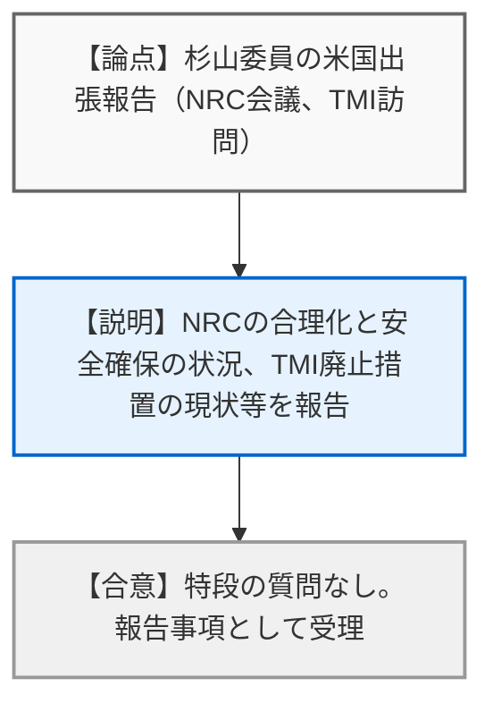
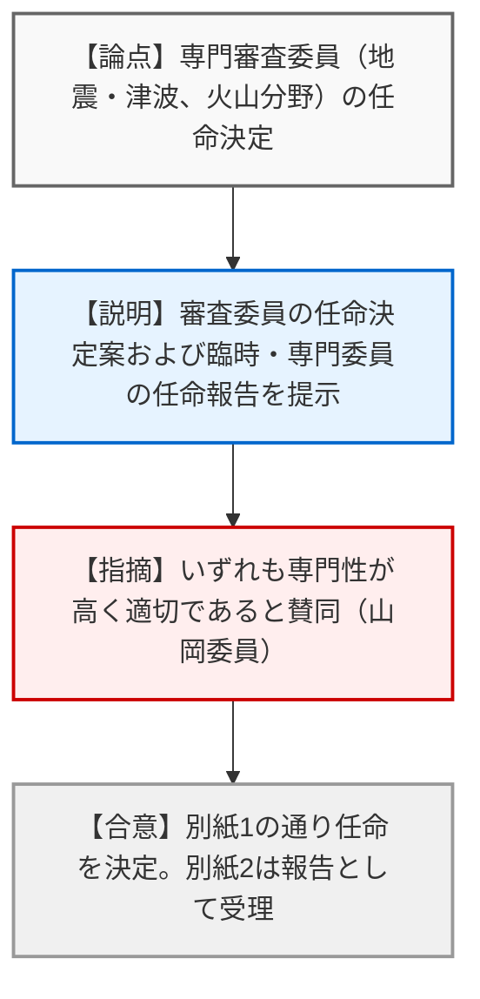
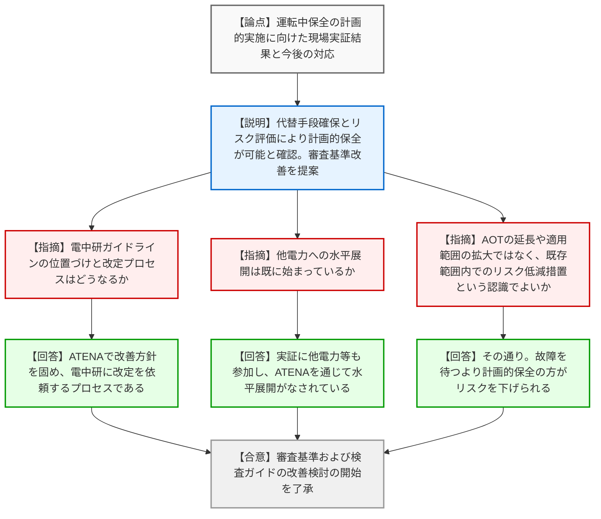
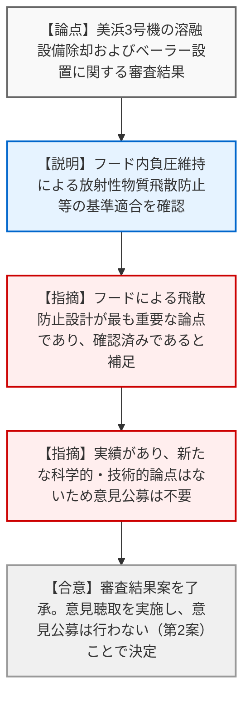
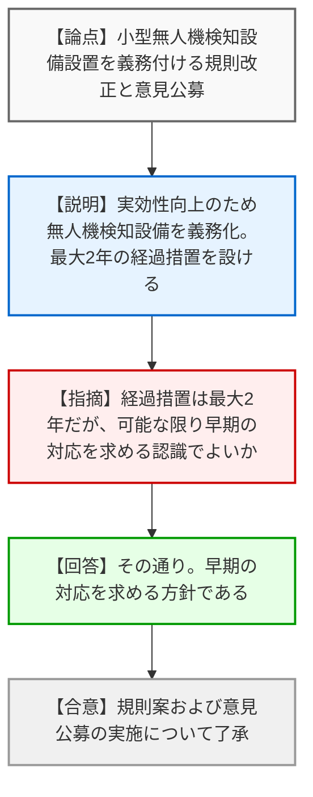
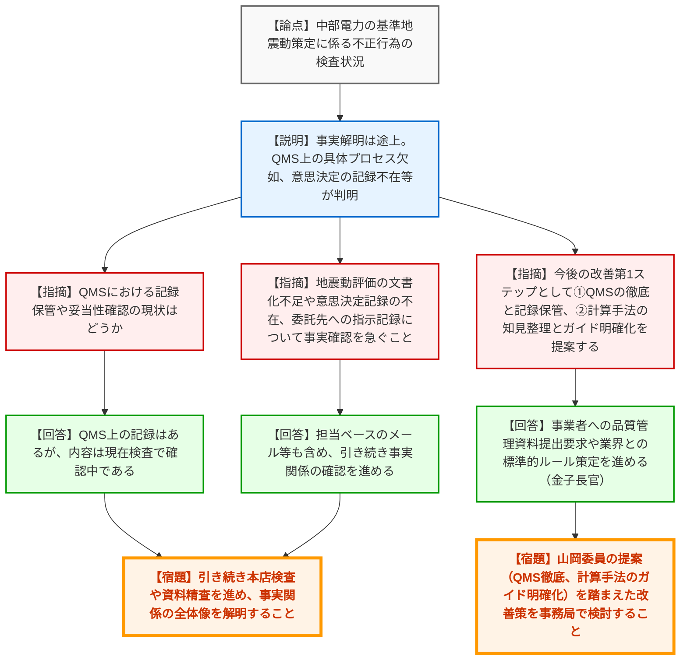

# 第66回原子力規制委員会（令和8年3月18日）
> 出典 : https://youtube.com/live/_l0FtKGxr5E?si=uiB5URklEe_8E2V8

## 会合の概要作成
* **最大の争点:** 中部電力の基準地震動策定に係る不正行為問題において、品質マネジメントシステム（QMS）上の具体的なプロセスや意思決定の記録が残っていない杜撰な実態が浮き彫りとなり、今後の事実解明と再発防止策（QMSの徹底、計算手法の審査ガイド明確化）に向けた方針が最大の議論の的となりました。
* **審査の進捗状況:** 運転中保全の現場実証が完了し、計画的な保全を認めるための審査基準・検査ガイドの改善検討が正式に始動しました。また、美浜3号機のベーラー設置は基準適合が認められ、意見公募を行わずに次のステップへ進むことが決定しました。
* **特筆すべき決定事項:** 美浜3号機の設置変更許可に係る科学的技術的意見の公募を「行わない（第2案）」と決定しました。また、核物質防護規制の強化（小型無人機検知設備の義務化）に向けた意見公募の実施が了承されました。
* **現場の雰囲気:** 中部電力の問題に対しては、記録が散逸していることに対する規制側の強い懸念と呆れが滲んでおり、委員からは単なる調査に留まらず、規制基準（審査ガイド）自体の抜本的な改善を求める強い要望が飛び交うなど、非常に緊張感のある質疑が展開されました。

---

## 議題ごとの詳細整理（テキスト）

**【議題6】杉山委員の出張報告**
* **議論の背景と論点:** 米国NRC（原子力規制委員会）主催の規制情報会議への出席、およびスリーマイル島原発の訪問結果の報告。
* **質疑応答（詳細）:**
  * **【説明者側（杉山委員）】:** NRCが合理化と安全確保の両立という難しい局面に直面していること、およびスリーマイル島原発（TMI）2号機の廃止措置（遠隔重機による除染等）と1号機の再稼働に向けた状況を視察した旨を報告。
* **結論と宿題事項（アクションアイテム）:**
  * **【合意】** 特段の質疑はなく、報告事項として了承された。

**【議題5】原子炉安全専門審査会及び核燃料安全専門審査会の審査委員等の任命**
* **議論の背景と論点:** 地震・津波分野、火山分野の専門審査委員の再任に関する決定。
* **質疑応答（詳細）:**
  * **【説明者側（規制庁: 佐藤）】:** 原子炉安全専門審査会の審査委員任命の決定（別紙1）、および委員長による臨時委員・専門委員の任命報告（別紙2）について説明。
  * **【規制側（山岡委員）】:** 提案された候補者はいずれも地震や火山分野で非常に高い専門性を持っており、再任は適切であると賛同。
* **結論と宿題事項（アクションアイテム）:**
  * **【合意】** 別紙1の通り審査委員の任命を決定し、別紙2の報告を受理した。

**【議題4】運転中保全に係る現場実証等の報告及び今後の対応**
* **議論の背景と論点:** 伊方3号機、大飯3号機等で実施された運転中保全の現場実証結果を踏まえ、計画的な運転中保全を制度として認めるための審査基準および検査ガイドの改善検討を開始することの妥当性。
* **質疑応答（詳細）:**
  * **【説明者側（規制庁: 村上）】:** 現場実証の結果、深層防護の維持（代替手段の確保）やリスク評価を活用することで、突発的な故障を待つよりもリスクを下げながら計画的な保全作業が実施可能であることを確認した。
  * **【規制側（神田委員）】:** 電中研が作成したガイドラインは今後どのように改定・オーソライズされていくのか。
  * **【説明者側（規制庁: 村上）】:** まずATENAのもとで事業者としての改善方針を固め、その上で電中研に改定を依頼するという流れである。
  * **【規制側（長﨑委員）】:** 実証現場には他電力も視察に来ており、既に水平展開が始まっていると理解してよいか。
  * **【説明者側（規制庁: 村上）】:** 全員ではないが他電力やATENAも参加しており、ATENAのワーキンググループを通じて詳細な経験が共有され、水平展開がなされていることを確認した。
  * **【規制側（杉山委員）】:** 今回の提案は、運転中保全の対象範囲の拡大やAOT（許容停止時間）の延長を認めるものではなく、既存の枠組みの中でのリスク低減措置という認識でよいか。
  * **【説明者側（規制庁: 村上）】:** その通りである。故障を待つしかなかった状況から、代替手段とリスク管理を行った上で計画的に作業する方が、リスクを下げつつ機器の信頼性を担保できる。
* **結論と宿題事項（アクションアイテム）:**
  * **【合意】** 現行のAOTの範囲内で計画的な運転中保全を認めるため、審査基準および検査ガイドの改善検討を開始することを了承した。

**【議題1】関西電力株式会社美浜発電所の発電用原子炉設置変更許可申請書に関する審査の結果の案の取りまとめ**
* **議論の背景と論点:** 溶融設備の除却およびベーラー（圧縮減容設備）の設置に伴う、放射性物質の飛散防止対策等の基準適合性の確認。
* **質疑応答（詳細）:**
  * **【説明者側（規制庁: 村田・皆川）】:** ベーラー設置に伴い、ドラム缶投入口をフードで囲い、建屋換気系フィルターを通して排気することでフード内を負圧に維持し、放射性物質が散逸し難い設計としていることを確認した。
  * **【規制側（杉山委員）】:** 審査担当として補足する。ドラム缶を圧縮した際に空気が吹き出し放射性物質が放出されるため、フードで覆い空気の流れを制御して飛散を防ぐ設計が最も重要な論点であり、しっかり確認した。
  * **【規制側（各委員）】:** 実績のある案件であり、新たな科学的・技術的論点はないため、意見公募は行わなくてよい。
* **結論と宿題事項（アクションアイテム）:**
  * **【合意】** 審査結果案を了承し、原子力委員会および経済産業大臣への意見聴取を実施することを決定した。
  * **【決定】** 科学的・技術的意見の公募については「行わない（第2案）」ことで全会一致で決定した。

**【議題2】核物質防護規制のあり方の検討状況（３回目）**
* **議論の背景と論点:** 小型無人機（ドローン等）の脅威に対応するため、対象原子力事業所に対して小型無人機を検知する設備の設置を義務付ける規則改正案と、意見公募の実施。
* **質疑応答（詳細）:**
  * **【説明者側（規制庁: 吉川）】:** 防護措置の実効性向上のため規則を改正する。事業者における対応期間を考慮し、交付日から起算して最大2年間を核物質防護規定の変更申請の経過措置期間として設ける。
  * **【規制側（杉山委員）】:** 経過措置は最大2年となっているが、当然それより前に可能な範囲でなるべく早期に対応（申請および現場対応）してもらうという認識でよいか。
  * **【説明者側（規制庁: 吉川）】:** その通りである。
* **結論と宿題事項（アクションアイテム）:**
  * **【合意】** 規則改正案および、電子政府の総合窓口と郵送による30日間の意見公募の実施について了承した。

**【議題3】中部電力株式会社の不正行為に係る検査状況の報告（２回目）**
* **議論の背景と論点:** 中部電力における基準地震動策定プロセスでの不正行為について、本店検査（3/2～3/3）により判明した事実関係（記録の不在、品質管理の不備）の共有と、今後の規制側のアプローチの検討。
* **質疑応答（詳細）:**
  * **【説明者側（規制庁: 忠内）】:** 本店検査の結果、地震動策定は品質マネジメント計画における「個別業務」に位置づけられているものの、具体的なプロセスが記載されておらず、意思決定の記録や、委託先への詳細条件の承認文書が存在しない（打ち合わせやメール等のレベルに留まる）ことが判明した。事実関係の全体像は未だ解明途上である。
  * **【規制側（山岡委員）】:** 品質管理プロセスにおける記録保管や妥当性確認の現状はどうなっているか。
  * **【説明者側（規制庁: 忠内）】:** QMSのプロセスに乗っている記録自体は存在するが、その内容や適合性については現在検査の中で確認中である。
  * **【規制側（山岡委員）】:** 全貌解明には時間がかかるが、並行して改善の「第1ステップ」を提案する。1点目はQMSに従ったプロセスの実行と記録・トレーサビリティの徹底。2点目は、計算手法（統計的グリーン関数法等）の最新知見を整理し、規制側の審査ガイドで手順を明確化（あるいは指定）することである。
  * **【規制側（山中委員長）】:** 山岡委員の提案を第1ステップとして、事務局でどう改善が可能か検討してほしい。
  * **【規制側（金子長官）】:** 新規制基準適合性審査チームから事業者に対し、品質管理をしっかり行った資料を出すよう既に指示している。計算手法についても業界と標準的なルール作りを進めていく。
  * **【規制側（山中委員長）】:** 地震動評価プロセスの文書化不足、意思決定の記録不在、委託業者に対する代表波選定の指示記録等について、事実確認をしっかり行うこと。
  * **【説明者側（規制庁: 忠内）】:** 担当ベースのメール等も含め、提出された資料を精査し、引き続き確認を進める。
* **結論と宿題事項（アクションアイテム）:**
  * **【宿題】** 引き続き関係者への聞き取りや資料精査を進め、事実関係の全体像を解明した上で再度委員会へ報告すること。
  * **【宿題】** 山岡委員の提案（QMSの徹底と記録保管の義務化、および計算手法に関する審査ガイドの明確化）を踏まえ、規制庁事務局において審査基準および検査手法の抜本的な改善策を検討すること。

---

## 論理構造の可視化（Mermaid）

### 議題6：杉山委員の出張報告

### 議題5：原子炉・核燃料安全専門審査会の審査委員等の任命

### 議題4：運転中保全に係る現場実証等の報告及び今後の対応

### 議題1：美浜発電所の設置変更許可申請審査結果の案の取りまとめ

### 議題2：核物質防護規制のあり方の検討状況（３回目）

### 議題3：中部電力株式会社の不正行為に係る検査状況の報告（２回目）

