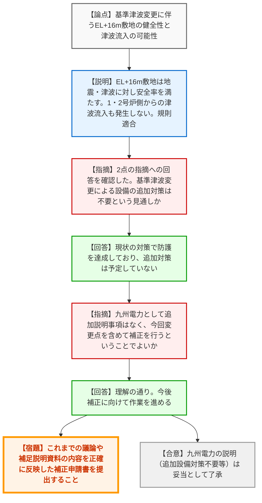
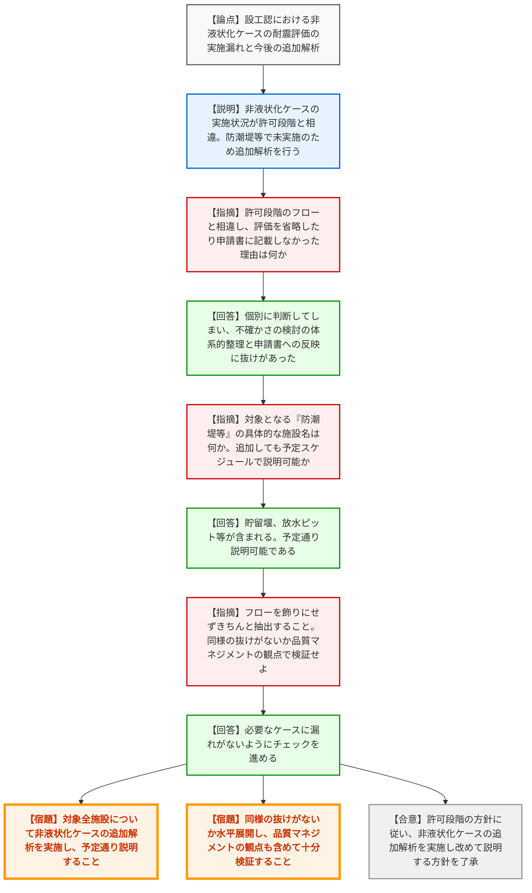
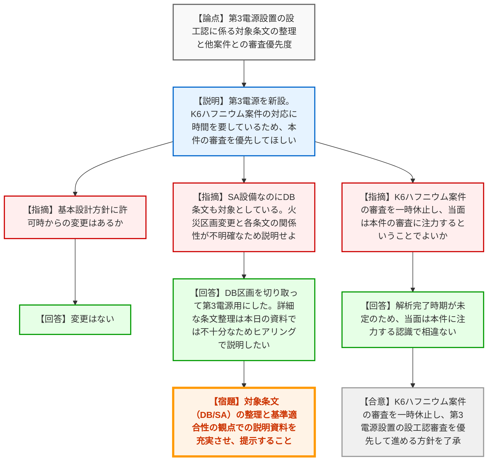

# 第1400回原子力発電所の新規制基準適合性に係る審査会合（令和8年3月19日）
> 出典 : https://youtube.com/live/tSFM1dgoYZ0?si=2MG5AKq75j54mUKq

## 会合の概要作成
* **最大の争点:** 議題2（泊発電所）において、設置許可段階で約束されていた「非液状化ケースの耐震評価」が設工認申請で実施・記載されていなかった問題が判明し、品質マネジメントの観点も含めて厳しい指摘と追加解析の要求が行われた点が最大の争点となりました。
* **審査の進捗状況:** 議題1（玄海）については、基準津波変更に伴う地形の健全性等の説明が了承され、補正申請へと進むことになりました。議題3（柏崎刈羽）については、別案件（K6ハフニウム型制御棒）の審査を一時休止し、今回の第3電源設置の審査を優先的に進める方針が確認されました。
* **現場の雰囲気:** 規制庁側は、九電や東電に対しては資料の整合性や今後の手続きの念押しを行う程度で概ね納得した様子でしたが、北電の評価漏れに対しては「フローが飾りになっている」「品質マネジメントを機能させるべき」と強いトーンで苦言を呈しており、緊張感のある場面が見られました。

---

## 議題ごとの詳細整理（テキスト）

**【議題1】九州電力株式会社 玄海原子力発電所3号炉及び4号炉の設置変更許可申請（日本海南西部の海域活断層の長期評価（第一版）の反映に伴う変更）の審査について**

* **議論の背景と論点:**
  基準津波の変更を踏まえた対津波設計方針に関し、前回会合で指摘された2点（①遡上波の障壁となるEL+16m敷地の地震時・津波時の健全性、②1・2号炉側の経路からの津波流入の可能性）に対する九州電力からの回答と、設置許可基準規則への適合性が論点となった。

* **質疑応答（詳細）:**
  * **【説明者側】（九州電力: 小宮）からの説明:**
    指摘①について、EL+11m敷地への障壁となるEL+16m敷地の岩盤部の健全性を評価した。地震時はすべり線③で最小安全率5.9、津波時は保守的な津波波力（段波）を用いて安全率90となり、耐震・対津波性を確認した。地震に起因する地形変化を考慮しても津波は到達しない。
    指摘②について、1号炉側の取水路・放水路・屋外排水路を評価した結果、入力津波高さは許容津波高さ（天端や敷地高さ等）を下回り、経路から津波は流入しないことを確認した。以上より、津波防護方針に基許可から変更はなく適合している。
  * **【規制側】（規制庁: 岩崎、市森）の懸念・指摘点:**
    2点の指摘について確認できた。基準津波の変更によっても、設備の変更や機器の補強などの追加対応は不要としていると考えてよいか。
  * **【説明者側】（九州電力: 福田）の回答・反論・根拠:**
    現状の対策で津波防護を達成しており、追加の対策は予定していない。
  * **【規制側】（規制庁: 中川）の再反論や確認事項:**
    九州電力として追加的説明事項はなく、今回説明した変更点を含めて今後補正申請を行うという理解でよいか。また、これまでの議論や補足説明資料の内容をしっかり反映して提出すること。
  * **【説明者側】（九州電力: 寺田）の回答:**
    理解の通りである。今後補正に向けて具体的に作業を進める。

* **結論と宿題事項（アクションアイテム）:**
  * **【合意】** 九州電力の回答（EL+16m敷地の健全性、1・2号炉からの流入なし、追加設備対策不要）は妥当と判断され、審査方針として了承された。
  * **【宿題】** これまでの審査会合での議論および補足説明資料の内容を正確に反映させた補正申請書を提出すること。

---

**【議題2】北海道電力株式会社 泊発電所3号機の設計及び工事の計画の審査について**

* **議論の背景と論点:**
  浸水防護施設の耐震評価において、設置許可段階で「有効応力解析を実施する場合は非液状化ケースの評価も実施する」と説明していたにもかかわらず、今回の設工認申請において防潮堤等で実施されていない、あるいは申請書に記載されていないという相違が判明した。その原因究明と追加解析の方針が論点となった。

* **質疑応答（詳細）:**
  * **【説明者側】（北海道電力: 牧野、松本）からの説明:**
    設工認の審査過程で、非液状化ケースの実施状況が許可段階の説明と相違していることを認識した。防潮堤では影響評価により液状化ケースの方が厳しいと判断して省略し、津波監視カメラや放水ピット等も未実施であったため、許可段階のフローに基づき追加解析を実施したい。
  * **【規制側】（規制庁: 藤原）の懸念・指摘点:**
    許可段階で示した明確なフローと相違し、一部評価を省略したり申請書に示さなかった理由・原因は何か。
  * **【説明者側】（北海道電力: 辰田）の回答・反論・根拠:**
    防潮堤の検討において個別に判断してしまった。許可のフローは社内で確認していたものの、不確かさに関する検討を体系的に整理できておらず、申請書への反映に抜けが生じたと反省している。
  * **【規制側】（規制庁: 藤原）の再反論や確認事項:**
    抜けがないような対策は考えているか。また、資料にある「防潮堤等」の「等」には具体的にどのような施設が含まれるか。これらを追加しても予定のスケジュール内で説明可能か。
  * **【説明者側】（北海道電力: 辰田、清水）の回答:**
    許可のフローにある検討対象施設に漏れがないようチェックをかけ、追加ケースの必要性を検討する。「等」には貯留堰、放水ピット、出口マスなどが当てはまる。追加解析を含めても予定スケジュールで説明可能と考えている。
  * **【規制側】（規制庁: 篠、杉山）の再反論や確認事項:**
    追加解析により審査期間が延びる恐れがある。他にも同様の事例・抜けがないか十分な検証を行うこと。フローを示した以上、飾りにせずきちんと抽出すること。これは品質マネジメントをきちんと効かせているかという問題にもなり得る。
  * **【説明者側】（北海道電力: 辰田）の回答:**
    追加解析を進める中で必要なケースに漏れがないように進めていく。

* **結論と宿題事項（アクションアイテム）:**
  * **【合意】** 許可段階の約束と相違して非液状化ケースが漏れていた事実が確認され、北海道電力が追加解析を実施した上で改めて説明を行う方針が了承された。
  * **【宿題】** 防潮堤、貯留堰、放水ピット、出口マス等の対象全施設について、非液状化ケースの追加解析を実施し、予定スケジュール通りに説明すること。
  * **【宿題】** 本件のような許可段階の方針との相違・抜けが他施設や他の評価項目で起きていないか、品質マネジメントの観点も含めて水平展開し、十分な検証を行うこと。

---

**【議題3】東京電力ホールディングス株式会社 柏崎刈羽原子力発電所第7号機の所内常設直流電源設備（3系統目）の設置に係る設計及び工事の計画の審査について**

* **議論の背景と論点:**
  交流電源喪失時に備えるための所内常設直流電源設備（第3電源）の設置に係る設工認申請の概要説明。DB（設計基準）条文とSA（重大事故等対処）条文の適用関係の整理、および他申請案件（K6ハフニウム型制御棒）との審査優先度の切り替えが論点となった。

* **質疑応答（詳細）:**
  * **【説明者側】（東京電力: 宮田、伊里沢、斎藤）からの説明:**
    第3電源を新設する。基本設計方針は既工認と同様だが、耐震設計としてSSに加えSdによる地震力にも概ね弾性状態で耐える設計とする。その他、火災・溢水防護等の要件を満たす。また、K6のハフニウム型制御棒の審査対応に時間を要しているため、優先順位を整理し、本件（第3電源）を優先して審査いただきたい。
  * **【規制側】（規制庁: 平本）の懸念・指摘点:**
    許可を受けた設置変更からの基本設計方針に変更はあるか。また、第3電源はSA設備であるにもかかわらず、DB条文（5条〜48条）も対象としている。例えば内部火災は11条(DB)と52条(SA)の両方を対象としているが、火災区画の変更とどのように関係しているのか不明確である。
  * **【説明者側】（東京電力: 斎藤、坂東）の回答・反論・根拠:**
    基本設計方針に変更はない。火災区画については、もともとDB区分2等が設置されていた区画の一部を切り取って第3電源用の区画を設けたため関連している。ただ、各条文の関連を含めた詳細な整理は本日の資料では不十分であるため、ヒアリングで改めて説明したい。
  * **【規制側】（規制庁: 山本）の懸念・指摘点:**
    K6のハフニウム型制御棒の審査で時間を要している具体的内容と対応完了時期はいつ頃か。K6の審査を一時休止し、当面は第3電源の審査に注力するということでよいか。
  * **【説明者側】（東京電力: 伊里沢）の回答:**
    解析は進捗しているが、完了時期は現時点で未定である。当面は本件に注力するという認識で相違ない。
  * **【規制側】（規制庁: 中川）の再反論や確認事項:**
    対象条文の整理に関する説明資料の充実など、指摘事項を含めて資料作成をしっかり対応すること。提出され次第確認を進め、論点があれば審査会合で確認する。
  * **【説明者側】（東京電力: 宮田）の回答:**
    真摯に対応する。

* **結論と宿題事項（アクションアイテム）:**
  * **【合意】** K6のハフニウム型制御棒の審査を一時休止し、K7の第3電源設置の設工認審査を優先して進めることが合意された。
  * **【宿題】** SA設備である第3電源に対してDB条文も適用している理由（特に内部火災等の区画変更との関係性）など、対象条文の整理と基準適合性の観点での説明を充実させた資料を作成し、ヒアリング等で提示すること。

---

## 論理構造の可視化（Mermaid）

### 議題1：玄海原子力発電所3号炉及び4号炉

### 議題2：泊発電所3号機

### 議題3：柏崎刈羽原子力発電所第7号機

