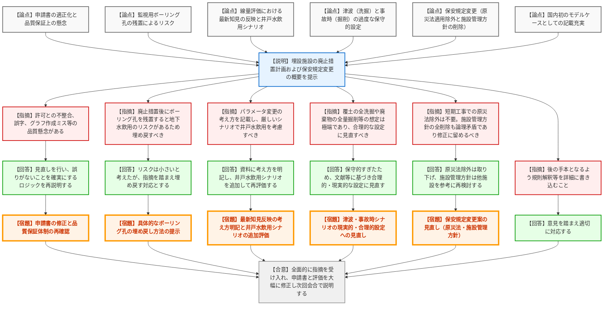

# 第47回核燃料施設等の廃止措置計画に係る審査会合（令和8年3月19日）
> 出典 : https://youtube.com/live/nqTD1pjp2zg?si=szrrH-Xo8NRWNC67

## 会合の概要作成
* **最大の争点:** 国内初となる廃棄物埋設施設の廃止措置計画の審査において、過度に保守的（非現実的）なシナリオ設定（津波による全洗掘、過失による全量掘削）、監視用ボーリング孔の残置によるリスク、保安規定からの条文全削除の論理矛盾など、申請内容の妥当性と品質保証体制が最大の争点となりました。
* **審査の進捗状況:** 規制側から多岐にわたる厳しい指摘がなされ、日本原子力研究開発機構（以下、機構）はこれらの指摘を全面的に受け入れ、シナリオの再評価や申請書の大幅な見直しを行うこととなり、次回会合へ持ち越しとなりました。
* **特筆すべき決定事項:** 本申請が今後の埋設施設廃止措置の「手本（モデルケース）」となるため、規則解釈の根拠等を詳細かつ精緻に申請書へ書き込む方針が規制側・機構側の双方で共有されました。
* **現場の雰囲気:** 規制側から「全く理解できない」「論理矛盾が生じる」「品質保証上の懸念をもたらす」といった厳しい言葉が飛び交い、機構側が防戦一方となる緊張感のあるやり取りが展開されました。しかし、機構側がすべての指摘を真摯に受け入れ、修正を約束したことで、次回に向けた道筋は建設的に共有されました。

---

## 議題ごとの詳細整理（テキスト）

**【議題1】日本原子力研究開発機構原子力科学研究所廃棄物埋設施設の廃止措置計画認可申請及び保安規定変更認可申請について**

* **議論の背景と論点:**
  JPDR解体に伴う極低レベルコンクリート廃棄物（約1670トン、約2.3×10^8 Bq）の埋設施設に関する国内初の廃止措置計画。対象施設の解体範囲、被ばく評価シナリオ（自然現象、人為事象）の妥当性、監視用ボーリング孔の扱い、および保安規定変更（原災法適用除外や施設管理方針の削除）の妥当性が技術的な争点となった。

* **質疑応答（詳細）:**
  **＜論点1：申請書の適正化と品質保証上の懸念＞**
  * **【規制側】（規制庁: 真田、大塚）の懸念・指摘点:** 
    事業許可との不整合、設備名の相違、解体方法の記載漏れなどがある。また、線量評価（炭素14）のグラフにおいてピークの数が合わない等の作成ミスがあり、他の核種に対する取り違えがないか等、品質保証上の懸念がある。
  * **【説明者側】（機構: 石川、佐藤）の回答・根拠:**
    許可との整合を見直し補正する。グラフの誤りは計算結果からグラフを起こす際のミスである。誤りがないことを確実にするロジックを組み立てて再説明する。

  **＜論点2：監視用ボーリング孔の残置によるリスク＞**
  * **【規制側】（規制庁: 佐藤）の懸念・指摘点:**
    廃止措置終了後は管理から外れるため、下流側のボーリング孔を残置したままにすると、地下水を飲用されるリスクがある。埋め戻さないという考え方は理解できない。
  * **【説明者側】（機構: 石川）の回答・根拠:**
    試験用のものでありリスクは小さいと考えていたが、指摘を踏まえ埋め戻す方向で対応する。
  * **【規制側】（規制庁: 佐藤）の再反論や確認事項:**
    具体的な埋め戻しの方法を次回の会合で説明すること。

  **＜論点3：線量評価における最新知見の反映と井戸水飲用シナリオ＞**
  * **【規制側】（規制庁: 大塚）の懸念・指摘点:**
    最新知見として更新したパラメータとそうでないものの考え方、及び新たに設定した安全機能（廃棄物への収着）の考え方を明記すべき。また、1000年後の海岸線移動を考慮すると、水質が改善し飲用可能になる可能性があるため、最も厳しいシナリオにおいて「井戸水飲用」を考慮すべきである。
  * **【説明者側】（機構: 佐藤）の回答・根拠:**
    空隙率など変化しない物理量は許可時の値とし、気候変動で変わる地下水流速などは更新した。パラメータ等の設定の考え方を資料に明記する。また、シナリオの整合を図り、最も厳しいシナリオにて井戸水飲用を追加する方向で検討する。

  **＜論点4：津波および事故時シナリオの過度な保守性の見直し＞**
  * **【規制側】（規制庁: 真田）の懸念・指摘点:**
    津波による覆土（2.5m）の全洗掘や、事故時の過失による廃棄物の全量掘削といった想定は、文献や「原科研廃止措置実施方針（発生する事故は見込んでいない）」と相場感が合わず極端すぎる。より現実的かつ合理的な設定に見直すべき。
  * **【説明者側】（機構: 石川）の回答・根拠:**
    保守的に設定しすぎた部分があるため、ご指摘の通り文献等も踏まえ、安全かつ合理的な設定に修正して再提示する。

  **＜論点5：保安規定の変更（原災法と施設管理方針）＞**
  * **【規制側】（規制庁: 真田、神藤）の懸念・指摘点:**
    廃止措置が約1ヶ月で終わるにもかかわらず、原災法の適用除外を受けるメリットがない。また、廃止措置段階に移行したからといって「施設管理方針」の条文を全削除するのは論理矛盾である。他の廃止措置施設と同様に、現状に合わせて適正化（修正）に留めるべき。
  * **【説明者側】（機構: 石川、佐藤）の回答・根拠:**
    原災法の適用除外指定は受けず（削除しないことに戻す）、施設管理方針についても他施設の状況を確認・整理した上で再提案する。

  **＜論点6：国内初のモデルケースとしての記載充実＞**
  * **【規制側】（規制庁: 金城）の懸念・指摘点:**
    国内初の埋設施設廃止措置であり、後に続く者の手本となるため、規則解釈の根拠や計画への落とし込みを詳細に書き込むこと。
  * **【説明者側】（機構: 亀尾）の回答:**
    意見を踏まえ適切に対応する。

* **結論と宿題事項（アクションアイテム）:**
  * **【合意】** 規制側からの全ての指摘（過度な保守的シナリオの見直し、ボーリング孔の埋め戻し、保安規定の削除方針撤回など）を機構側が全面的に受け入れ、申請書および評価を大幅に修正して次回会合で説明することが合意された。
  * **【宿題】** 事業許可との整合性確保、記載漏れの追記、線量評価（グラフ作成ミス等）の品質保証体制の確認と修正を行うこと。
  * **【宿題】** ボーリング孔の具体的な埋め戻し方法を提示すること。
  * **【宿題】** 線量評価において、パラメータや安全機能の最新知見反映の考え方を明記し、最も厳しいシナリオに「井戸水飲用」を追加して再評価すること。
  * **【宿題】** 津波による洗掘や事故時の掘削シナリオを、過度な保守性から現実的・合理的な設定に見直すこと。
  * **【宿題】** 保安規定において、原災法適用除外の取り下げ、及び施設管理方針の廃止措置段階に合わせた適正化（削除ではなく修正）を検討・反映すること。
  * **【宿題】** 後日実施される規制庁による現地調査に協力・対応すること。

---

## 論理構造の可視化（Mermaid）

