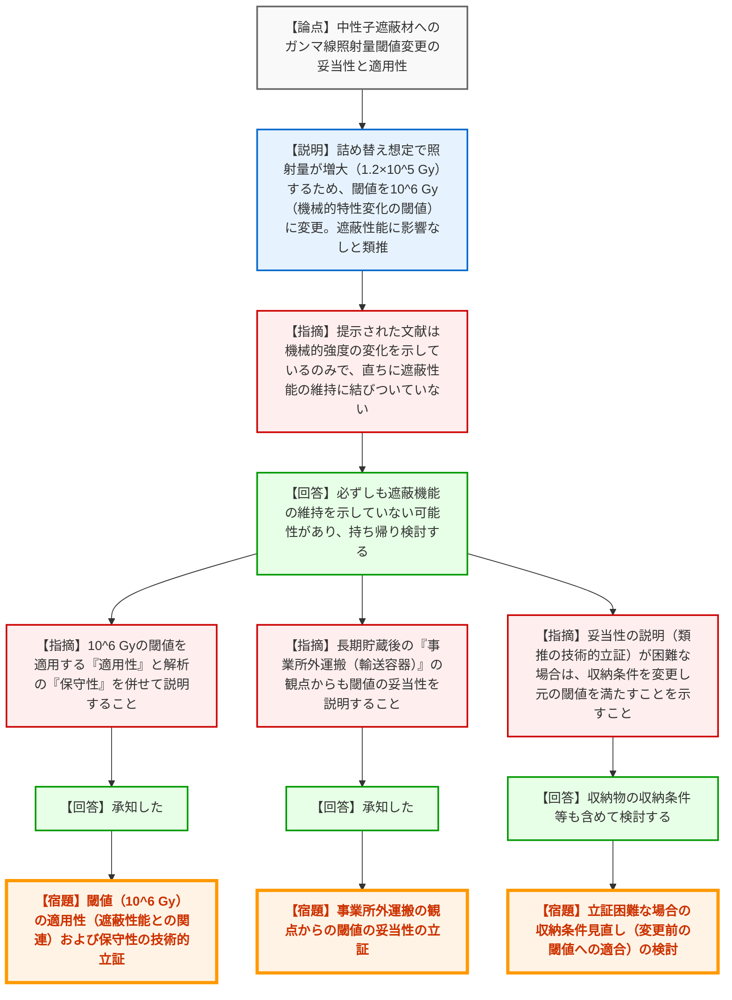

# 第40回特定兼用キャスクの設計の型式証明等に係る審査会合（令和8年3月19日）
> 出典 : https://youtube.com/live/eoGKe0n-kk8?si=zM6LNBF4VyUYQUrS

## 会合の概要作成
* **最大の争点:** Hitz-P24型キャスクにおいて「収納物の詰め替え」を想定した評価を追加した結果、中性子遮蔽材への累積ガンマ線照射量が増加することに伴い、事業者が新たに設定した照射量の閾値（10^6 Gy）の技術的妥当性（特に「機械的強度の変化がないこと」が「遮蔽性能を損なわないこと」の証明になり得るか）が最大の争点となりました。
* **審査の進捗状況:** 前回会合で概ね確認が完了し補正に向けて準備中でしたが、遮蔽機能評価の前提となる長期健全性のデータに論点が浮上し、今回改めて確認が行われました。結果として、事業者は即答できず、持ち帰り検討となりました。
* **特筆すべき決定事項:** 新たな閾値の妥当性を立証できない場合、事業者は「収納条件（使用済燃料の条件）の変更」によって、ガンマ線照射量を変更前の元の閾値内に収める対応を迫られることとなりました。
* **現場の雰囲気:** 規制庁側から「文献は機械的特性の変化を示しているのみで、直ちに遮蔽性能の維持に結びついていない」「類推としか説明されていない」と根本的な論理の飛躍を突く厳しい指摘が相次ぎ、事業者が立証不足を認めて持ち帰るなど、確実な技術的根拠を求める緊張感のある会合となりました。

---

## 議題ごとの詳細整理（テキスト）

**【議題1】カナデビア（株）特定兼用キャスクの設計の型式指定について（Hitz-P24型）**

* **議論の背景と論点:**
  Hitz-P24型キャスクについて、運用上の柔軟性を持たせるため「収納物の詰め替え」を想定した評価を追加した。これに伴い、中性子遮蔽材に対する構造材放射化ガンマ線の減衰を考慮しない厳しい条件に変更した結果、累積ガンマ線照射量が当初の想定（約4×10^4 Gy）から 1.2×10^5 Gy へと増加した。カナデビアはこれに対応するため、影響がないと判断する閾値を、別の文献に基づく 10^6 Gy （機械的特性の変化が顕著となる照射量）へ引き上げ、「機械的特性の変化がない＝物質としての変化がない＝遮蔽性能を損なわない」と類推した。この「類推」の技術的妥当性（適用性と保守性）が論点となった。

* **質疑応答（詳細）:**
  **＜論点1：新たなガンマ線照射量閾値の妥当性と適用性＞**
  * **【説明者側】（カナデビア: 樋口）からの説明:**
    収納物の詰め替えを想定してガンマ線の減衰を考慮しない条件とした結果、累積照射量は 1.2×10^5 Gy となる。そのため、機械的特性の変化が顕著となる 10^8 rad（10^6 Gy）を新たな閾値として引用した。機械的特性の変化がないことは物質としての変化がないことであり、閾値を超えない範囲であれば遮蔽性能を損なわないと類推できる。今回の照射量はこの閾値より十分に小さいため影響はない。
  * **【規制側】（規制庁: 森野）の懸念・指摘点:**
    提示された文献（エポキシレジンに関するデータ）は「曲げ強度の変化（機械的強度の変化）」を示しているに過ぎない。それが直ちに「物質としての変化がないこと」や「遮蔽性能を損なわないこと」に結びついていない。
  * **【説明者側】（カナデビア: 樋口）の回答・反論・根拠:**
    指摘の通り、提示した数値は機械的性質の変化であり、必ずしも中性子吸収材（遮蔽材）としての機能変化がないことを示しているものではない可能性がある。当社で持ち帰り検討したい。
  * **【規制側】（規制庁: 森野）の再反論や確認事項:**
    持ち帰ってしっかり説明すること。加えて、10^6 Gy の閾値を適用することの「適用性」と、それを適用した解析の「保守性」の2点について併せて説明すること。
  * **【説明者側】（カナデビア: 樋口）の回答:**
    承知した。

  **＜論点2：事業所外運搬時の影響と、立証困難な場合の代替措置＞**
  * **【規制側】（規制庁: 木原）の懸念・指摘点:**
    長期貯蔵に使用した後、核燃料輸送物の「輸送容器」として事業所外運搬に使用する場合も、経年変化を考慮した設計として共通の課題となる。事業所外運搬の観点からも、この閾値の妥当性を説明すること。
  * **【説明者側】（カナデビア: 樋口）の回答:**
    承知した。
  * **【規制側】（規制庁: 皆川、金城）の再反論や確認事項:**
    長期健全性に関するガンマ線照射量の閾値を変更するのであれば、その妥当性が十分説明される必要がある（類推ではなく技術的な内容で説明すること）。もし妥当性の説明が困難である場合は、使用済燃料の「収納条件の変更」などによって、変更前の元の閾値を満たすことを示す必要がある。次回以降整理して説明せよ。
  * **【説明者側】（カナデビア: 樋口）の回答:**
    収納物の収納条件等も含めて検討する。

* **結論と宿題事項（アクションアイテム）:**
  * 新たに設定された中性子遮蔽材のガンマ線照射量閾値（10^6 Gy）については、技術的な裏付け（機械的強度と遮蔽性能の相関関係）が不十分であると判断され、今回は了承されませんでした。
  * **【宿題】** 10^6 Gy という閾値を適用することの「適用性（遮蔽性能の維持に直結する技術的根拠）」と、解析上の「保守性」を詳細に説明すること。
  * **【宿題】** 長期貯蔵後に行われる「事業所外運搬（輸送容器としての使用）」の観点からも、当該閾値の妥当性を立証すること。
  * **【条件（制約事項）】** もし新たな閾値の技術的妥当性を立証することが困難な場合は、使用済燃料の「収納条件の変更」を行い、照射量を変更前の元の閾値（約4×10^4 Gy）の範囲内に収める対応をとること。

---

## 論理構造の可視化（Mermaid）

