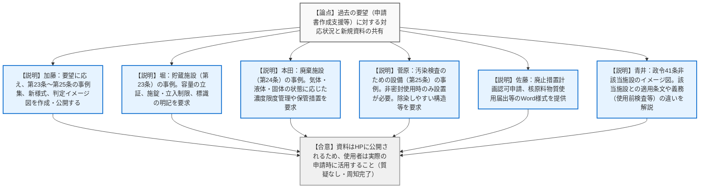
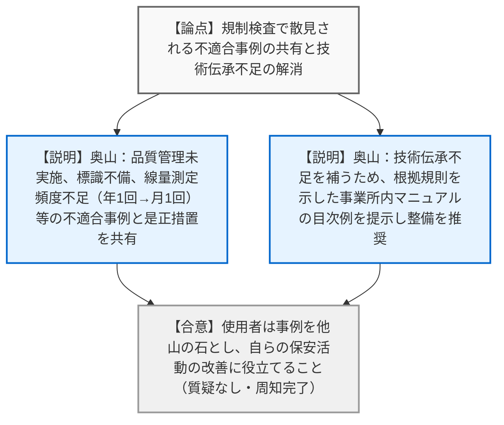
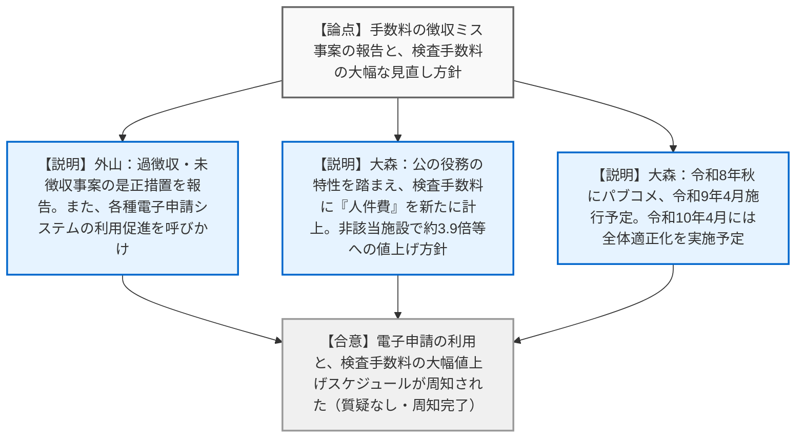

# 第3回核燃料物質等の使用の規制に係る使用者との意見交換会（令和8年3月23日）
> 出典 : https://youtube.com/live/JZduGmw6ong?si=UjstIz8KHF9J12YK

## 会合の概要作成
* **最大のハイライト:** 規制庁側から、昨今の物価・人件費上昇に伴う「原子力規制検査手数料の大幅な引き上げ（非該当施設において約3.9倍等）」という重要方針が示されたこと、及び、使用者の過去の要望に応える形での「申請書の記載事例集や各種様式」の全面的な開示が行われたことが最大のハイライトです。
* **現場の雰囲気と質疑の状況:** 本会合は規制庁から使用者への情報提供・意見交換の場としてオンラインで開催されました。多岐にわたる詳細な技術的解説や、検査での不適合事例の共有、さらには大幅な手数料値上げという重大な発表があったにもかかわらず、参加した使用者側からの質疑や意見表明は一切なく、終始規制庁側からの一方的な説明で進行・終了しました。
* **特筆すべき方針事項:** 令和2年新設の検査手数料には含まれていなかった「人件費」が新たに転嫁されることとなり、令和8年秋のパブリックコメントを経て令和9年4月から新手数料が適用されるスケジュールが明言されました。

---

## 議題ごとの詳細整理（テキスト）

**【議題1】核燃料物質等の使用に係る許認可について**

* **議論の背景と論点:**
  前年度の意見交換会で使用者から寄せられた「申請書の記入方法が専門外の企業には分かりづらい」「事例集や様式、判断フロー等を示してほしい」といった要望に対する規制庁の回答と、新たに作成された支援資料（事例集、申請様式、対象判定イメージ等）の共有が論点となった。

* **説明と質疑応答（詳細）:**
  ※本議題において使用者からの質疑は行われませんでした。以下は規制庁からの説明の詳細です。
  * **【規制側】（規制庁: 加藤）からの説明:** 
    使用者からの要望を受け、これまで第2条〜第6条の事例集を公開してきたが、今回新たに第23条〜第25条の事例集、廃止措置等の申請様式、政令41条非該当施設のイメージ図を取りまとめた。
  * **【規制側】（規制庁: 堀）からの説明（貯蔵施設について）:** 
    第23条（貯蔵施設）の記載事例として、貯蔵設備（容器等）を収容できる十分な「容量」があることを図面を用いて説明すること、及び「施錠または立ち入り制限の措置」や「標識の設置」を具体的に記載するよう解説した。
  * **【規制側】（規制庁: 本田）からの説明（廃棄施設について）:** 
    第24条（廃棄施設）の記載事例として、気体状（排気浄化装置等）、液体状（廃液処理装置、サンプリング構造等）、固体状（容器、漏えい受け皿、段積み時の転倒防止策、区画等）それぞれの廃棄・保管設備が、濃度限度以下とする能力や十分な容量を有していることを具体的に記載するよう求めた。
  * **【規制側】（規制庁: 菅原）からの説明（汚染検査のための設備について）:** 
    第25条について、本設備は「非密封の核燃料物質」を使用する場合のみ必要であり、密封のみの場合は設置不要である旨を申請書で明確にすること。設置する場合は、出入口付近等の適切な場所、平滑で除染しやすい表面素材、適切な放射線測定器の種類と台数、洗浄設備の排水接続等を記載するよう解説した。
  * **【規制側】（規制庁: 佐藤）からの説明（廃止措置等の様式について）:** 
    要望のあった「廃止措置計画認可申請書（及び同変更申請書）」「核原料物質の使用届出書（及び同変更届出書）」のWord様式を作成した。あくまで参考であり、自施設の状況に合わせて適宜修正して使用するよう案内した。
  * **【規制側】（規制庁: 青井）からの説明（政令41条非該当施設について）:** 
    核燃料物質の取扱量等に基づく「政令41条該当施設」と「非該当施設」の違い（非該当施設は使用前検査や保安規定の作成が不要である点等）と、申請時に確認が必要な条文の違いをイメージ図を用いて解説した。

* **結論と宿題事項（アクションアイテム）:**
  * **【周知完了】** 説明された各種資料（事例集、Word様式等）は後日規制委員会のホームページに公開されるため、使用者は実際の申請時にこれを活用すること。改善要望があれば随時事務局へ連絡すること。

---

**【議題2】原子力規制検査の主な気づき事項と是正措置について**

* **議論の背景と論点:**
  令和2年度から開始された原子力規制検査において、特にもっぱら貯蔵のみを行っている事業所などで、担当者の交代等による技術伝承の不足に起因する「基本的な要求事項の不適合」が散見されている。未然防止のための事例共有が論点となった。

* **説明と質疑応答（詳細）:**
  ※本議題において使用者からの質疑は行われませんでした。以下は規制庁からの説明の詳細です。
  * **【規制側】（規制庁: 奥山）からの説明:** 
    検査での主な気づき事項（不適合事例）と是正措置として以下を共有した。
    ・品質管理に係る実施評価を行っていない（→実施すること）
    ・管理区域境界の区画物や標識の不備、立入記録の未整備（→整備・掲示すること）
    ・線量当量等の測定頻度が年1回となっている（→月1回の測定を実施すること）
    ・施設管理方針や実施計画の未制定（→制定すること。※令和2年の規則改正で要求が厚くなっている点に留意）
    ・運搬に係る保安措置の記録作成漏れ（→記録を作成・保管すること）
    ・保安教育の計画未策定・未実施（→計画策定と実施を行うこと）
    技術伝承の不足を補うため、事業所内の「安全管理マニュアル」の整備を推奨し、その目次例（根拠規則条項を含む）を参考資料として提示した。

* **結論と宿題事項（アクションアイテム）:**
  * **【周知完了】** 使用者は共有された事例を他山の石とし、自らの保安活動を振り返り、マニュアルの整備等を含めた適切な改善・是正へとつなげること。

---

**【議題3】核燃料物質の使用に係る手数料について**

* **議論の背景と論点:**
  過去に発生した手数料の過徴収・未徴収事案の報告と、電子申請の利用促進。さらに、物価および人件費の高騰を受けた「原子力規制検査手数料」の大幅な値上げに関する方針説明が論点となった。

* **説明と質疑応答（詳細）:**
  ※本議題において使用者からの質疑は行われませんでした。以下は規制庁からの説明の詳細です。
  * **【規制側】（規制庁: 外山）からの説明（過徴収事案と電子申請）:** 
    令和5年度および令和6年度に政令41条非該当施設において手数料の過徴収・未徴収が発生し、マニュアル改定等の是正措置を実施した。また、電子申請（当事者型/立会人型電子署名、e-Gov）の利用状況はまだ少ない（37件中2件）ため、システムの充実を図りつつ積極的な利用を呼びかけた。
  * **【規制側】（規制庁: 大森）からの説明（検査手数料の見直し）:** 
    物価・人件費の高騰を受け、手数料の妥当性見直しを検討している。令和2年新設の検査手数料は当時「人件費」を国費で賄うとしていたが、公の役務の特性を踏まえ、新たに「人件費（1時間あたり約9,136円）」を計上し、旅費等も最新単価に見直す。
    具体例として、政令41条該当施設（特定核燃料物質取扱）では約32万円が約92万円（約2.9倍）へ、非該当施設の10年に1度の検査手数料は約8,400円から約33,000円（約3.9倍）へと変動する見込みである。
    スケジュールとして、令和8年秋にパブリックコメントを実施し、令和9年4月の施行（令和9年度分からの徴収）を目指す。また、これと並行して審査・検査手数料全体の適正化も行い、令和10年4月に更なる改正を予定している。

* **結論と宿題事項（アクションアイテム）:**
  * **【周知完了】** 電子申請の積極的な利用が推奨された。また、大幅な検査手数料の見直し方針について情報共有がなされ、今後のパブリックコメント等のスケジュールが周知された。

---

## 論理構造の可視化（Mermaid）

### 議題1：核燃料物質等の使用に係る許認可について

### 議題2：原子力規制検査の主な気づき事項と是正措置について

### 議題3：核燃料物質の使用に係る手数料について

