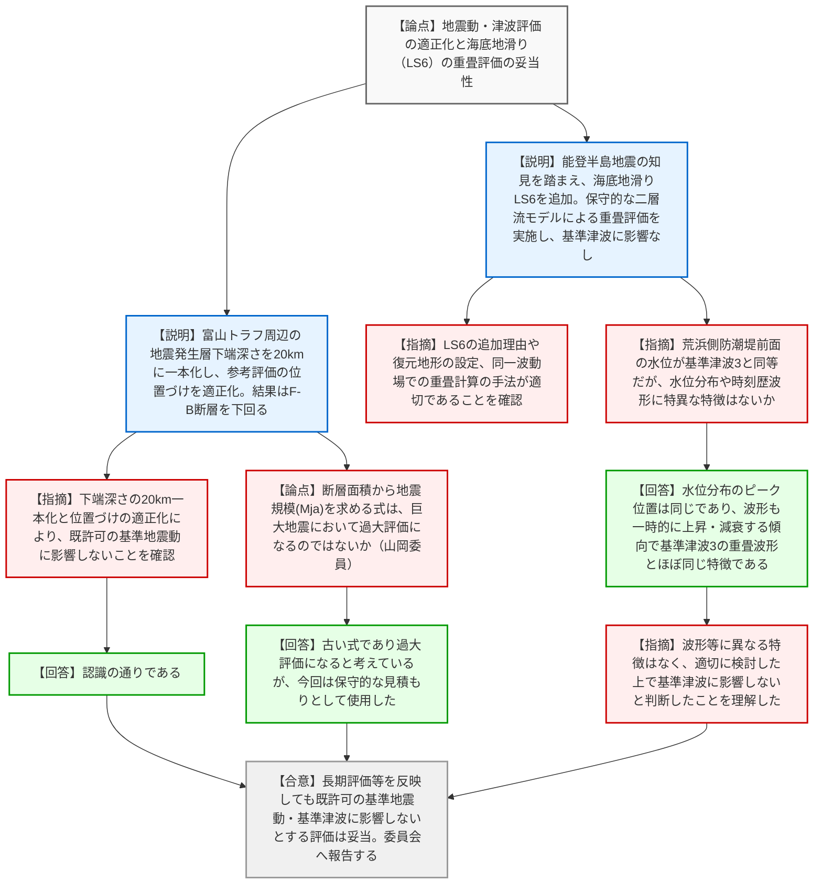

# 第4回日本海側の海域活断層の長期評価(令和6年8月版)への対応の現状聴取に係る会合（令和8年3月23日）
> 出典 : https://youtube.com/live/iA1yMMhJkx0?si=6RoIwbupTuVx6-Ai

## 会合の概要作成
* **最大の争点:** 最新の知見（地震本部の長期評価および令和6年能登半島地震）を踏まえた地震動・津波評価において、富山トラフ周辺の「地震発生層下端深さの設定（20kmへの一本化）」と、海底地滑り（LS6）を新たに追加した「津波の重畳（組み合わせ）評価」の妥当性が最大の争点となりました。
* **審査の進捗状況:** 東京電力からの説明と質疑を通じ、前回会合での指摘事項（評価手法の適正化や追加評価）が適切に資料へ反映されていることが確認されました。最新知見を考慮しても既許可の基準地震動および基準津波に影響しないとする東電の評価は「妥当」と判断され、本会合での確認結果が原子力規制委員会へ報告されることとなりました。
* **現場の雰囲気:** 規制庁側は評価の保守性や波形の特徴に至るまで綿密な確認を行い、東電側も的確に根拠を示して回答したことで、議論はスムーズかつ建設的に進行しました。また、担当委員からは古い評価式を用いた過大評価のリスクについて専門的な見解が示され、保守的な評価に対する技術的な問題意識が共有されるなど、納得度の高い意見交換が行われました。

---

## 議題ごとの詳細整理（テキスト）

**【議題1】東京電力ホールディングス（株）柏崎刈羽原子力発電所６号及び７号炉 日本海側の海域活断層の長期評価（令和６年８月版）への対応について（※「その他」の議論を含む）**

* **議論の背景と論点:**
  地震本部による海域活断層の長期評価（2024年8月版、2025年6月版）および令和6年能登半島地震の知見を踏まえ、柏崎刈羽6・7号炉の基準地震動・基準津波への影響確認が論点となった。前回会合で指摘された①富山トラフ周辺の地震発生層下端深さの設定、②参考評価の位置づけの適正化、③能登半島北岸の連動津波と海底地滑りによる津波の組み合わせの定量的評価、に対する東京電力の回答と妥当性が問われた。

* **質疑応答（詳細）:**
  **＜論点1：地震発生層下端深さの設定と参考評価の位置づけ適正化＞**
  * **【説明者側】（東電：橋本、及川）からの説明:** 
    指摘を踏まえ、富山トラフ周辺の地震発生層下端深さを基本・参考モデルに分けず、最新知見を考慮して「20km」に一本化した。また、参考評価としていた影響評価のタイトルを修正し位置づけを適正化した。これらの修正を反映しても、地震動評価は全周期帯でF-B断層の応答を下回り、津波評価も既許可の最大ケースを下回る。
  * **【規制側】（規制庁：鈴木）の懸念・指摘点:** 
    地震動・津波の両評価において、富山トラフ周辺の地震発生層下端深さが17kmと20kmの2段構成から20kmに一本化され適正化されたこと、また参考評価の位置づけが適切に修正されたことを確認した。その上で、検討用地震・津波最大ケースに変更なく、既許可に影響しないという結論でよいか。
  * **【説明者側】（東電）の回答・反論・根拠:**
    その通りである。

  **＜論点2：海底地滑りとの組み合わせ（重畳）評価の妥当性＞**
  * **【説明者側】（東電：及川）からの説明:** 
    能登半島地震の知見を踏まえ、富山トラフ西縁断層付近に分布し、土塊の移動方向が津波の進行方向と概ね同様である海底地滑り「LS6」を新たに検討対象に追加した。LS6の復元地形は崩壊物堆積の体積を保存するよう設定し、より保守的な「二層流モデル」を用いて数値シミュレーションを実施した。LS1〜3は線形足し合わせで組み合わせたが、LS6は重畳の影響が異なるため全評価位置で同一波動場にてシミュレーションを行った。結果として、荒浜側防潮堤前面等の各評価点において、最高水位は基準津波を下回り、最低水位は基準津波を上回った。
  * **【規制側】（規制庁：山崎）の懸念・指摘点:** 
    LS6を追加抽出した理由、復元地形の設定手法、二層流モデルの適用、およびLS1〜3とLS6で重畳計算の手法を変えた理由について適切であることを確認した。ただし、荒浜側防潮堤前面における水位が「基準津波3」と同等レベルであるため、水位分布や時刻歴波形に特異な特徴（違い）がないか説明を求める。
  * **【説明者側】（東電：及川）の回答・反論・根拠:** 
    水位分布図を比較すると、ともに防潮堤南西隅角部で最高水位となり特徴に大きな違いはない。時刻歴波形も、一時的に数分程度高くなりその後減衰する傾向であり、基準津波3の2波目（5連動とLS2の組み合わせによる重畳）とほぼ同じ特徴である。これらを踏まえ、基準津波3に影響しないと判断した。
  * **【規制側】（規制庁：山崎）の再反論や確認事項:** 
    時刻歴波形等に大きく異なる特徴はなく、適切に検討した上で既許可の基準津波に影響しないと判断されたことを理解した。荒浜側防潮堤なしのケースでも基準津波1を下回ることを確認した。

  **＜論点3：断層面積から地震規模（Mja）を求める評価式の保守性について（※その他）＞**
  * **【規制側】（規制委員会：山岡委員）の懸念・指摘点:** 
    修正を求めるものではないが、断層面積から地震モーメント、そして地震規模（Mja）を求める式（竹村1990等）について、M8クラスになると濃尾地震のデータに引っ張られて過大評価になるのではないかという問題意識がある。東電の見解を伺いたい。
  * **【説明者側】（東電：島瀬）の回答・反論・根拠:** 
    指摘の通り、古い式であるためマグニチュードが大きくなると過大評価すると考えている。最新の学会発表等でも頭打ちを考慮すべきとの議論があり、本来は新しいデータに基づく式を使えばここまで大きくならないと考えているが、今回は保守的な見積もりとして使用した。

* **結論と宿題事項（アクションアイテム）:**
  * **【合意】** 指摘事項への対応（地震発生層下端深さの20km一本化、位置づけの適正化、海底地滑りLS6を追加した二層流モデルによる重畳評価）が適切になされていることが確認された。
  * **【決定】** 地震本部による海域活断層の長期評価（令和6年8月版および令和7年6月版）ならびに令和6年能登半島地震の知見を反映しても、柏崎刈羽6・7号炉の既許可の基準地震動および基準津波に影響がないとする東京電力の評価は「妥当」であると確認された。この結果は事務局より原子力規制委員会へ報告される。

---

## 論理構造の可視化（Mermaid）

