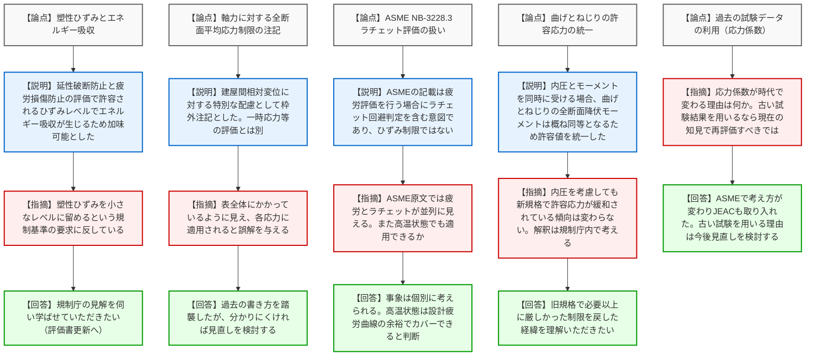
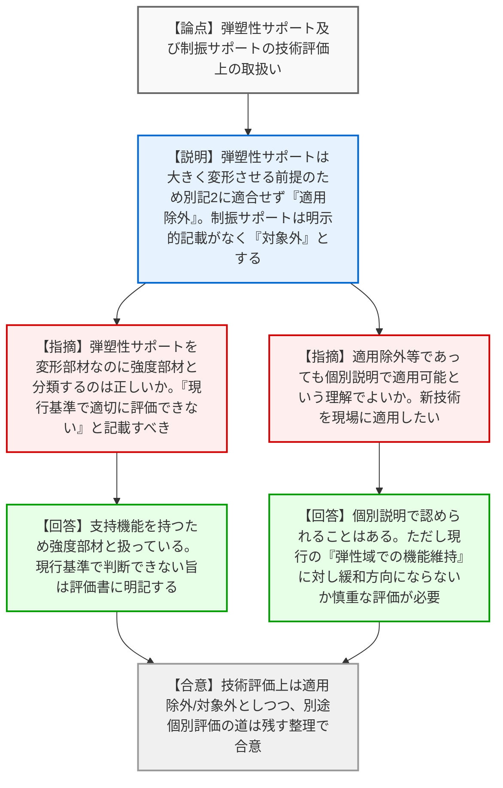
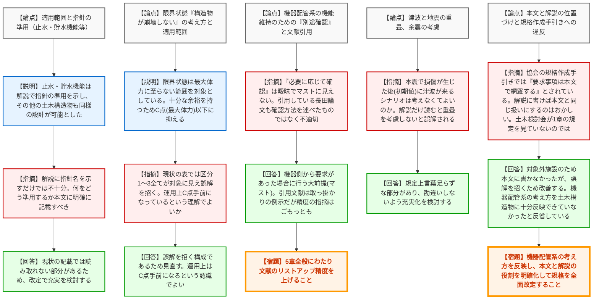

# 第4回耐震設計に係る日本電気協会の規格の技術評価に関する検討チーム（令和8年3月24日）
> 出典 : https://youtube.com/live/YSP0qnhLxCw?si=KDLVQjVLQ7-D2vIa

## 会合の概要作成
* **最大の争点:** JEAC4601-2021に対する技術評価において、新技術である「弾塑性サポート等」の現行規制基準への適合性、および第5章（屋外重要土木構造物）における「本文と解説の役割の混同（規格としての体裁の不備）」が最大の争点となりました。
* **審査の進捗・決定事項:** 弾塑性サポートは「適用除外」、制振サポートは「技術評価の対象外」としつつ、別途個別説明による適用検討の道を残す整理がなされました。土木構造物の規定については、電気協会側が「機器配管系の考え方を土木側に十分反映できていなかった」と反省を示し、次期改定での抜本的な見直しを約束しました。
* **現場の雰囲気:** 規制庁側や外部専門家から、適用範囲の曖昧さ、古い試験結果の無批判な引用、さらには電気協会自身の「規格作成手引き」に違反している（要求事項を解説に逃がしている）点など、規格の品質に対する根本的な苦言が呈され、強い緊張感と指導の空気が漂う会合となりました。

---

## 議題ごとの詳細整理（テキスト）

**【議題1】前回会合指摘事項等への回答（資料4-1）**

* **議論の背景と論点:** 配管の応力評価に関するJEACの規定（塑性ひずみの許容、軸力の注記、ラチェット評価、曲げとねじりの許容応力の統一、古い応力係数の使用）の技術的妥当性が論点となった。

* **質疑応答（詳細）:**
  * **【説明者側】（電気協会: 郷）:** 塑性ひずみとエネルギー吸収について、延性破断防止と疲労損傷防止の評価で許容されるひずみレベルでエネルギー吸収が生じるため、加味可能な設計法とした。
  * **【規制側】（規制庁: 日比野）:** 塑性ひずみをエネルギー吸収に活用できる結論に見えるが、規制基準（別記2第6項）は塑性ひずみを「小さなレベルに留める」ことを求めており、反している。
  * **【説明者側】（電気協会: 郷）:** 規制庁の見解を伺い、学ばせていただきたい（評価書更新の意向）。
  * **【説明者側】（電気協会: 郷）:** 建屋間相対変位に対する軸力の制限は、特別な配慮として枠外注記としたものであり、一次応力等の区分にかかるものではない。
  * **【規制側】（規制庁: 藤沢）:** 注記2が表全体にかかっているように見え、各応力に適用されると誤解を与えるため見直すべき。
  * **【説明者側】（電気協会: 郷）:** 過去の書き方を踏襲したが、分かりにくければ見直しを検討する。
  * **【説明者側】（電気協会: 郷）:** ASME NB-3228.3のラチェット考慮の記載は、疲労評価を行う場合（許容状態A, B）にラチェット回避判定を含む意図であり、ひずみ制限を規定したものではない。高温状態も設計疲労曲線の余裕でカバーできる。
  * **【規制側】（専門家: 深澤）:** ASME原文では疲労とラチェットが並列に見える。
  * **【説明者側】（電気協会: 郷）:** クラス1配管は内圧とモーメントを同時に受ける場合、曲げとねじりの全断面降伏モーメント（内圧なしで $4 T R^2 S_Y$、内圧ありで曲げ $2.666 T R^2 S_Y$・ねじり $2.96 T R^2 S_Y$）は概ね同等となるため、許容値を統一した。
  * **【規制側】（規制庁: 高松）:** 内圧を考慮しても新規格で許容応力が緩和されている傾向は変わらない。これをどう解釈するか規制庁内で考える。また、古い試験結果（応力係数）を用いるなら現在の知見で再評価すべき。
  * **【説明者側】（電気協会: 郷）:** 旧規格で厳しすぎたものを戻した経緯を理解いただきたい。古い試験を用いる理由は今後見直しを検討する。

* **結論と宿題事項（アクションアイテム）:**
  * **【結論】** 曲げとねじりの許容値統一に関する工学的な説明は一定の理解を得たが、古い試験データの扱い等については規制庁内で解釈を検討することとなった。
  * **【宿題】** 軸力制限の注記方法の改善、および古い試験結果の引用に関する見直しを次期改定等で検討すること。

---

**【議題2】弾塑性サポート及び制振サポートの技術評価上の取扱いの整理（資料4-2）**

* **議論の背景と論点:** 新技術である「弾塑性サポート」および「制振サポート」が、現行の規制基準（塑性ひずみを小さなレベルに留める）に適合するかどうか、技術評価上どう位置づけるかが論点となった。

* **質疑応答（詳細）:**
  * **【説明者側】（規制庁: 塚部）:** 弾塑性サポートは構造強度部材を大きく変形させる前提のため別記2に適合せず「適用除外」とする。制振サポートの制振機能部は別記2に明示的記載がないため「技術評価の対象外」とする。ただし、技術的な根拠があれば個別説明による適用検討は可能である。
  * **【規制側】（専門家: 深澤）:** 弾塑性サポートは変形して機能を発揮する部材なのに、強度部材と分類するのは技術的に正しいか。「適用除外」ではなく「現行の評価基準では適切に評価できない」と記載すべき。
  * **【説明者側】（規制庁: 塚部）:** 支持機能を持つため強度部材として扱っている。現行基準で判断できない旨は技術評価書上でもしっかり記載する。
  * **【説明者側】（電気協会: 野本、吉田）:** 適用除外や対象外であっても、個別に説明を行えば容認されるという理解でよいか。新しい技術を現場に適用させて安全性を向上させたい。
  * **【規制側】（規制庁: 塚部、森下）:** 個別説明で認められることはある。ただし、弾塑性サポートは現行の「弾性域での機能維持」に対して相対的に緩和の方向にならないか、本当に安全性向上に資するか慎重な評価が必要である。

* **結論と宿題事項（アクションアイテム）:**
  * **【合意】** 技術評価上は「適用除外」および「対象外」とする整理で合意した。ただし、これは新技術の採用を全否定するものではなく、別途個別審査の場で安全性を立証すれば適用可能とする道が残された。

---

**【議題3】屋外重要土木構造物等の耐震設計に関する説明依頼事項への回答（資料4-3）**

* **議論の背景と論点:** JEAC第5章における、対象施設の適用範囲、限界状態（崩壊しない）の定義、津波と地震の重畳、および「本文と解説の役割の混同」に関する規格としての体裁の不備が論点となった。

* **質疑応答（詳細）:**
  * **【説明者側】（電気協会: 村上）:** 止水・貯水機能については本文に記載せず、解説で水道施設耐震工法指針等の準用を示した。
  * **【規制側】（規制庁: 太田）:** 解説に指針名を示すだけでは不十分であり、何をどう準用するか本文に明確に記載すべき。
  * **【説明者側】（電気協会: 伊藤）:** 限界状態について、現状の表では区分1〜3全てが対象に見え誤解を招く構成であることを認め、見直す。運用上は終局耐力（C点からD点）に対し、十分な余裕を持つため最大体力（C点）以下に抑えている。
  * **【規制側】（専門家: 庄司）:** 機器配管系の機能維持のための「別途確認」において、「必要に応じて確認」という表現が曖昧でマストに見えない。引用している長田論文も確認方法を述べたものではなく不適切である。
  * **【説明者側】（電気協会: 伊藤）:** マストが前提である。引用文献は取っ掛かりの例示であるが、精度の指摘はごもっともである。
  * **【規制側】（専門家: 豊岡、規制庁: 大橋）:** 本震で損傷が生じた後（初期値）に津波が来るシナリオは考えなくてよいのか。JEACの解説だけを読むと、地震と津波の重畳を全く考慮しないと誤解される。
  * **【規制側】（規制庁: 藤沢）:** 協会の「規格作成手引き」では『要求事項は本文で網羅する』とされている。解説に書けば本文と同じ扱いにするのはおかしい。土木構造物検討会が第1章の規定を見ていないのではないか。
  * **【説明者側】（電気協会: 吉田）:** 対象外施設のため本文に書かなかったが、誤解を招くため改善する。機器配管系の考え方を土木構造物に十分反映できていなかったと反省している。

* **結論と宿題事項（アクションアイテム）:**
  * **【宿題】** 第5章全般にわたり文献のリストアップ精度を上げること。
  * **【宿題】** 地震と津波の重畳に関する表現を見直し、解釈別記に基づく検討が必須であることを勘違いさせない記載に修正すること。
  * **【宿題】** 協会の「規格作成手引き」に則り、本文と解説の役割を明確化し、機器配管系の設計思想を土木構造物規定に正しく反映させた全面的な規格改定を行うこと。

---

## 論理構造の可視化（Mermaid）

### 議題1：前回会合指摘事項等への回答（資料4-1）

### 議題2：弾塑性サポート及び制振サポートの技術評価上の取扱いの整理（資料4-2）

### 議題3：屋外重要土木構造物等の耐震設計に関する説明依頼事項への回答（資料4-3）

