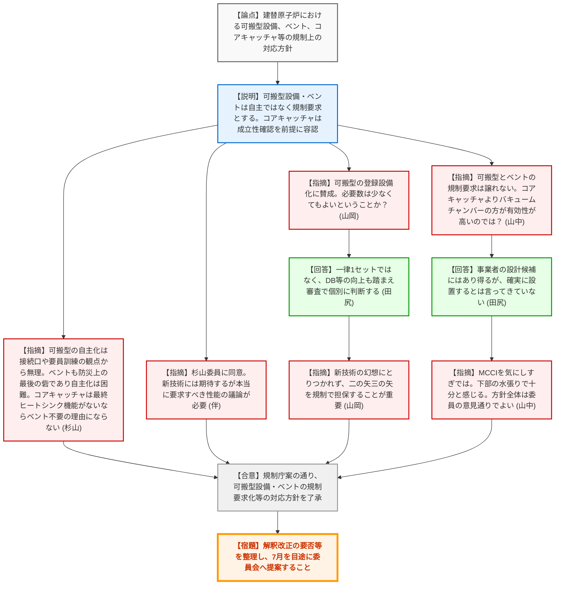
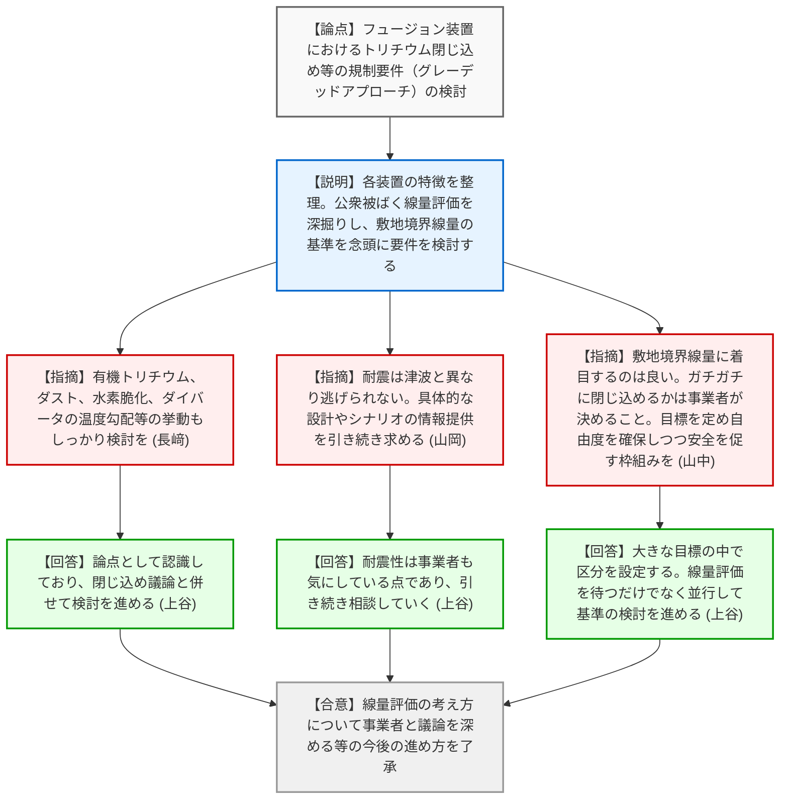
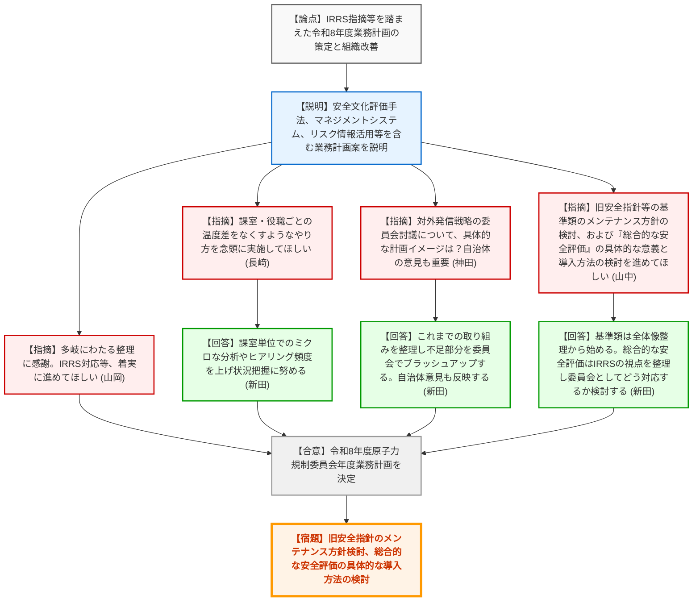
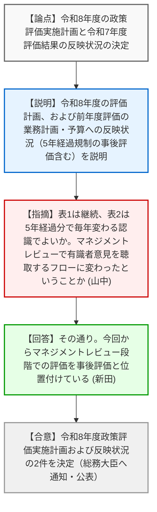

# 第67回原子力規制委員会（令和8年3月25日）
> 出典 : https://youtube.com/live/STIyeaFRpBo?si=rhPXv0fuxYxpEHG6

## 会合の概要作成

*   **最大の争点**: 建替原子炉における新技術（コアキャッチャ等）の導入やSA設備（可搬型設備、フィルターベント）の「自主的扱い」の是非、およびフュージョン装置における「トリチウムの閉じ込め機能」のグレーデッドアプローチに基づく規制基準の策定方法が主要な争点となった。
*   **審査の進捗状況**: 建替原子炉の設計に関する規制上の対応方針（可搬型設備やフィルターベントは自主ではなく規制要求とする等のスタンス）がまとまり、了承された。フュージョン装置については、線量評価の考え方を深掘りしつつ、敷地境界線量の目標値を念頭に規制の枠組みを構築していく方向性が了承された。また、令和8年度の業務計画および政策評価実施計画が決定された。
*   **特筆すべき決定事項**: 建替原子炉において、事業者が「自主設備」としたいと主張する可搬型設備やフィルターベントに対し、規制側として「深層防護の観点や最後の砦として規制要求の対象とする（設置許可上の登録設備等とする）」という毅然とした方針が決定された。
*   **現場の雰囲気・緊張感**: 規制側は、新技術（建替炉やフュージョン）による安全性向上への期待と歓迎の意を示しつつも、「新技術の幻想にとりつかれてはならない」と戒め、深層防護の徹底や1F事故の教訓に基づく「譲れない一線（最後の砦）」を明確に突きつけるなど、安全規制の根幹を守る強い意志と緊張感が感じられた。

---

## 議題ごとの詳細整理（テキスト）

**【議題1】事業者との実務レベルの技術的意見交換会を踏まえた建替原子炉の設計に関する規制上の対応方針**

*   **議論の背景と論点**:
    建替原子炉（SRZ-1200等）において、事業者が設計段階から常設設備によるSA対策を基本とし、可搬型設備やフィルターベントを「自主設備」と位置づけようとしている点、および「コアキャッチャ」の導入による格納容器下部注水対策の代替の妥当性について、規制上の対応方針をどう定めるかが論点となった。
*   **質疑応答（詳細）**:
    *   【説明者側】（規制庁 神谷技術基盤課長・田尻課長補佐）: 7回の意見交換会を踏まえた規制上の対応方針案を説明。
        *   論点1（可搬型設備の扱い）: 常設設備を基本としたSA対策は認め得るが、想定を超える事象への柔軟性（1F事故の反省）から、可搬型設備（水・電力供給等）を全て自主設備とすることは認めず、設置許可上の登録設備または保安規定上の資機材として配備を求める。配備数は既設炉と異なる設定を許容し得る。
        *   論点2（特重施設とSA設備の機能統合・フィルターベント）: フィルターベントは緊急時の有効な手段であり、APC対策を有する形で設置許可上の登録設備とする必要がある。
        *   論点3（コアキャッチャ）: コアキャッチャを用いた溶融炉心冷却対策の成立性が確認できるのであれば、格納容器下部注水対策の要求を満足するものと認められる。
    *   【規制側】（杉山委員）: 全体方針に賛成。可搬型設備の比重が下がることは認めるが、「自主」とすると接続口の規制や要員の確保・訓練の確認が困難になるため、自主化には反対。フィルターベントも防災（屋内退避等）の観点で最後の砦であり、自主化は困難。コアキャッチャは優れた技術だが、最終ヒートシンク（格納容器外への熱の逃がし）機能を持たないシステムであれば、ベントを不要とする理由にはならない。
    *   【規制側】（伴委員）: 杉山委員と同意見。可搬型の自主化は受け入れられない。ベントも最後の砦として規制要求すべき。コアキャッチャは新技術であり、海外事例等も見比べながら、本当に期待できる性能と要求すべき事項を議論していくべき。
    *   【規制側】（山岡委員）: 可搬型設備の登録設備化に賛成（深層防護に合致）。必要数は一律ではなく少なくてもよいということか？
    *   【説明者側】（規制庁 田尻課長補佐）: 事業者は1セットと主張しているが、一律ではなく、DB設備の3系統化等の向上部分も踏まえ、審査で個別に設計を確認しながら判断する形になる。
    *   【規制側】（山岡委員）: 建て替えによる安全性向上は当然だが、「新しい技術を使っているから大丈夫」という幻想にとりつかれないことが大事。二の矢、三の矢を確実に用意するために規制で担保する方針が妥当。
    *   【規制側】（山中委員長）: 提案方針で良い。可搬型の柔軟性は捨てがたく、自主ではなく規制要求とすべき。フィルターベントの規制要求も譲れない。コアキャッチャについて、個人的にはむしろ「バキュームチャンバー」の方が有効性が高い（CANDU炉で実績あり）と思うが、それは取り入れないのか？
    *   【説明者側】（規制庁 田尻課長補佐）: バキュームチャンバーは事業者の設計候補としてはあり得るが、現状で確実に設置するとは言ってきていない。
    *   【規制側】（山中委員長）: コアキャッチャは良い技術か疑問もある。MCCI（溶融炉心コンクリート相互作用）を気にしすぎではないか。下部の水張りで十分と感じる。悪影響がなければ導入は否定しない。全体方針は委員の意見通りでよい。
*   **結論と宿題事項（アクションアイテム）**:
    *   【合意】規制庁案の通り、可搬型設備やフィルターベントを規制要求（登録設備等）とし、コアキャッチャ等の新技術は成立性を確認した上で許容する等の「対応方針」を了承した。
    *   【宿題】了承された方針に基づき、設置許可基準解釈の改正の要否等を整理し、7月を目途に改めて委員会へ提案すること。

**【議題2】フュージョン装置の開発を進める事業者等との意見交換会合の状況（２回目）**

*   **議論の背景と論点**:
    ヘリカル型、レーザー型、リニア型の各フュージョン装置の特徴と安全機能の情報を収集し、サイト選定に影響を及ぼし得る「トリチウムの閉じ込め機能」の規制要件を、公衆への被ばく線量評価に基づきグレーデッドアプローチでどう設定していくかが論点となった。
*   **質疑応答（詳細）**:
    *   【説明者側】（規制庁 上谷管理官補佐）: 各装置の特徴を表にまとめた。トリチウムインベントリやA/D値には幅がある。最大の論点であるトリチウムの閉じ込め機能については、公衆の被ばく線量評価（小分け管理の有効性、障壁の評価、HT/HTOの化学形態の違い等）を行い、その結果と敷地境界線量（1mSv, 5mSv, 米国の10mSv等）の基準値を比較しながら、RI法や炉規法を参考に規制要求を検討していく。
    *   【規制側】（長﨑委員）: 閉じ込めを集中的に議論する方向性に賛成。トリチウムの形態として、有機トリチウム（メタンのHがTに置換したもの）やダスト等の影響もしっかり検討を。また、材料の水素脆化や、ダイバータの急激な温度勾配での挙動等についても継続してフォローしてほしい。
    *   【説明者側】（規制庁 上谷管理官補佐）: ダスト、脆化、ダイバータの挙動等の論点も認識しており、閉じ込めの議論と併せて検討を進める。
    *   【規制側】（山岡委員）: 耐震については津波のように逃げられないため、しっかり考える必要がある。具体的な設計やシナリオが見えないと議論が難しい点も理解した。引き続き情報提供を。
    *   【規制側】（山中委員長）: 非常に詳細な情報収集に感謝する。我々が確保すべきは人や環境への影響を許容範囲に収めること。敷地境界線量に着目する方向性は良い。しかし、ガチガチに閉じ込める必要があるかどうかは、我々が手取り足取り決めるのではなく事業者が決めることである（大きな目標を定め、研究開発の自由度を確保しつつ安全を促す）。情報収集と並行して、規制側の「認識論の議論」を内部で進めてほしい。
    *   【説明者側】（規制庁 上谷管理官補佐）: 大きな目標を定める中で区分を設定していく。線量評価を待つだけでなく、他国の状況等も踏まえ、並行して基準（閾値）の検討を進めていく。
*   **結論と宿題事項（アクションアイテム）**:
    *   【合意】線量評価の考え方について設計が進んでいる事業者と議論を深め（非公表データを含む場合は非公開会合とし議事概要を公表）、敷地境界線量の目標値を念頭にグレーデッドアプローチの検討を進めるという「今後の進め方」を了承した。
    *   【宿題】有機トリチウムやダストの考慮、水素脆化、ダイバータの挙動等の論点についても併せて検討を進めること。

**【議題3】令和８年度原子力規制委員会年度業務計画**

*   **議論の背景と論点**:
    IRRSミッションでの指摘（勧告・提言）やマネジメントレビューの結果を踏まえ、令和8年度の業務計画をどう設定し、組織の継続的改善を図るかが論点となった。
*   **質疑応答（詳細）**:
    *   【説明者側】（規制庁 新田政策立案参事官）: 令和8年度業務計画案を説明。IRRSミッションの指摘（R11等）を踏まえた安全文化の評価手法の検討、マネジメントシステムの確実な運用、リスク情報活用やグレードアプローチの適用等を計画に盛り込んだ。
    *   【規制側】（山岡委員）: 多岐にわたる整理に感謝。IRRS対応など着実に進め、必要に応じて委員会へ報告・議論の場を持ってきてほしい。
    *   【規制側】（長﨑委員）: 課室ごと、役職ごとの温度差をなくすようなやり方を念頭に置いて実施してほしい。
    *   【説明者側】（規制庁 新田政策立案参事官）: 課室単位でのミクロな分析や、ヒアリング頻度を上げて状況把握に努める。
    *   【規制側】（神田委員）: IRRS指摘や新ニーズ（フュージョン等）、職員の意識調査結果（分かりやすい情報提供等）の改善が盛り込まれており適切。「対外発信やコミュニケーションに係る戦略策定の方向性について委員会で討議する」とあるが、具体的な計画イメージは？分かりやすさは受け手である自治体等のフィードバックが重要である。
    *   【説明者側】（規制庁 新田政策立案参事官）: 現時点では具体化していない。これまでの取り組みを整理し、不足部分を洗い出して委員会で議論・ブラッシュアップするイメージ。自治体等の受け手の意見も反映していく。
    *   【規制側】（山中委員長）: 全体として問題ない。2点お願いがある。①IRRSの提言に関連し、旧安全委員会から引き継いだ「安全指針等の基準類」のメンテナンス（最新知見との照らし合わせ）を進めてほしい。②IRRSで提言された「総合的な安全評価（Integrated Safety Assessment）」について、言われたからやるのではなく、我々自身がご利益を感じるような意味のある取り組みとして検討してほしい。
    *   【説明者側】（規制庁 新田政策立案参事官）: ①基準類の全体像を整理し、レビュー実施方針の検討を担当部署に相談する。②IRRSがどういう視点で言ったかを整理した上で、規制委員会としてどう対応したいか改めて検討する。
*   **結論と宿題事項（アクションアイテム）**:
    *   【合意】別紙の通り、令和8年度原子力規制委員会年度業務計画を決定した。
    *   【宿題】旧安全指針等の基準類のメンテナンス方針の検討、および「総合的な安全評価」の具体的な意義と導入方法の検討を進めること。

**【議題4】令和８年度政策評価実施計画及び政策評価の結果の政策への反映状況（令和７年度公表分）**

*   **議論の背景と論点**:
    令和8年度の政策評価実施計画、および前年度の政策評価結果が次年度の予算や業務計画等にどう反映されたかの確認と決定。
*   **質疑応答（詳細）**:
    *   【説明者側】（規制庁 新田政策立案参事官）: 令和8年度中に実施する政策評価の計画、および令和7年度の評価結果の反映状況（概算要求や令和8年度業務計画への反映）を説明。導入後5年が経過した規制に対する事後評価も実施し、継続・推進を判断した。
    *   【規制側】（山中委員長）: 令和7年度時と特段変わったところはないと認識。表1は項目継続で反映状況が更新され、表2は5年経過のものが毎年登場して変わる部分という認識でよいか？また、マネジメントレビューの段階で有識者の意見聴取を行うフローに変わったということか？
    *   【説明者側】（規制庁 新田政策立案参事官）: その通り。今回からマネジメントレビューの段階での評価を「事後評価」と位置付け、政策評価懇談会の有識者意見を聴取するフローとして記載した。
*   **結論と宿題事項（アクションアイテム）**:
    *   【合意】令和8年度政策評価実施計画、および政策評価の結果の政策への反映状況の2件をまとめて決定した。総務大臣へ通知し、ホームページで公表する。

---

## 論理構造の可視化（Mermaid）

### 議題1：建替原子炉の設計に関する規制上の対応方針

### 議題2：フュージョン装置の開発を進める事業者等との意見交換会合の状況

### 議題3：令和８年度原子力規制委員会年度業務計画

### 議題4：令和８年度政策評価実施計画及び政策評価の結果の政策への反映状況

