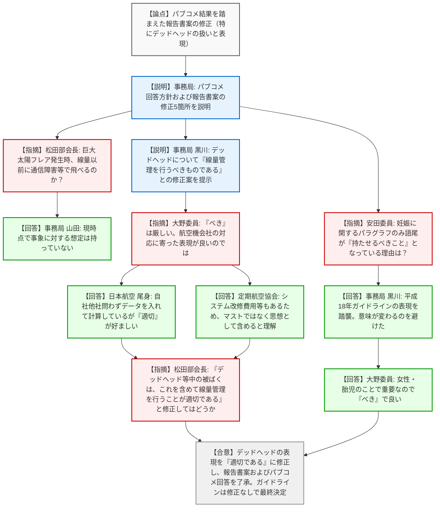
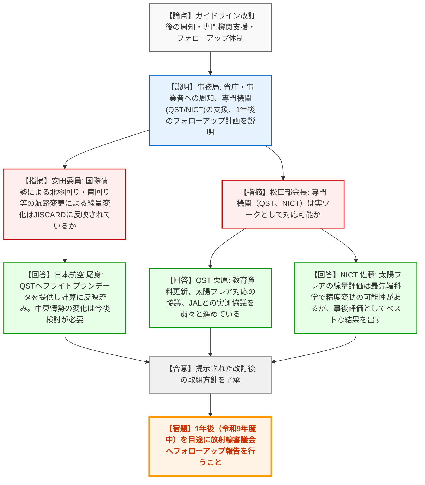

# 第4回放射線審議会航空機乗務員等の宇宙放射線防護検討部会（令和8年3月25日）
> 出典 : https://youtube.com/live/gTM-7REKr9s?si=1i_CBAfWpjhp0vtM

## 会合の概要作成
*   **最大の争点:** ガイドライン案に対するパブリックコメント（88件）を踏まえた「報告書案」の修正、特に「デッドヘッド（会社指示による業務移動時の搭乗）」の線量管理における取り扱いと表現の強さ（「べき」か「適切である」か）が最大の争点となった。
*   **審査の進捗状況:** パブリックコメントの結果を受けた報告書案の修正文言が合意に至り、ガイドライン（案）は修正なしで最終決定された。今後は関係省庁や事業者への周知、専門機関等による技術的支援（JISCARDの運用、太陽フレア対応、実測等）に移行し、1年後（令和9年度中）を目途にフォローアップを行うフェーズへと進んだ。
*   **特筆すべき決定事項:** デッドヘッド中の被ばくについては、システム改修の費用等現実的な運用課題を考慮し、プログラムに一律に組み込むことを義務付けるのではなく、「防護対策全体の中で線量管理を行うことが適切である」との表現に着地した。また、本ガイドライン案は部会の議決をもって放射線審議会の議決とすることが了承された。
*   **現場の雰囲気:** 20年ぶりのガイドライン改訂という節目であり、パブリックコメントの多さ（88件）からも社会的関心の高さが窺えた。委員や専門委員からは、運用の現実性（他社便利用時の計算困難さ等）や最先端科学（太陽フレア評価）の難しさを踏まえた建設的な意見が交わされ、実効性のある防護体制の構築に向けた関係者の高い納得感と協力姿勢が感じられた。

---

## 議題ごとの詳細整理（テキスト）

**【議題1】「航空機乗務員の宇宙放射線被ばく管理に関するガイドライン（案）」について**
*   **議論の背景と論点:** 放射線審議会総会での中間報告後、1〜2月に実施された意見募集（パブリックコメント）に寄せられた88件の意見に対する事務局の回答案の確認と、それを踏まえた「報告書案」の5箇所の修正（妊娠中の配置転換例、デッドヘッドの扱い、JISCARDの係数更新、教育教材の記述等）の妥当性が論点となった。
*   **質疑応答（詳細）:**
    *   【説明者側】（事務局：黒川課長）からの説明
        *   寄せられた意見に対する回答方針を説明。法令規制化や対象拡大の要望に対しては、自然放射線源であることを踏まえ事業者の自主的管理が適当と回答。太陽フレア発生時の航路変更義務化に対しては、ワンフライトで1mSvを超える事象は稀であり、事後的な把握と対応で十分と回答。
        *   報告書案の修正点5箇所を説明。特にデッドヘッドについて、高頻度で長距離を飛行する事業者は必要に応じて線量管理に含める旨を追記したと説明。
    *   【規制側】（松田部会長）の懸念・指摘点
        *   太陽フレアの巨大事象発生時、線量以前に通信障害等でそもそも飛べるのかという議論がある。航空業界ではどう見立てているか。
    *   【説明者側】（事務局：山田）の回答・反論・根拠
        *   現時点では、そのような事象に対する想定は持っていない。
    *   【説明者側】（事務局：黒川課長）からの追加説明
        *   デッドヘッドの修正案について、他社便利用時等にプログラムでの直接計算が難しいケースがあることを考慮し、「線量管理を行うべきものである」との表現を提案。
    *   【規制側】（大野委員）の懸念・指摘点
        *   「べきものである」はかなり厳しい表現である。航空機会社の対応に寄った方が良いのではないか。
    *   【説明者側】（日本航空：尾身専門委員）の回答・反論・根拠
        *   自社便・他社便問わずデッドヘッドの線量は含めている。他社便で精緻な数値が出せない場合は、近似ルートの自社便の保守的な（高い）データを用いている。ただし、「べき」は厳しいので「適切」が好ましい。
    *   【説明者側】（定期航空協会）の回答・反論・根拠
        *   システムにデッドヘッドが入っていない会社が改修するには費用等がかかるため、マストではなく思想として含めることが必要と理解する。
    *   【規制側】（松田部会長）の確認事項
        *   「デッドヘッド等中の被ばくは、これを含めて線量管理を行うことが適切である」との表現に修正することでどうか。
    *   【規制側】（安田委員）の懸念・指摘点
        *   報告書修正案の妊娠に関するパラグラフのみ、語尾が「持たせるべきこと」と強い表現になっている理由は何か。
    *   【説明者側】（事務局：黒川課長）の回答・反論・根拠
        *   平成18年ガイドラインの表現を踏襲しており、ことさらに変えると意味が変わると捉えられるため残している。
    *   【規制側】（大野委員）の確認事項
        *   女性・胎児に関することで重要であるため、あえて強調した形で「べき」で良いと考える。
*   **結論と宿題事項（アクションアイテム）:**
    *   【合意】パブリックコメントに対する回答案を了承。
    *   【合意】報告書案について、デッドヘッドの記述を「線量管理を行うことが適切である」に修正した上で了承（文言整理は部会長一任）。
    *   【合意】ガイドライン（案）は修正なしで了承し、本部会の議決をもって放射線審議会の最終決定とすることに合意。

**【議題2】「航空機乗務員の宇宙放射線被ばく管理に関するガイドライン」改訂後の取組について**
*   **議論の背景と論点:** ガイドライン改訂後、これを実効的に運用していくための関係省庁・事業者への周知方法、専門機関（QST、NICT等）による技術支援、および将来のフォローアップ体制の在り方が論点となった。
*   **質疑応答（詳細）:**
    *   【説明者側】（事務局）からの説明
        *   厚労省・国交省を通じた周知、事業者向け説明会の開催。専門機関によるJISCARDの運用支援、太陽フレアの検証等を実施。1年後（令和9年度中）を目途にフォローアップを行う。
    *   【規制側】（安田委員）の懸念・指摘点
        *   国際情勢等により航路が北極回りや南回りに変更され、飛行時間が長く線量も変わっている。この航路の違いはJISCARDに反映されているか。
    *   【説明者側】（日本航空：尾身専門委員）の回答・反論・根拠
        *   シベリア回避ルート（北回り、南アジア回り）のフライトプランデータをQSTに提供しており、それに基づいた計算がなされている。中東情勢の変化については今後検討が必要。
    *   【規制側】（松田部会長）の確認事項
        *   専門機関の取り組みとして、QSTやNICTは対応可能か。
    *   【説明者側】（QST：栗原専門委員）の回答・反論・根拠
        *   教育資料のアップデートを検討中。太陽フレア対応はNICT佐藤専門委員と協議し大まかな対応方針ができつつあるが、時間変動が大きくフライトデータの精度が影響する。実測についてはJALと機材持ち込みの協議を進めている。
    *   【説明者側】（NICT：佐藤専門委員）の回答・反論・根拠
        *   太陽フレアの線量評価は最先端科学であり、精度やデータが変動する可能性があるが、事後評価としてベストな結果を出せるよう努める。
*   **結論と宿題事項（アクションアイテム）:**
    *   【合意】提示された改訂後の取組方針（周知、専門機関の支援、フォローアップ体制）を了承。
    *   【宿題】1年後（令和9年度中）を目途に、各航空会社・専門機関の取り組み状況を取りまとめ、放射線審議会総会へフォローアップ報告を行うこと。

**【議題3】その他**
*   **議論の背景と論点:** 本部会の締めくくりとして、20年ぶりのガイドライン改訂の意義と今後の課題についての総括が行われた。
*   **質疑応答（詳細）:**
    *   【規制側】（松田部会長）からの説明
        *   20年ぶりの改訂であり、国際情勢による航路変更や太陽フレア対応など、変化のスピードが非常に速い。今後は20年を待たず、短期間での見直しや修正の追加が必要になる可能性がある。引き続き、乗務員が安心して業務に専念できるよう、フォローアップと情報提供をお願いしたい。
*   **結論と宿題事項（アクションアイテム）:**
    *   【合意】本部会の全議事を終了し、関係各位の協力に謝意が示され閉会となった。

---

## 論理構造の可視化（Mermaid）

### 議題1：「航空機乗務員の宇宙放射線被ばく管理に関するガイドライン（案）」について

### 議題2：「航空機乗務員の宇宙放射線被ばく管理に関するガイドライン」改訂後の取組について

