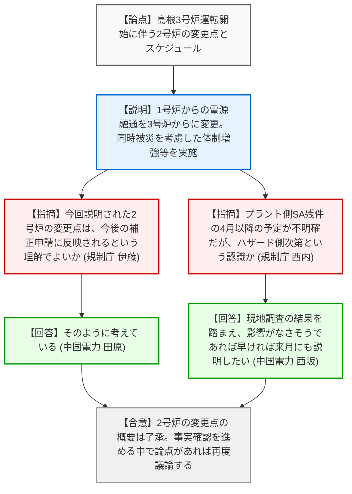
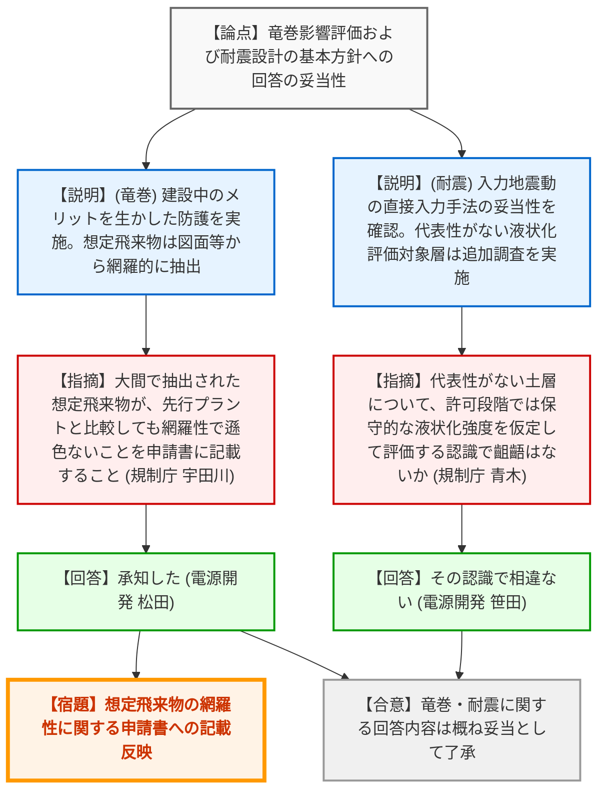
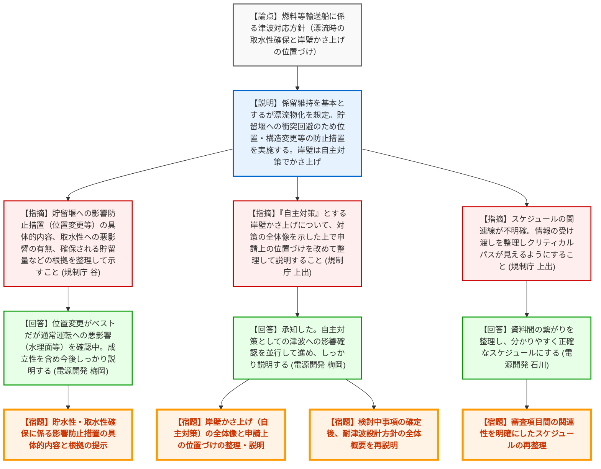

# 第1401回原子力発電所の新規制基準適合性に係る審査会合（令和8年3月26日）
> 出典 : https://youtube.com/live/Lq9eFuzI3f8?si=0zbRUTdpTBWe6y1O

## 会合の概要作成

*   **最大の争点**: 大間原子力発電所の「燃料等輸送船に係る津波対応方針」において、輸送船が漂流物化した場合の貯留堰への影響（取水性確保）と、自主対策とする岸壁のかさ上げの「申請上の位置づけ」について、規制側から厳しい確認と明確な整理の要求がなされた。
*   **審査の進捗状況**: 島根3号炉については、3号炉運転開始に伴う2号炉の変更点（電源融通や要員体制の変更等）が説明され、今後の補正申請に向けた方針が概ね了承された。大間原子力発電所については、竜巻影響評価および耐震設計の基本方針の回答は概ね了承されたが、耐津波設計（特に輸送船の漂流対応と岸壁かさ上げの位置づけ）については、さらなる具体化と整理を求められ、継続審議となった。
*   **特筆すべき決定事項**: 島根原子力発電所において、1号炉（廃止措置中）からの電源融通を取りやめ、3号炉からの融通に変更する方針が確認された。大間原子力発電所については、燃料等輸送船の津波対応において、漂流物化した場合でも取水性を確保できる根拠と、岸壁かさ上げ（自主対策）の全体像と申請上の位置づけを改めて整理・提示することが決定された。
*   **現場の雰囲気・緊張感**: 島根の審査はスムーズに進行したが、大間の審査、特に「耐津波設計」の議論においては、自主対策（岸壁かさ上げ）の扱いと安全機能確保（貯留堰への衝突回避）の論理的整合性について、規制側から「誤解のないように」と釘を刺されるなど、緊張感のある指摘が飛んだ。スケジュールの関連線（クリティカルパス）の不明確さについても厳しい指導が入った。

---

## 議題ごとの詳細整理（テキスト）

**【議題1】中国電力（株）島根原子力発電所３号炉の設計基準への適合性及び重大事故等対策について**

*   **議論の背景と論点**:
    島根3号炉の運転開始に伴い、2号炉側に生じる変更点（電源融通の変更、体制の強化、設備の共用化等）の概要説明、および今後の審査・説明スケジュールの確認が論点となった。

*   **質疑応答（詳細）**:
    *   **＜論点1：3号炉運転開始に伴う2号炉の変更点＞**
        *   【説明者側】（中国電力: 田原）からの説明
            *   1号炉（廃止措置中）から2号炉への電源融通を取りやめ、3号炉から2号炉への融通を可能とする設計に変更する。
            *   2・3号炉の同時被災を考慮し、初動体制を47名から74名へ、要員参集後を101名から146名へ増強する。被ばく評価も同時被災を前提に実施し作業可能であることを確認。輪谷貯水槽（西1・西2）の有効水量も増強する。
            *   緊急時対策所や可搬設備などのプラント共通設備の共用化を反映する。
        *   【規制側】（規制庁: 伊藤）の懸念・指摘点
            *   今回説明のあった2号炉の変更点は、既出の申請や補正申請には含まれていないため、今回の説明を踏まえた補正が今後なされるという理解でよいか。
        *   【説明者側】（中国電力: 田原）の回答・反論・根拠
            *   そのように考えている。
    *   **＜論点2：島根3号炉 設置変更許可 説明スケジュール案＞**
        *   【説明者側】（中国電力: 西坂）からの説明
            *   地震・津波側のスケジュールについて、実情に合わせ審査会合時期を3月下旬に見直した。4月以降は調査結果が整い次第説明する。プラント側（有効性評価、技術的能力等）も指摘事項回答を適宜説明していく。
        *   【規制側】（規制庁: 西内）の懸念・指摘点
            *   プラント側の残件（SA側の指摘事項回答）について、4月以降の予定が明確でない。ハザード側の状況次第とのことだが、おおよその目処感はあるか。
        *   【説明者側】（中国電力: 西坂）の回答・反論・根拠
            *   現地調査の結果を踏まえ、影響がなさそうであれば早ければ来月からでも説明させていただきたい。

*   **結論と宿題事項（アクションアイテム）**:
    *   【合意】島根3号炉の運転開始に伴う2号炉の変更点については概ね了承され、本内容を反映した補正申請を今後行うことが確認された。
    *   【宿題】（現時点での特段の指摘事項はないが）今後事実確認を進める中で新たな論点が見出された場合には、会合で議論することとする。

**【議題2】電源開発（株）大間原子力発電所の設計基準への適合性について**

*   **議論の背景と論点**:
    大間原子力発電所の審査において、過去の会合での指摘事項に対する回答（竜巻影響評価、耐震設計の基本方針）と、耐津波設計の基本方針（特に燃料等輸送船の津波対応）が論点となった。

*   **質疑応答（詳細）**:
    *   **＜論点1：竜巻影響評価について＞**
        *   【説明者側】（電源開発: 松田・竹内）からの説明
            *   建設中のメリットを生かし、軽油タンクの地下埋設や復水貯蔵槽の建屋内設置などにより竜巻飛来物から防護する。設計飛来物は、全体配置計画図やガイドの文献から網羅的に抽出し設定した。
        *   【規制側】（規制庁: 宇田川）の懸念・指摘点
            *   建設中のため現地調査で抽出できないが、大間で抽出された想定飛来物の結果が、先行プラントと比較して網羅性の観点で遜色ないことについて申請書にきちんと記載してほしい。
        *   【説明者側】（電源開発: 松田）の回答・反論・根拠
            *   承知した。

    *   **＜論点2：耐震設計の基本方針について＞**
        *   【説明者側】（電源開発: 神谷・笹田）からの説明
            *   （入力地震動）基準地震動の入力位置（TP-260m）に直接入力する手法が、解放基盤表面からの地震波の伝播特性を適切に考慮できていることを定量的に確認した。
            *   （液状化影響）埋戻し土・盛土材などの液状化評価対象層について、試験箇所の代表性を評価。代表性を有していない土層（埋戻し盛土材II、段丘堆積物、沖積層）については追加調査・試験を実施する。許可段階では保守的な液状化強度（豊浦標準砂）を仮定して評価する。
            *   （工学的対処の影響）CMs11（変状あり領域）の掘削除去とその後の埋戻し（工学的対処）が耐震設計方針に与える影響を検討した結果、液状化の影響はなく、耐震設計方針は妥当である。
        *   【規制側】（規制庁: 谷）の懸念・指摘点
            *   入力地震動の評価手法の妥当性について、定量的な評価から確認できた。地盤モデルの物性値設定根拠も確認できた。
        *   【規制側】（規制庁: 青木）の懸念・指摘点
            *   液状化強度試験の代表性・網羅性について、代表性を示せなかった土層については追加調査等を行うことを理解した。許可段階では保守的な液状化強度を仮定して評価を行うという認識で齟齬はないか。
        *   【説明者側】（電源開発: 笹田）の回答・反論・根拠
            *   その認識で相違ない。

    *   **＜論点3：耐津波設計の基本方針（燃料等輸送船に係る津波対応方針含む）＞**
        *   【説明者側】（電源開発: 川内・中山）からの説明
            *   燃料等輸送船は基準津波に対して係留を維持する方針だが、係留設備の没水による不確かさがあるため、漂流物化を想定した評価を実施。
            *   取水口スクリーン室への到達可能性は低いが、保守的に到達を想定。その場合でも消波ブロックの空隙等により通水性は確保されると評価。
            *   貯留堰への波及的影響については、衝突の可能性はないと考えるが、不確かさを考慮し、より確実な貯留量の確保に向け、貯留堰の位置・構造等の変更を含む影響防止措置を実施する。
            *   自主対策として岸壁をTP+4.4mにかさ上げする。
        *   【規制側】（規制庁: 谷）の懸念・指摘点
            *   貯留堰に対する影響防止措置について、具体的な方針が示されないと判断できない。位置や構造を変更する場合の成立性や、取水性に与える悪影響（デメリット）の有無、必要な貯留量などを整理して示してほしい。
        *   【説明者側】（電源開発: 梅岡）の回答・反論・根拠
            *   物理的に衝突しない位置に変更するのがベストだが、通常運転時への悪影響（水理面など）を確認中である。成立性を含めて今後しっかり説明する。
        *   【規制側】（規制庁: 上出）の懸念・指摘点
            *   岸壁のかさ上げを「自主対策」としているが、漂流物から安全機能を確保する上でどのような位置づけになるのか。構造・位置変更も含めた対策の全体像を示した上で、申請上の位置づけを改めて整理して説明してほしい。
        *   【規制側】（規制庁: 杉山委員）の懸念・指摘点
            *   荷役作業時の船の乗員はどうする想定か。
        *   【説明者側】（電源開発: 梅岡）の回答・反論・根拠
            *   船は強度があるため着底しても転覆しないと考えているが、津波の大きさによっては危険と判断し陸側へ逃げるなど、人命確保を含めた具体的な運用を検討する必要がある。

    *   **＜論点4：プラント審査の説明スケジュール＞**
        *   【説明者側】（電源開発: 石川）からの説明
            *   各審査項目間（ハザード側とプラント側）の関連線を明確化し、追而事項とその解消時期を明記したスケジュールに見直した。
        *   【規制側】（規制庁: 上出）の懸念・指摘点
            *   スケジュールの関連線について、例えば「地下水位の設定」に対し、津波審査側の線がそのまま引かれているなど、まだ整理されていない部分がある。審査項目間でどのような情報を受け渡すのか関連性を明確にし、クリティカルパスが見えるように再整理してほしい。

*   **結論と宿題事項（アクションアイテム）**:
    *   【合意】竜巻影響評価、および耐震設計の基本方針（入力地震動、液状化、工学的対処）に関する回答内容は概ね了承された。
    *   【宿題】大間・竜巻：抽出された想定飛来物が先行プラントと比較して網羅性の観点で遜色ないことについて、申請書に記載すること。
    *   【宿題】大間・耐津波：燃料等輸送船が漂流物化しても非常用海水冷却系に必要な貯水性・取水性が損なわれないことについて、検討中の影響防止措置（貯留堰の位置・構造変更等）の具体的な内容も含め、改めて根拠を整理して説明すること。
    *   【宿題】大間・耐津波：岸壁のかさ上げ（自主対策）について、影響防止措置も含めた対策の全体像を示した上で、申請上の位置づけを改めて整理して説明すること。
    *   【宿題】大間・耐津波：入力津波の評価結果等の検討中の事項を確定させた上で、耐津波設計方針の全体概要を改めて説明すること。
    *   【宿題】大間・スケジュール：審査項目間の情報の受け渡しや関連性を明確にし、クリティカルパスが見えるようスケジュールを再整理すること。

---

## 論理構造の可視化（Mermaid）

### 議題1：島根3号炉の設計基準への適合性及び重大事故等対策について

### 議題2：大間原子力発電所の設計基準への適合性について（竜巻・耐震）

### 議題2：大間原子力発電所の設計基準への適合性について（耐津波）

