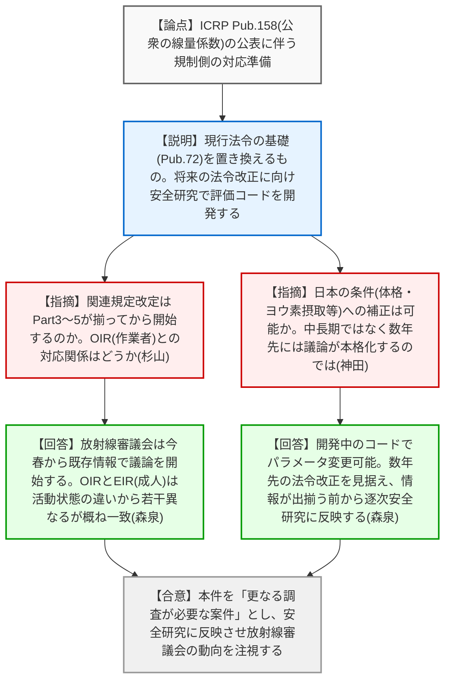
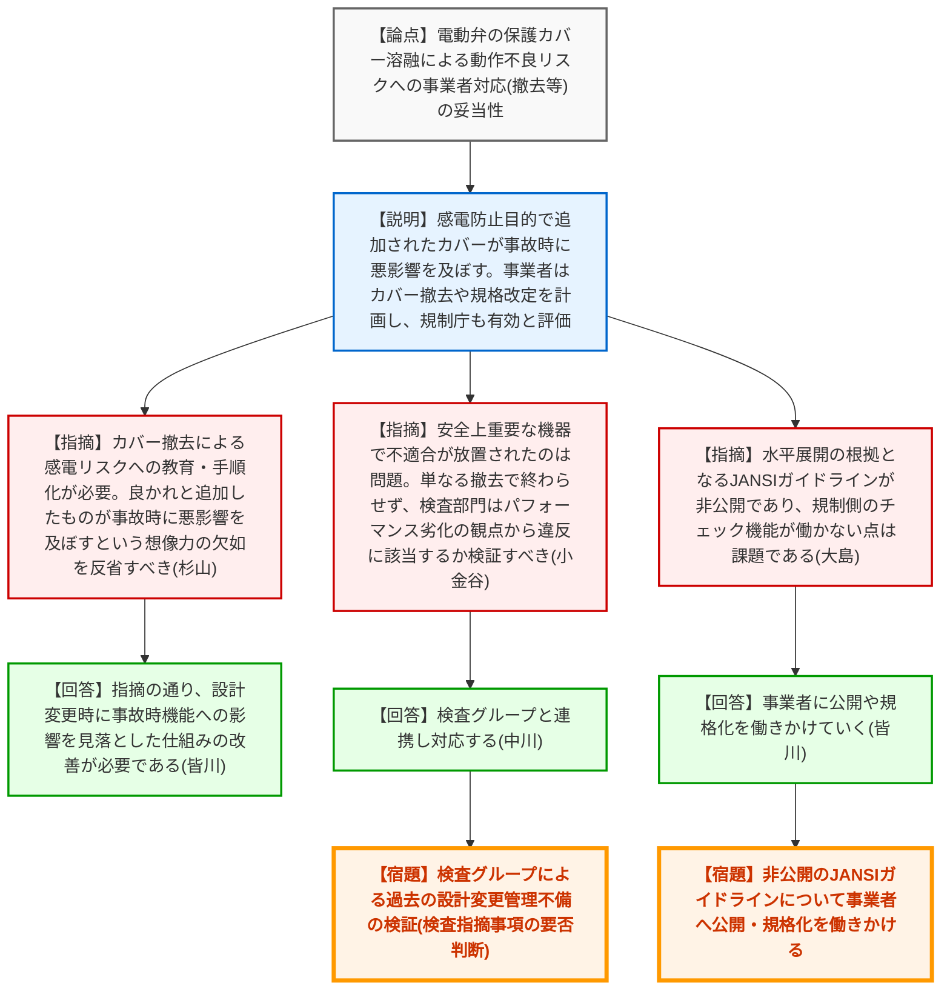
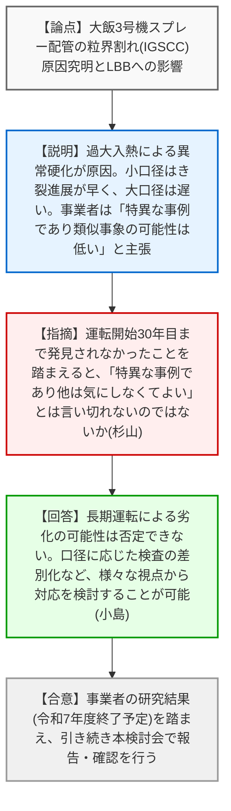

# 第78回技術情報検討会（令和8年3月26日）
> 出典 : https://youtube.com/live/obiryzBFdAI?si=oxsyfQvvH2_GN_m4

## 会合の概要作成
*   **最大の争点:** 電動弁駆動部の端子台保護カバー（アクリル製）が重大事故時の高温環境下で溶融・落下し、安全機能の喪失を招く事象について、過去の設計変更時（感電防止目的でのカバー追加時や新規制基準対応時）に「安全機能への悪影響」が見過ごされてきた設計変更管理の不備とその再発防止策が最大の争点となりました。
*   **審査の進捗状況:** 
    *   ICRPの新勧告（Pub.158）については、将来の法令・告示改正を見据え、安全研究部門での評価コード開発と放射線審議会へのデータ提供を推進することが確認されました。
    *   電動弁の不具合事象については、ATENA主導によるカバーの撤去と水平展開、規格改定の方向性が妥当と評価されました。
    *   PWRの配管粒界割れ事象については、事業者が「特異な事象」と結論づけようとしている点に対し、規制側から長期運転による劣化リスクや配管口径に応じた検査の必要性が指摘され、継続確認となりました。
*   **特筆すべき決定事項:** 電動弁の保護カバー撤去について方針は妥当とされたものの、規制側として単なる「水平展開」で終わらせず、検査部門において過去のパフォーマンス劣化（安全機能が長期間喪失する状態にあったこと）の観点から、検査指摘事項（違反）に該当するか検証を行う方針が示されました。
*   **現場の雰囲気:** 電動弁の事例において「良かれと思って追加した感電防止カバーが、事故時の過酷環境では命取りになる」という盲点に対し、委員や規制庁幹部から「想像力の欠如」「現場での気づきの重要性」について強い危機感が示され、事業者のみならず規制庁の検査官に対しても厳しい意識改革を求める緊張感のある議論が展開されました。

---

## 議題ごとの詳細整理（テキスト）

**【議題1】最新知見のスクリーニング状況の概要（ICRP Publication 158について）**
*   **議論の背景と論点:** ICRPより、公衆の構成員による放射性核種摂取時の線量係数に関する新勧告（Pub.158）が公表された。これが将来の国内法令等にどう影響し、規制側としてどう準備していくかが論点。
*   **質疑応答（詳細）:**
    *   **【説明者側】（規制庁 森泉）:** 現行法令の基礎であるPub.72を置き換えるものであり、全体として線量係数は小さくなる傾向だが、一部大きくなる核種もある。将来の法令等改正に向け、安全研究として線量評価コードを開発し準備を進める。
    *   **【規制側】（杉山委員）:** 関連規定の改定プロセスは、未公表のPart3〜5が揃ってから開始するのか。また、作業者向けのOIRと公衆向けのEIRの対応関係は。
    *   **【説明者側】（規制庁 森泉）:** 放射線審議会では今春から既存の情報を用いて議論を開始する。Part4（胚・胎児）、Part5（乳児）の情報が必要かは審議会の判断による。OIRとEIR（成人）は活動状態の違いから数値は若干異なるが、概ね一致している。
    *   **【規制側】（神田委員）:** 日本の条件（体格やヨウ素摂取量等）に合わせて補正できるか。また、中長期というより数年先には議論が本格化するのではないか。
    *   **【説明者側】（規制庁 森泉）:** 開発中のコードでパラメータ変更による計算が可能。数年先には法令改正に向けた動きになると考えており、情報が出揃う前から逐次安全研究に反映し、放射線審議会へ提供していく。
*   **結論と宿題事項（アクションアイテム）:**
    *   【合意】本件を「更なる調査が必要な案件」とし、安全研究の企画実施に反映させ、放射線審議会の動向を注視することが了承された。

**【議題2-1】国内外の原子力施設の事故・トラブル情報（1次スクリーニング結果等）**
*   **議論の背景と論点:** 国内外のトラブル事象から国内プラントへ反映すべき知見の確認。今回はスクリーニングアウトとなったが、参考として3件が報告された。
*   **質疑応答（詳細）:**
    *   **【説明者側】（規制庁 松澤）:** 米国NRCの監査プログラムの形骸化事例、国内の長期停止プラント（東海第二、大飯）における作業不慣れや点検時の見落としに起因するボヤ・油漏れ事象を紹介。
    *   **【規制側】（金城審議官・市村技監）:** NRCの独立監査組織（OIG）の機能について、NRA（規制庁）の監査室の役割と比較し、規制業務が効果的に実施されているかを評価する仕組みとして学ぶべき点がある。
*   **結論と宿題事項（アクションアイテム）:**
    *   長期停止プラント特有のヒューマンエラーに対する警戒を強め、検査部門とも連携して監視していく方針が共有された。

**【議題2-2】電動弁駆動部の事故時環境下における動作不良の可能性に関する知見への対応**
*   **議論の背景と論点:** 安全研究により、電動弁のアクリル製端子台保護カバーが重大事故時の高温で溶融落下し、動作不良を引き起こすことが判明。ATENAの未然防止措置（カバー撤去、規格改定等）の妥当性が論点。
*   **質疑応答（詳細）:**
    *   **【説明者側】（規制庁 皆川）:** カバーは1979年頃に感電防止目的で追加された。ATENAは、事故時機能要求のある電動弁についてカバーを取り外す対策を計画し、さらにIEEE等の海外動向を踏まえた民間規格（JEAC4623等）の改定を検討している。規制庁はこれを有効な対応と評価する。
    *   **【規制側】（杉山委員）:** カバーを外すことによる感電リスクについて、手順書への反映や教育訓練を確実に行うこと。良かれと思って追加したものが事故時に悪影響を及ぼすという「想像力の欠如」に対し、事業者も検査官も現場で想像を働かせるべき。
    *   **【規制側】（小金谷審議官・大島部長）:** 安全上重要な機器で不適合が放置されていたことは問題。単に「カバーを外した」で終わらせず、検査グループはパフォーマンス劣化の観点から検査指摘事項（違反）に該当するか検証すべき。また、水平展開の根拠となるJANSIガイドラインが「非公開」であるため、規制側でチェック機能が働かない点は課題である。
    *   **【説明者側】（規制庁 中川・皆川）:** 検査グループと連携し対応する。JANSIガイドラインの公開や規格化についても事業者側に働きかけていく。
*   **結論と宿題事項（アクションアイテム）:**
    *   【合意】事業者のカバー撤去や水平展開の方針は妥当と評価された。
    *   【宿題】検査グループは、過去の設計変更管理の不備について検証し、必要に応じて検査指摘事項として取り扱うこと。
    *   【宿題】非公開となっているJANSIガイドラインについて、事業者に公開や規格化を働きかけること。

**【議題2-3】PWR1次系におけるステンレス鋼配管粒界割れに関する事業者からの意見聴取結果**
*   **議論の背景と論点:** 大飯3号機の加圧器スプレー配管で発見された粒界割れ（IGSCC）について、事業者の原因究明結果（過大入熱による異常硬化等）と今後のLBB成立性への影響が論点。
*   **質疑応答（詳細）:**
    *   **【説明者側】（規制庁 小島）:** 事業者調査により、当該管は溶接入熱量が過大でビッカース硬さが特異に高かったことが判明。残留応力解析の結果、4B・6Bの小口径は内面が引張応力となり亀裂進展が早いが、12B・14Bの大口径は圧縮傾向で進展が遅いと評価。事業者は本事例を「特異」とし、類似事象の発生可能性は極めて低いと主張している。
    *   **【規制側】（杉山委員）:** 運転開始30年目まで亀裂が見つからなかったことを踏まえると、「特異な事例であり他は気にしなくてよい」とは言い切れないのではないか。
    *   **【説明者側】（規制庁 小島）:** 指摘の通り、長期間の運転による劣化の可能性は否定できない。小口径と大口径で進展速度が異なることも確認されており、口径に応じた検査の差別化など、様々な視点から対応を検討することが可能である。
*   **結論と宿題事項（アクションアイテム）:**
    *   【合意】ATENAによる研究結果（令和7年度終了予定）を踏まえ、引き続き技術情報検討会で報告・確認を行っていくことが了承された。

---

## 論理構造の可視化（Mermaid）

### 【議題1】最新知見のスクリーニング状況の概要（ICRP Pub.158）

### 【議題2-2】電動弁駆動部の事故時環境下における動作不良に関する知見

### 【議題2-3】PWR1次系におけるステンレス鋼配管粒界割れに関する意見聴取

