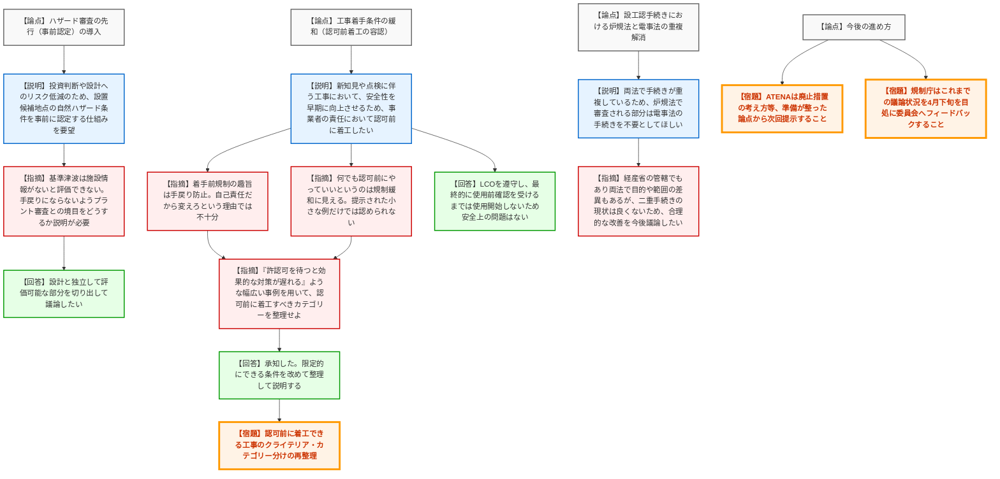

# 第2回実用発電用原子炉の許認可制度等の見直しに関する意見交換会合（令和8年3月26日）
> 出典 : https://youtube.com/live/1JYwhpo7bno?si=zsEtHrQi0mLPecUE

## 会合の概要作成

*   **最大の争点**: 原子力施設における工事の「認可前着手」を認めるか否か。事業者は安全性の早期実現を理由に制度見直しを求めたが、規制側は「手戻り防止」という法の趣旨や、安全確保上の重要性に基づく明確な線引き（クライテリア）がないままの規制緩和には難色を示し、議論が紛糾した。
*   **審査の進捗状況**: 法改正を伴う許認可制度の見直しに関する第2回意見交換として、ATENAから3つの要望（ハザード事前認定、認可前着工、炉規法・電事法手続きの重複解消）が提示された。いずれも方向性としては一定の理解を得られたものの、制度設計に向けた具体的な対象範囲や運用の整理が不足しているとして、ATENA側で再整理の上、次回以降に継続議論することとなった。
*   **特筆すべき決定事項**: 次回会合（4月中下旬予定）までに、ATENA側は「認可前に着工できる工事の条件・カテゴリー」や「廃止措置の考え方」について再整理を行うこと。また、規制庁側はこれまでの議論状況を4月下旬を目処に原子力規制委員会へ報告（フィードバック）することが決定した。
*   **現場の雰囲気・緊張感**: ハザードの事前認定や重複手続きの解消については建設的な意見交換が行われたが、「認可前着工」の議論においては、規制側から「何でもかんでも先にやっていいというのは規制緩和に見える」「ちっちゃい例だけ出されても手放しで認められない」と極めて厳しい指摘が飛び交い、事業者の要望の甘さが浮き彫りになる緊張感のある場面が見られた。

---

## 議題ごとの詳細整理（テキスト）

**【議題1】実用発電用原子炉の許認可制度等の見直しに関する事業者意見**

*   **議論の背景と論点**:
    前回の会合を踏まえ、法改正が必要となる可能性が高い事項についてATENAから意見が提示された。主な論点は以下の3点。
    ① ハザード（地震・津波等）審査の先行（事前認定）の導入
    ② 設工認における工事着手条件の緩和（認可前着工の容認）
    ③ 設工認手続きにおける炉規法と電事法の重複解消

*   **質疑応答（詳細）**:

    **＜論点1：ハザード審査の先行（事前認定）について＞**
    *   【説明者側】（ATENA: 田中）からの説明
        *   ハザード条件は不確実性が高く、投資判断やプラント設計へのリスクが大きい（過去の不許可事例や大幅な設計変更事例あり）。
        *   そのため、分割申請ではなく、必要に応じて設置候補地点の自然ハザード条件を審査・認定できる仕組み（事前認定）を要望する。対象は建替炉および新規制基準未適合炉。
    *   【規制側】（規制庁: 三田）の懸念・指摘点
        *   申請者が柔軟に選択できる仕組みとは具体的にどのようなイメージか。断層や波源ごとに小刻みに申請されるのは現実的ではない。
    *   【説明者側】（ATENA: 田中）の回答・反論・根拠
        *   例えば火山がない地域ではそれを除き、他の項目だけ認定をもらうといったケースを想定している。
    *   【規制側】（規制庁: 市川、島田部長）の懸念・指摘点
        *   基準津波は施設情報（取水口位置等）がないと評価できない。
        *   事前認定が手戻り（二度手間）にならない制度設計が必要。兼用キャスクの際も境界条件の整理で苦労した。ハザード審査とプラント審査の境目をどうするか、制度としてどういう利点があるのか、しっかり説明してほしい。
    *   【説明者側】（ATENA: 田中）の回答・反論・根拠
        *   ハザードが早期に決まれば設計に反映でき安全性向上に繋がる。二度手間にならないよう、設計と独立して評価可能な部分を議論したい。

    **＜論点2：工事着手の条件（認可前着工）について＞**
    *   【説明者側】（ATENA: 田中）からの説明
        *   現行は認可後（届出は受理後30日経過後）でないと着工できない。
        *   配管の減肉対応や津波対策（ポンプ長尺化）など、新知見や点検結果を踏まえた計画外の工事に対し、安全性を早期に向上させるため、事業者の責任において認可前に着手できる仕組みを要望する。技術基準への適合性は使用前事業者検査等で最終確認するため安全上の問題はない。
    *   【規制側】（規制庁: 三田）の懸念・指摘点
        *   着手前規制の趣旨は、基準不適合なものが設置されることによる社会的コストの最小化（手戻り防止）である。自己責任だから制度を変えろという理由では不十分。早期に安全性が向上するという理由に対応した意見（提案）にしてほしい。
    *   【規制側】（規制庁: 直居、松本）の懸念・指摘点
        *   認可前に工事を行い、技術基準に適合しない状態を作り出す可能性はないか。その場合どう対応するのか。
    *   【説明者側】（東京電力: 山下、ATENA: 田中）の回答・反論・根拠
        *   工事中も保安規定のLCO（運転上の制限）を満足しつつ実施する。また、技術基準適合が確認される（使用前確認を受ける）まではインサービス（使用開始）しないため問題ない。
    *   【規制側】（規制庁: 島田部長、田口）の懸念・指摘点
        *   何でもかんでも先にやっていいというのは規制緩和に見える。「認可前に着工してよいもの」の重要性や基準を明確にすべき。提示された「減肉配管の更新」等の小さな例だけでは、手放しで着手前規制を認められない。例えば「自然ハザードのリスクが見つかり、白黒はっきりしないが先に対策を打ちたい」といった、我々の許認可を待つと安全確保が遅れるような幅広い事例を用いて整理してほしい。
    *   【説明者側】（ATENA: 田中）の回答・反論・根拠
        *   承知した。全部ではなく、どういう場合に限定的にできるか改めて整理して説明する。

    **＜論点3：設工認手続きの重複（炉規法と電事法）について＞**
    *   【説明者側】（ATENA: 熊谷・田中）からの説明
        *   炉規法と電事法で申請対象が重複しており、二重の対応（書類作成、品証プロセス等）が生じている。炉規法で審査される部分については、電事法での手続きを不要としてほしい。
    *   【規制側】（規制庁: 市川、島田部長）の懸念・指摘点
        *   電事法は経産省の管轄であり規制庁だけで決められないが、二重手続きの現状が良いとは思っていない。ただし、両法では確認の目的や対象範囲（SA設備は電事法の対象外等）に差異がある。合意的な手続きをどう求めていくか、経産省とも協議が必要であり、引き続き議論したい。

*   **結論と宿題事項（アクションアイテム）**:
    *   【合意】ハザード事前認定や重複手続き解消の方向性については一定の理解が得られたが、制度設計に向けた深掘りが必要であることが確認された。
    *   【宿題】ATENA：認可前に着工できる工事の条件（カテゴリー分けや重要性の基準）について、幅広い具体例を用いて再整理し、次回説明すること。
    *   【宿題】ATENA：廃止措置の考え方など、準備が整ったその他の論点についても次回以降提示すること。
    *   【宿題】規制庁：本日の議論内容を含め、これまでの状況を4月下旬を目処に原子力規制委員会へフィードバック（報告）すること。

---

## 論理構造の可視化（Mermaid）

