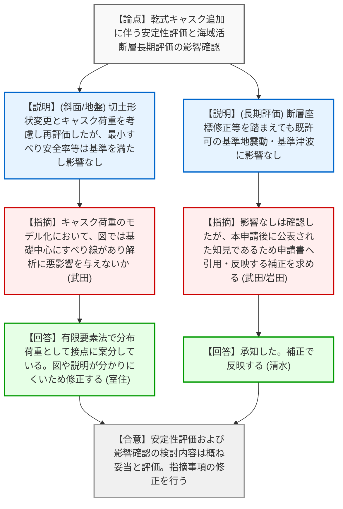
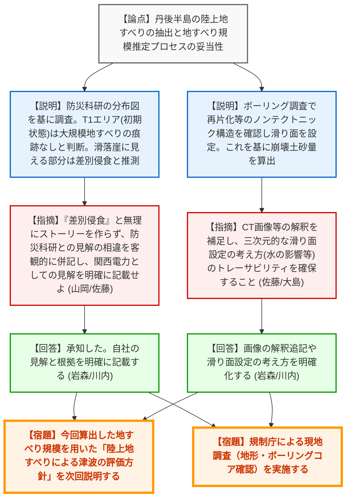
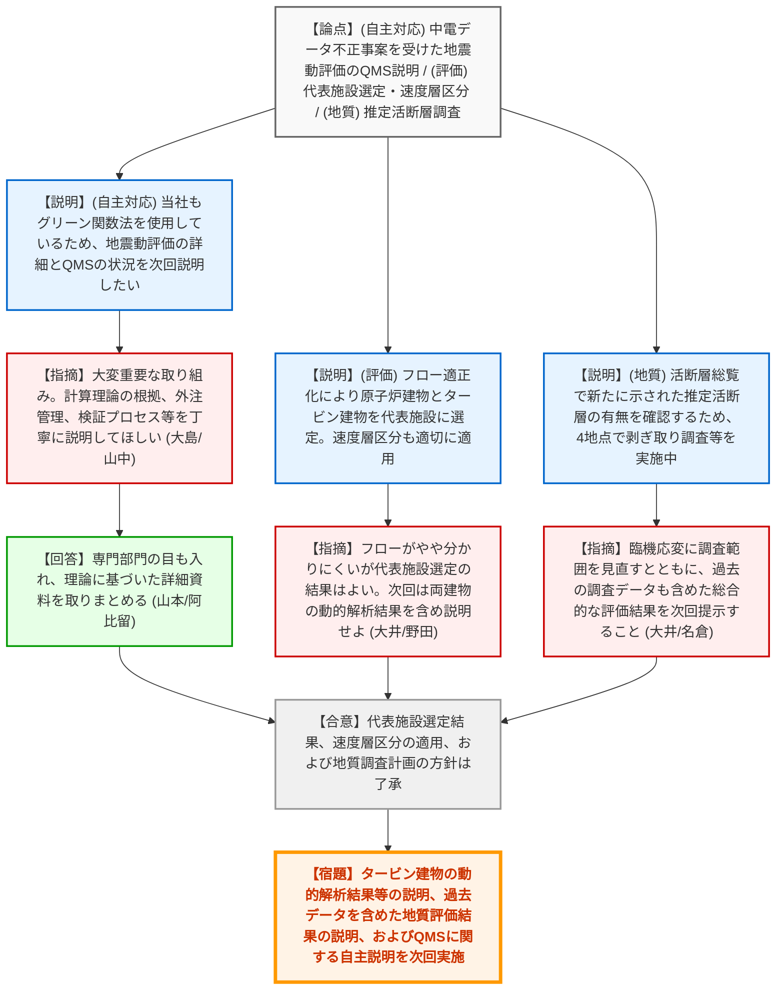

# 第1402回原子力発電所の新規制基準適合性に係る審査会合（令和8年3月27日）
> 出典 : https://youtube.com/live/e4e2GaA4BjE?si=DnpxYiumfstbqOIG

## 会合の概要作成

*   **最大の争点**: 大飯発電所における「日本海中南部の海域活断層の長期評価」を踏まえた影響確認において、丹後半島の陸上地すべり（特にT1エリア）の地形判読と調査結果の解釈、およびそれらが連動した巨大な地すべり津波を引き起こすかどうかの評価が最大の争点となった。
*   **審査の進捗状況**: 高浜発電所の乾式貯蔵施設追加に伴う周辺斜面・基礎地盤の安定性評価、および長期評価の影響確認は概ね妥当とされ、指摘事項の修正を経て了承される見通しとなった。大飯発電所の陸上地すべりに関する調査結果は、規制庁から「現地調査」の実施が求められ、引き続き評価方針を含めた継続審議となった。島根3号炉については、基礎地盤の安定性評価のフロー見直し（代表施設選定）や速度層区分の適用根拠が確認された。また、敷地周辺の地質調査計画（推定活断層）についても、幅広いデータの提示が求められ継続審議となった。
*   **特筆すべき決定事項**: 島根3号炉の審査において、中国電力から「中部電力のデータ不正事案」を受けた自主的な対応として、統計的グリーン関数法を用いた地震動評価の詳細と、そのプロセスにおける品質管理体制（QMS）の取り組み状況について、今後の審査会合で説明することが表明され、了承された。
*   **現場の雰囲気・緊張感**: 大飯発電所の陸上地すべりの議論において、規制側（山岡委員）から「無理にストーリーを作らなくてもよい」「防災科研の判読とは見解の相違があっても自然なことだ」と、事業者の過剰な解釈を戒め、事実（観察結果）に基づく客観的な評価と明記を求める場面があり、科学的妥当性を重視する緊張感のあるやり取りが見られた。また、中部電力の不正事案の波紋が他社（中国電力）の審査にも明確に影響を与えていることが確認された。

---

## 議題ごとの詳細整理（テキスト）

**【議題1】関西電力（株）高浜発電所の使用済燃料乾式貯蔵施設に係る周辺斜面及び２号炉基礎地盤の安定性評価について**

*   **議論の背景と論点**:
    高浜発電所に乾式貯蔵キャスクを追加設置する（第2期）ことに伴い、斜面形状の変更（切土）と荷重条件の変更が生じるため、周辺斜面および2号炉基礎地盤の安定性評価を再実施した。その妥当性と、地震本部による海域活断層の長期評価（令和6年8月版・令和7年6月版）の基準地震動・基準津波への影響がないことの確認が論点となった。

*   **質疑応答（詳細）**:
    *   **＜論点1：周辺斜面の安定性評価と代表断面の選定＞**
        *   【説明者側】（関西電力: 北村）からの説明
            *   代表断面は既許可と同じ「GG'断面」が最も厳しい（簡便法の最小すべり安全率が小さい）ため選定した。この断面上にキャスク2基分の荷重を投影して影響検討を実施したが、最小すべり安全率等の結果は既許可と同じであり、荷重の影響はないことを確認した。
        *   【規制側】（規制庁: 武田）の懸念・指摘点
            *   GG'断面の選定理由（他断面との比較）は理解した。荷重のモデル化について、図（55ページ等）を見ると基礎底面の中心にすべり線が設定されており、解析に悪影響を与えるのではないか。どのようにモデル化したのか詳細に説明せよ。
        *   【説明者側】（関西電力: 室住）の回答・反論・根拠
            *   有限要素法において、等分布荷重として接点ごとに案分して与えている。図や説明が分かりにくかったため、分布荷重として考慮していることが分かるよう記載を改める。

    *   **＜論点2：2号炉基礎地盤の安定性評価＞**
        *   【説明者側】（関西電力: 北村）からの説明
            *   切土の勾配変更と荷重を考慮し、BB'断面で再評価を実施。支持力、すべり、傾斜（地殻変動含む）のいずれも評価基準値を満足することを確認した。
        *   【規制側】（規制庁: 武田）の懸念・指摘点
            *   結果が基準値を満足することは確認した。

    *   **＜論点3：海域活断層の長期評価の影響確認＞**
        *   【説明者側】（関西電力: 大川）からの説明
            *   地震本部2025（令和7年6月版）について、若狭海丘列北縁断層の座標修正や三浜湾断層の追加等を踏まえ影響を確認したが、基準地震動・基準津波への影響はない。
        *   【規制側】（規制庁: 武田、岩田）の懸念・指摘点
            *   影響がないことは確認したが、本申請後に公表された知見であるため、申請書（参考文献等）に引用し、反映するよう補正を求める。
        *   【説明者側】（関西電力: 清水、大倉）の回答・反論・根拠
            *   承知した。補正で反映し、指摘事項全てに対応する。

*   **結論と宿題事項（アクションアイテム）**:
    *   【合意】高浜発電所の周辺斜面・基礎地盤の安定性評価および長期評価の影響確認については、概ね妥当な検討がなされたと評価された。
    *   【宿題】キャスク荷重のモデル化（分布荷重であること）が分かる図や記載の修正、および地震本部の最新長期評価（令和7年6月版）の申請書への反映を行うこと。

---

**【議題2】関西電力（株）大飯発電所の日本海中南部の海域活断層の長期評価に関する影響確認について**

*   **議論の背景と論点**:
    前回の審査会合で、海域活断層（京ヶ岬北方断層等）による津波と「陸上地すべりによる津波」の組み合わせ（重畳）の検討を求められた。これに対する回答として、防災科研の地すべり地形分布図に基づく丹後半島の陸上地すべりの抽出、現地調査・ボーリング調査による地すべり規模の推定プロセスが妥当であるかが論点となった。

*   **質疑応答（詳細）**:
    *   **＜論点1：地すべり地形の抽出とT1エリアの解釈＞**
        *   【説明者側】（関西電力: 川内・岩森）からの説明
            *   防災科研の分布図を基に詳細地形調査と現地調査（200箇所以上）を実施。T2〜T4は概ね防災科研の示す移動体と一致したが、T1（移動の初期状態/全域）については、大規模な地すべりの痕跡（開口割れ目等）は認められなかった。
            *   T1西縁の滑落崖（防災科研図示）付近も堅岩が連続しており、地すべりではなく、地層の軟質部が「差別侵食」を受けた結果リニアメントとして現れていると推測する。
        *   【規制側】（山岡委員、規制庁: 佐藤、武田）の懸念・指摘点
            *   （山岡委員）無理に「差別侵食」というストーリーを作らなくてもよい。防災科研の解釈（滑落崖）に対し、関西電力は調査結果から「単なる侵食（地すべりではない）」と考える、という見解の相違を客観的に併記・説明すればよい。また、国土地理院の最新データ（1mメッシュ）等の高精度なデータを用いた判断であることも追記すると説得力が増す。
            *   （規制庁 佐藤）各ステップの最後に、関西電力としての見解（総括）を明確に記載すること。
        *   【説明者側】（関西電力: 岩森、川内）の回答・反論・根拠
            *   承知した。自社の見解と根拠を明確に記載する。

    *   **＜論点2：ボーリングコアの観察（ノンテクトニック構造）と滑り面の設定＞**
        *   【説明者側】（関西電力: 岩森）からの説明
            *   T2エリアで実施したボーリング（No.3）において、深度84.6〜84.8m付近で再片化やジグソーパズル構造等のノンテクトニック構造を確認し、ここを滑り面と設定した。これを基に地すべりの厚さと幅を推定し、崩壊土砂量を算出した。
        *   【規制側】（規制庁: 佐藤、大島部長）の懸念・指摘点
            *   （佐藤）CT画像やボアホールテレビ（BTV）の解釈について、どの特徴（開口割れ目等）が認められたのか、番号を振るなどして説明を補足・充実させること。
            *   （大島部長）滑り面をどう引くかが最終的な土砂量（津波高さ）に直結する。どのような考え方（三次元的な器の形状や水の影響など）で滑り面を設定したのか、トレーサビリティが確保できるよう丁寧に記載すること。また、貴重なデータであるため論文化等も検討してほしい。
        *   【説明者側】（関西電力: 岩森、川内）の回答・反論・根拠
            *   BTV画像への解釈の追記や、三次元的な滑り面設定の考え方の明確化を行う。論文化も進めたい。

*   **結論と宿題事項（アクションアイテム）**:
    *   【合意】地すべり規模の設定の考え方は概ね理解されたが、記載の充実と「現地調査」の実施が必要とされた。
    *   【宿題】防災科研の解釈に対する関西電力の見解の明記、CT/BTV画像の解釈の補足、滑り面設定の考え方の丁寧な記載を行うこと。
    *   【宿題】今回算出した地すべり規模を用いた「陸上地すべりによる津波の評価方針（複数同時崩落か順次崩落か等）」について次回以降説明すること。
    *   【宿題】規制庁による現地調査（丹後半島の地すべり地形・ボーリングコアの確認）を実施する。

---

**【議題3】中国電力（株）島根原子力発電所３号炉の基礎地盤及び周辺斜面の安定性評価について**
*(※中部電力のデータ不正事案を受けた自主的対応を含む)*

*   **議論の背景と論点**:
    前回の審査会合の指摘を踏まえ、基礎地盤の安定性評価における「代表施設の選定フローの適正化」と、南側切土斜面の評価における「速度層区分の適用の妥当性」が論点となった。また、冒頭で中部電力のデータ不正事案に対する中国電力の自主的な対応方針が示された。

*   **質疑応答（詳細）**:
    *   **＜論点0：中部電力のデータ不正事案への対応（自主的表明）＞**
        *   【説明者側】（中国電力: 山本）からの説明
            *   島根の基準地震動策定においても「統計的グリーン関数法」を用いている。規制庁からの注意喚起（1/14）を踏まえ、自主的な対応として、地震動評価の詳細と品質管理（QMS）の取り組み状況を今後の審査会合で説明したい。
        *   【規制側】（規制庁: 大島部長、山中委員長）の懸念・指摘点
            *   大変重要な取り組みであり評価する。説明の際は、単なるマニュアルの提示ではなく、どのような理論・科学的根拠に基づき計算が行われたか、外注先の管理（調達管理や要求事項の伝達プロセス）、妥当性確認・検証のプロセス（ミスや不具合があった場合の社内処理の記録など）を丁寧に説明してほしい。
        *   【説明者側】（中国電力: 山本）の回答・反論・根拠
            *   承知した。専門部門による第三者の目も入れ、理論に基づいた詳細な説明資料を取りまとめる。

    *   **＜論点1：代表施設の選定と速度層区分の適用＞**
        *   【説明者側】（中国電力: 徳田）からの説明
            *   タービン建物の単位奥行き重量が大きいことを考慮し、評価フローを適正化。簡便法での比較の結果、原子炉建物とタービン建物の両方をグループAの代表施設として選定した。
            *   速度層区分について、3号炉基礎地盤は3号炉の区分を、3号炉南側切土斜面は2号炉の区分（2号炉西側斜面と同じ山体構造で整合的であるため）を適用する。
        *   【規制側】（規制庁: 大井、野田）の懸念・指摘点
            *   原子炉建物は施設重量が有意に大きいため、施設単体の比較（簡便法）をせずとも代表施設に選定できる。フローがやや分かりにくくなった感もあるが、結果として両建物を代表施設として動的解析を行うのであればその方針でよい。
            *   次回の会合では、実施中のタービン建物のEW断面の動的解析結果を含め、基礎地盤の安定性評価結果を説明すること。速度層区分の適用根拠については理解した。
        *   【説明者側】（中国電力: 勢井、清水）の回答・反論・根拠
            *   承知した。動的解析の結果を次回提示する。

*   **結論と宿題事項（アクションアイテム）**:
    *   【合意】代表施設の選定結果（原子炉建物とタービン建物）および速度層区分の適用方針は了承された。
    *   【宿題】タービン建物のEW断面の動的解析結果を含めた、基礎地盤の安定性評価結果を次回説明すること。
    *   【宿題】（自主的対応）統計的グリーン関数法を用いた地震動評価の詳細および品質管理体制（QMS）の取り組み状況について、別途資料を準備し説明すること。

---

**【議題4】中国電力（株）島根原子力発電所３号炉の敷地周辺の地質・地質構造について**

*   **議論の背景と論点**:
    2026年1月に刊行された「日本の活断層総覧（宮内ほか編）」において、宍道断層帯から敷地に向けて伸びる水底活断層（推定）が新たに示された。これに対する中国電力の地質調査計画（地表地質調査および剥ぎ取り調査）の妥当性が論点となった。

*   **質疑応答（詳細）**:
    *   【説明者側】（中国電力: 藤原）からの説明
        *   自社の地形判読では変位地形・リニアメントは認められないが、データ拡充のため調査を実施する。水底活断層の延長上と推定される4地点（谷の屈曲部周辺、小規模な鞍部など）を選定し、剥ぎ取り調査等を実施中である。
    *   【規制側】（規制庁: 大井、名倉）の懸念・指摘点
        *   調査地点が広範囲に設定されている理由は「断層の通過位置を見落とさないため」と理解した。調査状況に応じて範囲を見直すなど臨機応変に対応すること。
        *   結果を説明する際は、今回の調査結果だけでなく、過去（1996年等）の敷地近傍の文献調査や地表地質調査などの関連データも全て含め、科学的根拠に基づいた総合的な評価結果を提示すること。また、「総覧」に記載された他の活断層・推定活断層についても評価結果を説明すること。
    *   【説明者側】（中国電力: 勢井、清水）の回答・反論・根拠
        *   承知した。過去の調査結果も反映し、適宜結果を示す。

*   **結論と宿題事項（アクションアイテム）**:
    *   【合意】提示された調査計画の方針は概ね了承された。
    *   【宿題】調査状況に応じた臨機応変な対応を行うとともに、過去の調査データを含めた総合的な評価結果（他の活断層等への影響含む）を次回の審査会合で説明すること。

---

## 論理構造の可視化（Mermaid）

### 議題1：高浜発電所の周辺斜面及び基礎地盤の安定性評価等

### 議題2：大飯発電所の海域活断層の長期評価に関する影響確認（陸上地すべり）

### 議題3・4：島根原子力発電所3号炉の基礎地盤・周辺斜面の安定性評価および地質調査計画

