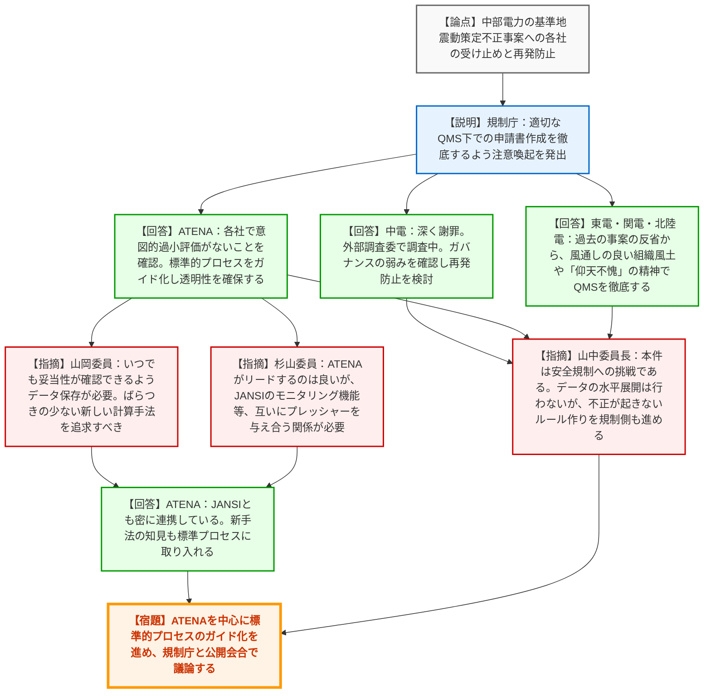
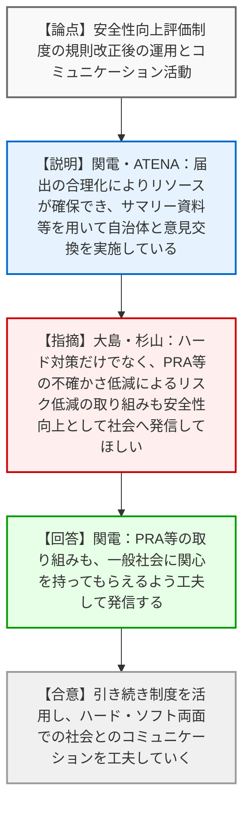
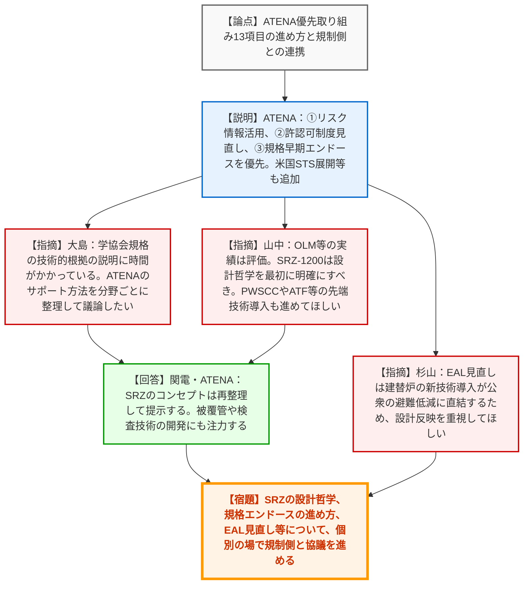
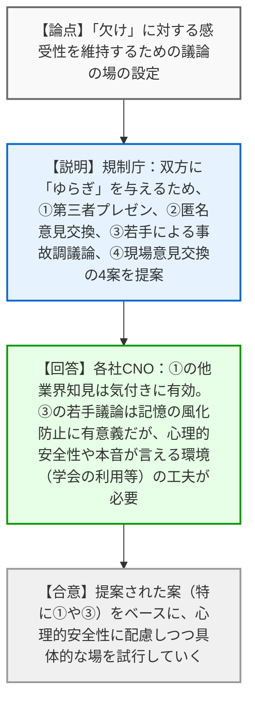

# 第23回主要原子力施設設置者（被規制者）の原子力部門の責任者との意見交換会（令和8年3月27日）
> 出典 : https://youtube.com/live/gAQWNIoxrAs?si=NI_AAQin-HePi_Wu

## 会合の概要作成

*   **最大の争点**:
    中部電力浜岡原発の基準地震動策定における不正行為の重大性に対する各事業者の受け止めと再発防止（品質マネジメント・安全文化の立て直し）の仕組みづくり。および、「欠け（unknown-unknowns）」に対する感受性を維持するため、規制側・事業者双方に「ゆらぎ」を与える具体的な議論の場の設定方法。
*   **審査の進捗状況**:
    安全性向上評価制度については、規則改正後の届出の合理化やコミュニケーションツールとしての活用事例が共有され、制度の定着が確認された。ATENAの重点案件（SRZ-1200の設計哲学、規格の早期エンドース等）については、それぞれの進捗と今後の規制側との個別議論の方向性が整理された。
*   **特筆すべき決定事項**:
    中部電力の不正事案を受け、ATENAが中心となって「標準的な地震波策定プロセス」をガイドライン化し、産業界に展開することが確認された。また、「欠け」に関する議論の場として、第三者（他産業の有識者等）の招聘や学会等を利用した若手による事故調報告書の議論など、心理的安全性を確保しつつ外部からの刺激を入れる取り組みを試行していく方針が了承された。
*   **現場の雰囲気**:
    中部電力のデータ不正という規制の根幹を揺るがす事態に対し、山中委員長から「安全規制に対する挑戦である」との極めて厳しい認識が示された。これに対し、各社CNOは自社の過去の隠蔽事案（臨界隠し等）の苦い経験を引いて「仰天不愧（天を仰いで恥じることがない）」の精神を語るなど、極めて重苦しく、かつ強い危機感と緊張感に包まれた意見交換となった。

---

## 議題ごとの詳細整理（テキスト）

**【議題1】中部電力株式会社の不正行為への対応について**
*   **議論の背景と論点**: 浜岡原発の基準地震動策定において、不適切な代表波の選定等が行われた事案について、規制委員会は報告徴収と検査を実施中。CNOが同席する本会合において、事業者全体の受け止めと、品質マネジメントシステム（QMS）や安全文化の立て直しに向けた方針が問われた。
*   **質疑応答（詳細）**:
    *   【規制側】（大島部長）からの説明
        *   事業者の一義的責任の下、適切な品質管理体制での申請書作成を求める注意喚起を1/14に発出した。規制側としても審査上の改善事項を検討・反映していく。
    *   【説明者側】（中部電力：豊田CNO）の回答
        *   心より深くお詫びする。独立した外部調査委員会で原因を究明中。自らもガバナンスやQMSの弱みを確認し、再発防止に向けた議論を進めている。
    *   【説明者側】（ATENA：加藤）からの説明
        *   各社へ耐震評価の状況確認を指示し、意図的な過小評価がないことを確認した。今後、標準的な地震波策定プロセスをATENAのガイドで規定し透明性を確保する。
    *   【説明者側】（東京電力：福田CNO）の回答
        *   自社の核物質防護事案の反省から、風通しの良さやQMSの徹底、CAP（是正処置プログラム）の活用が重要と認識している。
    *   【規制側】（山岡委員）の懸念・指摘点
        *   品質マネジメントに関して、いつでも妥当性が確認できるようデジタルデータの保存等が必要。計算手法も、ばらつきが出にくい新しい方法を継続的に追求すべき。
    *   【規制側】（杉山委員）の懸念・指摘点
        *   ATENAがガイド等でリードするのは良いが、JANSI（原子力安全推進協会）への言及が控えめである。JANSIのモニタリングが十分だったのか等、互いにプレッシャーを与え合う関係が必要。
    *   【説明者側】（ATENA：加藤）の回答
        *   JANSIとも密に調整しており、JANSIも強い危機意識を持っている。
    *   【説明者側】（北陸電力：福村CNO）の回答
        *   過去の臨界隠しの経験から「仰天不愧（天を仰いで恥じない）」をスローガンに、全社で意識と文化の醸成を続けている。
    *   【規制側】（大島部長）の懸念・指摘点
        *   トレーサビリティの確保やガイドの見直しについて、ATENAと公開会合で議論したい。
    *   【規制側】（山中委員長）の懸念・指摘点
        *   本件は安全規制への挑戦である。水平展開（規制側での全社バックチェック）は行わないが、不正が起きない環境・ルール作りを規制側も進める。国際的にも自然ハザード審査の改善が指示されており、それにも対応していく。
*   **結論と宿題事項（アクションアイテム）**:
    *   【合意】ATENAを中心に標準的プロセスのガイド化を進め、規制庁との公開会合で議論していくこととした。

**【議題2】安全性向上評価制度について**
*   **議論の背景と論点**: 昨年5月の規則・ガイド改正後の、安全性向上評価制度に関する事業者の取り組み状況とコミュニケーション活動への活用実績が論点となった。
*   **質疑応答（詳細）**:
    *   【説明者側】（関西電力：水田CNO）からの説明
        *   届出書の内容を工夫し、自治体等との意見交換において、サマリー資料や広報資料を活用している。
    *   【説明者側】（ATENA：片岡）からの説明
        *   制度見直しにより、既存資料の添付が可能となり二重管理が解消されたことで、安全性向上の取り組みによりリソースを配分できるようになった。
    *   【規制側】（大島部長）の懸念・指摘点
        *   届出書の公開義務は社会への説明を求めているもの。ハード対策だけでなく、PRA（確率論的リスク評価）等による取り組みも伝わるようにしてほしい。
    *   【規制側】（杉山委員）の懸念・指摘点
        *   ハード面の更新は分かりやすいが、PRAにおける不確かさの低減や新知見の反映など、リスク低減の取り組みも安全性向上として社会へ発信してほしい。
    *   【説明者側】（関西電力：水田CNO）の回答
        *   PRAの取り組みは学会等で説明しているが、一般社会にも関心を持ってもらえるよう工夫したい。
*   **結論と宿題事項（アクションアイテム）**:
    *   【合意】引き続き制度を活用し、ハード対策とソフト対策（リスク評価等）の双方について、社会とのコミュニケーションの工夫を継続していく。

**【議題3】ATENA検討案件のうち特に優先的に取り組む案件の順位付け**
*   **議論の背景と論点**: 昨年8月の意見交換で提示された案件に2件（米国STSの保安規定への展開等）を追加した計13項目の優先順位と、規制側との今後の議論の進め方が論点となった。
*   **質疑応答（詳細）**:
    *   【説明者側】（ATENA：加藤）からの説明
        *   4/1に一般社団法人へ移行する。優先事項は①リスク情報の活用、②許認可制度の見直し、③規格基準類の早期エンドースの3点。
    *   【規制側】（大島部長）の懸念・指摘点
        *   規格基準類の早期エンドースについて、学協会規格の技術的根拠の説明に時間がかかっている現状がある。ATENAがどうサポートするのか、分野ごとに整理して議論したい。
    *   【規制側】（山中委員長）の懸念・指摘点
        *   OLM（オンラインメンテナンス）等のリスク情報活用はうまく進んだ。SRZ-1200（革新軽水炉）については、設計哲学（コンセプト）を最初にしっかり示し、記録に留めるべき。また、PWRのPWSCC検査やATF（事故耐性燃料）など、先端技術の開発と導入を進めてほしい。
    *   【説明者側】（関西電力：水田CNO）の回答
        *   SRZは福島事故後に色々なものを追加してコンセプトがぼけた部分もあるので、再整理してお示しする。被覆管開発も再度注力する。
    *   【規制側】（杉山委員）の懸念・指摘点
        *   EAL（緊急時活動レベル）の見直しについて、建て替え炉の新技術導入が公衆の避難・屋内退避の低減に直結するため、設計への反映を重視してほしい。
*   **結論と宿題事項（アクションアイテム）**:
    *   【宿題】SRZ-1200の設計哲学の再整理、学協会規格のエンドースの進め方、EAL見直しの設計反映等について、個別の場で引き続き規制側と協議を進める。

**【議題4】「欠け（unknown-unknowns）」への対応について**
*   **議論の背景と論点**: 絶えず「欠け（未知の未知）」があり得ることを認識し続けるため、規制側と事業者の双方に「ゆらぎ」を与える具体的な議論の場（4つの提案）の設定方法が論点となった。
*   **質疑応答（詳細）**:
    *   【規制側】（規制庁：田口課長）からの提案
        *   ①第三者からのプレゼン、②匿名意見交換会、③若手による事故調報告書を用いた議論、④現場での意見交換の4案を提示。
    *   【説明者側】（北海道電力：勝海CNO）の回答
        *   ゆらぎを与える方向性に賛成。自由闊達な議論には心理的安全性の確保が重要。①のファシリテーターは有効、②は匿名性が高いが行司役が必要、③は若手の意識浸透に有意義。
    *   【説明者側】（電源開発：萩原CNO）の回答
        *   自社では他業界（医療事故等）から講師を呼んでいる。課題はそれを組織内にどう浸透させるか。若手との議論は本音が言える雰囲気作りが必要。
    *   【説明者側】（北陸電力：福村CNO）の回答
        *   ①は業界外の取り組みを知ることで安全活動の改善につながる。③は記憶の風化を防ぎ、「欠け」に対する感度を高める効果がある。
    *   【説明者側】（東京電力：福田CNO）の回答
        *   同じ業界の中よりも、外からの刺激（①）が気づきを与えやすい。③は学会など第三者が間に入ることで自由に議論できる場になり得る。
*   **結論と宿題事項（アクションアイテム）**:
    *   【合意】提示された提案（特に①他業界の第三者の招聘や、③学会等を利用した若手の議論）をベースに、心理的安全性に配慮しつつ、具体的な場や仕組みを試行していくことで一致した。

---

## 論理構造の可視化（Mermaid）

### 議題1：中部電力の不正行為への対応について

### 議題2：安全性向上評価制度について

### 議題3：ATENA検討案件のうち特に優先的に取り組む案件の順位付け

### 議題4：「欠け（unknown-unknowns）」への対応について

