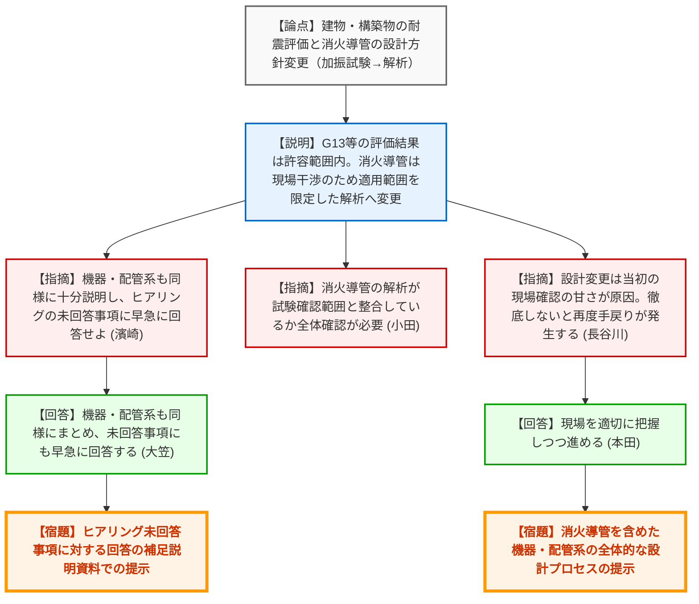
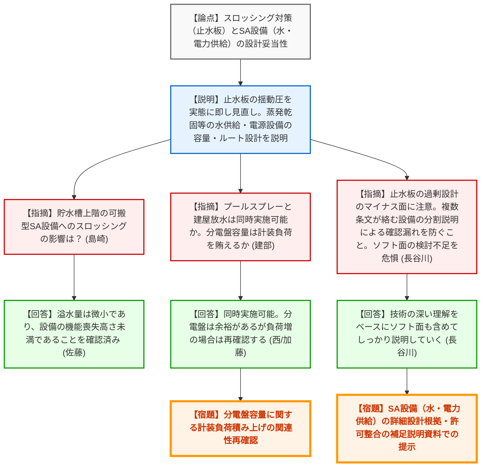
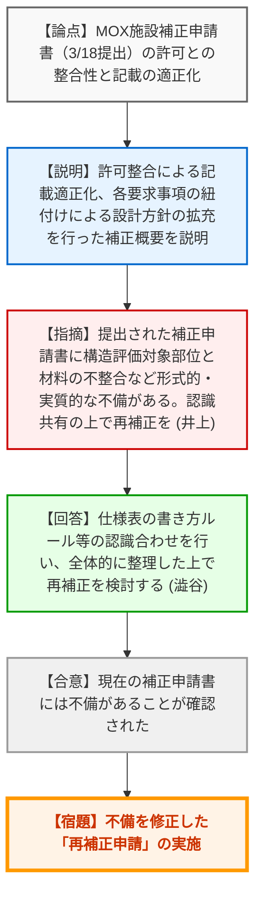
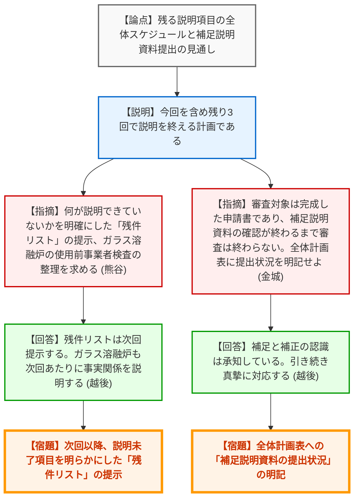

# 第576回核燃料施設等の新規制基準適合性に係る審査会合（令和8年3月27日）
> 出典 : https://youtube.com/live/DjKB9SfVOaE?si=9PkRLDJjA9xkp8b5

## 会合の概要作成
*   **会合全体のハイライト**: 日本原燃の再処理施設等の設工認申請において、消火導管の耐震設計方針変更（加振試験から解析への変更）に伴う現場確認の甘さや、MOX施設の補正申請書における形式的・実質的な記載不備に対し、規制庁から極めて厳しい指摘と再補正の要求がなされたことが最大の争点となりました。
*   **審査の進捗状況**: 建物・構築物の耐震設計プロセスや重大事故等対策の基本方針については概ね説明がなされましたが、それを裏付ける補足説明資料の提出や再補正申請が多数残っており、実質的な審査は継続中です。日本原燃は残り3回程度で全体説明を終える計画を示しましたが、規制庁は「補足説明資料の確認が終わるまで審査は終わらない」と念を押しました。
*   **特筆すべき決定事項**: MOX施設の第3回設工認補正申請について、規制庁との認識共有を図った上で「再補正」を実施することが決定しました。また、今後の全体計画表に「補足説明資料の提出状況」や「残件リスト」を明記することが義務付けられました。
*   **現場の緊張感**: 規制庁側から「当初の設計方針や現場確認が甘かったのではないか」「過剰設計のマイナス面に注意せよ」「事実関係の回答に手間取っている」「申請書に正確でない内容を含む」など、日本原燃の技術的理解度や資料作成の品質に対する根本的な苦言が相次ぎ、非常に高い緊張感が漂う会合となりました。

---

## 議題ごとの詳細整理（テキスト）

**【議題1】耐震設計について**
*   **議論の背景と論点:** 建物・構築物、機器・配管系における耐震評価結果、および消火導管の耐震設計方針の変更（加振試験による手法から、適用範囲を限定した解析手法への変更）の妥当性が論点となった。
*   **質疑応答（詳細）:**
    *   【説明者側】（日本原燃 三上）からの説明
        *   第1保管庫・貯水所、北換気筒、TYK洞道などの建物評価結果が許容範囲内であることを説明。
        *   消火導管について、現場との干渉等で加振試験のパターンが多数となり困難となったため、適用範囲を限定した解析による設計へ方針を変更する。
    *   【規制側】（規制庁 濱崎）の懸念・指摘点
        *   建物・構築物の設計プロセス説明は完了したと理解する。機器・配管系も同様に十分説明すること。また、ヒアリングでの未回答事項に早急に回答せよ。
    *   【説明者側】（日本原燃 大笠）の回答・反論・根拠
        *   機器・配管系も同様にまとめ、未回答事項にも早急に回答する。
    *   【規制側】（規制庁 小田）の懸念・指摘点
        *   消火導管の解析結果が、試験で確認された範囲と整合しているか全体的な確認が必要。残りの代表施設についても提示に向けた準備を求める。
    *   【規制側】（規制庁 長谷川）の懸念・指摘点
        *   消火導管の設計変更は当初の設計方針や現場確認の甘さが原因である。この先も現場確認をしっかりやらないと再度手戻りが発生する。
    *   【説明者側】（日本原燃 本田）の回答・反論・根拠
        *   指摘の通りであり、現場を適切に把握しつつ進める。
*   **結論と宿題事項（アクションアイテム）:**
    *   【宿題】建物・構築物のヒアリング未回答事項に対する回答を早急に補足説明資料で提示すること。
    *   【宿題】機器・配管系について、消火導管の試験・解析範囲の整合性を含め、代表施設の全体的な設計プロセスを提示すること。

**【議題2】耐震設計以外の設計について**
*   **議論の背景と論点:** 燃料貯蔵プール等のスロッシング対策（止水板）、重大事故等対策における屋外からの水供給系統、および電力供給系統の設計の妥当性と実効性が論点となった。
*   **質疑応答（詳細）:**
    *   【説明者側】（日本原燃 佐藤・富永・相馬）からの説明
        *   スロッシングによる溢水量を低減するため止水板を設置する。過剰な設定を見直し実態に即した揺動圧とした。
        *   蒸発乾固やプールへの屋外からの水供給系統（可搬型ポンプ・ホース等）、および電源設備（可搬型発電機・分電盤等）の容量やアクセスルートの設計方針を説明。
    *   【規制側】（規制庁 島崎）の懸念・指摘点
        *   貯水槽の上階に保管する可搬型SA設備へのスロッシングの影響は評価しているか。
    *   【説明者側】（日本原燃 佐藤）の回答・反論・根拠
        *   溢水量は微小（最大0.76m3）であり、設備の機能喪失高さ未満であることを確認済み。
    *   【規制側】（規制庁 建部）の懸念・指摘点
        *   プールスプレーと建屋への放水は同時実施可能か。また、分電盤容量は計装設備の起動容量等を賄えるか。
    *   【説明者側】（日本原燃 西・加藤）の回答・反論・根拠
        *   同時実施可能であり水量に影響はない。分電盤容量は余裕を持たせているが、負荷が増加した場合は再確認して回答する。
    *   【規制側】（規制庁 杉山）の懸念・指摘点
        *   詳細な設計根拠や許可整合を補足説明資料で提示すること。SA設備への燃料補給設備に係る説明準備を進めること。
    *   【規制側】（規制庁 長谷川）の懸念・指摘点
        *   止水板の過剰設計に伴うマイナス面に注意せよ。多数の条文が絡む設備について、分割説明による確認漏れが生じないよう設備ごとの担当を明確にすること。また、ハードだけでなくソフト面（手順や作業員の力量）の検討が不足している危惧がある。
    *   【説明者側】（日本原燃 長谷川）の回答・反論・根拠
        *   技術の深い理解をベースにし、今後の説明においてソフト面も含めてしっかり説明していく。
*   **結論と宿題事項（アクションアイテム）:**
    *   【宿題】水・電力供給系統に関する詳細な設計根拠や許可整合性を整理した補足説明資料を提出すること。
    *   【宿題】分電盤容量に関する計装設備負荷の積み上げの関連性を再確認し回答すること。
    *   【宿題】SA設備への燃料補給設備に関する説明準備、およびソフト面（手順等）の実効性の検討を深めること。

**【議題3】MOX燃料加工施設の第3回設工認補正申請の概要について**
*   **議論の背景と論点:** 3月18日に行われたMOX施設の補正申請書における、許可との整合性や記載の適正化の状況が論点となった。
*   **質疑応答（詳細）:**
    *   【説明者側】（日本原燃 澁谷）からの説明
        *   許可との整合性確保、各要求事項の紐付けによる設計方針の拡充（火災感知器の選定、グローブボックスと同等の閉じ込め機能の分類等）を行った補正申請の概要を説明。
    *   【規制側】（規制庁 井上）の懸念・指摘点
        *   提出された補正申請書に、構造評価対象部位と使用表に記載すべき材料の不整合などの形式的・実質的な不備がある。記載の適正化が不十分であり、当庁と認識を共有した上で再補正を検討すべき。
    *   【説明者側】（日本原燃 澁谷）の回答・反論・根拠
        *   仕様表の書き方ルール等の認識合わせを行い、全体的に再度整理した上で再補正を検討する。
*   **結論と宿題事項（アクションアイテム）:**
    *   【合意】現在の補正申請書には不備があることが確認された。
    *   【宿題】申請書の記載事項の適切性について規制庁と認識共有を図り、不備を修正した「再補正申請」を行うこと。

**【議題4】全体計画について**
*   **議論の背景と論点:** 残る説明項目の全体スケジュールと、補足説明資料の提出・審査完了に向けた見通しが論点となった。
*   **質疑応答（詳細）:**
    *   【説明者側】（日本原燃 長谷川）からの説明
        *   今回を含め残り3回で説明を終える計画である。
    *   【規制側】（規制庁 平山）の懸念・指摘点
        *   資料作成の丁寧さと事実関係への速やかな回答を強く求める。担当外の分野の議論も自身の分野に適用して考えること。
    *   【規制側】（規制庁 熊谷）の懸念・指摘点
        *   何が説明できていないかを明確にした「残件リスト」の提示、耐震計算が仕上がる時期と審査会合の結びつきの説明、およびガラス溶融炉の使用前事業者検査の整理状況の説明を求める。
    *   【説明者側】（日本原燃 越後）の回答・反論・根拠
        *   残件リストは次回提示する。耐震計算は物量が多いが計画的に説明する。ガラス溶融炉についても次回あたりに事実関係を説明する。
    *   【規制側】（規制庁 金城）の懸念・指摘点
        *   審査対象は完成した申請書であり、補足説明資料の確認が終わるまで審査は終わらない。全体計画表に「補足説明資料の提出状況」を明記すること。
    *   【説明者側】（日本原燃 越後）の回答・反論・根拠
        *   補足と補正の認識は承知している。引き続き真摯に対応する。
*   **結論と宿題事項（アクションアイテム）:**
    *   【宿題】次回以降、説明未了項目を明らかにした「残件リスト」を全体計画に添付すること。
    *   【宿題】全体計画表に「補足説明資料の提出済みか否かの状況」を明記すること。
    *   【宿題】ガラス溶融炉の使用前事業者検査について、整理した事実関係を説明すること。

---

## 論理構造の可視化（Mermaid）

### 【議題1】耐震設計について

### 【議題2】耐震設計以外の設計について

### 【議題3】MOX燃料加工施設の第3回設工認補正申請の概要について

### 【議題4】全体計画について

