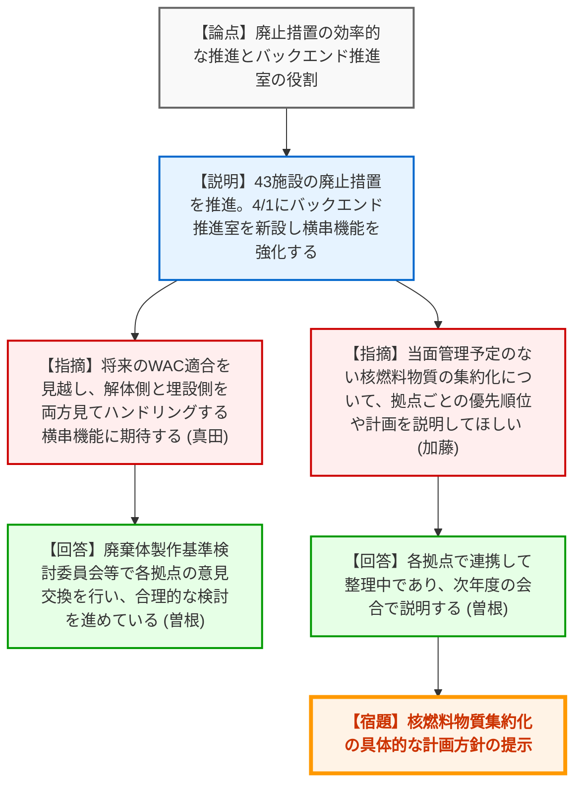
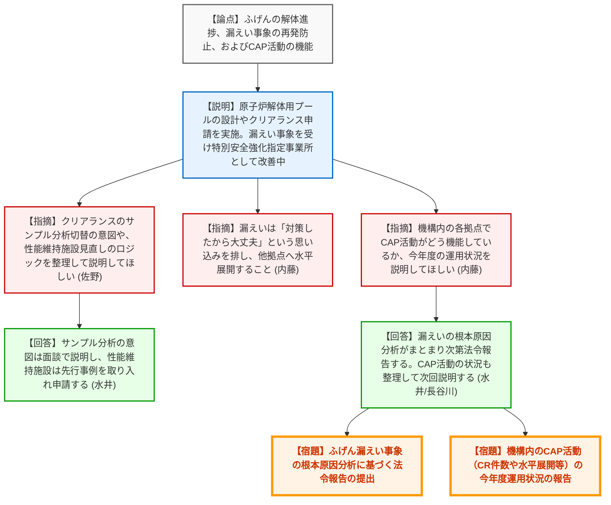
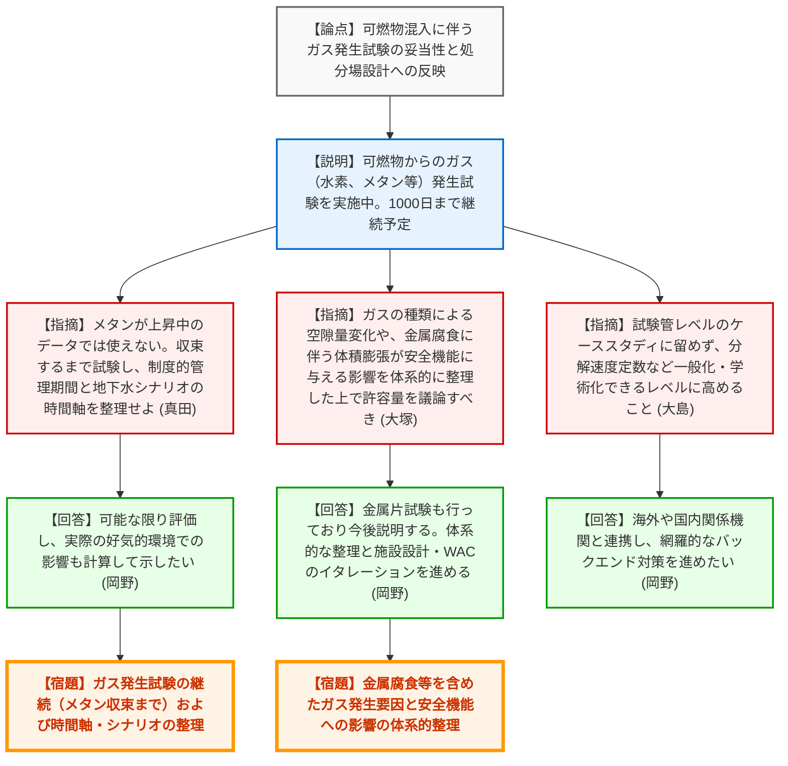

# 第12回原子力機構バックエンド対策監視チーム会合（令和8年3月30日）
> 出典 : https://youtube.com/live/3OK_oo4Acgw?si=G3gUScDlFreDE0Cm

## 会合の概要作成

*   **最大の争点**: 日本原子力研究開発機構（機構）が抱える多種多様な施設における「廃止措置の着実な推進とトラブル防止体制（CAP活動の機能）」、および最終的な処分に向けた「廃棄物対策（ガス発生メカニズム等の科学的評価と廃棄物受入基準の設定）」の進め方が最大の争点となった。
*   **審査の進捗状況**: 機構の組織改正（バックエンド推進室の新設）による横串機能の強化方針が示された。各施設での解体作業は概ね計画通り進んでいるが、ふげん等での漏えいトラブルを重く受け止め、「特別安全強化指定事業所」として根本的な改善活動が行われている。廃棄物対策では、可燃物からのガス発生試験が開始されたものの、規制側からは処分場設計との関係性や、実験の一般化（学術的裏付け）を強く求められる段階にある。
*   **特筆すべき決定事項**: ふげんにおけるトリチウム含有水の漏えい事象について、根本原因分析がまとまり次第、改めて法令報告として提出し、規制庁が精査することが確認された。また、次回以降の会合で、機構内のCAP（是正処置プログラム）の運用状況や核燃料物質の集約化の優先順位について報告することが決定した。
*   **現場の雰囲気・緊張感**: 廃止措置におけるトラブルの頻発に対し、規制側からは「思い込みや常識にとらわれていないか」と厳しい指摘が飛び、安全確保の徹底が強く求められた。廃棄物対策の議論では、規制側が米国EPAの事例や日本原燃の審査実績を引き合いに出し、機構に対し「技術研究集団として、単なるケーススタディではなく学術的に一般化できるレベルにまで内容を高めること」を期待とプレッシャーを込めて要求する場面が見られた。

---

## 議題ごとの詳細整理（テキスト）

**【テーマ1】原子力機構における廃止措置の実施状況（全体・中小施設）**
*   **議論の背景と論点**: 機構内の多数の施設の廃止措置を効率的に進めるため、4月1日の組織改正で「バックエンド推進室」が新設される。限られたリソースの中で、解体技術の横展開や、将来の廃棄物埋設に向けた解体側と埋設側の調整（相互依存性）をどう機能させるかが論点となった。
*   **質疑応答（詳細）**:
    *   【説明者側】（機構：佐藤理事長、曽根）からの説明
        *   89施設のうち43施設の廃止措置を進めている。人形峠の六フッ化ウラン譲渡準備や、FCA、JMTRの燃料搬出準備などが進捗している。再処理特建でのグリーンハウスを用いた排水管撤去など、汚染を広げない工法を実施中。
    *   【規制側】（規制庁：真田）の懸念・指摘点
        *   新設されるバックエンド推進室には、解体側と埋設側を両方見て、将来のWAC（廃棄物受入基準）に適合するようハンドリングする「横串機能」を期待する。
    *   【説明者側】（機構：曽根）の回答・反論・根拠
        *   埋設との連携は重要と認識しており、廃棄体製作基準検討委員会等を用いて各拠点の要求が合理的になるよう検討を進めている。
    *   【規制側】（規制庁：加藤）の懸念・指摘点
        *   当面の管理が予定されていない核燃料物質の集約化について、次回の会合で拠点ごとの具体的な優先順位や計画方針を説明してほしい。
    *   【説明者側】（機構：曽根）の回答・反論・根拠
        *   現在各拠点で連携して整理中であり、次年度の会合で説明できるよう準備する。

**【テーマ2】ふげんの廃止措置の実施状況**
*   **議論の背景と論点**: ふげんの原子炉周辺設備の解体状況、クリアランス申請、使用済燃料搬出計画の進捗報告。併せて、12月に発生したホットカラム室でのトリチウム含有水漏えい事象の根本原因と再発防止策、および機構全体の安全文化（CAP活動）の状況が問われた。
*   **質疑応答（詳細）**:
    *   【説明者側】（機構：水井）からの説明
        *   原子炉解体に向けて、水中でレーザー切断等を行う解体用プールの設計を進めている。クリアランス第2期の申請を実施した。
        *   漏えい事象は、対象外と思い込んでいた隔離弁上流側に水が残存していたことが原因。ふげん及び原科研を「特別安全強化指定事業所」に指定し、組織的な背景要因の分析と改善を進めている。
    *   【規制側】（規制庁：佐野）の懸念・指摘点
        *   クリアランス申請について、全数測定からサンプル分析に切り替えた意図や、対象物の汚染メカニズムの違い等を審査で確認する。
        *   廃止措置の進捗に応じた「性能維持施設の見直し」について、先行するもんじゅ等のロジックを参考にして申請してほしい。
    *   【規制側】（規制庁：山口、内藤）の懸念・指摘点
        *   漏えい事象は被ばくに至らなかったが、現場が変化する廃止措置では汚染への注意が重要。「対策をとったから大丈夫」という思い込みを排し、他拠点へ水平展開すること。
        *   機構内の各拠点でCAP活動がどう機能しているか、次回の会合で運用状況を説明してほしい。
    *   【説明者側】（機構：水井、長谷川）の回答・反論・根拠
        *   今回のトラブルを学びに生かし、根本原因分析がまとまり次第、法令報告として提出する。CAP活動の状況も整理して次回説明する。

**【テーマ3】原子力機構の廃棄物対策について**
*   **議論の背景と論点**: 分別処理の合理化を目的とした、廃棄体中の「可燃物からのガス発生に関する試験」の進捗が報告された。この試験結果を、最終的な処分場設計や地下水シナリオにどう反映させるか、体系的な整理と学術的裏付けが求められた。
*   **質疑応答（詳細）**:
    *   【説明者側】（機構：岡野）からの説明
        *   紙ウエス等の可燃物を水に浸してガス発生を測定。水素が発生し、その後メタンが増加する傾向を確認した。
    *   【規制側】（規制庁：真田）の懸念・指摘点
        *   メタンが上昇し続けている段階では評価に使えない。減少してゼロになるまで試験を継続すべき。また、制度的管理期間中にガス発生が終わるのか否かで、基準適合性の説明（地下水シナリオでガスとの二相流を考慮するか等）が変わるため、時間軸を整理してほしい。
    *   【説明者側】（機構：岡野）の回答・反論・根拠
        *   1000日以降はサンプル数のやりくり等で可能な限り評価する。実際の埋設環境は好気的で分解は進行しないと考えているが、データをもって計算してお示ししたい。
    *   【規制側】（規制庁：大塚）の懸念・指摘点
        *   ガスの種類により有機物の減少量（空隙の発生）が変わる。また、金属の嫌気性腐食に伴うガス発生や体積膨張が覆土に与える影響も考慮すべき。これらを体系的に整理した上で持ち込み量（WAC）を議論すべき。
    *   【規制側】（規制庁：大島部長）の懸念・指摘点
        *   研究所の廃棄物は考慮事項が多岐にわたるため、海外（韓国KORAD等）との情報共有を積極的に行うべき。
        *   今回の試験管レベルの試験だけではケーススタディに過ぎない。分解速度定数など一般論化できるレベルまで学術的な中身を高め、論文等にしてほしい。技術研究集団として期待している。
    *   【説明者側】（機構：岡野）の回答・反論・根拠
        *   金属片を入れた試験も行っており今後説明する。海外や国内関係機関と連携し、オールジャパンで網羅的なバックエンド対策を機構のリーダーシップで進めたい。

---

## 論理構造の可視化（Mermaid）

### ブロック1: 原子力機構における廃止措置の実施状況（全体・中小施設）

### ブロック2: ふげんの廃止措置の実施状況

### ブロック3: 原子力機構の廃棄物対策について

