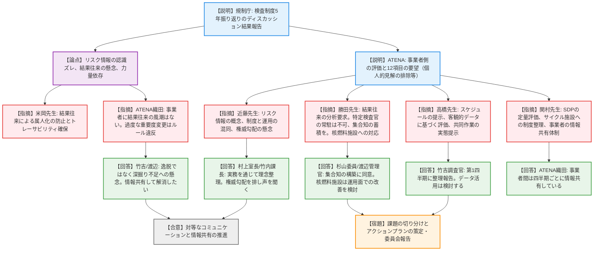
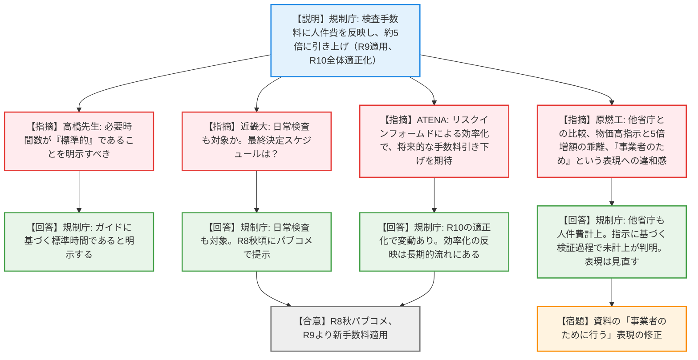
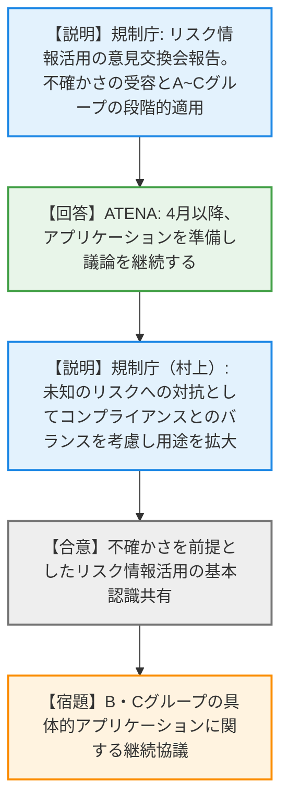
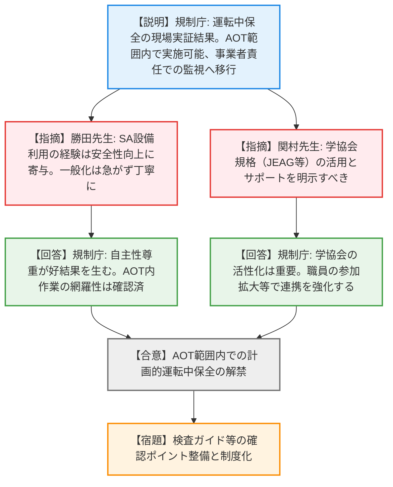
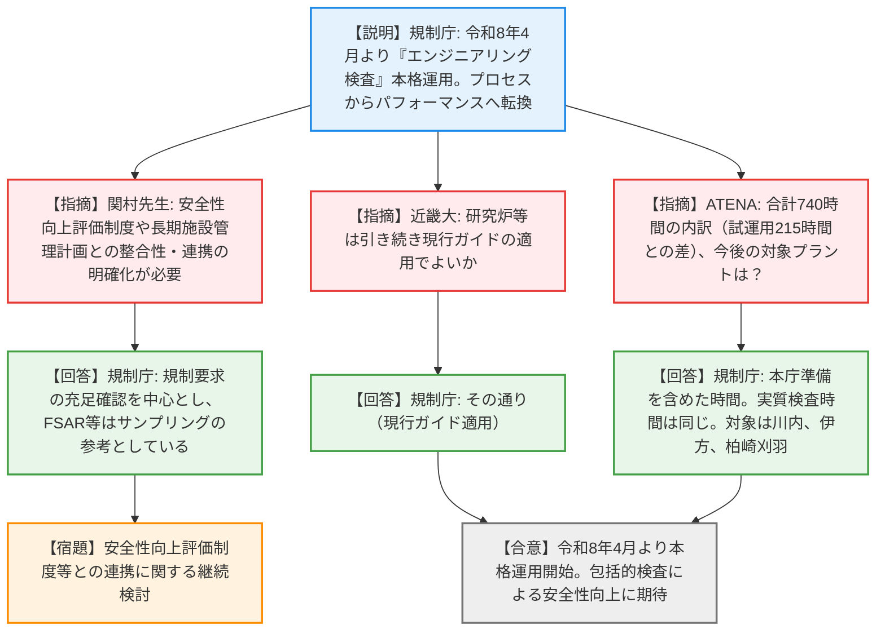

# 第19回検査制度に関する意見交換会合（令和8年3月30日）
> 出典 : https://youtube.com/live/QeJCQ9Pmn18?si=UcqSGv_KrUj60zVb

# 会合の概要
* **検査制度5年の総括と課題の顕在化:** 新検査制度（RIDM、フリーアクセス等）はおおむね定着し、技術的議論の深まりなどのメリットが評価される一方で、規制・事業者双方から「結果オーライ（ルール違反が軽視される懸念）」や「検査官の力量依存」などの課題が呈示され、双方が認識のすり合わせを行う緊迫した場面が見られた。
* **検査手数料の大幅な値上げと事業者の懸念:** 物価高・人件費高騰を背景に、これまで未計上だった「人件費」を転嫁する形で実用炉の検査手数料を約5倍（約2700万円）に引き上げる方針が提示された。事業者側からは委員長指示の真意や他省庁の事例を問うなど、強い緊張感を伴う質疑が行われた。
* **「運転中保全」の本格解禁とパフォーマンス重視への転換:** 従来、原則禁止されていた計画的な「運転中保全（オンラインメンテナンス）」について、AOT（許容運転待機時間）の範囲内での実施を許容する方針が了承された。また、設工認対象設備もリスクベースで検査対象とする「エンジニアリング検査」の本格運用（令和8年4月〜）も決定し、プロセス重視からパフォーマンス重視（機能維持の確認）への大きな制度転換が合意された。
* **「権威勾配」の打破と対等なコミュニケーションの模索:** 有識者から「権威勾配（規制側と事業者の立場の非対称性）」によるコミュニケーション不全の指摘があり、規制庁幹部が「間違っていると思ったら所長や本庁へ直接言ってほしい」と強く呼びかけるなど、対等な関係構築への強い意志が示された。

---

# 議題ごとの詳細整理（テキスト）

## 【議題1】原子力規制検査制度の鍵となる要素に係る取組状況の検証について
* **議論の背景と論点:** 新検査制度導入から5年（実質6年目）が経過し、当初目指した「リスクインフォームド」「パフォーマンスベースド」が定着しているかを検証。規制側からは「結果オーライ」への懸念や力量依存、事業者からは「特定の検査官の個人的見解による対応要求」や「手続きの不一致」が論点となった。
* **質疑応答（詳細）:**
  * 【規制庁 竹吉調査官】検査官アンケートに基づき、リスクインフォームド検査における「認識のズレ」や「実用炉以外への適用困難性」、パフォーマンスベースド検査における「結果オーライの懸念（ルール違反の不問化）」、安全重要度評価の「判断基準の曖昧さ」を課題として抽出したと説明。
  * 【ATENA 織田氏】事業者側の実務者アンケート結果を報告。制度には概ね満足しているが、課題として「特定検査官の個人的見解による要求」「チーム検査途中の交代」「フリーアクセスの趣旨を外れた事務局への直接問い合わせ」等を指摘し、改善要望12項目を提示。
  * 【外部有識者 近藤先生】「リスク情報活用」という言葉が補足的な印象を与える点、制度運用と設計上の課題が混同されている点、そして「権威勾配」に起因するコミュニケーション不全の懸念を指摘。
  * 【規制側 村上室長/竹内課長】リスク情報の扱いは実務を重ねて理念を整理していくと回答。権威勾配については、現場の声を拾い対等な関係構築に努めると強調。
  * 【外部有識者 勝田先生】「結果オーライ」はルール違反の理由理解不足が原因であり分析を要請。特定検査官の常駐要望には緊張感低下の懸念を示し、検査官の「集合知（経験共有）」による解決を提示。また、核燃料サイクル施設への適用方針の検討を求めた。
  * 【規制側 杉山委員/渡辺管理官】集合知の構築に同意。核燃料施設への適用はNRCを参考にしにくいが、運用面でのグレードアプローチを検討すると回答。
  * 【外部有識者 高橋先生】今後のスケジュール提示、客観的データ（経験年数、研修回数等）に基づく評価、チーム検査以外での共同作業による経験共有の実態提示を求めた。
  * 【規制側 竹吉調査官】第1四半期中に整理し報告する。客観的データは何が使えるか検討すると回答。
  * 【外部有識者 米岡先生】結果オーライの思想が強まると属人化が進むため、トレーサビリティの観点から適正な範囲にとどめるべきと指摘。
  * 【外部有識者 関村先生】基本検査と特別検査の切り分け、SDP実績（緑、白等の件数）の定量評価、サイクル施設適用の制度整理を要求。事業者に対しても全社的な情報共有体制を求めた。
  * 【ATENA 織田氏/片岡氏】事業者間では四半期ごとに情報共有・分析を実施していると回答。一方、規制庁が指摘した「事業者に結果オーライの風潮がある」との点には反発し、「法令遵守による過度な重要度変更があったならルールに従ってほしい」と指摘。
  * 【規制側 竹吉調査官/渡辺管理官】結果オーライについてはルールの逸脱ではなく「深掘りや改善意欲に至っていない懸念」であるとトーンを和らげ、情報共有の場を設けて解消すると回答。
* **結論と宿題事項（アクションアイテム）:**
  * 抽出された課題について、運用上の問題か制度上の問題かを切り分け、優先順位をつけた「アクションプラン」を策定し、規制委員会へ報告する（宿題）。
  * 検査官個人の力量に依存しない「集合知」の蓄積と共有の仕組みを構築する（宿題）。
  * 事業者から出た不満（個人的見解の押し付け等）については、所長・本庁ルートを活用した率直な対話を推進する（合意）。

## 【議題2】原子力規制検査手数料の見直しについて
* **議論の背景と論点:** 物価高や人件費高騰を理由とする山中委員長の指示により手数料を検証した結果、現行の検査手数料には「人件費」が含まれていなかったことが判明。これを転嫁するための大幅な値上げ案（実用炉で約5倍）が提示された。
* **質疑応答（詳細）:**
  * 【規制庁 大森】検査は国が行う公の役務であるため人件費を計上する。令和9年4月に実用炉で約4.9倍（約2700万円）へ引き上げ、令和10年4月に審査・検査全体の手数料適正化を行うと説明。
  * 【外部有識者 高橋先生】計算根拠の「必要時間数」は「標準的」であることを明示すべきと指摘。
  * 【規制庁 大森】検査ガイドに基づく標準時間であることを明示すると回答。
  * 【事業者（近畿大） 杉山氏】日常検査も対象か。またスケジュール感を確認。
  * 【規制庁 大森】日常検査も対象。令和8年秋頃のパブコメで具体額を提示すると回答。
  * 【ATENA 織田氏/片岡氏】令和10年の適正化で再見直しはあるか確認。また、リスクインフォームド化で検査効率が上がり、業務量が減って手数料が下がることを期待すると指摘。
  * 【規制庁 大森】令和10年にも変動の可能性がある。効率化による反映も長期的な流れとしてあると回答。
  * 【事業者（原燃工） 黒石氏】他省庁の検査でも人件費は徴収されているか。また「物価高（10%増）」という委員長指示に対し「5倍増額（別物）」となるのは真意通りか。さらに「事業者のために行う役務」という表現は「国のため」ではないかと違和感を表明。
  * 【規制庁 大森】他省庁の法定確認でも人件費は計上されている。委員長の全体見直し指示の過程で人件費未反映が判明し是正した。「事業者のため」という表現は「事業者に対する検査」という趣旨であり、資料の書きぶりは検討すると回答。
* **結論と宿題事項（アクションアイテム）:**
  * 令和8年秋にパブリックコメントを実施し、令和9年4月より人件費を含めた新検査手数料（第一段階）を適用する（合意）。
  * 資料中の「事業者のために行う」という表現の適切性を見直す（宿題）。

## 【議題3】「リスク情報活用に関する事業者との実務レベルの技術的意見交換会」における議論の状況
* **議論の背景と論点:** リスク情報を実務でどのように使うか、規制と産業界で4回にわたり意見交換を実施。PRAモデルの不確かさの受容と、段階的な適用（難易度別のアプリケーション選定）が論点。
* **質疑応答（詳細）:**
  * 【規制庁 深原幹事官】不確かさの幅を含めてリスクを見ること、PRAモデルは発展途上でも使いながら高度化する基本スタンスで認識が一致した。難易度に応じA〜Cグループに分け検討すると説明。
  * 【ATENA 飯野氏】4月以降、アプリケーションを準備しじっくり議論したいと回答。
  * 【規制庁 村上室長】PRAのモデル外の未知のリスクに対抗するツールとしてコンプライアンス（ルール遵守）を見るというバランス論を提示し、用途を広げていくと補足。
* **結論と宿題事項（アクションアイテム）:**
  * 不確かさを前提としたリスク情報の活用について、基本認識の共有が図られた（合意）。
  * 難易度B・Cグループの具体的アプリケーションについて、引き続き実務レベルの意見交換会で検討を深める（宿題）。

## 【議題4】運転中保全に係る現場実証等の報告及び今後の対応
* **議論の背景と論点:** 従来、原則禁止されていた計画的な「運転中保全（オンラインメンテナンス）」について、3回の現場実証を経て、AOT（許容運転待機時間）の範囲内での実施可否と規制のあり方を検証。
* **質疑応答（詳細）:**
  * 【規制庁 田辺係長】実証の結果、AOT範囲内であればリスク上昇を回避しつつ実施可能であり、人材確保や作業環境改善のメリットも確認。規制庁が制限するのではなく、事業者の自主的責任のもとパフォーマンスベースで監視する方針と説明。
  * 【外部有識者 勝田先生】SA（シビアアクシデント）設備を実際に準備・利用する経験が安全性向上に大きく寄与したと評価。一方で、実証が3プラントのみであるため、一般化を急がず丁寧に制度化すべきと指摘。
  * 【規制庁 村上室長】SA設備の活用は現場からも好評であり、事業者の一義的責任に委ねる方が良い結果を生むと実感。AOT範囲内での作業レベルは他プラントでも大差ないと網羅性を確認済みと回答。
  * 【外部有識者 関村先生】学協会規格（JEAG等）が運転中保全をサポートしている事実を明確にすべき。事業者が自主的に規格を活用する体制の構築を評価。
  * 【規制庁 村上室長】学協会の活性化は技術向上に不可欠であり、規制庁職員の参加範囲も拡大して連携を強化していると回答。
* **結論と宿題事項（アクションアイテム）:**
  * 現行の保安規定（AOT）の範囲内での計画的な運転中保全を解禁・容認する（合意）。
  * 現場実証の知見を踏まえ、検査ガイド等で示すべき確認ポイントなど、制度面の整備を進める（宿題）。

## 【議題5】エンジニアリング検査の本運用開始について
* **議論の背景と論点:** 従来の設計管理検査は「手順を守っているか（プロセス）」に偏重し、設工認対象設備が除外されていた。これをNRCのSETIを参考に、PRAでリスクの高い設備を選定し、機能が維持されているか（パフォーマンス）を確認する「エンジニアリング検査」へと改組。
* **質疑応答（詳細）:**
  * 【規制庁 水戸係長】令和8年4月より実用炉を対象に本格運用開始。日常とチームに分かれていた検査をチーム検査（3年ごと）に一本化。核燃料施設には引き続き旧ガイドを適用すると説明。
  * 【外部有識者 関村先生】安全性向上評価制度や長期施設管理計画（40年目特別点検等）との整合性・連携をどう検討したか。NRCのような制度的明確化が必要と指摘。
  * 【規制庁 水戸係長】検査は「規制要求を満たしているか」を中心に確認しており、FSAR等はサンプリングの参考としていると回答。
  * 【事業者（近畿大） 杉山氏】研究炉等は引き続き現行ガイド（BM10100）適用でよいか確認。
  * 【規制庁 水戸係長】その通りと回答。
  * 【ATENA 織田氏】ガイドの合計740時間は、試運用の215時間とどう違うか。準備時間を含んだだけか。
  * 【規制庁 水戸係長】本庁での事前準備時間を含めたものであり、実質的な検査時間は試運用と変わらないと回答。
  * 【規制庁 上田氏】今年度は川内原発（第1四半期）、来年度は伊方、柏崎刈羽を対象とすると補足。
  * 【ATENA 片岡氏】設計から運用までの包括的な検査により新たな気づきが期待できる。本格運用後も意見交換を継続してほしいと要望。
* **結論と宿題事項（アクションアイテム）:**
  * 令和8年4月1日より、実用炉を対象とした「エンジニアリング検査」の本格運用を開始する（合意）。
  * 安全性向上評価制度や長期施設管理計画との連携・整合性について、今後の運用実績を見ながら引き続き検討する（宿題）。

---

# 論理構造の可視化（Mermaid）

### 【議題1】原子力規制検査制度の鍵となる要素に係る取組状況の検証について

### 【議題2】原子力規制検査手数料の見直しについて

### 【議題3】「リスク情報活用に関する事業者との実務レベルの技術的意見交換会」における議論の状況

### 【議題4】運転中保全に係る現場実証等の報告及び今後の対応

### 【議題5】エンジニアリング検査の本運用開始について

