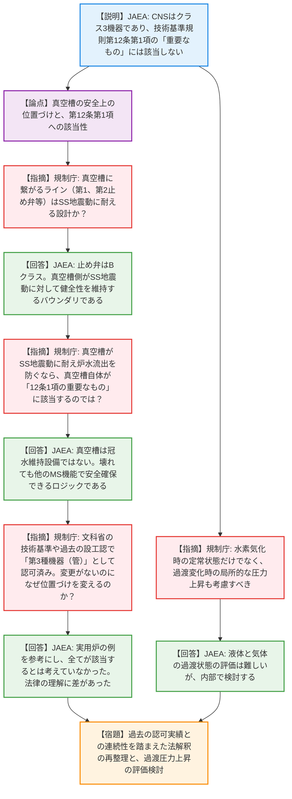
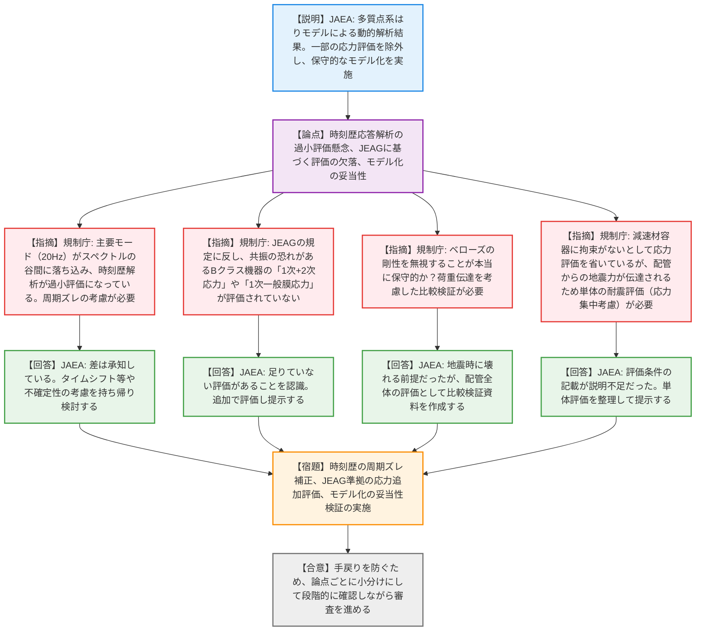

# 第577回核燃料施設等の新規制基準適合性に係る審査会合（令和8年3月31日）
> 出典 : https://youtube.com/live/ChCBUSJigUI?si=GCt-OJBqNKJAgHOj

# 会合の概要
* **法解釈と安全上の位置づけを巡る根本的な認識の相違:** JRR-3の冷中性子源装置（CNS）の更新において、JAEA側が「真空槽は安全確保上で重要な設備（第12条第1項）には該当しない」と主張したのに対し、規制側は文科省時代の構造等技術基準や過去の設工認実績（第3種機器としての認可）を盾に強く反論。JAEA側に法解釈とロジックの抜本的な見直しを迫る緊迫した議論となった。
* **耐震評価手法の妥当性に対する厳しい追及:** 時刻歴応答解析において、主要モードの固有周期が応答スペクトルの谷間（約0.05秒）に落ち込み、過小評価になっている疑いが浮上。規制側からJEAG等に基づく補正（タイムシフト等）や地盤剛性の不確定性の考慮を強く求められた。
* **共振機器の評価漏れとモデル化の不備の発覚:** Bクラス機器であるにもかかわらず「1次+2次応力」等の評価が省略されている点や、減速材容器の拘束を無視した評価、ベローズの剛性を無視したモデル化に対し、規制側が「保守的とは言えない」と一蹴。JAEA側は再評価と追加資料の提出を余儀なくされた。
* **審査の進捗と今後の進め方の是正:** JAEA側は夏頃の認可を希望していたが、規制側は現状の説明レベルに全く納得しておらず、手戻りを防ぐために「論点を小分けにして、間隔を空けずに段階的に確認しながら進めること」を強く要求し、審査の軌道修正が図られた。

---

# 議題ごとの詳細整理（テキスト）

## 【議題】日本原子力研究開発機構原子力科学研究所の原子炉施設（JRR-3原子炉施設）の変更に係る設計及び工事の計画の認可申請の審査について

### トピック1：CNSの機能喪失時の影響と機器の重要度分類（技術基準規則第12条関係）
* **議論の背景と論点:** JAEAはCNSを更新するにあたり、同設備は原子炉の安全確保（止める・冷やす・閉じ込める）に必須ではないとしてクラス3機器に分類し、技術基準規則第12条第1項の「安全性を確保する上で重要なもの」には該当しないと説明。これに対し、規制庁は真空槽が果たすバウンダリ機能の重要性と過去の認可実績から、その位置づけと法解釈の妥当性を問いただした。
* **質疑応答（詳細）:**
  * 【説明者側（JAEA 徳永・川村）】からの説明
    CNSの異常が原子炉へ与える影響はない。真空槽は二重機密構造であり、真空槽側で破断が生じない限り炉水の吸い上げはない。真空槽側がSS地震動に対して健全性を維持する設計（BクラスだがSS機能維持）としている。
  * 【規制側（規制庁 伊藤・加藤・新井）】の懸念・指摘点
    真空槽がSSに耐え、炉水の流出を防ぐのであれば、真空槽自体が「原子炉の安全性を確保する上で重要なもの（12条1項）」に該当するのではないか。文科省の構造等技術基準（平成15年）では炉内構造物は「第3種機器」と明記されており、過去（平成16年）の設工認でも第3種管として認可されている。変更がないのになぜ位置づけが変わるのか。
  * 【説明者側（JAEA 木梨・川村）】の回答・反論・根拠
    実用炉の例を参考にすると、設計基準対象施設の中で重要なものが12条1項に該当すると考えており、第3種・第4種機器がすべて該当するとは考えていない。万一壊れたとしても、サイフォンブレーク弁などの他のMS機能によって安全が確保されるロジックである。
  * それに対する再反論や確認事項
    【規制庁 加藤・管理官】実用炉の例ではなく試験研究炉の基準に従うべき。真空槽をしっかり守る設計が本来の考え方である。従来第3種としていたものを違うと言うなら、明確な論理が必要である。
    【規制庁 篠岡】水素気化時の圧力上昇について、定常状態だけでなく過渡変化時の局所的な圧力上昇も考慮すべきではないか。
    【JAEA 川村】法律規則の理解に差があった。3種管相当で評価しているが説明が不十分だった。過渡状態の評価も含め、全体を整理し直す。

### トピック2：クライオスタットの耐震評価手法とモデル化（技術基準規則第6条関係）
* **議論の背景と論点:** クライオスタット（Bクラス・上位波及考慮）の耐震評価において、時刻歴応答解析における固有周期のズレによる過小評価の懸念、およびJEAGに則らない評価の省略（応力評価の除外、モデル化の簡略化）が露呈し、評価の妥当性が厳しく問われた。
* **質疑応答（詳細）:**
  * 【説明者側（JAEA 菊地）】からの説明
    多質点系はりモデルを用い、固有振動数50Hzを基準に動的解析（時刻歴応答解析およびスペクトルモーダル解析）を実施した。1次+2次応力の裕度は1.43。ベローズの伸縮継手の剛性を考慮せず、減速材容器は拘束がないため管の一部として扱うことで保守的にモデル化した。
  * 【規制側（規制庁 小森・加藤）】の懸念・指摘点
    主要モード（20Hz / 0.05秒）が床応答スペクトル（FRS）の谷間に入っており、拡幅を考慮したスペクトルモーダル（約2000Gal）に対して時刻歴（約1400Gal）が大幅に小さくなっている。周期のズレを考慮しないと過小評価になる。また、共振の恐れがあるBクラス機器なのに、JEAGで求められる「1次+2次応力」や「1次一般膜応力」の評価が除外されているのはなぜか。ベローズの剛性無視や減速材容器の単体評価の欠如も保守的とは言えない。
  * 【説明者側（JAEA 川村・菊地）】の回答・反論・根拠
    時刻歴解析で差が出ていることは認識している。ベローズは地震時に壊れるものとし、減速材容器は支持点がないため管の一部として評価した。
  * それに対する再反論や確認事項
    【規制庁 小森・加藤】時刻歴を使うならJEAGのタイムシフト等の補正を検討すべき。剛性があれば荷重伝達されるため、ベローズでモデルを切ることが保守的とは限らない。減速材容器も配管を介して地震力を受けるため、接続部の応力集中を考慮した単体の耐震評価を示すべき。
    【JAEA 川村・菊地】足りていない評価があることを認識した。不確定性の考慮、除外した応力評価の追加、モデル化の妥当性について再検討し提示する。

* **結論と宿題事項（アクションアイテム）:**
  * **【宿題】12条関係:** 真空槽および配管の安全上の位置づけ（第3種機器としての取り扱い）と、技術基準規則第12条第1項への該当性について、過去の設工認からの連続性を踏まえて法解釈と防護のロジックを抜本的に再整理する。また、水素気化時の過渡的な局所圧力上昇の評価を検討する。
  * **【宿題】6条関係（耐震評価）:** 
    1. 時刻歴応答解析における固有周期のズレ（スペクトルの谷間落ち込み）を補正するため、タイムシフト等の適用や地盤剛性のばらつきの考慮を実施する。
    2. JEAGに従い、共振の恐れがあるBクラス機器の「1次+2次応力」「1次一般膜応力」を追加評価し提示する（強制変位の入力も反映する）。
    3. ベローズの剛性を無視したモデル化が真に保守的であるかの比較検証資料を作成する。
    4. 減速材容器単体の耐震評価（管との接続部の応力集中等の考慮）を追加実施し提示する。
  * **【合意】今後の進め方:** 大量の宿題事項を一度にまとめて提出するのではなく、手戻りを防ぐために論点ごとに小分けにし、短い間隔で規制庁と認識をすり合わせながら審査を進める。

---

# 論理構造の可視化（Mermaid）

以下に、トピックごとの議論のフローをMermaid形式で示します。

### 【議題】トピック1：CNSの機能喪失時の影響と機器の重要度分類（第12条関係）

### 【議題】トピック2：クライオスタットの耐震評価手法とモデル化（第6条関係）

