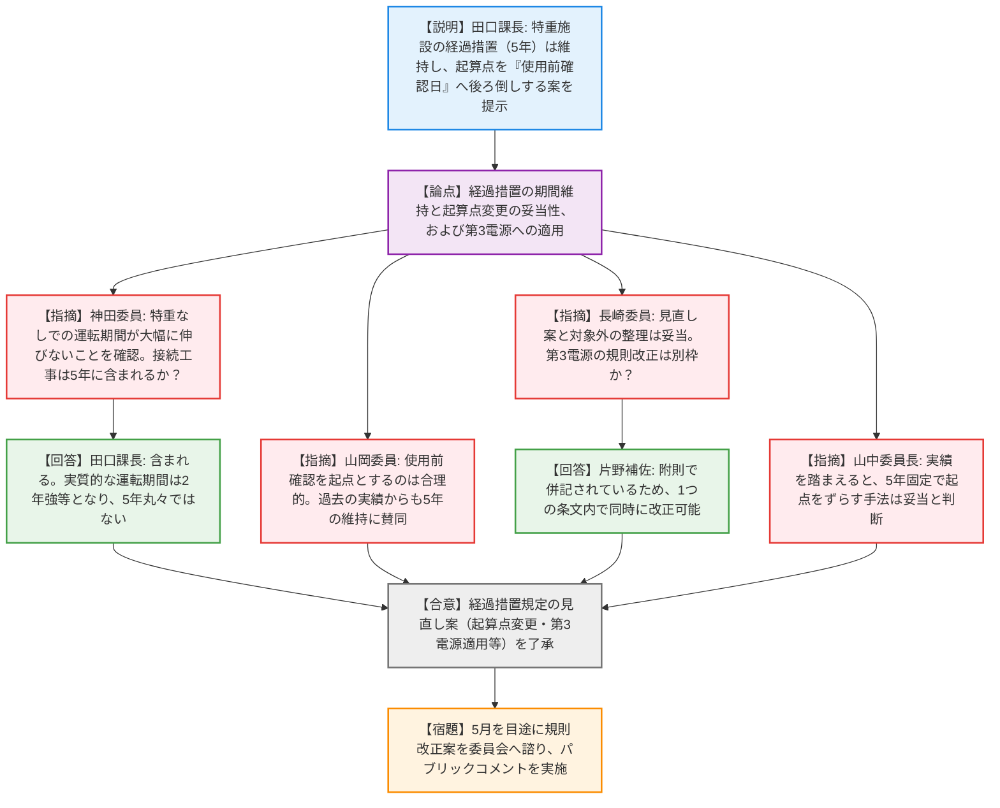
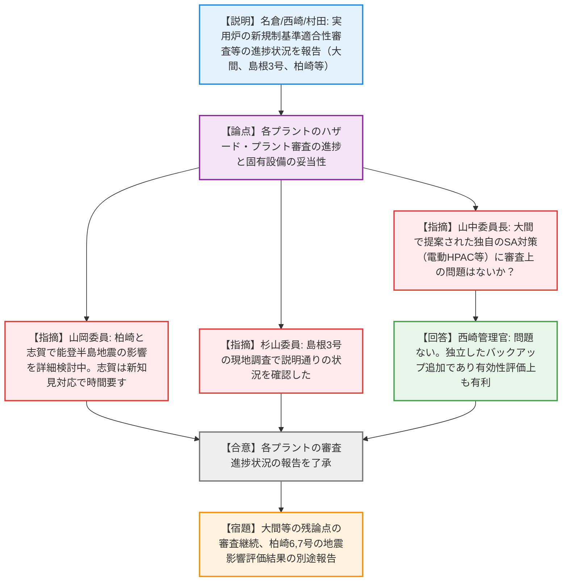
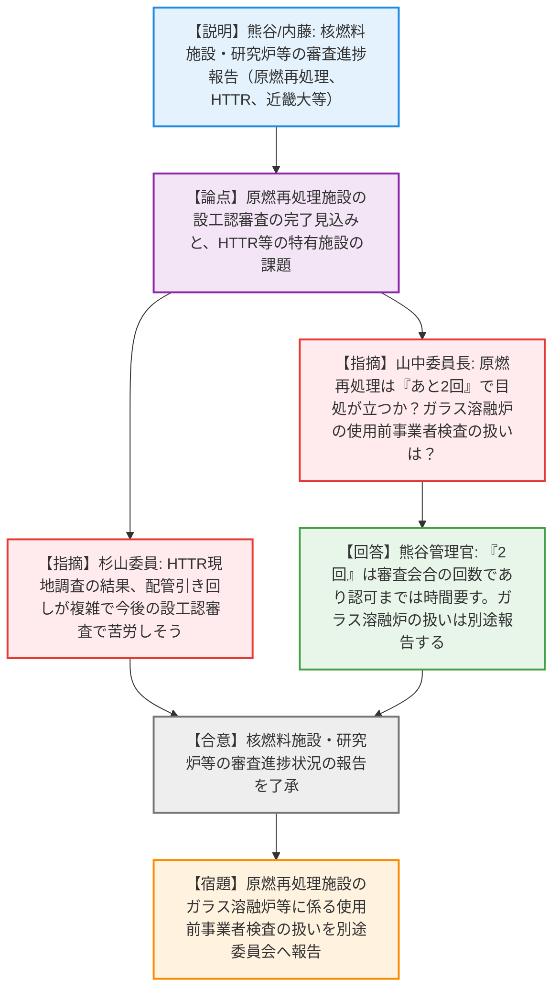
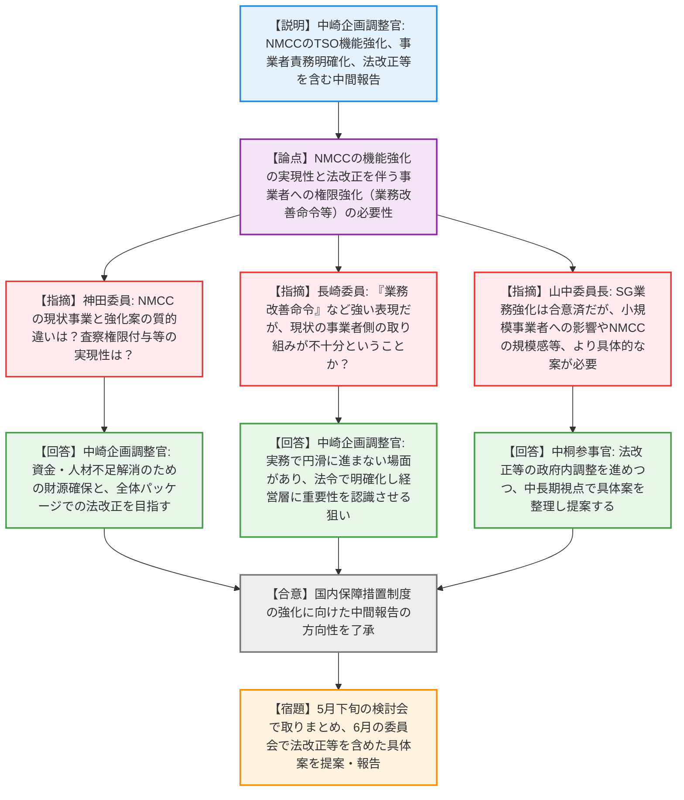
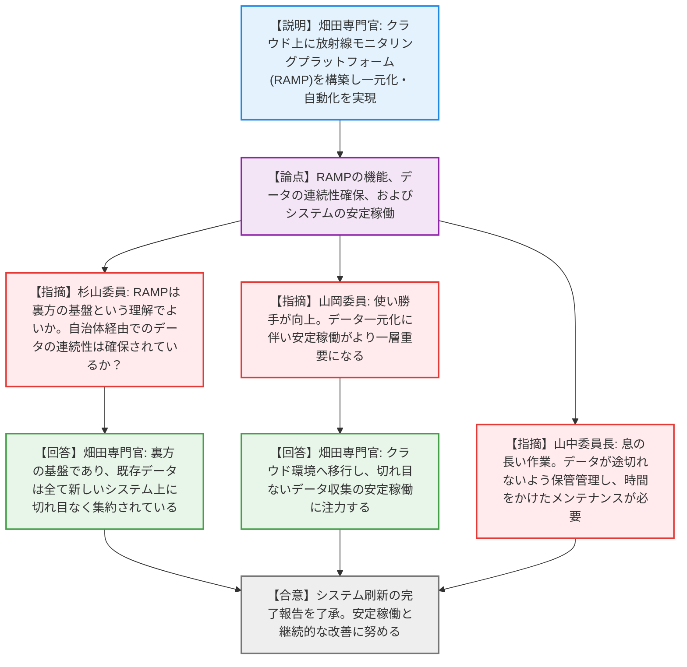

# 第1回原子力規制委員会（令和8年4月1日）
> 出典 : https://youtube.com/live/jZ2x5a9M5cY?si=Z6yNIyx_nQEubQdl

# 会合の概要
* **特重施設の経過措置期間の適正化：** 特定重大事故等対処施設の設置に係る経過措置（5年）について、過去の実績（平均5.5年以上）を踏まえ、期間の起算点を「設工認認可日」から「本体施設の使用前確認日」へ後ろ倒しする見直し案が提示・了承された。これにより、実態に即した合理的な規制への改善が図られる。
* **新規制基準適合性審査等の着実な進展と課題：** 実用炉では大間等の審査が進捗する一方、中部電力浜岡における基準地震動算定の不正事案による影響（島根等の他プラントの自主的対応を含む）が確認された。核燃料施設では原燃再処理施設の膨大な設工認審査が佳境を迎えつつあり、研究炉ではHTTRの熱利用など新規性の高い審査において、規制側・事業者側の円滑なコミュニケーションの重要性が再確認された。
* **国内保障措置制度の抜本的強化に向けた布石：** 人材・財源不足やIAEA対応の質向上といった課題に対し、核物質管理センター（NMCC）のTSO機能強化や事業者の責務明確化（業務改善命令の導入等）を図る方針が示された。委員長からは、法改正を伴う本件について、小規模事業者への影響も考慮した国全体のシステムとしての具体案提示が強く求められた。
* **環境放射線モニタリングのクラウド一元化：** コスト削減と利便性向上を目的とした「放射線モニタリングプラットフォーム（RAMP）」の構築が完了し、国や自治体、他省庁のデータがシームレスに集約される環境が整ったことが報告され、今後の継続的な安定稼働への期待が示された。

---

# 議題ごとの詳細整理（テキスト）

## 【議題1】特定重大事故等対処施設等設置の経過措置に係る検討（その３）
* **議論の背景と論点:** 特重施設の設置には5年の経過措置が設けられているが、実績としてほとんどのプラントで期間を超過している。規制の継続的改善の観点から、期間を維持した上で起算点を見直す案の妥当性が論点となった。
* **質疑応答（詳細）:**
  * 【説明者側】田口課長：経過措置5年は一般的な期間として維持し、起算点を「本体施設の設計の日（設工認認可日）」から「本体施設の使用前確認日」に変更する案を提示。これにより特重未完成での運転期間は大幅に増えず、安全上のリスクも上がらないと説明。第3電源も同様の扱いとし、既存の経過措置満了施設は対象外とする。
  * 【規制側】神田委員：現行規定と比べて特重なしでの運転期間が大幅に伸びるわけではないことを確認。本体との接続工事は5年の期間内に含まれるか。
  * 【説明者側】田口課長：5年の間に含まれる。女川2号機の例のように、実際の運転期間は2年強で次の定検時に接続工事が発生する見込みであり、実質的に5年丸々運転するわけではない。
  * 【規制側】山岡委員：起算点を使用前確認とするのは直接的な評価ができ合理的。過去の事例からも4年半〜5年での完成が多く、5年の維持に賛同する。
  * 【規制側】長崎委員：見直し案と適用範囲（満了施設を対象外とすること）、および第3電源への適用は妥当である。第3電源の規則改正は別に行うのか。
  * 【説明者側】片野補佐：附則の中で特重と第3電源が併記されているため、1つの条文の改正で対応可能である。
  * 【規制側】山中委員長：12基中11基が期限を守れなかった実績を踏まえると、5年を固定し起点をずらす改善手法は妥当である。
* **結論と宿題事項（アクションアイテム）:**
  * 提示された経過措置規定の見直し案（起算点の使用前確認日への変更、第3電源への適用等）を了承（合意）。
  * 5月中を目途に規則改正案を作成して委員会に諮り、パブリックコメントを実施する（宿題）。

## 【議題2】原子力発電所の新規制基準適合性審査等の状況
* **議論の背景と論点:** 実用炉の新規制基準適合性審査（本体許可、特重、第3電源、その他）の進捗状況についての定期報告。
* **質疑応答（詳細）:**
  * 【説明者側】名倉管理官：中部電力の不正事案に関する報告書を受理し現在精査中で、今後検査を実施する。ハザード審査において、大間は降下火砕物の層厚評価が概ね妥当（ステータス4）。島根3号は地盤斜面の安定性等の審議中で、最新の活断層知見を踏まえた調査結果を今後確認する。柏崎6,7号は能登半島地震等の影響がないことを確認した。
  * 【説明者側】西崎管理官：プラント審査において、大間は基準地震動の入力位置や津波漂流物化防止、内部火災の耐火性能等を確認中。独自のSA対策（電動HPAC等）の全体像の整理を求めている。
  * 【規制側】山岡委員：能登半島地震の影響評価について、柏崎（東側）と志賀（西側）で詳細に検討が行われている。志賀は新知見への対応で時間がかかっているが着実に進んでいる。
  * 【規制側】杉山委員：島根3号の現地調査を行い、説明通りの状況であることを確認した。
  * 【規制側】山中委員長：大間で提案されている他プラントにない独自の設備（HPAC等）について、審査上の問題はないか。
  * 【説明者側】西崎管理官：問題ない。独立したバックアップ系統が追加される形であり、有効性評価のシナリオ対応としてはむしろ有利になる説明を受けている。
* **結論と宿題事項（アクションアイテム）:**
  * 審査状況の報告を了承（合意）。
  * 引き続き、大間等のプラント側・ハザード側の残論点について審査を進め、柏崎6,7号の能登半島地震影響評価等は別途委員会へ報告する（宿題）。

## 【議題3】核燃料施設等の新規制基準適合性審査等の状況
* **議論の背景と論点:** 核燃料施設、研究炉等の新基準適合性審査、設工認、保安規定、廃止措置等の進捗状況についての定期報告。
* **質疑応答（詳細）:**
  * 【説明者側】熊谷管理官：原燃再処理施設の設工認審査は117項目のうち73%が終了したが、可搬型重大事故対処設備の保管設計等の確認に時間を要している。事業者からは「あと2回程度の審査会合で説明しきる」との発言があった。
  * 【説明者側】内藤管理官：常陽の設工認は事業者の説明手順を工夫し審査中。HTTRの水素製造施設接続の設計変更は、配管の引き回し等の基本設計を確認し、現地調査を実施した。近畿大学は出力1Wの特性を踏まえたグレーデッドアプローチで審査対象を絞り合意した。
  * 【規制側】杉山委員：HTTRの現地調査に参加したが、配管の引き回しが予想以上にごちゃごちゃしており、今後の設工認審査で苦労しそうという印象を受けた。
  * 【規制側】山中委員長：原燃再処理施設の審査は「あと2回」で目処が立ちそうか。また、ガラス溶融炉の使用前事業者検査の扱いは別途報告されるか。
  * 【説明者側】熊谷管理官：「あと2回」は審査会合の回数であり、その後の補足説明、補正申請、審査書作成、認可まではまだ時間がかかる認識である。ガラス溶融炉の過去の試験記録の有効性等については、専門検査部門と連携して別途委員会へ報告する。
* **結論と宿題事項（アクションアイテム）:**
  * 審査状況の報告を了承（合意）。
  * 原燃再処理施設のガラス溶融炉等に係る使用前事業者検査の扱いについて、別途委員会へ報告する（宿題）。

## 【議題4】国内保障措置制度のあり方に関する検討状況（中間報告）
* **議論の背景と論点:** 国内の保障措置（SG）業務における人材・財源不足やIAEA対応の質向上といった課題を解決するため、核物質管理センター（NMCC）の機能強化や事業者の責務明確化（法改正を含む）の方向性が論点となった。
* **質疑応答（詳細）:**
  * 【説明者側】中崎企画調整官：NMCCをTSOとして機能強化し、政策的調査研究や人材育成の中核とする。指定情報処理機関と指定保障措置検査等実施機関の仕組みを一体化し、規制庁（JSGO）単独査察の質を向上させる。また、原子力事業者に対する品質保証活動の制度化、施設管理の責務明確化、および業務改善命令の導入を検討している。
  * 【規制側】神田委員：NMCCの現在の事業と提示された機能強化案はさほどかけ離れていないように見え、意向や体制が整えば実現可能に思える。一方で、査察権限の付与などは法改正が必要で次元が異なるが、質的違いをどう考えているか。
  * 【説明者側】中崎企画調整官：NMCCの活動は資金と人材不足が課題であり、財源確保に向けて査定当局へ訴えるための準備である。査察権限付与や事業者責務の明確化は法改正が必要であり、全体パッケージでの見直しを考えている。
  * 【規制側】長崎委員：事業者に対する「業務改善の命令」など強い表現があるが、現状の事業者側の取り組みが不十分であるということか。
  * 【説明者側】中崎企画調整官：事業者は協力しているが、規制実務として円滑に手続きが進まない場面が多くある。法令上で手続きの必要性を明確化し、経営層に重要性を再認識させる狙いがある。
  * 【規制側】山中委員長：保障措置業務の強化は全体で合意されている。国全体としてNMCCとの協力関係や能力向上を考える必要がある。一方で小規模な事業者（大学等）も多数存在するため、規模感やNMCCとの関連について、より具体的な案を提示して議論を進めてほしい。
  * 【説明者側】中桐参事官：法改正等を含め政府内での調整を進めつつ、中長期的な視点で議論ができるよう具体案を整理する。
* **結論と宿題事項（アクションアイテム）:**
  * 中間報告の方向性を了承（合意）。
  * 5月下旬の検討会で取りまとめを行い、法改正を含めた具体的な組織のあり方や規模感について、6月の委員会へ提案・報告する（宿題）。

## 【議題5】環境放射線モニタリングに係る情報発信システムの刷新
* **議論の背景と論点:** 従来のモニタリングシステム（RAMIS等）のコスト高止まりや自治体ごとの仕様の差異を解消するため、クラウド上に構築された一元的な「放射線モニタリングプラットフォーム（RAMP）」の概要と運用開始の報告。
* **質疑応答（詳細）:**
  * 【説明者側】畑田専門官：コスト削減とデータ集約のため、クラウド上にRAMPを構築し3月に運用を開始した。自治体のデータを一元集約し、RAMDASには他機関（環境省等）のデータも統合して表示可能となった。IAEAへの自動データ送信APIも整備した。今後はRAMIS等の他システムもRAMPへ統合していく。
  * 【規制側】杉山委員：RAMPはユーザーから直接見えるサービスではなく、RAMIS等が乗る裏方の基盤という理解でよいか。また、現状は各自治体サーバー経由となっているが、データの連続性は確保されているか。
  * 【説明者側】畑田専門官：裏方の基盤である。過渡期ではあるが、データは全て新しいRAMIS上に切れ目なく集約されている。
  * 【規制側】山岡委員：使い勝手が向上している。データが一元化されることで、システムの安定稼働がより一層重要になる。
  * 【説明者側】畑田専門官：クラウド環境へ移行したが、切れ目ないデータ収集の安定稼働に特に力を入れて取り組んでいく。
  * 【規制側】山中委員長：息の長い作業であり、データが途切れないように保管・管理し、見やすい状態を維持することが重要である。時間をかけてメンテナンスを行ってほしい。
* **結論と宿題事項（アクションアイテム）:**
  * システム刷新の報告を了承（合意）。
  * データの欠損を防ぎ、継続的な利便性向上と安定稼働に向けたメンテナンスを実施していく（合意）。

---

# 論理構造の可視化（Mermaid）

### 【議題1】特定重大事故等対処施設等設置の経過措置に係る検討（その３）

### 【議題2】原子力発電所の新規制基準適合性審査等の状況

### 【議題3】核燃料施設等の新規制基準適合性審査等の状況

### 【議題4】国内保障措置制度のあり方に関する検討状況（中間報告）

### 【議題5】環境放射線モニタリングに係る情報発信システムの刷新

