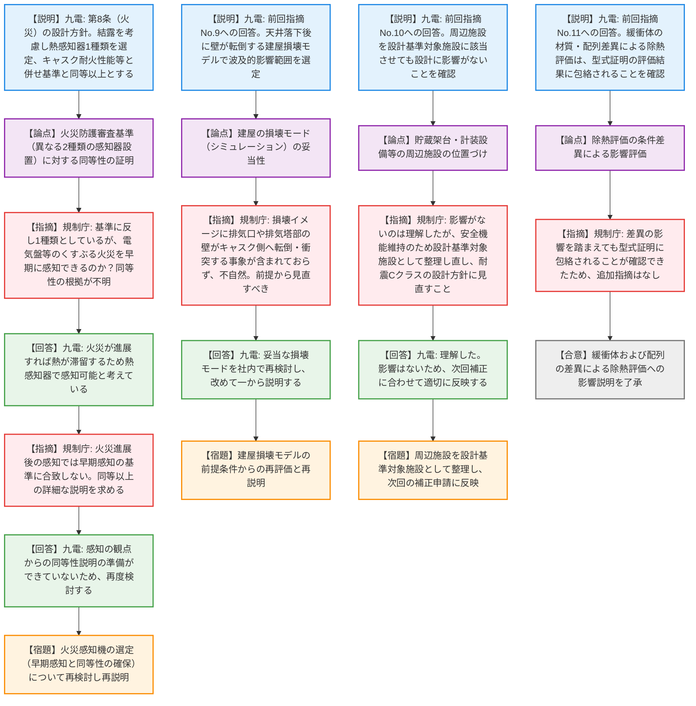

# 第1404回原子力発電所の新規制基準適合性に係る審査会合（令和8年4月2日）
> 出典 : https://youtube.com/live/z4-F9rHL89k?si=uz4ov2GAt5UWFYgR

# 会合の概要
* **審査の進捗と明確な課題の切り分け:** 九州電力川内原発の使用済燃料乾式貯蔵施設の設置許可に関し、基準への適合性および前回会合での指摘事項に対する回答が審議された。一部の評価結果は了承されたものの、火災対策や建屋損壊モデルについては規制庁から厳しい指摘が相次ぐ結果となった。
* **火災防護審査基準に対する認識の乖離と緊張感:** 規制庁が求める「異なる2種類の火災感知器の設置」に対し、九州電力が結露対策を理由に「熱感知器1種類で同等以上」と主張した点について、規制庁側から「電気盤等のくすぶる火災に早期反応できない」「基準と同等以上とする根拠が不十分」との強い懸念が示され、説明者が回答に窮し再検討を持ち帰る緊迫した場面が見られた。
* **建屋損壊シミュレーションの不自然さの指摘:** 竜巻飛来物等による建屋損壊時のキャスクへの波及的影響評価において、排気塔等の上部構造物がキャスク側へ転倒する事象が考慮されていない点に対し、規制庁から「損壊形態として不自然」と一蹴され、評価の前提に立ち返っての全面的な見直しが要求された。
* **周辺施設の位置づけに関する合意:** 貯蔵架台や計装設備等について、九州電力は「設計基準対象施設に該当させなくても影響なし」と説明したが、規制庁は安全機能維持の観点から「設計基準対象施設として整理し直すべき」と指導。事業者がこれに同意し、次回の補正申請へ反映されることとなった。

---

# 議題ごとの詳細整理（テキスト）

## 【議題1】九州電力（株）川内原子力発電所1号炉及び2号炉の設置変更許可申請（使用済燃料乾式貯蔵施設の設置）に係る審査について
* **議論の背景と論点:** 使用済燃料乾式貯蔵施設の設置に向け、第5条（津波）、第6条（外部衝撃）、第7条（不法侵入）、第8条（火災）、第11条（避難通路）等の設置許可基準規則への適合性と、前回審査で指摘された「建屋損壊モデルの妥当性」「周辺施設の位置づけ」「除熱評価における条件差異の影響」が論点となった。
* **質疑応答（詳細）:**
  * 【説明者側（九州電力 林氏・田中氏等）】からの説明
    各条文の設計方針を説明。特に第8条（火災）に関し、貯蔵エリアは結露を考慮し「アナログ式熱感知器」を選定した。キャスクの耐火性能と可燃物管理を組み合わせることで、消防法に基づく設計で火災防護審査基準と同等以上の安全性を確保すると説明した。
  * 【規制側（規制庁 鳥枝室長）】の懸念・指摘点
    火災防護審査基準は「早期感知のために異なる方式の感知器を設置すること」を求めている。現場盤等の電気火災など「くすぶる火災」を想定した場合、熱感知器1種類では反応できないのではないか。これでどのように「同等以上」と言えるのか根拠が不明である。
  * 【説明者側（九州電力 林氏）】の回答・反論・根拠
    火災が進展すれば熱も滞留するため、熱感知器での感知も可能であると考えている。
  * それに対する再反論や確認事項
    【規制庁 鳥枝室長】火災が進展してからの感知では早期感知の基準要求を満たしているとは受け取れない。同等性の詳細な説明を求める。
    【九州電力 遠崎氏】キャスクの耐火性能を含め総合的に同等以上と考えたが、感知の観点での同等性の説明準備ができていないため、再度検討する。
  * 【説明者側（九州電力 田中氏）】からの説明
    前回指摘No.9（波及的影響評価における建屋の損傷ケース）について、天井が直下に落下した後、壁がキャスクに向かって転倒するステップで損壊モデルを構築し、影響範囲を選定したと説明。
  * 【規制側（規制庁 藤川氏）】の懸念・指摘点
    提示された建屋の損壊イメージにおいて、排気口や排気塔部の壁がキャスク側へ転倒・衝突する事象が考慮されていない。損壊形態として不自然であり、前提に立ち返って評価を見直し、一から再説明すべきである。
  * 【説明者側（九州電力 田中氏）】の回答・反論・根拠
    指摘を踏まえ、改めて妥当な損壊モードを社内で検討し、再度説明する。
  * 【説明者側（九州電力 田中氏）】からの説明
    前回指摘No.10（周辺施設の位置づけ）について、貯蔵架台や計装設備を設計基準対象施設に該当させた場合でも、設計上の影響がないことを確認・整理した。
  * 【規制側（規制庁 島田氏）】の懸念・指摘点
    影響がないことは理解したが、周辺施設はキャスクの安全機能を維持するために設計されるべきものである。したがって、設計基準対象施設として整理し直し、耐震設計方針もCクラスを中心とするように見直してほしい。
  * 【説明者側（九州電力 二宮氏）】の回答・反論・根拠
    理解した。影響はないと考えているため、次回の補正申請に合わせて適切に反映する。
  * 【説明者側（九州電力 田中氏）】からの説明
    前回指摘No.11（除熱評価の条件差異）について、型式証明（木材緩衝体、無限配列）と設置許可（金属緩衝体、軸方向のみ無限配列）の差異を比較した結果、キャスク中央部・端部ともに設置許可の温度が低く、型式証明の評価に包絡されることを確認した。
  * 【規制側（規制庁 松野氏）】の懸念・指摘点
    材質や配列の違いによる影響を踏まえても、型式証明の評価に包絡されることが確認できたため、本件に関する追加のコメントはない。

* **結論と宿題事項（アクションアイテム）:**
  * 緩衝体の材質とキャスク配列の差異による除熱評価への影響については、型式証明の評価に包絡されることが示され、妥当として了承された（合意）。
  * 火災感知機の選定について、「異なる2種類の感知器」を求める基準に対し「熱感知器1種類で同等以上」とする根拠が示せなかったため、早期感知の観点を含め感知器の設計を再検討し、再説明する（宿題）。
  * 竜巻等による建屋の損壊波及的影響評価について、排気塔部の転倒が考慮されていない不自然なモデルとなっているため、損壊条件の前提に立ち返って再評価し、一から説明をやり直す（宿題）。
  * 貯蔵架台および計装設備等の周辺施設について、設計基準対象施設として整理し直し、Cクラスの耐震設計方針を次回の補正申請に反映する（宿題）。

---

# 論理構造の可視化（Mermaid）

### 【議題1】九州電力（株）川内原子力発電所1号炉及び2号炉の設置変更許可申請（使用済燃料乾式貯蔵施設の設置）に係る審査について

