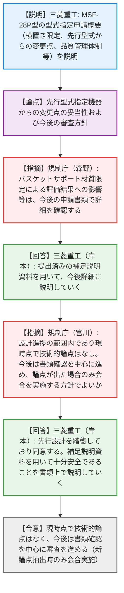

# 第41回特定兼用キャスクの設計の型式証明等に係る審査会合（令和8年4月2日）
> 出典 : https://youtube.com/live/2VRpwIobK68?si=is9w0fZ5AF2cA4vH

# 会合の概要
* **型式指定申請の概要確認と円滑な滑り出し:** 三菱重工業より申請された特定兼用キャスク「MSF-28P型」について、初回となる概要説明が行われた。先行の「MSF-24PS型」や型式証明の設計を基本踏襲していることが示され、終始穏やかで協力的な雰囲気の中で進行した。
* **技術的な懸念事項の不在と審査方針の合意:** 規制側は、今回の申請内容が設計進捗の範囲内であり、現時点において特段の技術的な論点は存在しないと評価した。これにより、今後の審査は会合よりも「書類確認」をベースに効率的に進められる方針で双方が合意した。
* **変更点に対する詳細確認の予告:** バスケットサポートの材質をステンレス鋼に限定したことに伴う再評価結果など、一部の仕様変更や設計進捗による影響については、今後提出される補足説明資料等を通じて厳密に確認していくことが規制側から提示され、事業者もこれに同意した。

---

# 議題ごとの詳細整理（テキスト）

## 【議題1】三菱重工業（株）特定兼用キャスクの設計の型式指定について（MSF-28P型）
* **議論の背景と論点:** 三菱重工業から新たに型式指定申請された「MSF-28P型」特定兼用キャスクについて、先行型式指定機器（MSF-24PS型）や型式証明を受けた設計からの変更点、技術基準規則・品質管理基準規則への適合性を確認し、今後の審査方針を決定することが主な論点となった。
* **質疑応答（詳細）:**
  * 【説明者側（三菱重工 岸本・斉藤・若松）】からの説明
    MSF-28P型の申請概要を説明。今回は貯蔵用緩衝体付きの「横置き貯蔵」に限定した申請であり、PWR燃料28体を収納可能である。先行のMSF-24PS型と比べ容量等は増加しているが、基本的な評価方法や材質は踏襲している。設計進捗として、バスケットサポートの材質をステンレス鋼に限定したことによる再評価や、遮蔽解析コードへの「MCNP5」の採用を行った。また、ISO9001やJEAG4111に適合した品質マネジメントシステム（QMS）により、機器が均一に製作される品質管理体制を構築していると説明した。
  * 【規制側（規制庁 森野）】の懸念・指摘点
    設計進捗の中で、バスケットサポートの材質を限定したことによる評価結果への影響（元の評価からの低下傾向など）が記載されているが、これらに関する詳細については今後の申請書類の中で確認していくと指摘した。
  * 【説明者側（三菱重工 岸本）】の回答・反論・根拠
    指摘の通り、提出した補足説明資料を用いて今後詳細に説明していくと回答した。
  * 【規制側（規制庁 宮川）】の懸念・指摘点
    申請内容が型式証明を受けた設計からの設計進捗の範囲内であり、同型の先行キャスク（MSF-24PS型）が既に型式指定を受けている実績も踏まえると、現時点では技術的な論点はないと判断している。今後は本日の説明を踏まえ、申請書の基本設計方針や説明書の書類確認を中心に進めたい。もし書類確認の中で新たな論点が出れば、改めて審査会合の場で確認したいが、その進め方でよいか確認した。
  * 【説明者側（三菱重工 岸本）】の回答・反論・根拠
    MSF-28P型はこれまでの設計をそのまま踏襲しており、材料等も基本的に同じものを採用している。今後、補足説明資料を用いて詳細に説明し、本設計が十分安全なものであることをしっかりと示していくと同意した。
* **結論と宿題事項（アクションアイテム）:**
  * 本申請については、現時点で大きな技術的論点はないとの認識で一致し、今後は申請書類の確認ベースで審査を進めることで合意した。
  * 書類確認の過程で新たな論点や疑義が抽出された場合に限り、再度審査会合を実施して確認を行うこととされた（条件付きの書類確認への移行）。

---

# 論理構造の可視化（Mermaid）

### 【議題1】三菱重工業（株）特定兼用キャスクの設計の型式指定について（MSF-28P型）

