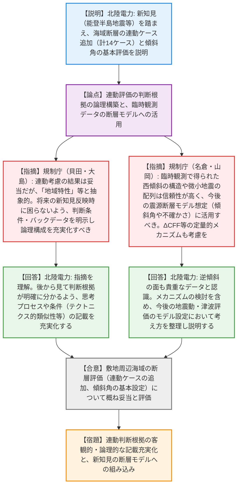
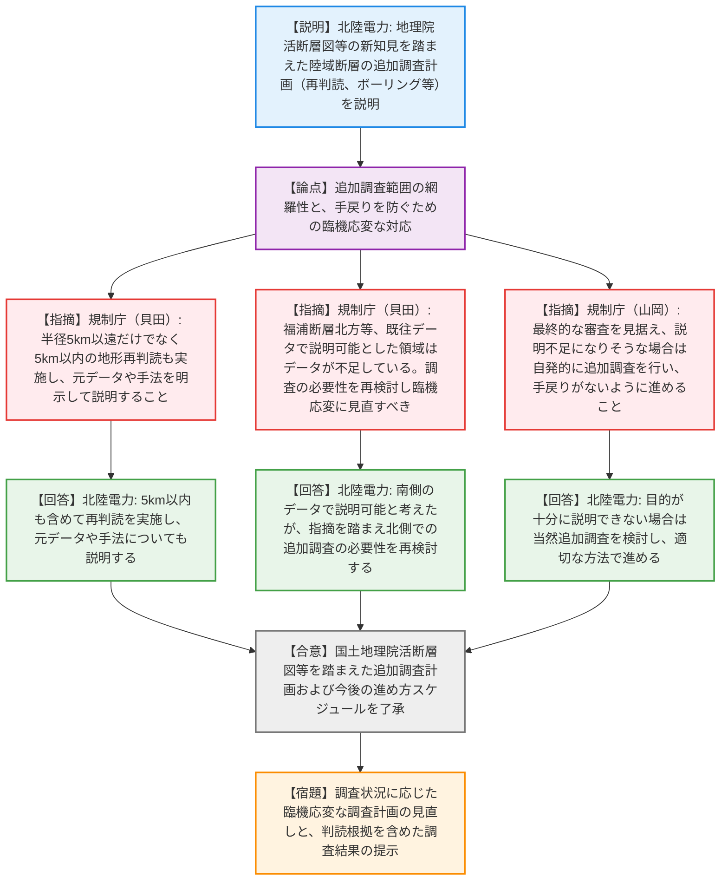

# 第1405回原子力発電所の新規制基準適合性に係る審査会合（令和8年4月3日）
> 出典 : https://youtube.com/live/k9Cu9W1ayJM?si=9hqHOnxBeNfMCwjs

# 会合の概要
* **連動評価に対する論理構築の厳格化要求:** 令和6年能登半島地震などの最新知見を踏まえた海域断層の連動評価について、結果自体（連動を考慮する等）は概ね妥当とされたものの、「地域特性」や「重視しない」といった抽象的な記載に対し、規制庁幹部から「将来の新知見反映時に判断基準が不明確になる」と強い危機感が示され、客観的かつ論理的な説明の充実化が厳しく求められた。
* **臨時観測データ（微小地震知見）の評価への組み込み:** 規制側から、高橋et al.等の臨時地震観測で得られた西傾斜の断層構造や微小地震の配列データについて、非常に精密で信頼性が高いとの評価がなされ、今後の断層モデル（傾斜角の設定や不確かさの考慮）に積極的に活かすよう技術的な指導が行われた。
* **国土地理院「活断層図」等を受けた追加調査計画への柔軟な対応要求:** 地理院2025等による新知見を受けた陸域の追加調査計画について、事業者が「既往データで説明可能」とした箇所に対し、規制側から「従来データが不足している領域である」との懸念が呈され、調査状況に応じた臨機応変な計画見直しと手戻りの防止が強く指導された。
* **地震メカニズムの定量的評価の推奨:** 山岡委員から、断層の連動評価において、単なる形態（地下で離れる・近づく）だけでなく、ΔCFF（クーロン破壊応力変化）のような定量的・地震学的なメカニズムを念頭に置いた評価を行うべきとの本質的な助言がなされ、事業者がこれを受諾した。

---

# 議題ごとの詳細整理（テキスト）

## 【議題1】北陸電力（株）志賀原子力発電所2号炉の敷地周辺の地質・地質構造について（前半：敷地周辺海域の断層の評価）
* **議論の背景と論点:** 令和6年能登半島地震や石川県西方沖地震の知見を踏まえ、海士崎沖断層帯や白浦沖東/西撓曲などの海域断層の「連動評価」および「傾斜角の評価」を見直した結果の妥当性、ならびに判断根拠の客観性・論理性が論点となった。
* **質疑応答（詳細）:**
  * 【説明者側】（北陸電力 野原氏、石田氏）からの説明
    能登半島周辺の地域特性（断層の傾斜方向が異なっていても同時活動した事例等）を踏まえ、海士崎沖断層帯と白浦沖西/東撓曲、笹波沖断層帯全長とKZ3・KZ4などの連動ケースを追加した。また、傾斜角については高橋et al.等の臨時地震観測や反射法地震探査を重視し、北部沿岸域は40〜50度、笹波沖は60度、海士崎沖は60度と評価した。
  * 【規制側】（規制庁 貝田氏）の懸念・指摘点
    連動評価の結果（計14ケース考慮）や傾斜角の評価結果については確認した。しかし、「地域特性」や「同時活動を否定する根拠としてデータを重視しない」という記載が抽象的である。地質構造の特徴やテクトニクス（インバージョンテクトニクス等）のバックデータを示し、どのような条件が揃えば連動を考慮したのか、思考プロセスが分かるように論理構成を充実化・適正化すべき。
  * 【説明者側】（北陸電力 石田氏、野原氏）の回答・反論・根拠
    白浦沖の各断層等は地質的特徴や分布が類似しており、それらも考慮して選定した。ご指摘の通り、連動考慮に至った条件（直線的な分布等）や判断基準が明確に分かるよう、資料の記載を修正・充実化する。
  * 【規制側】（規制庁 名倉氏）の懸念・指摘点
    臨時観測データで確認された西傾斜の断層構造は、白浦沖等の断層の傾斜角を示唆する重要な知見である。この傾斜データを震源断層モデル想定時にしっかりと考察し、評価に結びつけるよう説明を求める。
  * 【説明者側】（北陸電力 石田氏）の回答・反論・根拠
    白浦沖西撓曲等と同じような西傾斜の構造であり、傾斜を考慮する一因となると認識している。同じように形成された断層の傾斜角として検討し、今後の評価に活用する。
  * 【規制側】（規制庁 大島部長）の懸念・指摘点
    連動の選定自体は十分に行われていると評価する。ただし、「分かったようで分からない言葉」で抽象的に書くと、将来新たな知見が出た際に「過去の審査でどう判断したか」が分からなくなり、事業者・規制側双方が困ることになる。現時点の知見に基づく論理立てた構成を作り込むこと。また、この連動評価を今後の断層モデリング（傾斜角の不確かさ、破壊点、スケーリング則、カスケードモデル等）にどう繋げるかの論理構築も図ること。
  * 【説明者側】（北陸電力 小田氏）の回答・反論・根拠
    後から見た際に判断根拠が明確に分かるよう記載を追加・整理する。逆傾斜の面についても貴重なデータであると認識しており、今後の地震動・津波評価のモデル設定において考え方を整理し説明する。
  * 【規制側】（規制庁 山岡委員）の懸念・指摘点
    地震の連動は難しい分野であり、定性的な「断層が地下で遠ざかる・近づく」といった指標だけで否定するのは困難である。ΔCFF等の定量的・地震学的なメカニズムを念頭に置いて評価すべき。また、高橋et al.の臨時観測データは精度が高く、微小な割れ目構造を反映している可能性があるため、関連論文も参考に今後の評価に活かすこと。167ページの「地震積算回数が増加している期間中に」は表現として不適切なので修正すること。
  * 【説明者側】（北陸電力 小田氏）の回答・反論・根拠
    ΔCFF等のデータも確認しており、基本に立ち返ってメカニズムを含めた検討を進める。微小地震の知見も反映し、文書の適正化も行う。
* **結論と宿題事項（アクションアイテム）:**
  * 海域の断層評価（連動14ケース考慮、傾斜角の基本設定）については、概ね妥当な検討がなされたものと評価・了承された（合意）。
  * 「地域特性」や連動判断の根拠について、将来の新知見反映に耐えうる客観的かつ論理的な記載に充実化・適正化する（宿題）。
  * 臨時観測等で得られた西傾斜のデータや微小地震の知見を、今後の震源断層モデル（傾斜角の不確かさ、スケーリング則等）の構築に反映し説明する（宿題）。

## 【議題2】北陸電力（株）志賀原子力発電所2号炉の敷地周辺の地質・地質構造について（後半：陸域の追加調査計画および今後の進め方）
* **議論の背景と論点:** 国土地理院「活断層図（地理院2025）」等の新知見の公開に伴い、敷地周辺の陸域における断層の追加調査計画（地形再判読、ボーリング、反射法地震探査等）が提示された。調査対象の選定妥当性や、臨機応変な調査の実施方針が論点となった。
* **質疑応答（詳細）:**
  * 【説明者側】（北陸電力 木村氏、濱田氏）からの説明
    地理院2025により新たに図示された活断層や、評価範囲を超えて推定された活断層（福浦断層など）について、断層の有無や活動性を確認する追加調査を実施する。敷地近傍（半径5km以内）も含めて地形の再判読を行い、調査結果と合わせて今後の審査会合で説明する。
  * 【規制側】（規制庁 貝田氏）の懸念・指摘点
    半径5km以遠だけでなく、5km以内も含めて地形の再判読結果を説明するということでよいか。また、その際は判読の元データ（DEM等）や手法・基準を含めて説明すること。
  * 【説明者側】（北陸電力 木村氏）の回答・反論・根拠
    5km以内も含めて再判読を実施し、元データや手法についてもご説明する。
  * 【規制側】（規制庁 貝田氏）の懸念・指摘点
    福浦断層の北方について、「既往の表土剥ぎ調査データで説明可能」としているが、地理院2025が図示した水底活断層の大部分はこれまでデータがなかった領域と見受けられる。調査の必要性を再検討し、状況に応じて臨機応変に調査範囲を見直すべき。
  * 【説明者側】（北陸電力 野原氏）の回答・反論・根拠
    南側の既往データで連続性を説明可能と考えていたが、指摘を理解し、必要に応じて北側での追加調査を実施するかどうか改めて検討する。
  * 【規制側】（規制庁 山岡委員）の懸念・指摘点
    追加調査の最終結果は審査会合で評価されるため、結果を見ながら「どのような指摘がありそうか」を想定し、さらなる調査が必要と判断されれば手戻りがないよう自発的に追加実施してほしい。
  * 【説明者側】（北陸電力 小田氏）の回答・反論・根拠
    調査目的が十分に説明できない結果となった場合は、当然追加調査を検討し、適切な方法で進めていく。
* **結論と宿題事項（アクションアイテム）:**
  * 国土地理院活断層図等を踏まえた追加調査計画の枠組みおよび今後の説明スケジュールについて了承された（合意）。
  * 半径5km内外を問わず地形の再判読を実施し、元データ・手法を含めて結果を説明する（宿題）。
  * 福浦断層北方等の既往データが不足していると懸念される領域について、調査の必要性を再検討し、手戻りのないよう臨機応変に追加調査を実施する（宿題）。

---

# 論理構造の可視化（Mermaid）

### 【議題1】北陸電力（株）志賀原子力発電所2号炉の敷地周辺の地質・地質構造について（前半：敷地周辺海域の断層の評価）

### 【議題2】北陸電力（株）志賀原子力発電所2号炉の敷地周辺の地質・地質構造について（後半：陸域の追加調査計画および今後の進め方）

