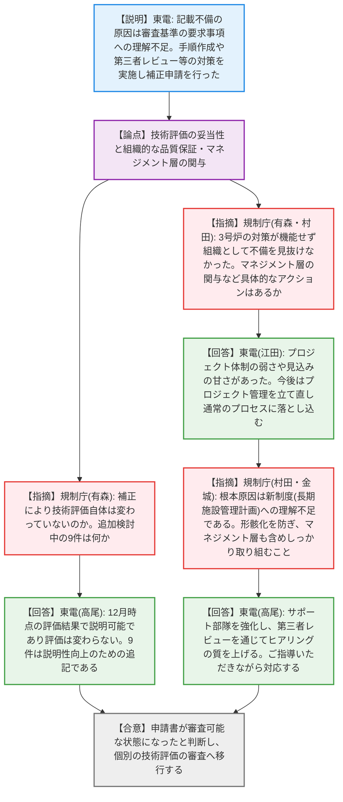
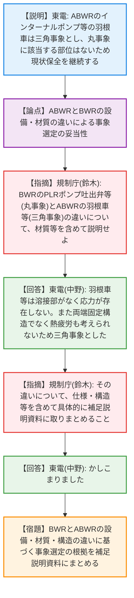
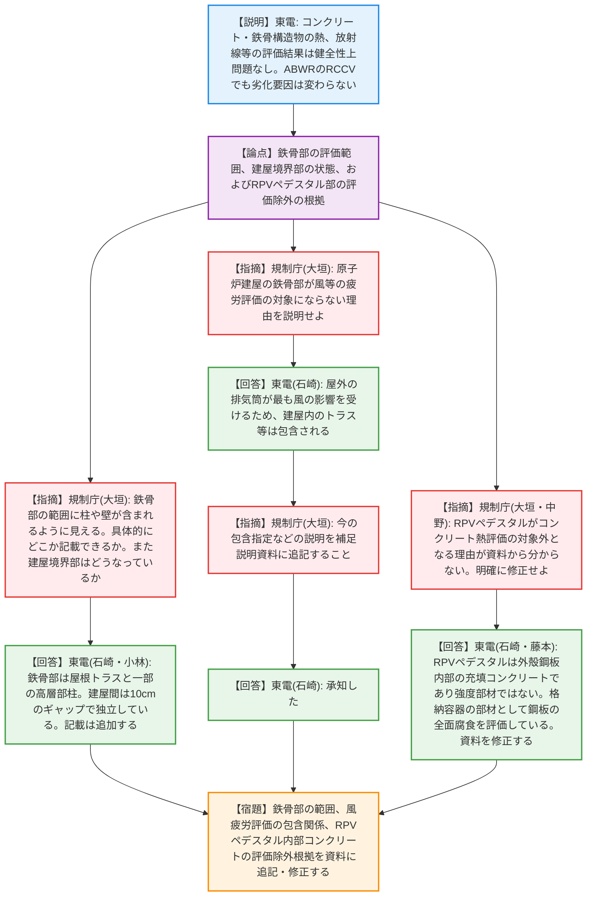
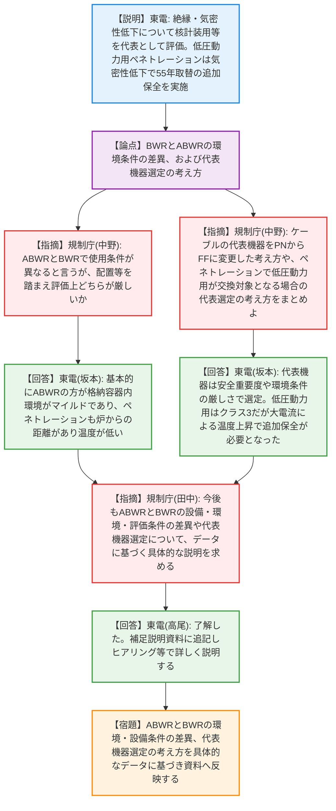

# 第28回実用発電用原子炉の長期施設管理計画等に係る審査会合（令和8年4月7日）
> 出典 : https://youtube.com/live/z1VuDL_Pey0?si=-HshxWzMj_7zYslF

# 会合の概要
* **長期施設管理計画の審査開始と事業者の姿勢への苦言:** 柏崎刈羽6号炉の長期施設管理計画認可申請について、前回指摘された「審査基準に対する記載不足・不備」に関する原因と対策が報告された。補正申請により形式的な審査要件が整ったと判断され、実質的な技術審査が開始された。しかし、規制側からは不備の根本原因が「新制度の趣旨（プロセス重視の厳格化）への理解不足」にあると厳しく指摘され、マネジメント層の関与と意識改革が強く求められた。
* **技術評価（熱時効・コンクリート・電気計装品）の初審議:** 二相ステンレス鋼の熱時効、コンクリート及び鉄骨構造物、電気・計装品の絶縁低下・気密性低下について個別の技術評価方針が説明された。ABWR特有の構造（インターナルポンプやRCCV等）が劣化事象の選定や環境条件に及ぼす影響が主な論点となった。
* **補足説明資料の充実化と今後の進め方:** 規制側は、ABWRと従来BWRの差異、評価対象外とした部位（RPVペデスタル内部の充填コンクリート等）の根拠、代表機器選定の考え方について、説明資料が不足していると指摘。具体的な仕様やデータに基づく補足説明資料の拡充が各事象で宿題として課され、ヒアリングを通じた事実確認を進めることで合意した。

---

# 議題ごとの詳細整理（テキスト）

## 【議題1-1】申請書の記載事項の不備に対する原因と対策
* **議論の背景と論点:** 前回（2月17日）の審査会合で、申請書に審査基準への適合に必要な記載不足や不明確な記載があり、形式上の要件を満たしていないと指摘された。これを受け、東京電力が原因分析と対策を実施し、補正申請（3月27日）を行った経緯と、その組織的な再発防止策が論点となった。
* **質疑応答（詳細）:**
  * 【説明者側】（東電 菊川氏・高尾氏）からの説明
    24件の記載不備を確認し修正した。原因は、審査基準の要求事項に対する理解不足である。背後要因として、作成手順や様式がなく、担当者の判断で過去の高経年化技術評価書の記載をそのまま用いたことが挙げられる。対策として、手順の作成、第三者レビューの実施、プロジェクト体制による確認を行った。
  * 【規制側】（規制庁 有森氏）の懸念・指摘点
    補正した内容について、技術評価自体に不備はなかったということか。「追加等を検討中の9件」は技術評価の結果を変えるものか。
  * 【説明者側】（東電 高尾氏）の回答・反論・根拠
    12月時点の技術評価結果で説明可能であり、評価自体は変わらない。9件は説明性向上のための追記を検討しているものである。
  * 【規制側】（規制庁 有森氏）の懸念・指摘点
    他の先行プラント（女川等）のヒアリングに参加していたのに、なぜ作成方針がなく担当者任せになったのか。
  * 【説明者側】（東電 藤本氏）の回答・反論・根拠
    新しい項目（サプライチェーン等）は相談・整理したが、高経年化評価から移行した技術評価部分は手順がなく相談が発生しなかった。技術評価の手法に変更がないため、記載もそのまま移行できると思い込んでしまった。
  * 【規制側】（規制庁 有森氏・村田氏）の懸念・指摘点
    3号炉の際の対策が機能せず、今回組織としての品質保証の観点で不備が見抜けなかった。手順の改善は理解したが、マネジメント層が関与する仕組みの変更など、現場が形骸化しないための具体的なアクションはあるか。
  * 【説明者側】（東電 江田氏）の回答・反論・根拠
    プロジェクト体制の弱さや見込みの甘さがあった。所長も含めたエスカレーションの枠組みはあったが、機能が十分でなかった。今後、プロジェクト管理のあり方を立て直し、通常のプロセスに落とし込む。
  * それに対する再反論や確認事項
    【規制庁 村田氏・田中氏・金城氏】今回の補正で審査ができる状態になったと認識する。しかし、根本原因は新制度（長期施設管理計画への移行に伴う厳格化）への理解不足である。改めて制度の趣旨を理解し、マネジメント層も含めしっかり準備した上で説明すること。
    【東電 江田氏・高尾氏】サポート部隊を強化し、第三者レビューを通じてヒアリングの質を上げる。ご指導いただきながら対応していく。
* **結論と宿題事項（アクションアイテム）:**
  * 補正申請により形式的な審査要件が整ったと判断され、実質的な個別の技術評価の審査へ移行することが了承された（合意）。
  * 策定した再発防止策（手順化、第三者レビュー等）を形骸化させず、マネジメント層の関与のもとで継続的に機能させること（宿題）。

## 【議題1-2】技術評価（二相ステンレス鋼の熱時効）
* **議論の背景と論点:** ABWRと従来BWRの経年劣化事象の違いを踏まえ、二相ステンレス鋼の熱時効評価における対象機器の選定基準（丸事象と三角事象の切り分け）の妥当性が論点となった。
* **質疑応答（詳細）:**
  * 【説明者側】（東電 高尾氏）からの説明
    ABWRはインターナルポンプ（RIP）を採用しており、BWRにあったPLRポンプの吸込・吐出弁がないため、丸事象（定量評価が必要な事象）に該当する部位がない。RIPの羽根車とディフューザは三角事象（高経年化対策上着目すべきでない事象）とした。結果として、熱時効が問題となる可能性はなく、現状の保全を継続する。
  * 【規制側】（規制庁 鈴木氏）の懸念・指摘点
    BWRではPLRポンプ吐出弁等が丸事象だが、ABWRの羽根車等が三角事象とされた違いについて、材質等を含めて説明せよ。
  * 【説明者側】（東電 中野氏）の回答・反論・根拠
    羽根車等はステンレス鋳鋼で温度278℃であるが、当該部に溶接部がなく応力が存在しない。また、両端固定構造でなく熱疲労も考えられないため、亀裂の原因となる事象が想定されず三角事象と整理した。
  * それに対する再反論や確認事項
    【規制庁 鈴木氏】その違いについて、仕様や構造を含めて具体的に補足説明資料に取りまとめること。
    【東電 中野氏】かしこまりました。
* **結論と宿題事項（アクションアイテム）:**
  * ABWRにおけるRIP羽根車等を三角事象とした根拠（溶接部の有無、固定構造の違いによる熱疲労の非該当等）について、BWRとの仕様・構造の違いを含めて具体的に補足説明資料にまとめる（宿題）。

## 【議題1-3】技術評価（コンクリート及び鉄骨構造物）
* **議論の背景と論点:** コンクリート・鉄骨構造物の熱、放射線、中性化等の評価において、ABWR特有の構造（RCCV等）を踏まえた評価対象部位の選定、包含関係の説明、およびRPVペデスタル内部のコンクリートの評価除外の根拠が論点となった。
* **質疑応答（詳細）:**
  * 【説明者側】（東電 石崎氏）からの説明
    ABWRはRCCV（鉄筋コンクリート製格納容器）だが、評価上の劣化要因は変わらない。熱による強度低下の代表としてダイヤフラムフロア（57℃）を選定し、制限値を下回っている。放射線、中性化、塩分浸透、機械振動も健全性評価上問題ない。
  * 【規制側】（規制庁 大垣氏）の懸念・指摘点
    鉄骨部の範囲（資料16ページ）に柱や壁も含まれるように見えるが具体的にどこか。また、タービン建屋と廃棄物処理建屋の境界部はどうなっているか。
  * 【説明者側】（東電 石崎氏・小林氏）の回答・反論・根拠
    鉄骨部は屋根トラスと一部の高層部柱である。建屋間は10cmのギャップがあり各々独立している。記載は追加可能である。
  * 【規制側】（規制庁 大垣氏）の懸念・指摘点
    原子炉建屋の鉄骨部が風等の疲労評価の対象にならない理由を説明せよ。
  * 【説明者側】（東電 石崎氏）の回答・反論・根拠
    屋外の排気筒が最も風の影響を受けるため、建屋内のトラス等はその評価に包含されると考えている。
  * それに対する再反論や確認事項
    【規制庁 大垣氏】今の包含関係等の説明を補足説明資料に追記すること。
    【東電 石崎氏】承知した。
  * 【規制側】（規制庁 大垣氏・中野氏）の懸念・指摘点
    コンクリート熱評価で、RPV支持スカートとペデスタルの接触面が評価点に選定されない理由は何か。図（21ページ）からは、縦に立っているペデスタル部分がコンクリート構造物として評価対象外となっていることが全く分からない。
  * 【説明者側】（東電 石崎氏・藤本氏）の回答・反論・根拠
    RPVペデスタルは外殻が鋼板で内部が充填コンクリートだが、このコンクリートは強度部材ではない。技術評価としては格納容器内の鋼板部材として全面腐食を評価している。
  * それに対する再反論や確認事項
    【規制庁 中野氏】資料からその意図が全く読み取れないので、分かるように修正すること。
    【東電 藤本氏】部位展開が分かるように記載を追記・修正する。
* **結論と宿題事項（アクションアイテム）:**
  * 鉄骨部の具体的な範囲、建屋間の境界状態、風疲労評価における排気筒への包含関係について、補足説明資料に追記する（宿題）。
  * RPVペデスタル内部の充填コンクリートがコンクリート熱評価の対象外となる根拠（強度部材でなく鋼板部材として評価していること）が明確に分かるよう、資料の部位展開図等を修正する（宿題）。

## 【議題1-4】技術評価（電気・計装品の絶縁低下及び気密性低下）
* **議論の背景と論点:** ケーブルおよびペネトレーションの絶縁低下・気密性低下評価において、BWRとABWRの環境条件の差異、代表機器（ケーブル種別等）の変更理由、および追加保全策の対象選定の考え方が論点となった。
* **質疑応答（詳細）:**
  * 【説明者側】（東電 坂本氏）からの説明
    ABWRとBWRで環境条件・設備が異なるが、評価手法に差異はない。絶縁低下は難燃FFケーブルと核計装用電気ペネトレーションを代表とし、60年間の健全性を確認した。代表ケーブルをPNからFFに変更した。気密性低下も核計装用を評価したが、低圧動力用ペネトレーションについては温度上昇により55年で取り替える追加保全策を策定した。
  * 【規制側】（規制庁 中野氏）の懸念・指摘点
    BWRとABWRで使用条件が異なると言うが、配置や距離を踏まえ評価上どちらが厳しいか。
  * 【説明者側】（東電 坂本氏）の回答・反論・根拠
    基本的にABWRの方が格納容器内の雰囲気（使用条件）としてはマイルドであり、ペネトレーションも炉からの距離があり温度が低い。
  * 【規制側】（規制庁 中野氏）の懸念・指摘点
    代表ケーブルをPNからFFに変更した考え方や、絶縁・気密性で核計装用を代表としながら、まとめで低圧動力用が交換対象となっている代表選定の考え方をまとめよ。
  * 【説明者側】（東電 坂本氏）の回答・反論・根拠
    代表機器は安全重要度や環境条件の厳しさで選定し、核計装用とした。低圧動力用はクラス3で重要度は低いが、大電流による温度上昇がシール材劣化に影響するため、結果として追加保全策が必要となった。評価は全ての機器に対して行っている。
  * それに対する再反論や確認事項
    【規制庁 田中氏】今後もABWRとBWRの設備構成、使用環境、評価条件の差異や代表機器選定について、データに基づく具体的な説明を補足説明資料に反映し、ヒアリング等で説明すること。
    【東電 高尾氏】了解した。いただいた指摘を補足説明資料に追記し、ヒアリングで詳しく説明する。
* **結論と宿題事項（アクションアイテム）:**
  * ABWRとBWRの設備・使用環境・評価条件の差異（ABWRの方がマイルドである点等）について、具体的なデータに基づく説明を補足説明資料に反映する（宿題）。
  * ケーブルの代表機器変更（PNからFFへ）や、ペネトレーションの代表機器選定（核計装用と低圧動力用の関係）の考え方について、補足説明資料に追記する（宿題）。

---

# 論理構造の可視化（Mermaid）

### 【議題1-1】申請書の記載事項の不備に対する原因と対策

### 【議題1-2】技術評価（二相ステンレス鋼の熱時効）

### 【議題1-3】技術評価（コンクリート及び鉄骨構造物）

### 【議題1-4】技術評価（電気・計装品の絶縁低下及び気密性低下）

