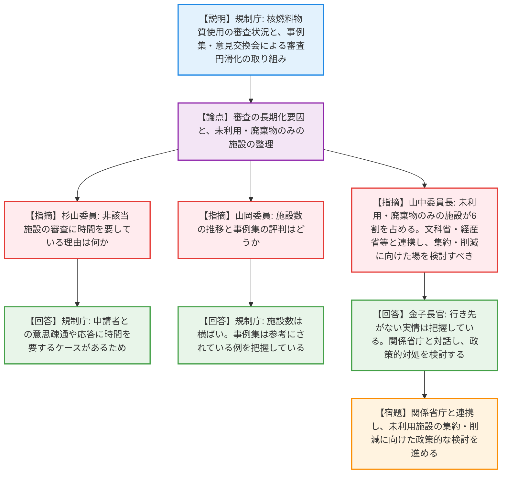
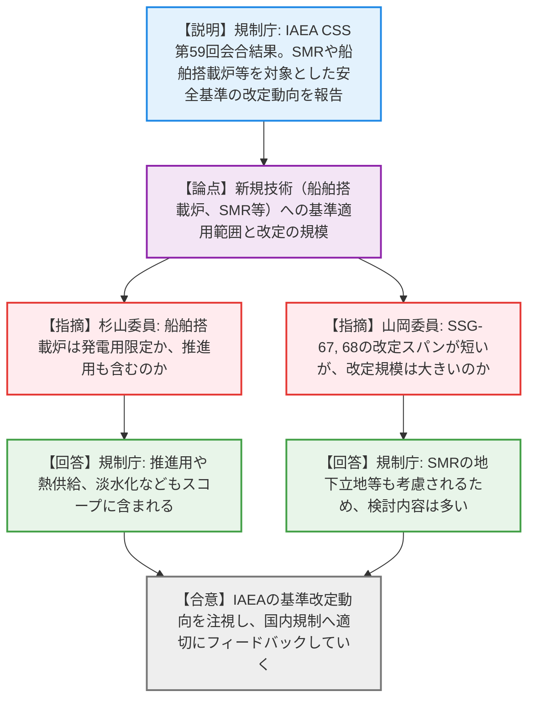
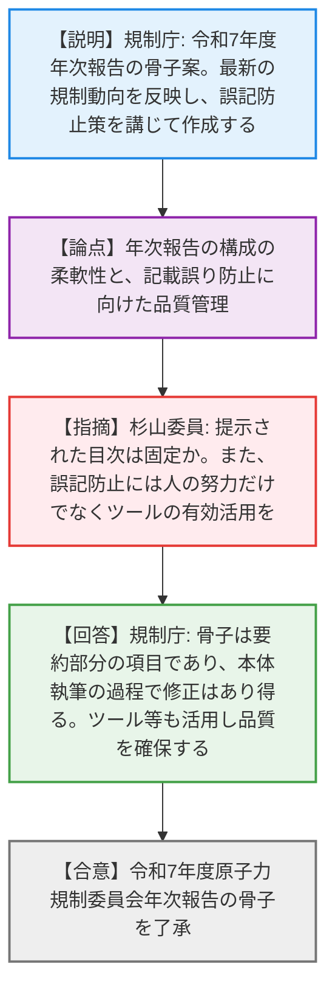

# 第3回原子力規制委員会（令和8年4月8日）
> 出典 : https://youtube.com/live/frKc60l4oVo?si=JeaMWfGAeH8ZPjAB

# 会合の概要
* **未利用核燃料物質の集約に向けた省庁間連携の要請:** 大学や企業等の核燃料物質使用施設のうち、約6割が未利用または廃棄物のみを保管している実情に対し、委員長から「安全上、集約・削減が望ましい」との強い問題意識が示され、文科省や経産省を巻き込んだ政策的な対処を進める方向性が打ち出された。
* **IAEA安全基準の最新動向と国内規制への反映:** IAEAの安全基準委員会（CSS）において、SMR（小型モジュール炉）の地下立地や、船舶搭載炉（推進・熱供給含む）といった新規技術に関する基準改定が進められていることが報告され、これらの国際動向を国内規制へ適切に取り込んでいく重要性が確認された。
* **年次報告の骨子了承と品質確保の徹底:** 令和7年度の年次報告骨子が了承された。前年度に記載の誤りが多数発生した反省から、委員より「人の努力だけでなくツールの有効活用」が求められ、規制庁側も重層的なチェック体制で品質確保に努める姿勢を示した。

---

# 議題ごとの詳細整理（テキスト）

## 【議題1】核燃料物質の使用に係る審査等への対応状況
* **議論の背景と論点:** 核燃料物質の使用（41条該当施設、非該当施設、使用届出）に関する審査や手続きにおいて、申請者が不慣れなために審査が長期化するケースがある。審査円滑化の取り組み（事例集や意見交換会）の成果と、利用実態のない施設への抜本的な対応が論点となった。
* **質疑応答（詳細）:**
  * 【説明者側】（規制庁 森光氏、加藤氏）からの説明
    審査状況について、サイクル工学研究所の電源供用や、大学・企業等の変更申請等を処理している。申請者が不慣れなケースが多いため、事例集の公開や意見交換会を通じて審査の円滑化を図っていると報告。
  * 【規制側】（杉山委員）の懸念・指摘点
    非該当施設の審査で時間を要しているものがあるが、難易度が高いのか。
  * 【説明者側】（規制庁 加藤氏）の回答・反論・根拠
    難易度というより、求める基準適合への説明について意思疎通がうまくいかず、応答に時間を要するケースがある。
  * 【規制側】（山岡委員）の懸念・指摘点
    非該当施設数は増減の傾向はあるか。事例集の評判はどうか。
  * 【説明者側】（規制庁 加藤氏）の回答・反論・根拠
    施設数は約180で横ばい。事例集はアンケート未実施だが、実際に参考にして申請された例は把握している。
  * 【規制側】（山中委員長）の懸念・指摘点
    約190施設のうち6割が研究等を行わず、未利用や廃棄物のみを管理している状態であり、行き先がわからず減らない実情がある。安全上、集約や削減が好ましいため、文科省や経産省など関係省庁と相談する場を設けて対処を検討できないか。
  * 【説明者側】（金子長官）の回答・反論・根拠
    行き先がなくなっている状況は把握している。所管する文科省や経産省と対話し、どのような政策的対処があり得るか検討したい。
* **結論と宿題事項（アクションアイテム）:**
  * 審査等の対応状況について了承された（合意）。
  * 規制庁は文科省・経産省等の関係省庁と連携し、未利用施設や行き先のない廃棄物の集約・削減に向けた政策的な対処を検討する（宿題）。

## 【議題2】国際原子力機関（IAEA）安全基準委員会（CSS）第59回会合結果概要
* **議論の背景と論点:** 3月に開催されたCSSにおいて、SMRや船舶搭載炉といった新技術を取り込むための安全基準（SSR-2/1、SSG-67, 68等）の改定方針が承認された。これらの技術がどのようなスコープで議論されているか、および改定の規模感が論点となった。
* **質疑応答（詳細）:**
  * 【説明者側】（規制庁 山田氏）からの説明
    原子炉等施設の許認可プロセス（SMR推奨事項追加）、規制経験反映マネジメントの新規策定、および原子力発電所の安全設計等の改定が承認された。特に船に搭載されたトランスポータブルな原子炉等について、IMO（国際海事機関）と連携しつつ技術中立性を目指す方針であると報告。
  * 【規制側】（杉山委員）の懸念・指摘点
    船に搭載された原子炉は、推進用ではなく発電用に限定された話か。
  * 【説明者側】（規制庁 山田氏）の回答・反論・根拠
    発電だけでなく、原子力による推進（プロパルジョン）、熱供給、淡水化などもスコープに含まれている。
  * 【規制側】（山岡委員）の懸念・指摘点
    SSG-67、68は2021年発行で改定が早いが、改定の規模は大きいのか。
  * 【説明者側】（規制庁 山田氏）の回答・反論・根拠
    SMRの地下立地など新しい設計や、気候変動による激しい気象条件も考慮されるため、検討すべき内容は多いと認識している。
* **結論と宿題事項（アクションアイテム）:**
  * IAEAにおける安全基準の改定動向について報告が了承された。新規制基準策定の参照文書となるため、引き続き動向を注視し国内規制へ適切にフィードバックしていく（合意）。

## 【議題3】令和7年度原子力規制委員会年次報告の骨子
* **議論の背景と論点:** 令和7年度年次報告の作成にあたり、3.11報告をベースに最新情報（中部電力不正事案への対応、モニタリングシステムの刷新等）を反映した「骨子」が提示された。目次の固定性や、前年度の反省を踏まえた記載誤り防止策が論点となった。
* **質疑応答（詳細）:**
  * 【説明者側】（規制庁 新田氏）からの説明
    3月末時点の情報を反映した骨子案を説明。また、前年度に記載誤りが多数あった反省から、複数人での確認や前年度比較、ソフトウェアツールの活用などにより品質を確保して作成すると報告。
  * 【規制側】（杉山委員）の懸念・指摘点
    骨子として提示された目次はこれで固定されるのか。また、誤字や記載漏れの防止については、人の努力だけでなくツールの有効活用をしっかり行ってほしい。
  * 【説明者側】（規制庁 新田氏）の回答・反論・根拠
    今回の骨子はあくまで要約部分の項目に相当するものであり、本体執筆の過程で修正はあり得る。
  * 【規制側】（山中委員長）の懸念・指摘点
    人の手を借りずに間違いを見つけるのは難しいが、慎重に作業を行っていただきたい。
* **結論と宿題事項（アクションアイテム）:**
  * 令和7年度原子力規制委員会年次報告の骨子が了承された（合意）。
  * 提示された骨子を踏まえ、ツール等を有効活用した誤記防止策を講じつつ、6月頃の公表に向けて年次報告本体および概要の作成を進める（合意）。

---

# 論理構造の可視化（Mermaid）

### 【議題1】核燃料物質の使用に係る審査等への対応状況

### 【議題2】国際原子力機関(IAEA)安全基準委員会(CSS)第59回会合結果概要

### 【議題3】令和7年度原子力規制委員会年次報告の骨子

