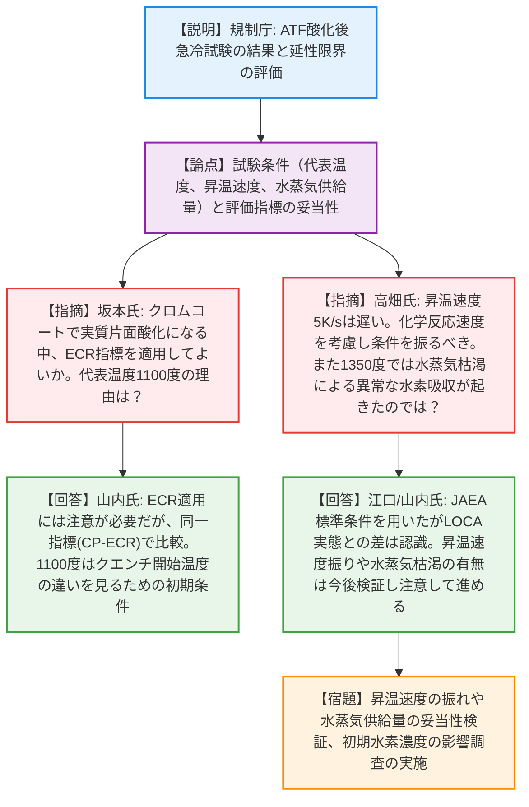
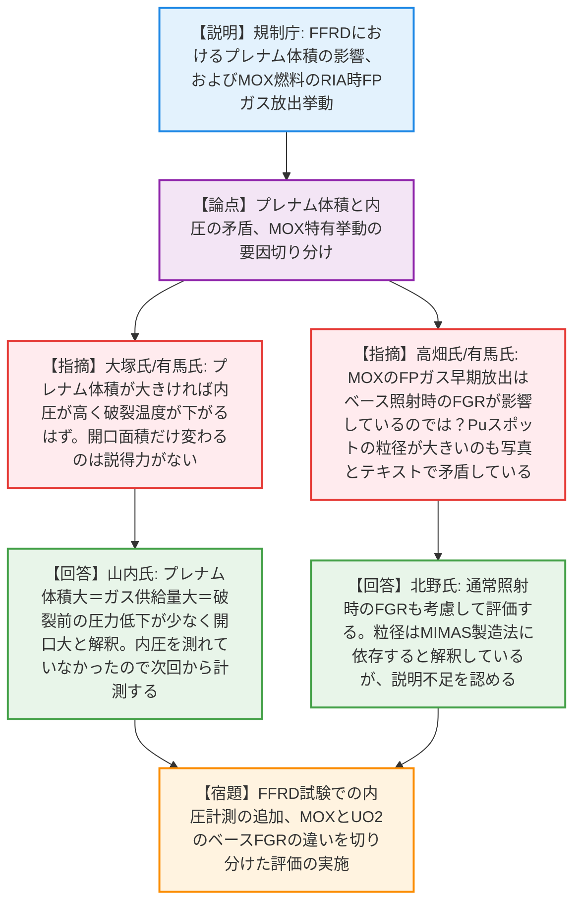
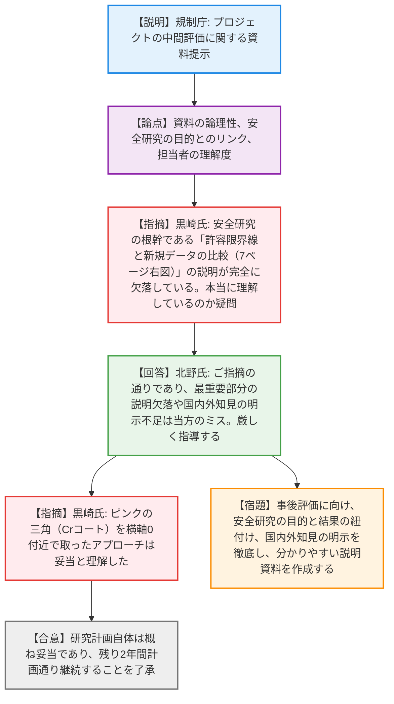

# 第7回燃料技術評価検討会（令和8年4月8日）
> 出典 : https://youtube.com/live/kjVwBCEZszc?si=7WGmpfDMPdI-c8wc

# 会合の概要
* **事故耐性燃料等に関する安全研究の中間評価を実施:** 令和6年度開始の安全研究プロジェクト（ATFの損傷挙動、現行基準で未考慮の事故時挙動など）について、外部専門家および専門技術者を交えて研究の進め方や技術的妥当性の評価が行われた。研究計画自体は概ね妥当とされ、残り2年間の継続が了承された。
* **プレゼン資料の質と規制庁の理解度に対する厳しい苦言:** 外部専門家から「安全研究の目的と実験データの繋がり（許容限界線と新規データの比較など）の最重要部分の説明が欠落している」「国内外の最新知見をどう踏まえたかが見えない」「規制庁担当者が委託研究の要所を本当に理解しているか疑問」といった極めて厳しい指摘が飛んだ。規制庁側は手落ちを全面的に認め、事後評価に向けた抜本的な改善を約束する緊迫した場面があった。
* **実験条件の妥当性とメカニズム解明に向けた深掘り:** 専門技術者から、クロムコーティング被覆管の高温酸化試験における昇温速度の影響や、1350度という極高温度帯での水蒸気枯渇による異常な水素吸収の可能性が指摘された。また、FFRD（燃料微細化・分散）におけるプレナム体積と内圧の関係性について、実験事実と理論の矛盾点が突かれ、今後の試験で内圧計測を追加するなどの改善策が引き出された。
* **MOX燃料特有の挙動に関する考察:** MOX燃料におけるプルトニウムスポットと結晶粒径の相関について、写真の見た目とテキストの結論（相関なし）の乖離が指摘された。また、通常運転時のFPガス蓄積量がRIA時の放出挙動に与える影響を適切に切り分けて評価するよう指導がなされた。

---

# 議題ごとの詳細整理（テキスト）

## 【議題1】安全研究プロジェクトの技術的観点からの評価（事故耐性燃料等の事故時挙動研究 中間評価）

* **議論の背景と論点:**
  現行の規制基準の妥当性確認と、事業者の評価を審査するためのデータ取得を目的とした安全研究（JAEAへの委託研究等）の中間評価。具体的には、①ATF（クロミウムコーティング被覆管）の事故時挙動、②現行基準で未考慮の事象（FFRD、MOXのRIA時挙動、LOCA後地震時の被覆管強度）に関する試験・解析手法の技術的妥当性が論点となった。

* **質疑応答（詳細）:**

  **＜テーマ1：ATF（クロムコート被覆管）の試験条件と評価指標＞**
  * 【説明者側】（規制庁 山内氏・江口氏）
    クロムコート被覆管の酸化後急冷試験において、ダイレクトクエンチでは延性限界が低下すること、1200度超での機械特性試験装置を製作中であることを説明。
  * 【専門技術者】（日本核燃料開発 坂本氏）
    8ページのグラフで破断したタイミングが不明瞭。また、クロムコートの場合、実質片面酸化になるためECR（等価被覆管酸化割合）の指標を適用してよいのか。さらに、代表温度を1100度とした理由は何か。
  * 【説明者側】（規制庁 山内氏）
    急冷時に荷重負荷した急な立ち上がり部分で破断した。ECR適用に注意が必要なのは承知しており、今回は同じ物差しとして「CP-ECR（重量増加）」を使用し、実質片面酸化に近い状況が反映されている。1100度は先行研究に基づき、酸化からのクエンチと冷ましてからのクエンチの違いを確かめるため選択した。
  * 【専門技術者】（関西電力 高畑氏）
    昇温速度5K/sはLOCA模擬にしては遅い。クロムコートの化学反応を考えると、昇温速度を振る計画はあるか。また、1350度の試験において、試験片が長い中で水蒸気供給量が十分だったか。水蒸気枯渇による異常な水素吸収が起きたのではないか。
  * 【説明者側】（規制庁 江口氏・山内氏）
    JAEAの標準条件を用いているが、実際のLOCAの昇温速度との違いは認識している。化学反応速度に注目した条件振りは検討する。水蒸気供給量については従来と同じ条件としたが、1350度で十分だったか、意図しない水素吸収が起きていないかは今後検証し注意して進める。

  **＜テーマ2：FFRD（燃料微細化・分散）挙動＞**
  * 【説明者側】（規制庁 江口氏）
    プレナム体積の違いが開口部面積に影響することを確認。TRACE/FRAPTRANコードを改良し、リロケーションやディスパーザルを考慮したシミュレーションを進めていると説明。
  * 【専門技術者】（東京電力 大塚氏・オンライン）
    プレナム体積が大きいと開口面積が大きくなるメカニズムは？また、その時の内圧も関係するのではないか。
  * 【説明者側】（規制庁 山内氏）
    プレナム体積が大きいと膨れ部に供給できるガス量が多く、破裂前の圧力低下が少なくなるため開口面積が大きくなると解釈している。膨れ部の内圧低下が少ない方が開口部が大きくなる。
  * 【外部専門家】（九州大 有馬氏）
    プレナム体積が大きければ内圧が高いので破裂温度が下がるはずだが、同じ温度で破裂し開口部だけが変わっているのは説得力がない。また、「ペレットの有無に関わらず」とあるが、FFRDは燃料側の問題かガスが引き金か。
  * 【説明者側】（規制庁 山内氏・大橋氏）
    「ペレットの有無」は実燃料ペレットか模擬アルミナかの違い。FFRDは内圧とペレット性状の両方が複雑に影響する。今回内圧を測れていなかったため説得力に欠ける点は認め、次期試験から内圧計をつけ、解析的評価も進める。
  * 【専門技術者】（東京電力 大塚氏・オンライン）
    解析はPWRのみか。BWRの予定は？
  * 【説明者側】（規制庁 江口氏）
    FFRDが顕著なのがPWRのLOCAとされるため、現状はPWRに注力している。

  **＜テーマ3：MOX燃料の事故時挙動＞**
  * 【説明者側】（規制庁 山内氏・北野氏）
    MOX燃料のRIA模擬実験でFPガス放出が早く完了し内圧上昇が早期に生じること、未照射MOXのPuスポットと結晶粒径に顕著な相関は見られないことを説明。
  * 【外部専門家】（九州大 有馬氏）
    UO2とMOXで出力パルスの形状が違うが、投入エネルギーが同じなら比較可能という解釈か。また、写真を見るとPuスポット（緑）の粒径が大きく見えるが本当に関係ないのか。
  * 【説明者側】（規制庁 山内氏・北野氏）
    出力パルス（FGD3とFGD2）の投入エンタルピーの違いは確認して改めて回答する。Puスポットの粒径は画像解析でも大きいが、他の製造施設（ベルゴニュークリア）のデータでは相関がなかったため、Pu濃度ではなく製造方法（MIMAS法）に依存すると解釈している。
  * 【専門技術者】（関西電力 高畑氏）
    MOXのFPガス移行が速い点について、通常運転時のFPガス蓄積量（ベース照射時のFGR）がRIA時の追加放出にどう影響しているかを切り分けて評価すべき。
  * 【説明者側】（規制庁 北野氏）
    通常照射完了時のFGRデータも取っておりUO2とコンパラなはずだが、改めて確認し、その視点を入れて評価する。

  **＜テーマ4：研究マネジメントとプレゼン資料の質への苦言＞**
  * 【外部専門家】（京都大 黒崎氏）
    国内外の最新知見をどう踏まえたかが見えない。また、資料の作り込みが甘く、Puスポットの写真とテキストの矛盾など、背景説明がないと伝わらない。何より、7ページ右図の「青い線（許容限界）に対し新しい実験データが下回っているから現行基準が使える」という安全研究の根幹に関わる説明が完全に欠落していた。委託研究であっても、規制庁は要所を確実に押さえておくべきであり、本当に理解しているのか疑問に思った。
  * 【説明者側】（規制庁 北野氏）
    指摘はごもっともであり、安全研究の目的に対する重要な説明が欠落していた点は厳しく指導する。国内外の知見についても、評価の視点に入っているのに資料に反映できていなかったのはこちらのミスである。次回の事後評価では万全の準備をし、分かりやすい説明を徹底する。

* **結論と宿題事項（アクションアイテム）:**
  * 【合意】事故耐性燃料等に関する安全研究の中間評価において、研究計画自体に反対意見はなく、残り2年間計画通りに進めることが了承された。
  * 【合意】クロムコーティングの酸化試験において、横軸0付近で1点データを取得したアプローチは妥当と評価された。
  * 【宿題】試験条件（昇温速度の振れ、1350度での水蒸気枯渇の有無、初期水素濃度の影響）について、最新知見や化学反応のメカニズムを考慮した検証を実施する。
  * 【宿題】FFRD試験において、破裂時の内圧低下と開口面積の関係性を定量的に示すため、今後の試験で内圧計測を実施する。
  * 【宿題】事後評価に向け、プレゼン資料に「国内外の先行知見との関連」「安全研究の目的と実験データの紐付け（限界線との比較等）」を明記し、規制庁担当者が本質を理解した上で論理的な説明を行う体制を再構築する。

---

# 論理構造の可視化（Mermaid）

※内容が多岐にわたるため、テーマごとに分割して出力します。

### 【議題1】ATF（クロムコート被覆管）の試験条件と評価指標

### 【議題1】FFRD挙動とMOX燃料の事故時挙動

### 【議題1】研究マネジメントとプレゼン資料の質

