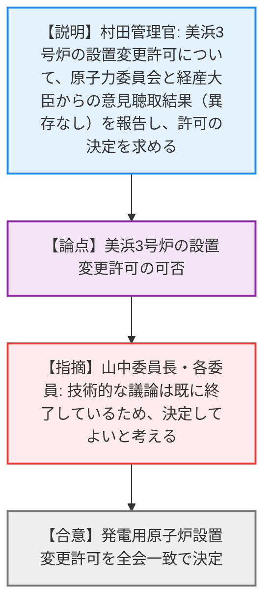
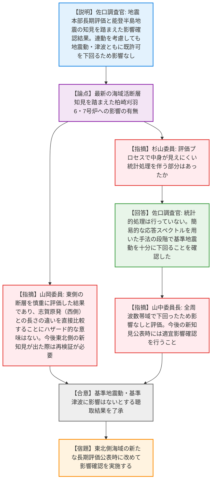
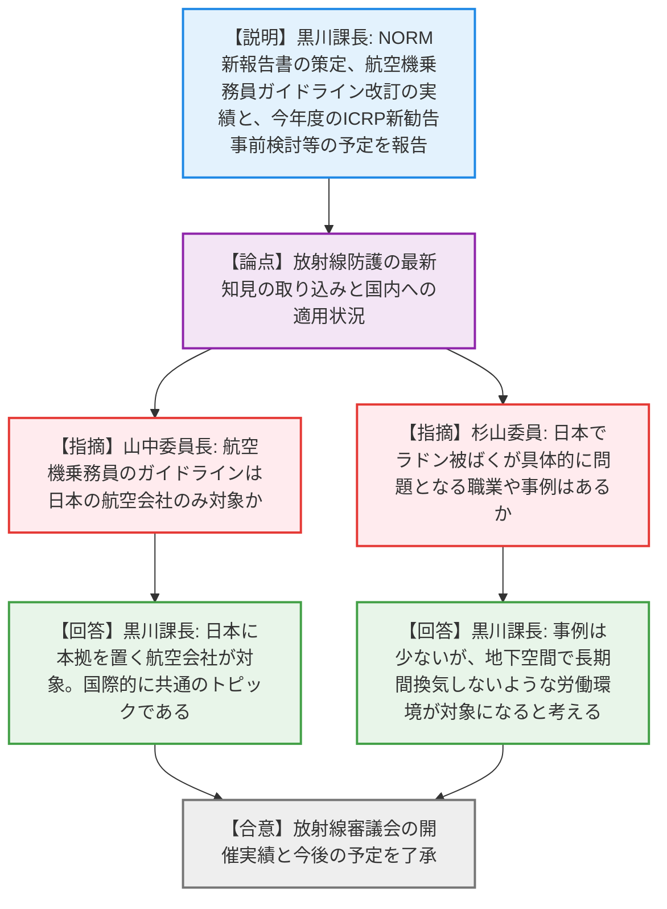
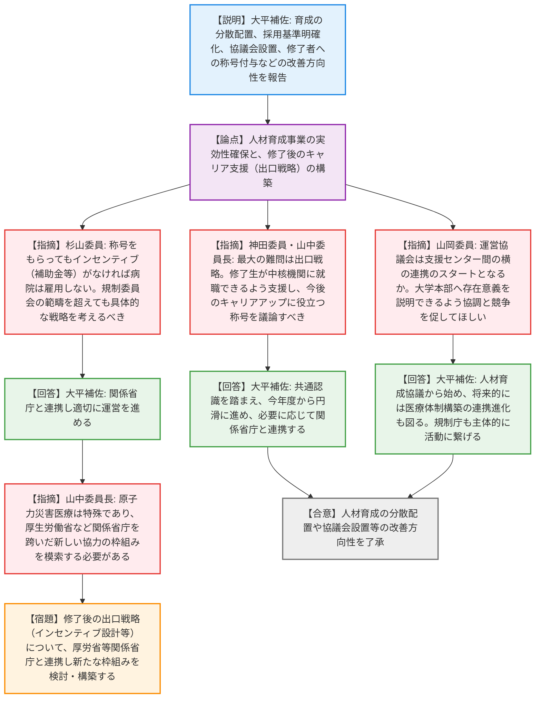
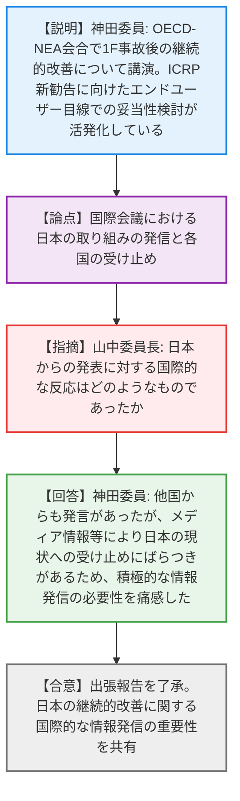

# 第4回原子力規制委員会（令和8年4月15日）
> 出典 : https://youtube.com/live/MwKn_JmvIs8?si=wv8_f6rqbgCJg373

# 会合の概要
* **美浜3号炉の設置変更許可の決定:** 美浜3号炉の溶融設備の除却及びベイラの設置に係る設置変更許可について、原子力委員会および経済産業大臣への意見聴取が完了し、全会一致で許可が決定され、手続きが滞りなく進行した。
* **柏崎刈羽6・7号炉への最新地震知見の影響確認:** 地震本部の最新の海域活断層長期評価および能登半島地震の知見を踏まえ、複数の断層連動を考慮した影響確認が行われた。結果として既許可の基準地震動・基準津波を下回ることが確認され、規制側もその評価結果に深く納得した。
* **放射線防護と災害医療人材育成における実効性の追求と危機感:** 航空機乗務員の被ばく管理やNORM（自然起源放射性物質）への対応など、国際動向に合わせた防護基準の整備が報告された。一方で、原子力災害医療の高度専門人材育成については、育成後の「出口戦略（キャリアパスや受け入れ病院へのインセンティブ）」の欠如に対する強い危機感が委員から示され、厚生労働省等を含めた関係省庁との連携による枠組み構築が強く求められた。

---

# 議題ごとの詳細整理（テキスト）

## 【議題1】関西電力株式会社美浜発電所の発電用原子炉設置変更許可（３号発電用原子炉施設の変更）－溶融設備の除却及びベイラの設置－
* **議論の背景と論点:** 美浜3号炉の設置変更許可に関する審査結果について、原子力委員会および経済産業大臣への意見聴取結果を報告し、最終的な許可の決定を求める。
* **質疑応答（詳細）:**
  * 【説明者側（規制庁 村田管理官）】からの説明
    原子力委員会からは「平和目的以外に利用される恐れがないと認められる」、経済産業大臣からは「許可することに異存はない」との回答が得られたことを報告。これらを踏まえ、原子炉等規制法に適合しているとして許可の決定を求めた。
  * 【規制側（山中委員長、他全委員）】の懸念・指摘点
    技術的な議論は既に終了しているため、出席委員全員が「決定してよいと考える」と回答。
* **結論と宿題事項（アクションアイテム）:**
  * 提出された審査結果の取りまとめおよび発電用原子炉設置変更許可が全会一致で決定・了承された。持ち越し事項はなし。

## 【議題2】地震調査研究推進本部地震調査委員会の海域活断層の長期評価による東京電力ホールディングス株式会社柏崎刈羽原子力発電所６号炉及び７号炉への影響確認に関する聴取結果
* **議論の背景と論点:** 地震本部の海域活断層の長期評価（2024・2025）と令和6年能登半島地震の知見を踏まえ、東京電力が実施した柏崎刈羽6・7号炉の基準地震動・基準津波への影響確認結果について報告し、その妥当性を確認する。
* **質疑応答（詳細）:**
  * 【説明者側（規制庁 佐口企画調査官）】からの説明
    東電は地震本部で示された断層から7断層を抽出し影響確認を実施した。結果、単独断層の地震動・津波は既許可の最大ケースを下回った。さらに能登半島地震の知見を踏まえ、「門前断層帯」「能登半島北岸断層帯」「富山トラフ西縁断層帯」の3断層の連動、および「富山トラフ横断断層」への連動を考慮して評価した結果、地震動は既許可のスペクトルを全周期帯で下回り、津波も海底地滑りとの組み合わせを含めて既許可の最高・最低水位内に収まるため、影響はないと確認された。
  * 【規制側（山岡委員）】の懸念・指摘点
    今回の評価は地震本部の2024・2025年版と能登半島地震の知見を併せて確認したため時間を要したが、一区切りついた。ただし、今後海域の北東隣の長期評価が公表された際は同様の検証が必要である。また、連動長について志賀原発（西側評価）と柏崎刈羽（東側評価）で長さが異なるが、ハザード的に直接比較することには意味がないと補足した。
  * 【規制側（杉山委員）】の懸念・指摘点
    地震動と津波の評価プロセスにおいて、中身が見えにくい統計的処理（統計的グリーン関数法など）を伴う部分はあったか。
  * 【説明者側（規制庁 佐口企画調査官）】の回答・反論・根拠
    統計的な処理は行っておらず、入力パラメータの適切性を確認した。断層モデルに基づく評価の前段階である、応答スペクトルを用いた手法で十分に基準地震動を下回ることを確認している。
  * 【規制側（山中委員長）】の懸念・指摘点
    既存の基準地震動を全周波数帯域で下回ったため影響なしと評価されたことを確認。今後新しい知見（東北側の海域）が公表された際は、適宜影響確認を行うよう求めた。
* **結論と宿題事項（アクションアイテム）:**
  * 柏崎刈羽6・7号炉の基準地震動・基準津波に影響はないとする聴取結果が了承された（合意）。
  * 将来、東北側海域の新たな長期評価が公表された際には、改めて影響確認を実施する（宿題）。

## 【議題3】令和７年度の放射線審議会の開催実績及び今後の予定
* **議論の背景と論点:** 令和7年度の放射線審議会の活動実績（NORM新報告書策定、航空機乗務員ガイドライン改訂）と、今年度以降の国際動向を踏まえた取り組み（ICRP新勧告の事前検討等）について報告。
* **質疑応答（詳細）:**
  * 【説明者側（規制庁 黒川課長）】からの説明
    NORM（自然起源放射性物質）の新報告書を策定した。また、航空機乗務員の宇宙放射線被ばくガイドラインを改訂し、年間5mSvの参考レベル、妊娠中の1mSv制限、太陽フレア対応、低被ばく者の管理要否判断などを定めた。今後はICRP2007年勧告の実効線量係数の取り入れ、NORMの残課題（ラドン、一般消費財）への対応、ICRP次期主勧告（2030年代）に向けた事前検討を行う。
  * 【規制側（神田委員）】の懸念・指摘点
    自然放射線防護は継続的検討課題。アブダビのICRPシンポジウムで規制庁職員が発表したことは新しい試みとして評価する。
  * 【規制側（山中委員長）】の懸念・指摘点
    航空機乗務員のガイドラインは日本の航空会社のみが対象か。海外の航空会社は独自の基準があるのか。
  * 【説明者側（規制庁 黒川課長）】の回答・反論・根拠
    日本に本拠を置く航空会社が対象。国際的に共通のトピックであり、他国も同様の管理を行っている。
  * 【規制側（杉山委員）】の懸念・指摘点
    NORMの検討に関連して、職務中のラドン被ばく等で、日本で具体的に問題となる職業や事例はあるか。
  * 【説明者側（規制庁 黒川課長）】の回答・反論・根拠
    日本はラドン濃度が低く具体的な事例は少ないが、地下空間で長期間換気しないような労働環境がキーワードになると考えている。
* **結論と宿題事項（アクションアイテム）:**
  * 放射線審議会の開催実績と今後の予定に関する報告が了承された（合意）。

## 【議題4】原子力災害医療における高度専門人材の育成・活動の現状と今後の取組（第２回）
* **議論の背景と論点:** 令和3年度から開始したQSTでの高度専門人材育成事業が5年を経過した。意見交換会を踏まえ、育成の分散配置、採用基準の明確化、育成プランの柔軟化、修了者への名称付与などの改善策と、育成後の「出口戦略」の構築が論点となった。
* **質疑応答（詳細）:**
  * 【説明者側（規制庁 大平課長補佐）】からの説明
    育成体制をQST一元から全高度被ばく医療支援センターへの分散配置へ変更する。職種ごとの採用要件明確化、本人の経験に応じた育成プランの策定、運営協議会での中間・修了評価を実施し、修了者には「原子力災害医療スペシャリスト」等の名称を与える方向。また、修了後は支援センターや拠点病院へ所属し、10年間の登録を義務付けて災害時派遣に備える。
  * 【規制側（神田委員）】の懸念・指摘点
    最大の難問は任期修了後のキャリア支援（出口戦略）である。修了生が中核機関に就職できるよう後押しする仕組みづくりと、6つの支援センターが強みを生かして連携するオールジャパンでの準備強化が必要。
  * 【規制側（山中委員長）】の懸念・指摘点
    11名の定員で開始したが、今後のキャリアアップに役立つ称号については議論が必要。今後5年間再度様子を見て、規制庁は連携を取りサポートしていくべき。
  * 【規制側（山岡委員）】の懸念・指摘点
    新設する運営協議会は人材育成に限った位置づけか。全国の支援センター間の横の連携のスタートとなるのか。また、大学本部に対して存在意義を説明できるよう、協調と競争を促してほしい。
  * 【説明者側（規制庁 大平課長補佐）】の回答・反論・根拠
    まずは人材育成の協議に活用するが、将来的には医療体制構築への意見反映や連携の進化も考えている。規制庁も一緒に具体的な活動につなげる議論をしたい。
  * 【規制側（杉山委員）】の懸念・指摘点
    出口戦略について、称号をもらってもインセンティブがなければ意味がない。雇用する病院側へのメリット（補助金等）がないと掛け声倒れになる。規制委員会の範疇を超えるかもしれないが、具体的な戦略を考えるべき。
  * 【説明者側（規制庁 大平課長補佐）】の回答・反論・根拠
    関係省庁とも連携しながら適切に運営を進める。
  * 【規制側（山中委員長）】の懸念・指摘点
    原子力災害医療は特殊分野であり、厚生労働省など関係省庁とまたがって新しい協力の枠組みを模索していく必要がある。
* **結論と宿題事項（アクションアイテム）:**
  * 人材育成の分散配置、運営協議会の設置、称号付与などの改善方向性が了承された（合意）。
  * 育成後のキャリアパス確立や受け入れ病院へのインセンティブ付与など、実効性のある「出口戦略」について、厚生労働省等を含めた関係省庁と連携し、新たな枠組みを検討・構築する（宿題）。

## 【議題5】神田委員の出張報告
* **議論の背景と論点:** パリで開催されたOECD-NEAの放射線防護・公衆衛生委員会（CRPPH）関連会合への出席報告と、国際的な情報発信の重要性について。
* **質疑応答（詳細）:**
  * 【説明者側（神田委員）】からの説明
    1F事故後の放射線防護と緊急時準備の継続的な改善について講演した。また、ICRP新勧告（2030年代予定）に向けた基本化グループの活動が活発化しており、規制当局等のエンドユーザー目線での妥当性検討が始まったことを報告。
  * 【規制側（山中委員長）】の懸念・指摘点
    日本からの発表に対する国際的な反応はどのようなものであったか。
  * 【説明者側（神田委員）】の回答・反論・根拠
    他国からも自国の取り組みについて積極的な発言があった。一方で、メディア情報等により日本の現状に対する受け止め方にばらつきがあるため、積極的な国際情報発信の必要性を強く感じた。
* **結論と宿題事項（アクションアイテム）:**
  * 出張報告が了承され、日本の取り組みに関する継続的かつ積極的な国際情報発信の重要性が共有された（合意）。

---

# 論理構造の可視化（Mermaid）

### 【議題1】関西電力株式会社美浜発電所の発電用原子炉設置変更許可（３号発電用原子炉施設の変更）－溶融設備の除却及びベイラの設置－

### 【議題2】柏崎刈羽原子力発電所６号炉及び７号炉への影響確認に関する聴取結果

### 【議題3】令和７年度の放射線審議会の開催実績及び今後の予定

### 【議題4】原子力災害医療における高度専門人材の育成・活動の現状と今後の取組（第２回）

### 【議題5】神田委員の出張報告

