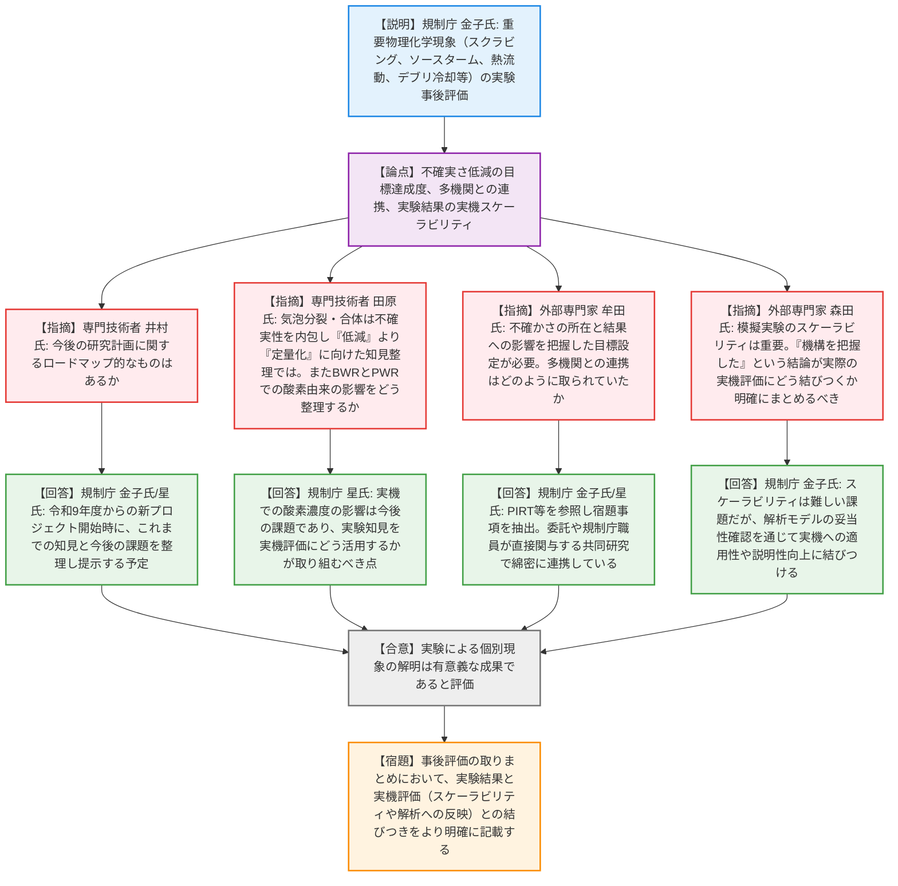
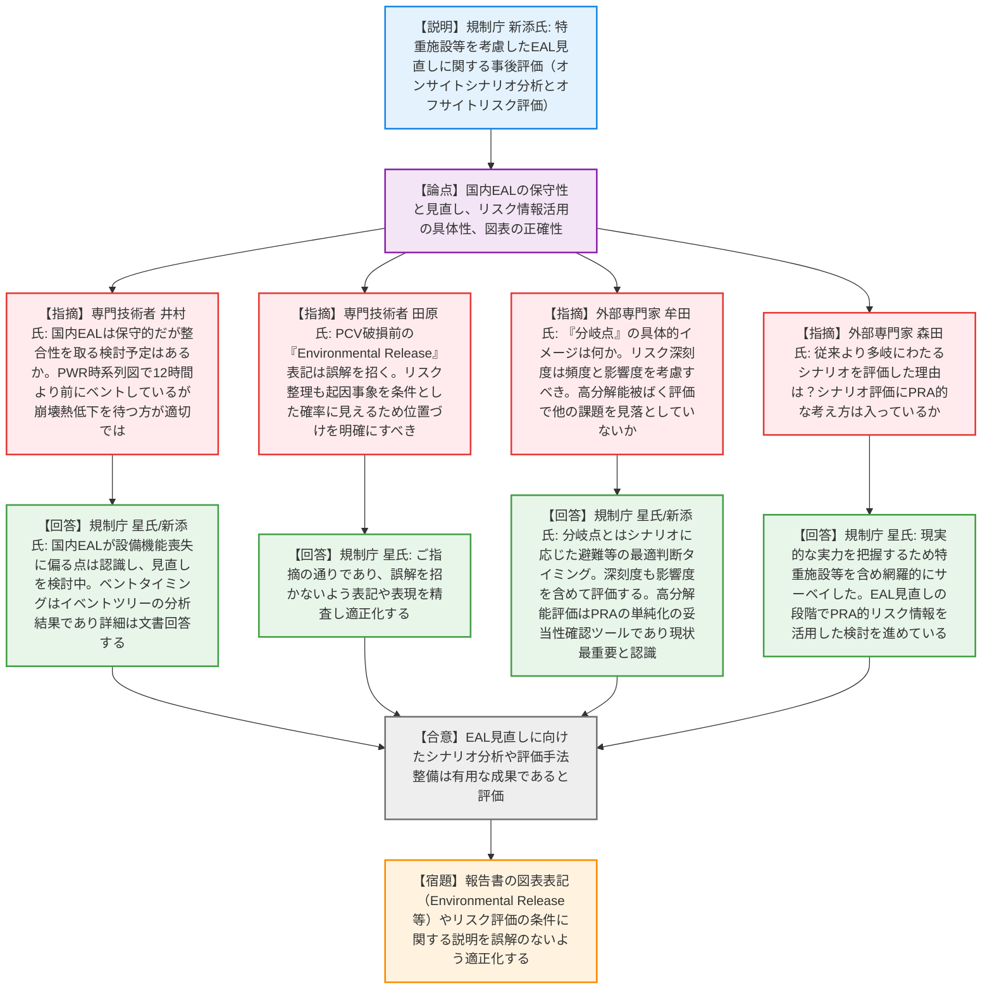

# 第14回シビアアクシデント技術評価検討会（令和8年4月16日）
> 出典 : https://youtube.com/live/mqRg27X4X0c?si=affKy2w1NOwFXllf

# 会合の概要
* **安全研究の事後評価と実機適用への橋渡し:** 令和7年度に終了した2件の安全研究プロジェクト（「重要物理化学現象の不確実さ低減」「EAL見直し」）の事後評価を実施。外部専門家および専門技術者からの技術的意見が聴取され、得られた実験データや解析手法が今後の実機評価にどう結びつくかが焦点となった。
* **物理化学現象研究における「スケーラビリティ」の課題:** プールスクラビングやデブリ冷却等の実験成果について、専門家から「実機条件との乖離（スケーラビリティ）をどう評価するか」「不確実性の低減というより定量化のフェーズではないか」といった本質的な指摘がなされ、解析モデルへの適用を通じた説明性の向上が求められた。
* **EAL（緊急時活動レベル）見直しの実効性とリスク情報の活用:** オフサイト・オンサイトのシナリオ分析によるEAL見直しの研究では、国内EALが諸外国に比べ「設備機能喪失」に偏り保守的であることへの課題意識が共有された。PRAの単純化モデルの影響確認や、防護措置の「分岐点」を一般公衆へ分かりやすく説明していくことの重要性が確認された。

---

# 議題ごとの詳細整理（テキスト）

## 【議題1】安全研究プロジェクトの技術的観点からの評価（重大事故時における重要物理化学現象の不確実さ低減に係る実験 事後評価）
* **議論の背景と論点:** 重大事故時の不確実さが大きい5つの物理化学現象（プールスクラビング、ソースターム、雰囲気熱流動、粒子状デブリ冷却、プール内温度成層化）の機構解明とデータ取得を目的とした研究の事後評価。実機条件への適用性（スケーラビリティ）や、今後の研究ロードマップの有無が論点となった。
* **質疑応答（詳細）:**
  * 【説明者側】（規制庁 金子氏）からの説明
    5つの重要現象について、国内外の最新知見を踏まえて実験データを取得し、機構を解明した。これらの成果は、重大事故の進展評価や解析コードの開発に活用していると説明。
  * 【規制側（専門技術者）】（三菱重工 井村氏）の懸念・指摘点
    今後の研究計画に関するロードマップ的なものはあるか。現象の整理から今後の課題への取り組み方針が示されると分かりやすい。
  * 【説明者側】（規制庁 金子氏・星氏）の回答・反論・根拠
    令和9年度からの新プロジェクト開始の初期段階で、これまでの知見と今後の課題を整理した結果を提示する予定である。
  * 【規制側（専門技術者）】（東芝 田原氏）の懸念・指摘点
    プールスクラビングの気泡分裂・合体は不確実性を内包するプロセスであり、「低減」というより「定量化」に向けた知見整理ではないか。また、ソースターム実験で酸素存在下の化学反応が確認されたが、窒素置換されているBWRとPWRでの酸素由来の影響をどう整理するかが重要である。
  * 【説明者側】（規制庁 星氏）の回答・反論・根拠
    ご指摘の通り、実機で酸素濃度がどう影響するかは今後の課題であり、実験知見を実機評価にどう活用するかが取り組むべき点と認識している。
  * 【規制側（外部専門家）】（東京都市大 牟田氏）の懸念・指摘点
    どこに不確かさがあり、結果にどう影響するかを把握した上で目標設定すべきである。また、他機関との連携はどのように取られていたか。
  * 【説明者側】（規制庁 金子氏・星氏）の回答・反論・根拠
    PIRT（重要度ランキング）等を参照し対象を選定した。連携については、委託事業だけでなく規制庁職員が直接計測等に関与する共同研究も行い、綿密な連携体制を敷いている。
  * 【規制側（外部専門家）】（九州大 森田氏）の懸念・指摘点
    模擬実験と実機条件との乖離（スケーラビリティ）は重要問題か。また、「機構を把握するデータが得られた」という結論が、実際の実機の不確実性低減にどう結びついているかを明確にまとめるべき。
  * 【説明者側】（規制庁 金子氏）の回答・反論・根拠
    スケーラビリティは非常に難しい課題と認識している。実験で機構を解明し、それを解析モデルやコードに反映し、妥当性確認を通じて実機への適用性や説明性の向上に結びつける方針である。
* **結論と宿題事項（アクションアイテム）:**
  * 実験による個別現象の解明は有意義な成果であると評価され、研究の進め方は概ね妥当と認められた（合意）。
  * 事後評価の取りまとめにおいて、得られた実験結果と実機評価（スケーラビリティや解析コードへの反映など）との結びつきをより明確に記載する（宿題）。

## 【議題2】安全研究プロジェクトの技術的観点からの評価（特定重大事故等対処施設等を考慮した緊急時活動レベル（EAL）見直しに関する研究 事後評価）
* **議論の背景と論点:** オフサイト・オンサイト両面からの事故シナリオ分析およびリスク評価を通じたEAL見直しのための知見取得に関する事後評価。国際比較における国内EALの保守性、解析モデルの単純化の妥当性、および報告書の表記の正確性が論点となった。
* **質疑応答（詳細）:**
  * 【説明者側】（規制庁 新添氏）からの説明
    特定重大事故等対処施設等を考慮したシナリオ分析、PRAを用いたEALの深刻度評価、OSCAコード改良等の高分解能被ばく評価手法を整備し、防護措置の有効性変化を確認したと説明。
  * 【規制側（専門技術者）】（三菱重工 井村氏）の懸念・指摘点
    国内EALは諸外国と比べ軽微な状態で防護措置を要求するなど保守的だが、整合性を取る検討予定はあるか。また、PWRのイベント時系列図で12時間より前にベントしているケースがあるが、現実的には崩壊熱低下を待つ方が適切ではないか。
  * 【説明者側】（規制庁 星氏・新添氏）の回答・反論・根拠
    国内EALが設備機能喪失に偏り保守的である点は認識しており、現在EAL見直し検討会でパラメータや障壁機能喪失を基準とする見直しを議論中である。ベントのタイミングはイベントツリーに基づく分析結果であり、詳細は後日文書で回答する。
  * 【規制側（専門技術者）】（東芝 田原氏）の懸念・指摘点
    図2-1のPCV破損前の「Environmental Release」表記は炉心損傷前であり誤解を招く。また、リスク整理がEAL発生条件ではなく起因事象を条件とした確率に見えるため、位置づけを明確にすべき。
  * 【説明者側】（規制庁 星氏）の回答・反論・根拠
    ご指摘の通りであり、誤解を招かないよう表記や表現を精査し適正化する。
  * 【規制側（外部専門家）】（東京都市大 牟田氏）の懸念・指摘点
    防護措置の「分岐点」の具体的イメージは何か。深刻度は頻度だけでなく影響度も考慮すべきである。また、高分解能被ばく評価において他に重要な課題を見落としていないか。
  * 【説明者側】（規制庁 星氏・新添氏）の回答・反論・根拠
    分岐点とは、放出シナリオ（量やタイミング）に応じた避難や安定ヨウ素剤服用の最適な判断タイミングを指す。深刻度も頻度と放出量等を含めたリスクで評価する方向で検討中である。高分解能評価はPRAの単純化モデルの妥当性（地形や建屋影響）を確認するためのツールであり、現状ではこれが最重要課題と認識している。
  * 【規制側（外部専門家）】（九州大 森田氏）の懸念・指摘点
    従来より多岐にわたるシナリオを評価した理由は何か。また、そのシナリオ評価やソースターム評価にPRA的な考え方（頻度や不確実性）は入っているか。
  * 【説明者側】（規制庁 星氏）の回答・反論・根拠
    再稼働プラントの現実的な実力を把握するため、特重施設等を含めたシナリオを網羅的にサーベイした。EAL見直しの段階でPRA的なリスク情報（不確かさも含む）を活用した検討を進めている。
* **結論と宿題事項（アクションアイテム）:**
  * EAL見直しに向けたシナリオ分析やOSCAコード改良等の評価手法整備は、有用な成果であると評価された（合意）。
  * 報告書の図表表記（Environmental Release等）やリスク評価の条件に関する説明を、誤解のないよう適正化・修正する（宿題）。

---

# 論理構造の可視化（Mermaid）

### 【議題1】安全研究プロジェクトの技術的観点からの評価（重大事故時における重要物理化学現象の不確実さ低減に係る実験 事後評価）

### 【議題2】安全研究プロジェクトの技術的観点からの評価（特定重大事故等対処施設等を考慮した緊急時活動レベル（EAL）見直しに関する研究 事後評価）

