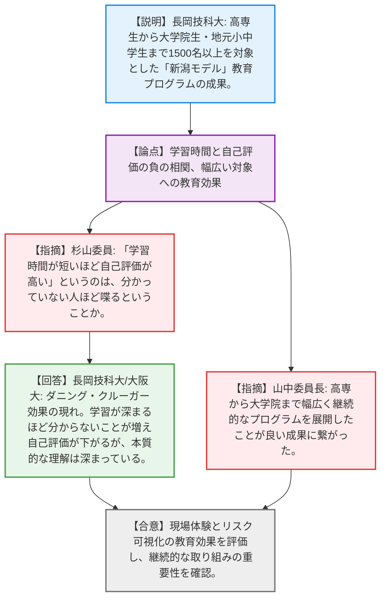
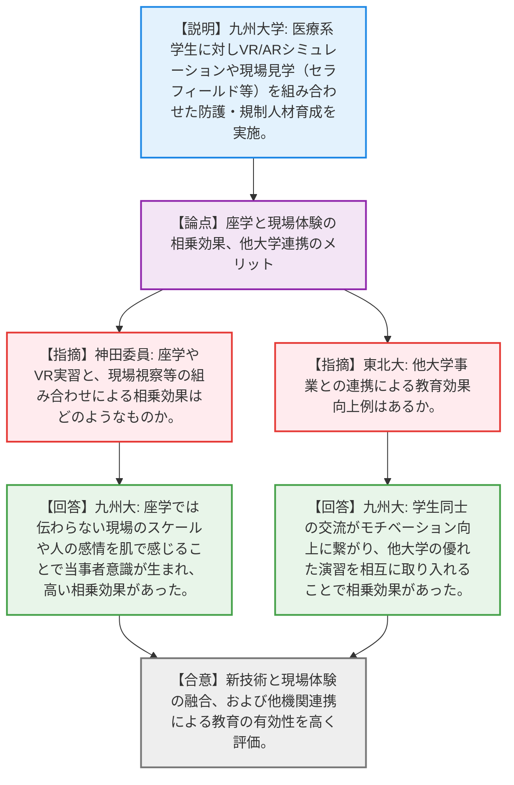
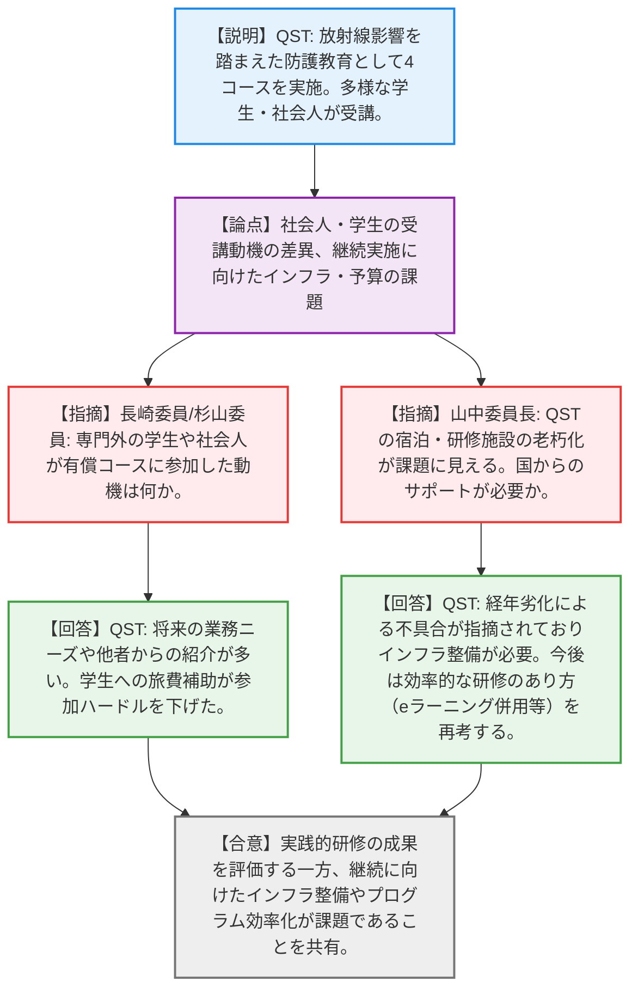
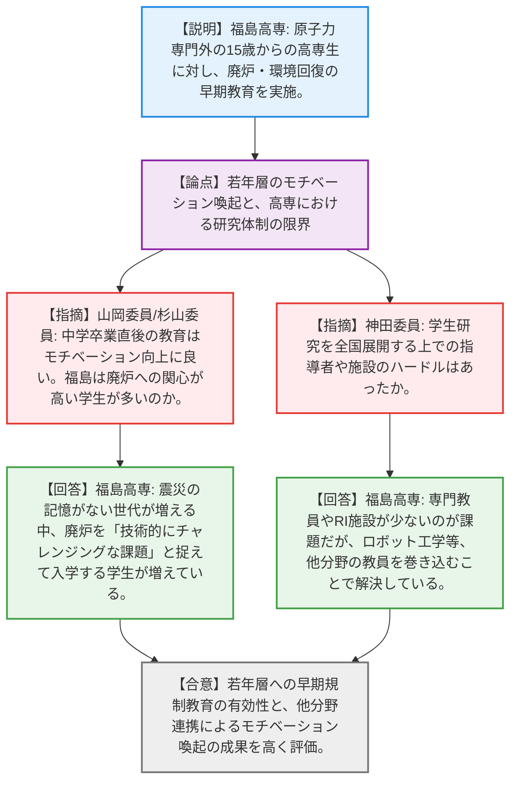
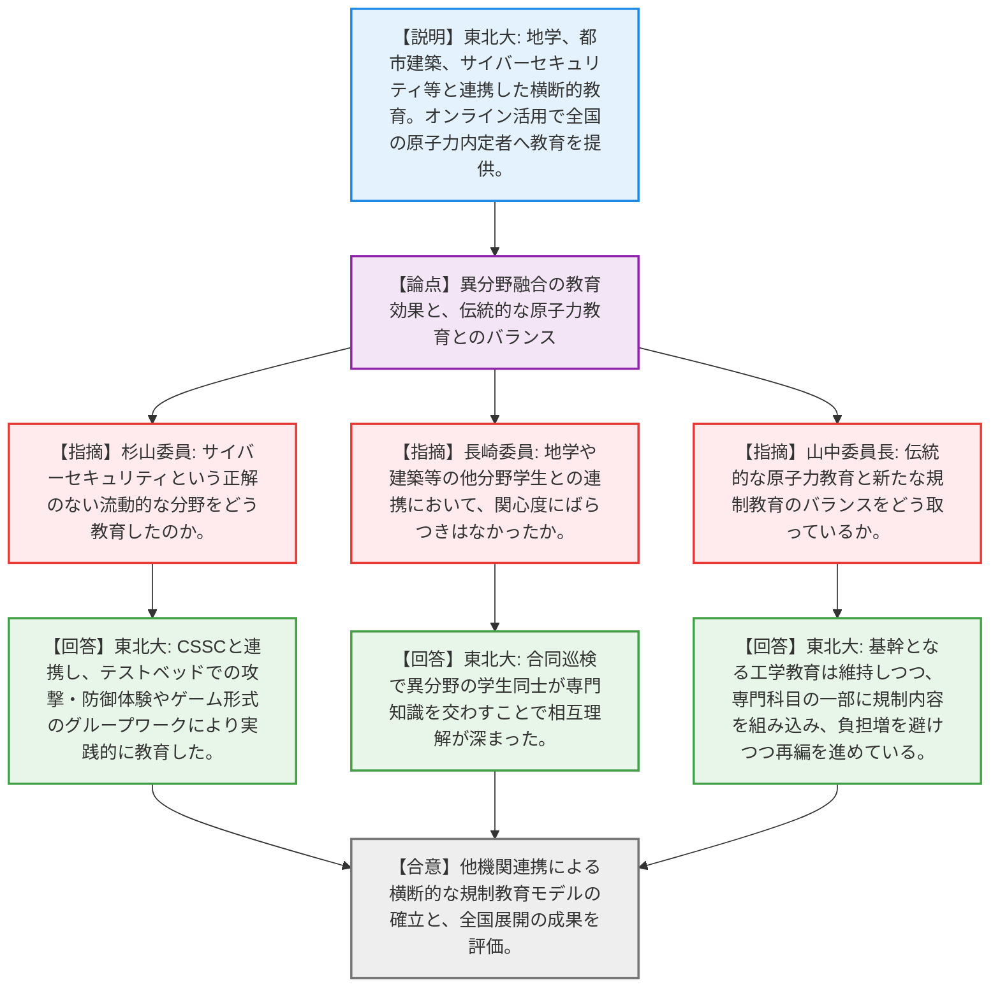
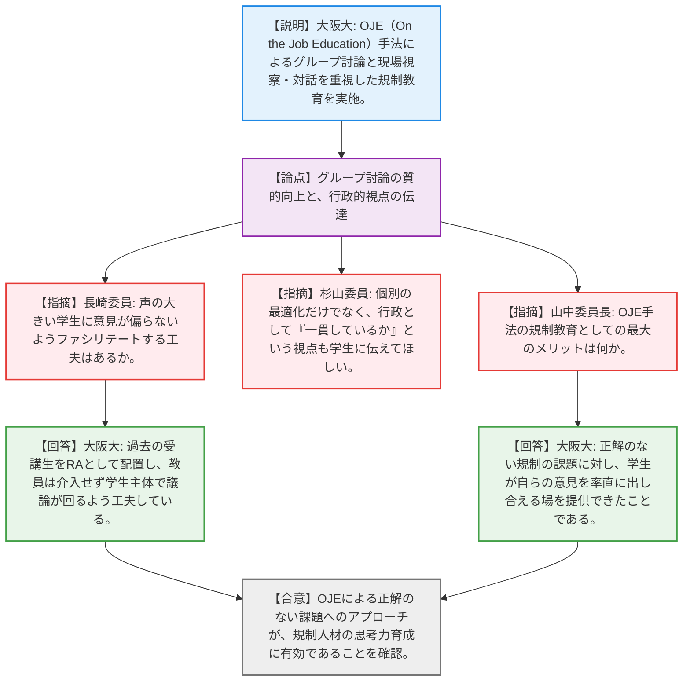
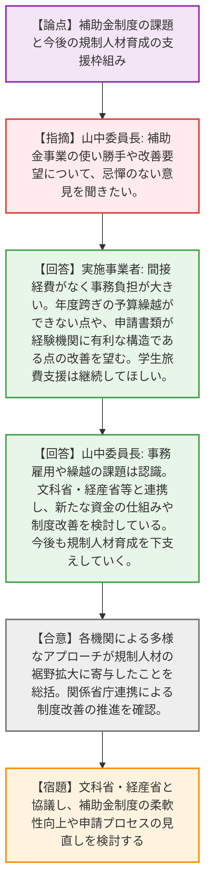

# 第1回原子力規制人材育成事業における令和7年度終了事業報告会（令和8年4月20日）
> 出典 : https://youtube.com/live/yXg2JRwMiDk?si=oNCWFo4bcfUmNA_f

# 会合の概要
* **多様なアプローチによる規制人材の裾野拡大:** 令和3年度から開始された6事業（長岡技科大、九州大、QST、福島高専、東北大、大阪大）の成果が報告された。VR/ARを活用したシミュレーション、国内外の現場視察（福島第一、セラフィールド等）、OJE（On the Job Education）手法、異分野（地学・建築・サイバーセキュリティ等）との融合など、各機関の強みを活かした実践的な教育が高く評価された。
* **現場体験と対話を通じた「当事者意識」の醸成:** 座学による知識付与だけでなく、現場での体験や、学生同士・専門家（規制委員等）との直接対話を通じて、学生が原子力規制を「自分ごと」として捉え、安全確保やリスクコミュニケーションの重要性を深く理解する意識変容（マインドシフト）が起きたことが共通の成果として確認された。
* **補助金制度の硬直性と事務負担の課題顕在化:** 全体ディスカッションにおいて、実施事業者側から「間接経費がないことによる事務負担の増大」「年度を跨いだ予算執行の柔軟性不足」「申請書類の煩雑さによる新規参入障壁」など、補助金制度特有の課題が率直に指摘された。
* **関係省庁連携による制度改善への意志:** 委員長および規制委員会側は事業者からの課題指摘を重く受け止め、文部科学省や経済産業省と連携し、より使い勝手の良い資金の仕組みや制度改善を進め、今後も規制人材育成を下支えしていく強い方針を示した。

---

# 議題ごとの詳細整理（テキスト）

## 【議題1】長岡技術科学大学 報告
* **議論の背景と論点:** 高専生から大学院生、地元小中学生までを対象とした一貫教育「新潟モデル」の成果報告。学習時間と自己評価の関係性や、現場視察の教育効果が論点となった。
* **質疑応答（詳細）:**
  * 【説明者側】（長岡技科大 菊地氏）からの説明
    1500名以上を対象に、現場視察（福島、柏崎刈羽）やインターンシップ、小中学生への教育を通じて、規制と社会的責任の自覚を促した。データ分析では、学習時間が短い学生ほど「自己評価（積極性）」が高く出るという負の相関が見られたと報告。
  * 【規制側】（杉山委員）の懸念・指摘点
    「学習時間が短いほど自己評価が高い」というのは、「分かっていない人ほどよく喋る」ということか。
  * 【説明者側】（長岡技科大 菊地氏 / 大阪大 北田氏）の回答・反論・根拠
    教育学における「ダニング・クルーガー効果」の現れである。学習が深まるほど「分からないこと」が増え自己評価が下がるが、本質的な理解は確実に深まっていると捉えている。
  * 【規制側】（山中委員長）の懸念・指摘点
    高専から大学院まで幅広く継続的なプログラムを展開したことが良い成果に繋がった。今後も継続を期待する。
* **結論と宿題事項（アクションアイテム）:**
  * 新潟モデルを通じた現場体験とリスク可視化の教育効果が高く評価され、継続的な取り組みの重要性が確認された（合意）。

## 【議題2】九州大学 報告
* **議論の背景と論点:** 医学部・保健学科の学生に対し、VR/ARや現場視察（セラフィールド等）を組み合わせた放射線防護教育の成果報告。座学と現場体験の相乗効果や、多様なバックグラウンドを持つ学生への対応が論点となった。
* **質疑応答（詳細）:**
  * 【説明者側】（九州大 藤淵氏）からの説明
    医療系学生に対し、放射線防護・規制の科目を必修等に組み込み、VR/ARによるシミュレーションや国内外の現場視察を実施。結果として、規制庁へ2名の就職者を輩出したと報告。
  * 【規制側】（神田委員）の懸念・指摘点
    座学やVR実習と、現場視察やロールプレイ等を組み合わせたことによる相乗効果はどのようなものか。
  * 【説明者側】（九州大 藤淵氏）の回答・反論・根拠
    座学だけでは伝わらない現場のスケール感や、人の感情（リスクコミュニケーションの重要性）を肌で感じることで当事者意識が生まれ、高い相乗効果が確認された。
  * 【規制側】（杉山委員）の懸念・指摘点
    医療系学生を対象にリスクコミュニケーション演習を取り入れたのは興味深い。学年が進むにつれての意識変化を見たい。セラフィールド見学は1F廃炉と重なり非常に適切である。
  * 【規制側】（東北大 伊藤氏）の懸念・指摘点
    他大学（東北大等）の事業と連携したことによる教育効果の向上例はあるか。
  * 【説明者側】（九州大 藤淵氏）の回答・反論・根拠
    学生同士の交流がモチベーション向上に繋がり、他大学の優れた演習（放射線生物学等）を相互に取り入れることで相乗効果があった。
* **結論と宿題事項（アクションアイテム）:**
  * VR/AR等の新技術と現場体験の融合、および他機関との連携による放射線規制教育の有効性が高く評価された（合意）。

## 【議題3】量子科学技術研究開発機構（QST） 報告
* **議論の背景と論点:** 入門、管理計測、生命科学、法令アドバンスの4コースを通じた放射線防護教育の成果報告。社会人と学生の受講動機の差異や、事業継続に向けたインフラ・予算の課題が論点となった。
* **質疑応答（詳細）:**
  * 【説明者側】（QST 赤羽氏）からの説明
    521名が受講し、学生には旅費・宿泊費を全額補助した。参加者の評価は高いが、QSTのインフラ老朽化や人材不足、8日間の対面研修の負担の重さから、次年度の応募は見送ったと報告。
  * 【規制側】（長崎委員/杉山委員）の懸念・指摘点
    専門外の学生や社会人が有償コースに参加した動機は何か。
  * 【説明者側】（QST 赤羽氏）の回答・反論・根拠
    将来の研究・実務で放射線を使う可能性や、他者からの紹介が多い。学生への旅費・宿泊費の補助が参加ハードルを大きく下げた。
  * 【規制側】（山中委員長）の懸念・指摘点
    学生と社会人が共に学ぶ良い機会だが、QSTの宿泊・研修施設の老朽化が課題に見える。国からのサポートが必要か。
  * 【説明者側】（QST 赤羽氏）の回答・反論・根拠
    長年使用している施設であり、経年劣化による不具合がアンケートでも指摘されている。インフラ整備の検討が必要と認識している。今後は効率的な研修のあり方（eラーニング併用など）を再考する。
* **結論と宿題事項（アクションアイテム）:**
  * 多様な参加者に対する実践的研修の成果が評価された一方、継続に向けたインフラ整備やプログラムの効率化が課題として共有された（合意）。

## 【議題4】福島工業高等専門学校 報告
* **議論の背景と論点:** 原子力専門外の15歳からの高専生に対し、廃炉・環境回復の早期教育を実施した成果報告。若年層のモチベーション喚起と、高専における研究体制の限界が論点となった。
* **質疑応答（詳細）:**
  * 【説明者側】（福島高専 鈴木氏）からの説明
    震災の記憶がない世代に対し、1Fやセラフィールド視察、単位互換制度を活用した全国展開を実施。学生研究を通じて廃炉への関心を高めたと報告。
  * 【規制側】（山岡委員/杉山委員）の懸念・指摘点
    中学卒業直後の学生への教育はモチベーション向上に良い。福島という土地柄、廃炉への関心が高い学生が多いのか。
  * 【説明者側】（福島高専 鈴木氏）の回答・反論・根拠
    震災の記憶がない世代が増える中、廃炉を「後始末」ではなく「技術的にチャレンジングな課題」と捉えて入学する学生が増えている。
  * 【規制側】（神田委員）の懸念・指摘点
    高専生による学生研究は教育効果が高いが、全国展開する上での指導者や施設のハードルはあったか。
  * 【説明者側】（福島高専 鈴木氏）の回答・反論・根拠
    原子力専門の教員やRI施設が少ないのが課題だが、ロボット工学等、他分野の教員を巻き込むことで、卒業研究のテーマとして取り組んでもらうきっかけを作っている。
* **結論と宿題事項（アクションアイテム）:**
  * 高専生という若年層への早期規制教育の有効性と、他分野連携によるモチベーション喚起の成果が高く評価された（合意）。

## 【議題5】東北大学 報告
* **議論の背景と論点:** 他研究科（地学、都市建築）やCSSC（サイバーセキュリティ）と連携した横断的教育の成果報告。異分野融合の教育効果と、伝統的な原子力教育とのバランスが論点となった。
* **質疑応答（詳細）:**
  * 【説明者側】（東北大 伊藤氏）からの説明
    サイバーセキュリティ、自然災害対策（合同巡検）、鉄筋コンクリート構造など、多専攻と連携した教育を展開。また、オンライン講義を全国の原子力分野内定者へ提供したと報告。
  * 【規制側】（杉山委員）の懸念・指摘点
    サイバーセキュリティという正解のない流動的な分野をどう教育したのか。
  * 【説明者側】（東北大 伊藤氏）の回答・反論・根拠
    専門機関(CSSC)と連携し、テストベッドでの攻撃・防御体験や、限られたリソースで対策を選ぶゲーム形式のグループワーク等により実践的に教育した。
  * 【規制側】（長崎委員）の懸念・指摘点
    地学や建築等の他分野学生との連携において、関心度にばらつきはなかったか。
  * 【説明者側】（東北大 伊藤氏）の回答・反論・根拠
    応用堆積学等の合同巡検では、異分野の学生同士が専門知識を交わすことで相互理解が深まった。情報や建築分野への展開拡大は今後の課題である。
  * 【規制側】（山中委員長）の懸念・指摘点
    東北大の伝統的な原子力教育（古風な原子力）と新たな規制教育のバランスをどう取っているか。
  * 【説明者側】（東北大 伊藤氏）の回答・反論・根拠
    基幹となる工学教育は維持しつつ、専門科目の一部に規制や廃炉の内容を組み込み、学生の負担増を避けつつ幅広く学べるよう再編を進めている。
* **結論と宿題事項（アクションアイテム）:**
  * 他研究科・外部機関との連携による横断的な規制教育モデルの確立と、オンライン活用による全国展開の成果が評価された（合意）。

## 【議題6】大阪大学 報告
* **議論の背景と論点:** OJE（On the Job Education）手法によるグループ討論と現場視察を重視した教育の成果報告。グループ討論の質的向上手法と、行政的視点の伝達が論点となった。
* **質疑応答（詳細）:**
  * 【説明者側】（大阪大 北田氏）からの説明
    福島事故後の規制のあり方について、学生主体で討論し、専門家や規制庁職員と対話するOJE手法の成果を報告。
  * 【規制側】（長崎委員）の懸念・指摘点
    グループ討論において、声の大きい学生に意見が偏らないようファシリテートする工夫はあるか。
  * 【説明者側】（大阪大 北田氏）の回答・反論・根拠
    過去の受講生をRA（リサーチアシスタント）として配置し、教員は介入せず学生主体で議論が回るよう事前打ち合わせを徹底している。
  * 【規制側】（杉山委員）の懸念・指摘点
    個別の最適化だけでなく、行政として「一貫しているか」という視点も学生に伝えてほしい。
  * 【規制側】（山中委員長）の懸念・指摘点
    OJE手法の規制教育としての最大のメリットは何か。
  * 【説明者側】（大阪大 北田氏）の回答・反論・根拠
    正解のない規制の課題に対し、学生が自らの意見を率直に出し合える場を提供できたことである。大学全体としても、法規制の講義が欠落していた反省から、大学院の必須要素として組み込んでいる。
* **結論と宿題事項（アクションアイテム）:**
  * OJEによる正解のない課題へのアプローチが、規制人材の思考力育成に有効であることが確認された（合意）。

## 【議題7】全体ディスカッション
* **議論の背景と論点:** 報告会全体を総括し、今後の規制人材育成事業の改善に向けた補助金制度の使い勝手や要望が論点となった。
* **質疑応答（詳細）:**
  * 【規制側】（山中委員長）の懸念・指摘点
    補助金事業の使い勝手や改善要望について、実施事業者から忌憚のない意見を聞きたい。
  * 【説明者側】（実施事業者複数）の回答・反論・根拠
    ・間接経費がないため、事務対応等の負担が大きい。
    ・社会情勢の変化に応じた計画変更の柔軟性や、年度跨ぎの予算繰越ができないことがネックである。
    ・学生への旅費支援は極めて重要であり継続してほしい。
    ・申請書のフォーマットが同じ内容を何度も書かせる構造で煩雑であり、経験機関に有利になりがちである。
  * 【規制側】（山中委員長）の回答・反論・根拠
    事務雇用や繰越の課題は認識している。現在、文科省・経産省・規制庁の3省庁で協議し、新しい資金の仕組みや制度改善を検討している。今後もより良いプロジェクトを採択し、規制人材育成を下支えしていく。
* **結論と宿題事項（アクションアイテム）:**
  * 各機関による多様なアプローチが規制人材の裾野拡大に寄与したことが総括された（合意）。
  * 補助金制度の柔軟性向上や申請プロセスの見直しについて、文科省・経産省と協議し制度改善を進める（宿題）。

---

# 論理構造の可視化（Mermaid）

### 【議題1】長岡技術科学大学 報告

### 【議題2】九州大学 報告

### 【議題3】量子科学技術研究開発機構（QST） 報告

### 【議題4】福島工業高等専門学校 報告

### 【議題5】東北大学 報告

### 【議題6】大阪大学 報告

### 【議題7】全体ディスカッション

