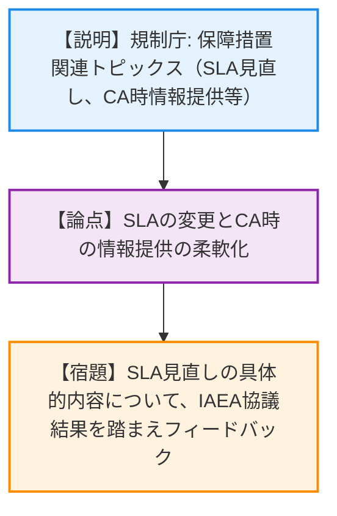
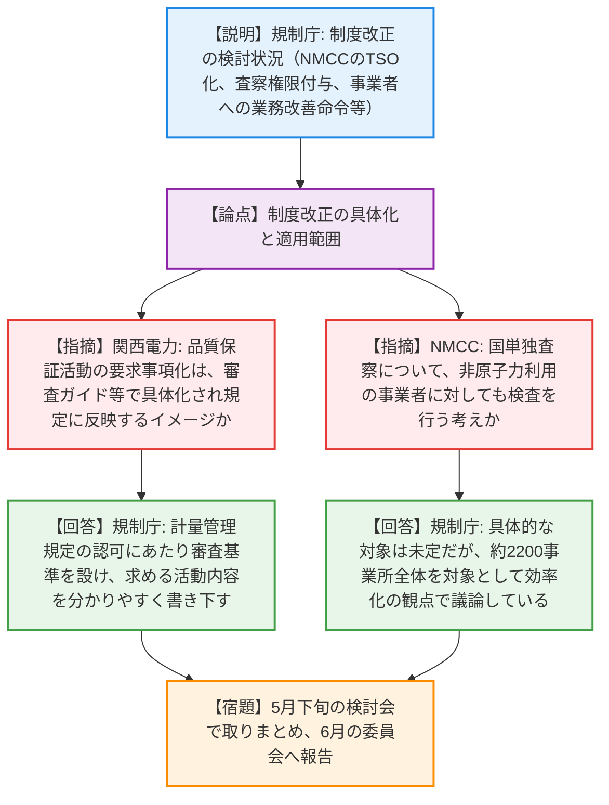
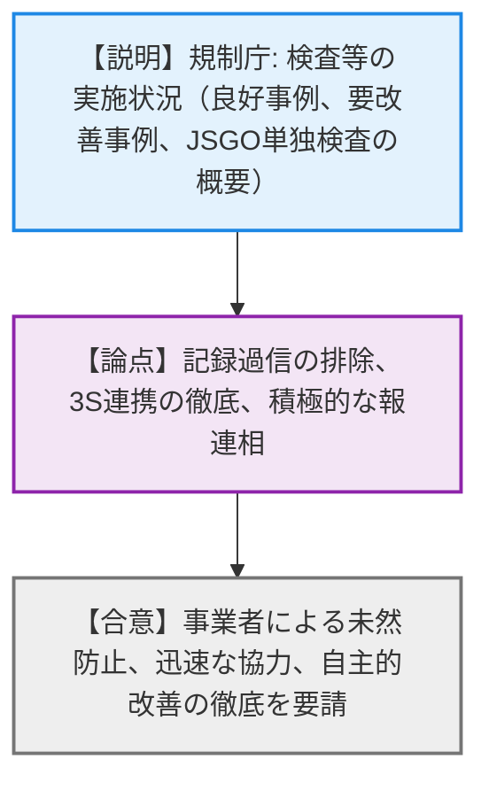
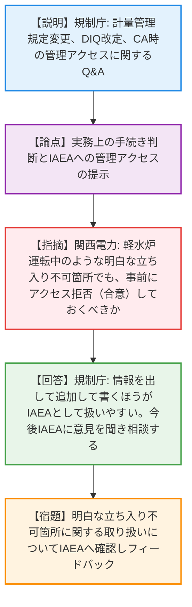
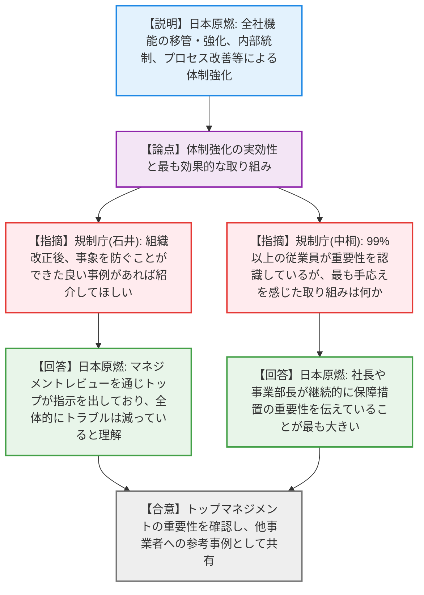
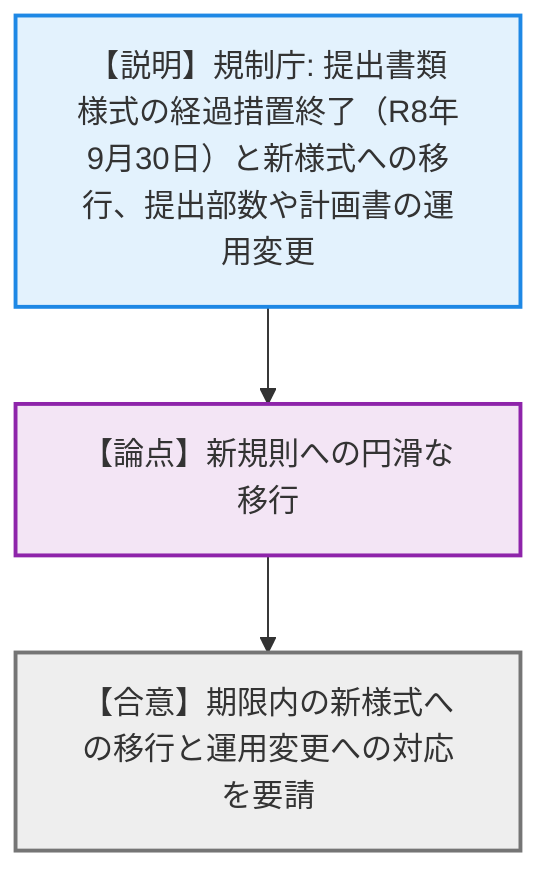

# 第1回保障措置実施に係る事業者連絡会（令和8年4月20日）
> 出典 : https://youtube.com/live/fmNXO_wCQ7c?si=XPVVxT9Kf7U9n7wV

# 会合の概要
* **保障措置制度の抜本的見直しと検査権限の移譲検討:** IAEAの査察リソースの約20%を占める我が国の現状を踏まえ、国内保障措置制度のあり方検討会における「NMCC（核物質管理センター）への査察権限付与」や「事業者への業務改善命令の導入」など、現行制度の枠を超えた抜本的な改革案が示された。これに対し、事業者から具体的な運用イメージを問う質問が出るなど、制度変更に対する高い関心が伺えた。
* **実務現場における要改善事例の共有と適切な対応の徹底:** 過去の記録を過信した申告誤り、保管廃棄（FW）在庫の未申告、汚染事象発生時の連絡遅れなど、具体的な要改善事例が共有された。規制庁は、記録の過信排除や3S（安全・核セキュリティ・保障措置）連携の重要性を強調し、積極的な「報連相」を求めた。
* **IAEAアプローチの変更とCA（補完的なアクセス）時の情報提供の柔軟化:** IAEAによる国レベル保障措置アプローチ（SLA）の見直しが進行中であることが報告された。また、CA時の「管理されたアクセス」の提示タイミングについて、IAEAから通告受領後でも可能との見解が示され、事業者の実務負担軽減と円滑な査察対応への期待が高まった。
* **大規模施設しゅん工に向けた事業者の体制強化とトップマネジメントの重要性:** 日本原燃から、六ヶ所再処理施設等のしゅん工に向けた全社的な体制強化策が発表された。99%以上の従業員が保障措置の重要性を認識しているとの成果に対し、トップの継続的なメッセージ発信が鍵であるとの実感が共有され、規制庁からも高く評価された。

---

# 議題ごとの詳細整理（テキスト）

## 【議題1】保障措置関連トピックス
* **議論の背景と論点:** IAEAによる国レベル保障措置アプローチ（SLA）の見直し状況、および補完的なアクセス（CA）時の管理アクセス情報提供タイミングの柔軟化に関する最新動向の共有。
* **質疑応答（詳細）:**
  * 【説明者側】（規制庁 石井氏）からの説明
    IAEAとのSLA見直し協議が進行中であり、今週木曜日に詳細な協議を実施予定であること。また、CA時の「管理されたアクセス」の情報提供について、従来は事前提供が必要とされていたが、IAEAとの協議の結果、通告受領後であっても情報提供が可能との見解が示された旨を報告。
* **結論と宿題事項（アクションアイテム）:**
  * SLA見直しの具体的内容については、IAEAとの協議結果を踏まえて改めて事業者にフィードバックする（宿題）。

## 【議題5】保障措置に係る今後の制度改正
* **議論の背景と論点:** 国内保障措置制度のあり方検討会における中間報告。NMCCへの査察権限付与や事業者への業務改善命令導入など、今後の制度改正の方向性が論点となった。
* **質疑応答（詳細）:**
  * 【説明者側】（規制庁 中崎氏）からの説明
    JSGOとNMCCの関係性強化（TSO機能強化、査察権限の付与、予算の統合等）、事業者に対する品質保証活動の要求事項化、業務改善命令の導入、およびIAEAとの関係性強化について説明。
  * 【事業者側】（関西電力 西内氏）の懸念・指摘点
    品質保証活動を制度上の要求事項に位置づける点について、審査・検査ガイドで具体化され、計量管理規定等に反映していくイメージでよいか。
  * 【説明者側】（規制庁 中崎氏）の回答・反論・根拠
    現状の計量管理規定をアップグレードして認可するにあたり、審査基準を設ける必要がある。その中でどのような品質保証活動をお願いするかを分かりやすく書き下す予定である。
  * 【事業者側】（NMCC 武藤氏）の懸念・指摘点
    国単独査察の対象として、非原子力利用の事業者に対しても検査を行っていく考えか。
  * 【説明者側】（規制庁 中崎氏）の回答・反論・根拠
    具体的な対象は未定だが、約2200事業所全体を対象として効率化を検討する必要があるという観点で議論している。
* **結論と宿題事項（アクションアイテム）:**
  * 制度改正の方向性について理解が得られた。5月下旬の検討会で取りまとめ、6月の委員会へ報告予定（宿題）。

## 【議題2】保障措置検査等の実施状況
* **議論の背景と論点:** IAEAと国が同時に行う検査における良好事例と要改善事例の共有、およびJSGO単独検査の実施手順と留意点に関する周知。
* **質疑応答（詳細）:**
  * 【説明者側】（規制庁 筒井氏）からの説明
    良好事例として、アウトライヤー発生時の迅速な調査・報告対応を紹介。要改善事例として、①過去の記録を過信しPITで中身を確認せず申告誤り、②保管廃棄在庫の未申告と担当者引継ぎ不足、③汚染事象発生時に安全上問題ないとしてJSGOへ連絡しなかった事例、④CA時に製品製造環境を保護するための管理アクセスを未設定であった事例を共有。また、LOFに対するJSGO単独検査の概要を説明した。
* **結論と宿題事項（アクションアイテム）:**
  * 事業者に対し、未然防止と迅速な協力、3S連携を含む自主的改善、積極的な「報連相」の徹底を要請した（合意）。

## 【議題3】よくあるお問合せ
* **議論の背景と論点:** 計量管理規定の変更認可申請、DIQ改定、CA時の管理されたアクセスの提示タイミングに関する実務上の疑問点解消。
* **質疑応答（詳細）:**
  * 【説明者側】（規制庁 佐藤氏）からの説明
    国規則の経過措置期間中でも早めの計量管理規定変更を推奨。組織名変更は原則事前申請が必要。DIQ改定について、貯蔵スペース増設は取扱量に影響し得るためコード3.1.6に基づく対応が必要であること。また、CA時の管理されたアクセスの提供タイミング（事前の情報整理と速やかな提示）について解説。
  * 【事業者側】（関西電力 石田氏）の懸念・指摘点
    CA時の管理アクセスについて、軽水炉の原子炉運転中のような明白な立ち入り不可箇所についても、事前にアクセス拒否（合意）しておくべきか。
  * 【説明者側】（規制庁 石井氏）の回答・反論・根拠
    IAEAも安全最優先は理解しているはずだが、情報を出して追加して書くほうがIAEAとして扱いやすい。今後IAEAに意見を聞き、情報共有・相談する。
* **結論と宿題事項（アクションアイテム）:**
  * 明白な立ち入り不可箇所に関する取り扱いについて、IAEAの見解を確認し事業者にフィードバックする（宿題）。

## 【議題4】六ヶ所再処理施設及び大型MOX燃料加工施設のしゅん工を踏まえた保障措置体制強化の取組
* **議論の背景と論点:** 大規模施設稼働に向けた日本原燃の全社的な保障措置体制強化の取り組みと、その実効性についての共有。
* **質疑応答（詳細）:**
  * 【説明者側】（日本原燃 中村氏）からの説明
    社長方針の設定、安全品質本部・核物質管理部の新設、計量管理責任者の配置、専門家による教育、3S相互影響評価、PDCAサイクルの実施等の体制強化策について説明。
  * 【規制側】（規制庁 石井氏）の懸念・指摘点
    組織改正後、事象を防ぐことができた良い事例があれば紹介してほしい。
  * 【説明者側】（日本原燃 中村氏）の回答・反論・根拠
    マネジメントレビューを通じてトップが重要性を認識し、人材育成の着手等の指示を出している。全体的にトラブルは減ってきていると理解している。
  * 【規制側】（規制庁 中桐氏）の懸念・指摘点
    99%以上の従業員が重要性を認識しているとのことだが、最も手応えを感じた取り組みは何か。
  * 【説明者側】（日本原燃 中村氏）の回答・反論・根拠
    社長や事業部長が継続的に保障措置の重要性を伝えていることが最も大きい。
* **結論と宿題事項（アクションアイテム）:**
  * トップマネジメントの重要性が確認され、他の事業者にも参考となる取り組みとして共有された（合意）。

## 【議題6】国際規制物資の使用等に関する規則の改正に伴う対応
* **議論の背景と論点:** 国規則改正に伴う提出書類様式の経過措置終了（令和8年9月30日）と、新様式への移行に向けた運用上の注意喚起。
* **質疑応答（詳細）:**
  * 【説明者側】（規制庁 郷屋氏）からの説明
    提出書類様式の経過措置は令和8年9月30日で終了し、10月1日以降は新様式のみ有効となること。提出部数は全て1部に変更され、LOFの操業計画・受払計画等報告書は不要となること。また、輸出入実施計画報告書の提出時期（輸出は梱包の1ヶ月前、輸入は到着日の2週間前）について説明した。
* **結論と宿題事項（アクションアイテム）:**
  * 事業者に対し、期限内の新様式への移行と運用変更への対応を要請した（合意）。

---

# 論理構造の可視化（Mermaid）

### 【議題1】保障措置関連トピックス

### 【議題5】保障措置に係る今後の制度改正

### 【議題2】保障措置検査等の実施状況

### 【議題3】よくあるお問合せ

### 【議題4】六ヶ所再処理施設及び大型MOX燃料加工施設のしゅん工を踏まえた保障措置体制強化の取組

### 【議題6】国際規制物資の使用等に関する規則の改正に伴う対応

