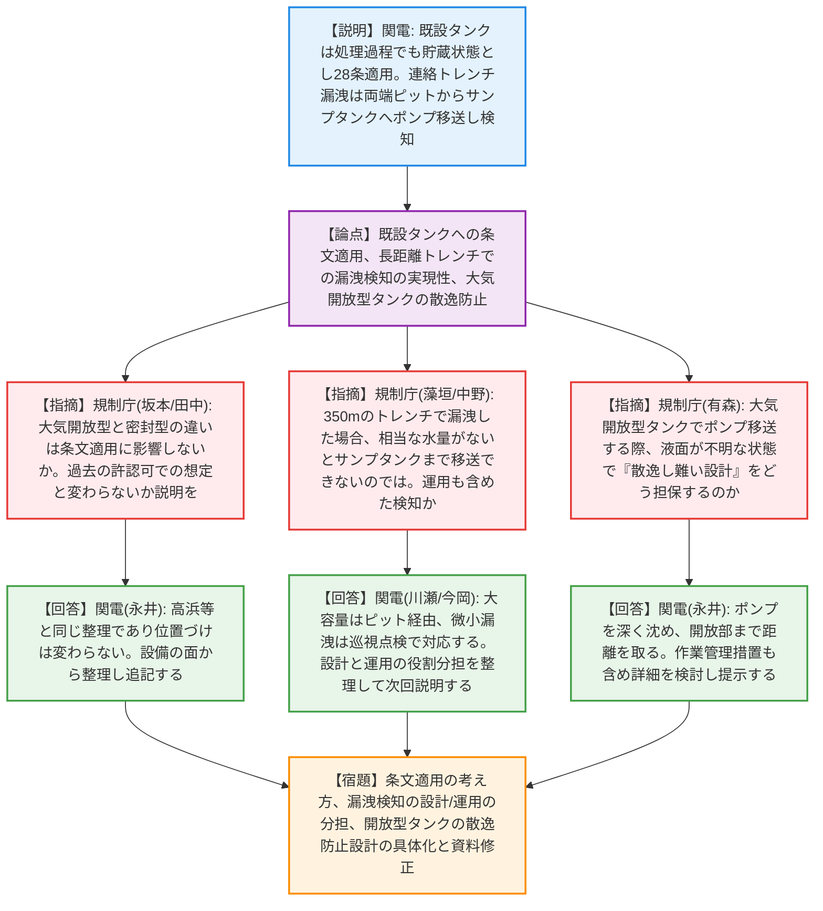
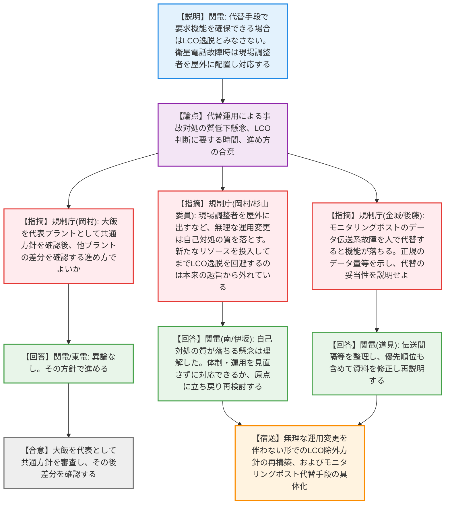

# 第1406回原子力発電所の新規制基準適合性に係る審査会合（令和8年4月21日）
> 出典 : https://youtube.com/live/W1c-AgOdNgU?si=wwHaqU6_8uNVrS6L

# 会合の概要
* **LCO見直しの本来の趣旨と事業者提案の乖離による紛糾:** LCO（運転上の制限）逸脱を回避するための保安規定見直し（議題2）において、事業者が「人を屋外に配置して電話連絡で代替する」「要員管理ツールを屋外に持ち出す」といった無理な運用を提案したことに対し、規制側から「事故対処の質が落ちる懸念がある」「新たなリソースを投入してまでLCO逸脱を回避するのは本来の趣旨から外れている」と極めて厳しい苦言が呈され、事業者が提案を一旦持ち帰り再検討する緊迫した事態となった。
* **使用済樹脂処理設備における設計と運用の境界の不明確さ:** 大飯発電所の新設設備（議題1）の審査において、大気開放型タンクからの移送時の散逸防止や、350mに及ぶ連絡トレンチでの漏洩検知（ポンプ移送の実現性や微小漏洩の運用監視）について、設計で担保する部分と運用で担保する部分の説明が不明瞭であることが指摘され、申請書および補足説明資料の抜本的な整理・追記が求められた。
* **審査の進め方の合意とスケジュールの現実的見直し:** 4プラント同時の保安規定見直し申請に対し、大飯発電所を「代表プラント」として全プラント共通の対応方針を先行して固め、その後に他プラントの「差分」を審査する効率的な進め方で合意した。ただし、事業者が希望した5月末の認可スケジュールについては、根本的な論点が多数残っていることから「相応の審査期間を要する」と釘を刺された。

---

# 議題ごとの詳細整理（テキスト）

## 【議題1】関西電力（株）大飯発電所3号炉及び4号炉の設置変更許可申請（使用済樹脂処理設備の設置）に係る審査について
* **議論の背景と論点:** 新設する「使用済樹脂処理設備」および「連絡トレンチ」について、第27条（処理過程の漏洩・散逸防止）および第28条（貯蔵施設の汚染拡大防止）等への適合性が問われた。特に、既設タンクの条文適用の考え方、長距離トレンチでの漏洩検知メカニズム、大気開放型タンクでの散逸防止設計が主な論点となった。
* **質疑応答（詳細）:**
  * 【説明者側】（関西電力 寺西氏・永井氏等）からの説明
    処理能力や実効線量評価に変更はない。既設の使用済樹脂貯蔵タンクは処理過程であっても「貯蔵」状態であるため28条を適用し、27条（処理過程）の対象外とする。漏洩検知は、トレンチ両端のピットに水を集め、新設側のサンプタンクへポンプで移送して検知する。
  * 【規制側】（規制庁 坂本氏）の懸念・指摘点
    既設タンクについて、大気開放型と密封型の違いは条文適用に影響しないのか。過去の類似設備追加時の考え方と整合しているか、補足説明資料に追加してほしい。
  * 【説明者側】（関西電力 永井氏）の回答・反論・根拠
    高浜等と同じ整理であり、処理過程における位置づけは同じである。資料に追記する。
  * 【規制側】（規制庁 藻垣氏・中野氏）の懸念・指摘点
    350mのトレンチで漏洩した場合、相当な水量がないとサンプタンクまで移送して検知できないのではないか。漏洩検知はトレンチの設計だけでなく、運用（巡視点検）も含めているのか。現状の資料では読み切れない。
  * 【説明者側】（関西電力 今岡氏・永井氏）の回答・反論・根拠
    大容量の漏洩はピット経由で検知し、微小漏洩は巡視点検で監視する運用である。漏洩しない設計を前提としつつ、トータルでどう整理しているか次回説明する。
  * 【規制側】（規制庁 有森氏）の懸念・指摘点
    「汚染の恐れのない管理区域」とするために、設計で担保することと運用で担保することが混在している。また、大気開放型タンクにポンプを沈めて移送する際、液面が分からない状態で「散逸し難い設計」をどう担保するのか。
  * 【説明者側】（関西電力 永井氏）の回答・反論・根拠
    ポンプを十分な深さまで沈め、水面から開放部まで距離を取る。作業管理による措置も行うが、詳細な検討結果は改めて提示する。
  * 【規制側】（規制庁 田中氏）の懸念・指摘点
    開放型タンクで蓋を開けるなどの作業が、過去の既許可（28条）で想定されていた状態と変わらないのか含めて説明してほしい。
  * 【説明者側】（関西電力 永井氏）の回答・反論・根拠
    設備の面からどういう整理になっているか、合わせて説明する。
* **結論と宿題事項（アクションアイテム）:**
  * 既設タンクの条文適用（27条対象外・28条適用）の考え方と、開放型タンクでの作業が既許可の想定内であるかの整理を補足説明資料に追記する（宿題）。
  * 連絡トレンチの漏洩検知について、設計による検知（ピット・サンプタンク）と運用による検知（巡視点検）の役割分担を明確にし、資料を修正する（宿題）。
  * 大気開放型タンクからのポンプ移送時における「散逸し難い設計」の具体的な担保方法（27条1項3号の適用要否を含む）について詳細を検討し、次回説明する（宿題）。

## 【議題2】関西電力（株）美浜・高浜・大飯、東京電力（株）柏崎刈羽の保安規定変更認可申請（重大事故等対処設備等のLCOに係る記載の一部見直し）の審査について
* **議論の背景と論点:** SA設備（衛星電話、可搬式モニタリングポスト等）が機能喪失した場合でも、代替手段があれば直ちにLCO（運転上の制限）逸脱とみなさない運用への見直し提案。大飯発電所を代表プラントとして、LCO判断に要する時間（2日間の妥当性）、代替要員の配置による本来業務への悪影響、代替機器の伝送能力が論点となった。
* **質疑応答（詳細）:**
  * 【説明者側】（関西電力 西川氏・道見氏）からの説明
    通信機器等の故障時、予備機への切り替え等により要求機能を確保できる場合はLCO逸脱とみなさない。LCO判断には最大2日程度を想定し、それを超えれば逸脱とする旨を社内規定に定める。衛星電話故障時は、現場調整者を屋外に配置し衛星携帯で連絡を取る。
  * 【規制側】（規制庁 岡村氏）の懸念・指摘点
    審査の進め方として、大飯を代表プラントとして共通方針を確認後、他プラントの差分を確認する方針でよいか。また、スケジュールについて相応の期間を要する。
  * 【説明者側】（関西電力 伊坂氏・東電 山田氏）の回答・反論・根拠
    進め方について異論はない。スケジュールも理解した。
  * 【規制側】（規制庁 岡村氏）の懸念・指摘点
    現場調整者を屋外に配置して要員管理ツールを持ち出すというが、通信環境が制限される中でユニット指揮者との戦略検討などが適切に行えるのか。本来の役割と比較して事故対処の質が落ちる懸念が払拭できない。
  * 【説明者側】（関西電力 南氏・伊坂氏）の回答・反論・根拠
    懸念は理解した。事故対処に問題がないことを前提としており、無理な運用であれば見直す。一旦持ち帰って体制・運用を含めて再検討する。
  * 【規制側】（杉山委員）の懸念・指摘点
    新たなリソース（人手など）を投入してまでLCO逸脱を回避するのは、本来の制度趣旨（設定の不備による無駄な逸脱を防ぐ）から外れている。今回は通信連絡設備というリスク評価が難しい対象だから判断時間の猶予（2日）を容認するが、他の機器ではそうはいかない。
  * 【説明者側】（関西電力 伊坂氏）の回答・反論・根拠
    体制や運用を見直さないで考えるという前提についての説明が不十分だった。原点に立ち戻り整理し直す。
  * 【規制側】（規制庁 後藤氏・金城審議官）の懸念・指摘点
    可搬式モニタリングポストについて、データ伝送系の故障を人間（電話等）で代替すると機能が落ちるのではないか。正規の伝送頻度やデータ量を示した上で、人間でどう代替するのか説明せよ。また、①の代替監視と②の10条事象の監視が重なった場合の優先順位が不明瞭である。
  * 【説明者側】（関西電力 道見氏）の回答・反論・根拠
    伝送間隔等を整理して説明する。重なった場合は①（炉心損傷の兆候監視）を優先する方針だが、資料の記載を修正する。
* **結論と宿題事項（アクションアイテム）:**
  * 大飯発電所を代表プラントとして共通方針を審査し、その後他プラントの差分を確認する進め方で合意した（合意）。
  * 新たな要員配置など無理な運用変更を伴わず、事故対処の質を落とさない範囲でのLCO除外となるよう、現場調整者の役割や代替手段のあり方を根本から再検討する（宿題）。
  * LCO逸脱判断にかかる時間（最大2日等）の社内標準化について資料に明記する。ただし、この時間的猶予は通信設備等特有の扱いであり、一般化されるものではないとの認識を共有した（合意）。
  * 可搬式モニタリングポストの伝送系故障時の代替手段（データ量・頻度）および監視の優先順位について、資料を整理し再説明する（宿題）。

---

# 論理構造の可視化（Mermaid）

### 【議題1】使用済樹脂処理設備の設置に係る審査

### 【議題2】LCOに係る記載の一部見直しの審査

