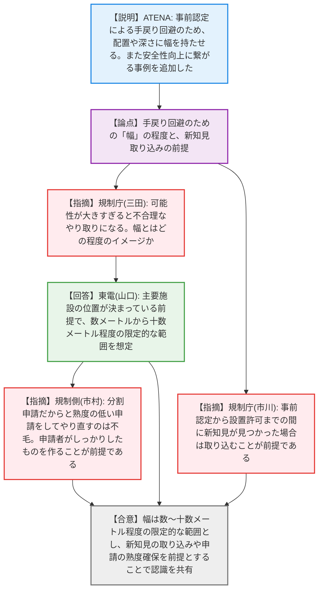
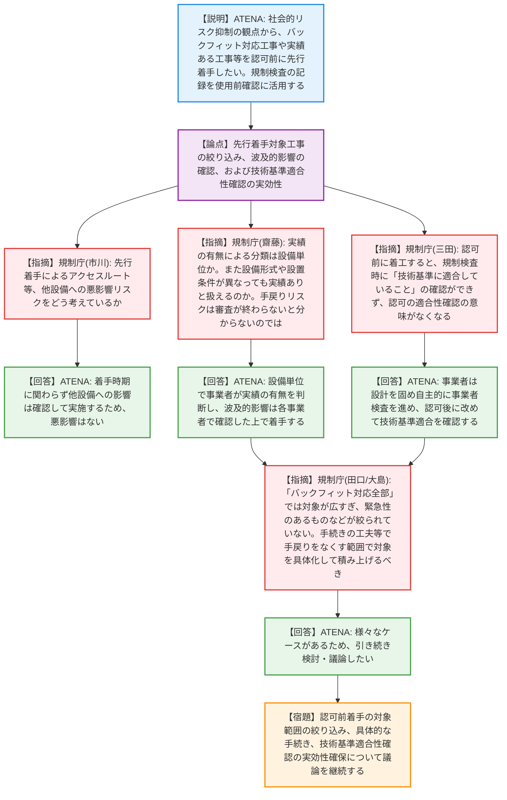
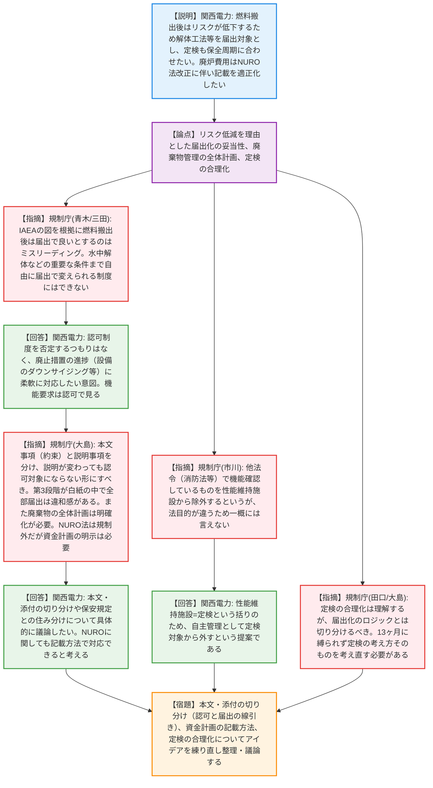
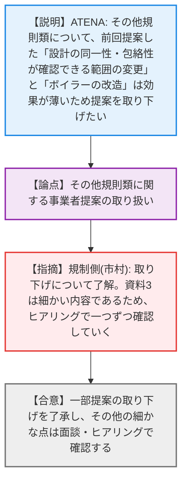

# 第3回実用発電用原子炉の許認可制度等の見直しに関する意見交換会合（令和8年4月21日）
> 出典 : https://youtube.com/live/SUHKV3Vf3w8?si=2_8emxKM05OEDBP-

# 会合の概要
* **許認可制度の合理化に向けた活発な議論と認識のギャップの顕在化:** 実用発電用原子炉の許認可制度等の見直しにおいて、事業者（ATENA・各社）から提示された「自然ハザードの事前認定」「認可前の工事着手」「廃止措置段階での届出への移行と定検の合理化」について審議が行われた。事業者は予見性向上や柔軟な対応を求めたが、規制側からは「条件が広範すぎる」「規制の本来の趣旨（適合性確認の担保）が損なわれる」といった懸念が相次ぎ、制度に落とし込むための「線引き」において双方の認識に大きなギャップがあることが浮き彫りとなった。
* **工事の「先行着手」における対象絞り込みの難航:** バックフィット工事や実績のある工事を認可前に着手したいという事業者提案に対し、規制庁は「対象が広すぎ、緊急性や必要性のロジックが立たない」「設工認の認可前に着手すると、使用前確認での技術基準適合性確認の実効性が失われる」と厳しく指摘。具体的な手続きや対象の絞り込みに関する議論は平行線を辿り、継続審議となった。
* **廃止措置分野における「リスク低減」を理由とした届出化への牽制:** 燃料搬出後はリスクが下がるため各種変更を「届出」とし、定検も自主保全周期に合わせたいとする事業者に対し、規制側は「水中解体などの重要な安全措置まで自由に届出で変えられる制度にはできない」「廃止措置第3段階が白紙の状態で届出化するのは違和感がある」と一蹴。本文（約束事項）と添付（説明事項）の整理による合理化を模索する方向で軌道修正が図られた。

---

# 議題ごとの詳細整理（テキスト）

## 【議題1-1】自然ハザード審査の先行（事前認定）について
* **議論の背景と論点:** 自然ハザードの事前認定後、許可段階での建屋配置等の変更による手戻りリスクをいかに回避するか、また事前認定による安全性向上のメリットについての整理が論点となった。
* **質疑応答（詳細）:**
  * 【ATENA 田中氏】からの説明
    直下断層の評価等には建屋の配置や深さなどの設計情報が必要となるため、事前認定の段階でこれらの範囲に幅を持たせることで手戻りを回避できると提案。また、事前認定により最適な設計（最適な建屋配置、防潮施設や免震装置の最適化等）が可能となり、安全性向上に繋がる事例を追記したと説明。
  * 【規制庁 三田氏】の懸念・指摘点
    手戻り回避のために幅を持たせるとのことだが、可能性を大きく取りすぎると不合理な審査のやり取りになる。どの程度の幅を想定しているか。
  * 【東京電力 山口氏】の回答・反論・根拠
    主要施設の位置が決まっていることを前提とし、数メートルから十数メートル程度の限定的な範囲を想定しており、何百メートルも幅を持たせることは考えていない。
  * 【規制庁 市川氏】の懸念・指摘点
    事前認定から設置許可までには時間がかかり、その間に新知見が見つかることはあり得る。その際は新知見を取り込むことについて理解していると思うが念のためコメントする。
  * 【規制側 市村氏】の確認事項
    イメージは共有できた。ただし、分割申請だからといって熟度の低い（プリミティブな）申請をして「駄目ならずらしました」とするのは不毛であるため、申請者がしっかりした申請書を作ることが大前提である。
* **結論と宿題事項（アクションアイテム）:**
  * 事前認定において幅を持たせる範囲は数メートルから十数メートル程度の限定的なものであること、および新知見の取り込みや申請の熟度確保が前提であるとの認識で合意した（合意）。

## 【議題1-2】認可前の工事着手について
* **議論の背景と論点:** 設工認の認可前に工事に着手できる条件（先行着手）について、対象工事の範囲（バックフィット対応工事、認可実績のある工事等）や、技術基準適合性を担保するための使用前確認との関係性が論点となった。
* **質疑応答（詳細）:**
  * 【ATENA 田中氏】からの説明
    電気事業法の趣旨を踏まえ、手戻りによる社会的リスクを抑制しつつ、安全性が高いバックフィット対応工事や認可実績のある工事を対象に、認可前の先行着手を行いたい。新知見・新技術の導入は対象外とする。規制検査の記録を使用前確認のインプットとして活用することで対応可能と説明。
  * 【規制庁 市川氏】の懸念・指摘点
    バックフィット由来の工事を先行着手することで、アクセスルート等、他の設備へ悪影響を及ぼすリスクをどう考えているか。
  * 【ATENA 田中氏】の回答・反論・根拠
    先行着手するか否かに関わらず、他の設備への影響は確認しながら工事を実施するため、悪影響はないと考えている。
  * 【規制庁 齋藤氏】の懸念・指摘点
    「認可実績の有無」で分類するというが、単位はプラント全体か設備ごとか。実績の有無は誰が判断し、申請時点で着手されている場合があるのか。また、設備形式や設置条件がサイトごとに異なっても「実績あり」と扱えるのか。
  * 【ATENA 熊谷氏】の回答・反論・根拠
    設備単位で事業者が実績の有無を判断し、工認申請後に着手する。着手判断後に通知を行う。設計上の実績の有無を確認し、波及的影響はプラントごとに各事業者が確認した上で着手する。
  * 【規制庁 齋藤氏】の再反論
    手戻りリスクの低さは個々の設備設計だけでなく設置条件等も含めた判断が必要であり、結局審査が終わらないと手戻りの有無は分からないのではないか。
  * 【規制庁 三田氏】の懸念・指摘点
    工認申請段階で着工すると、規制検査において「設工認通りであること」「技術基準に適合していること」の確認ができず、認可の適合性確認の意味がなくなるように感じる。
  * 【ATENA 熊谷氏】の回答・反論・根拠
    事業者は工認申請時に設計を固め自主的に事業者検査を進める。認可後に改めて設工認通り・技術基準適合を確認する。審査結果で変更があれば設計や検査をやり直す。
  * 【規制庁 田口氏】の懸念・指摘点
    「バックフィット対応工事全部」では対象が広すぎ、緊急性があり審査を待てないものなど、本当に先に着手すべきものが絞られていない。このままでは法令上の整理や対外的な説明が難しい。
  * 【規制庁 大島氏】の懸念・指摘点
    安全性・信頼性向上に寄与する制度にできるなら入れた方が良いが、何を対象にするか個別すり合わせで積み上げる必要がある。工事計画（材料調達や汎用品の入れ替え等）の中には認可前に着手できるものもあるはずで、手続きの工夫で手戻りをなくす範囲でできることがあるのではないか。
  * 【ATENA 田中氏】の回答・反論・根拠
    様々なケースがあるため、引き続き検討し議論したい。
* **結論と宿題事項（アクションアイテム）:**
  * 認可前着手の対象範囲の絞り込み、具体的な手続き、および技術基準適合性確認の実効性確保について、さらに具体化し議論を継続する（宿題）。

## 【議題2】許認可制度等の見直しに関する事業者意見（廃止措置分野）
* **議論の背景と論点:** 廃止措置の進展に伴うリスク低減に応じた認可・届出対象の切り分け、定期事業者検査（定検）の実施時期・対象の見直し、および廃炉費用の記載（NURO法改正への対応）の適正化が論点となった。
* **質疑応答（詳細）:**
  * 【関西電力 (原氏等)】からの説明
    冷却告示適用以降や燃料搬出完了後にはリスクが大きく低下するため、解体工法などを届出対象とし、性能維持施設も見直したい。定検については13ヶ月の期間縛りをなくし、保全周期に合わせて実施して報告は年度単位にしたい。廃炉費用についてはNURO法改正により廃炉拠出金制度ができたため、記載を適正化したい。
  * 【規制庁 青木氏】の懸念・指摘点
    IAEAの右肩下がりの図を根拠に燃料搬出後は届出で良いとしているが、実際の申請書での事故時評価（燃料落下やフィルタ破損等）を見ると、リスクが単純に下がっているとは言えない。解体時には作業リスクや放射線リスクが上がることも想定されているはずであり、ミスリーディングである。
  * 【関西電力 原氏・堀氏】の回答・反論・根拠
    定量的な評価は示し切れていないが、燃料起因のリスクから作業管理・労働安全のリスクへシフトしていくのは認識している。保安規定での被ばく管理等でコントロール可能と考えており、これまでの解体実績からもコントロールできる範囲であるため届出とした。
  * 【規制庁 三田氏】の懸念・指摘点
    リスクが段階的に減るため見直す余地があることは認識しているが、水中解体などの重要な条件まで自由に届出で変えられる制度にはできない。規制の趣旨に反する。
  * 【関西電力 原氏】の回答・反論・根拠
    認可制度を否定するつもりはなく、廃止措置の進捗（設備のダウンサイジング等）に柔軟に対応したい意図である。機能要求は認可で見るが、具体的な仕様は届出で柔軟にしたい。
  * 【規制庁 田口氏】の懸念・指摘点
    全て届出となると事業者にフリーハンドを与えることになり無理がある。大事なものは最初の認可でしっかり決め、リスクが下がった時の軽微な変更を届出にできる仕組みを考えるべき。
  * 【規制庁 大島氏】の懸念・指摘点
    本文事項（約束事項）と添付の説明事項を分け、説明事項が変わっても認可対象にならない形にすべき。廃止措置第3段階が白紙の状態で「燃料が出たから全部届出」というのは違和感がある。何を約束するのか明確にすべき。また、廃棄物の全体計画（発生から埋設処分まで）を廃止措置計画や保安規定で明確化することが重要。NURO法は規制対象外であるため、資金確保の記載の適正化はあっても、計画自体は明示していただく必要がある。
  * 【関西電力 原氏】の回答・反論・根拠
    認可対象の整理（本文・添付の切り分け）や保安規定との住み分けについて具体的に議論したい。NUROに関しても記載方法で対応できる部分があると思う。
  * 【規制庁 松本氏】の確認事項
    資料の「燃料搬出後」とは、サイト内での保管（ユニットから出された状態）という意味でよいか。
  * 【関西電力】の回答・反論・根拠
    ユニットから出された状態と整理している。
  * 【規制庁 市川氏】の懸念・指摘点
    「他法令（消防法・建築基準法等）で機能を確認しているもの」を性能維持施設から除外するというが、法目的が違うため一概に除外できるとは言えない。慎重な検討が必要。
  * 【規制庁 大島氏】の懸念・指摘点
    定検の合理化については理解するが、廃止措置で運転しなくなった状態で13ヶ月に縛られず、定検の考え方そのものを考え直す必要がある。
* **結論と宿題事項（アクションアイテム）:**
  * 認可・届出の線引き（本文・添付の切り分け）、NURO法を踏まえた資金計画の記載方法、および定検の合理化（周期・報告方法の考え方）について、具体的なアイデアを練り直し、改めて整理・議論する（宿題）。

## 【議題3】許認可制度等の見直しに関する事業者意見（その他規則類に関するもの）
* **議論の背景と論点:** その他規則類に関する事業者からの見直し要望についての取り扱い。
* **質疑応答（詳細）:**
  * 【ATENA 田中氏】からの説明
    資料16ページで提案した「過去の認可実績に対して設備構成や設計の同一性・包絡性が確認できる範囲の変更は一つ一つ対応する」点と、「ボイラーの改造」については、整理に時間を使う割に効果が薄いため、提案を取り下げたい。
  * 【進行 市村氏】の回答・反論・根拠
    取り下げについて了解した。本資料は非常に細かい内容であるため、ヒアリングで一つずつ確認していくこととする。
* **結論と宿題事項（アクションアイテム）:**
  * 事業者からの提案の一部取り下げを了承し、その他の細かな点については面談・ヒアリングを通じて確認していく（合意）。

---

# 論理構造の可視化（Mermaid）

### 【議題1-1】自然ハザード審査の先行（事前認定）について

### 【議題1-2】認可前の工事着手について

### 【議題2】許認可制度等の見直しに関する事業者意見（廃止措置分野）

### 【議題3】許認可制度等の見直しに関する事業者意見（その他規則類に関するもの）

