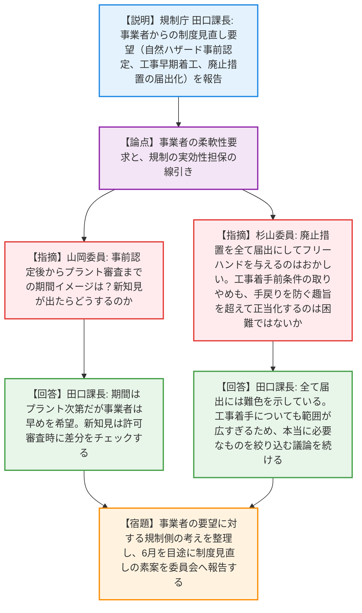
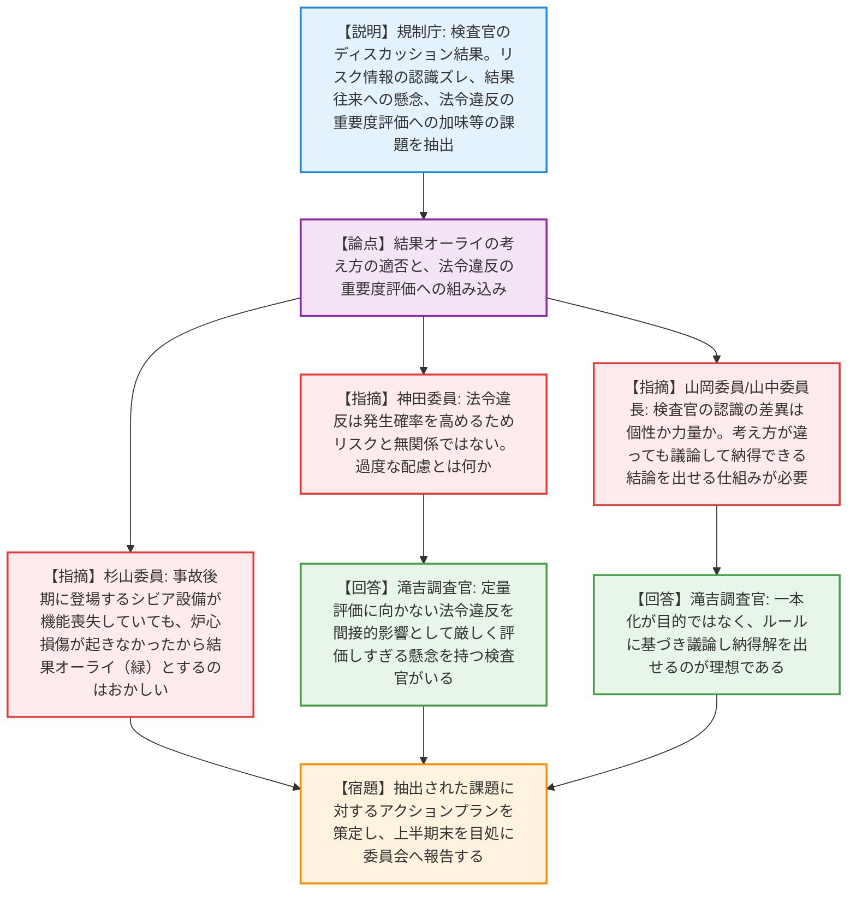
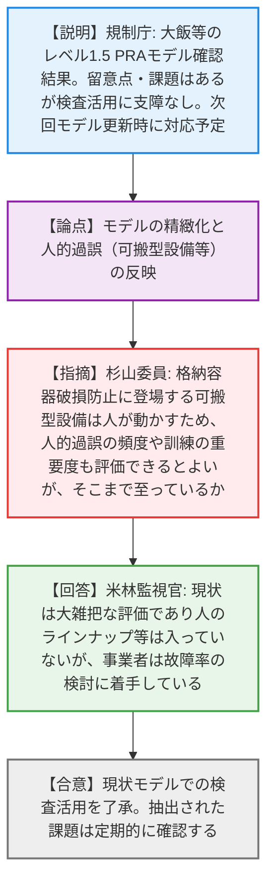
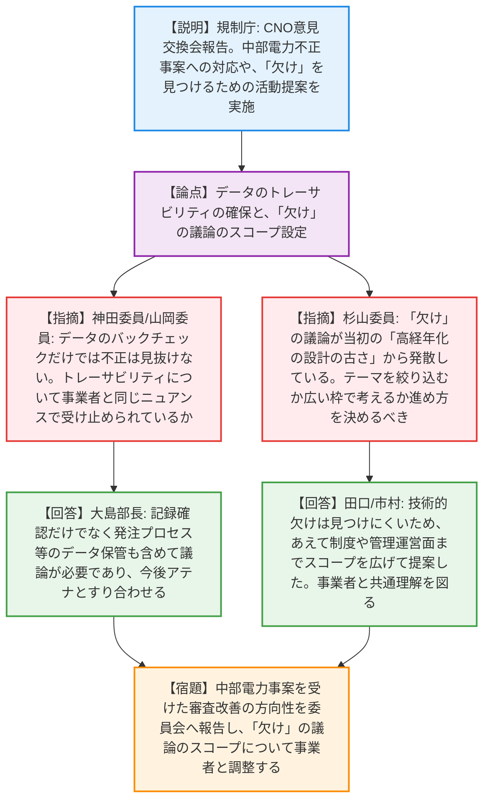
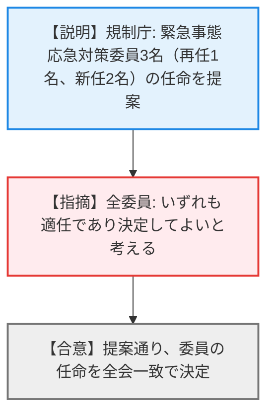
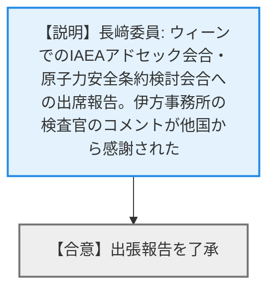

# 第5回原子力規制委員会（令和8年4月22日）
> 出典 : https://youtube.com/live/jawjrlG5_v0?si=v2QGHUtdmIJNTD9P

# 会合の概要
* **許認可制度見直しに対する規制側の強い牽制と慎重姿勢:** 事業者から提案された「自然ハザードの事前認定」「認可前の工事着工」「廃止措置手続きの届出化」に対し、規制委員からは「廃止措置を全て届出にすると事業者にフリーハンドを与えることになる」「手戻りを防ぐ趣旨を超えた早期着工は正当化が困難」と厳しい指摘が相次ぎ、制度の緩和に対する高いハードルと慎重な姿勢が示された。
* **検査制度5年検証で浮き彫りになった現場の葛藤:** 検査官のグループディスカッション結果から、「結果オーライ（ルール違反が軽視される懸念）」や「法令違反をどう重要度評価に組み込むか」という現場の悩みが報告された。委員長からは、検査官間の力量や判断のばらつきを把握し、納得解を導く仕組みづくりへの強い期待が示された。
* **PRAモデルの精緻化と人的過誤の課題:** レベル1.5 PRAモデルの確認において、可搬型設備の運用における「人の失敗（人的過誤）」や「訓練頻度」が現状のモデルに十分反映されていないことが指摘され、中長期的なモデルの高度化と実態への適応が求められた。
* **不正防止と「欠け」の議論のスコープに対する厳しい注文:** 中部電力の不正事案を踏まえたCNO（責任者）意見交換会の報告に対し、委員から「データのトレーサビリティだけでは不正は見抜けない」「『欠け』の議論が当初の『設計の古さ』から発散している」と鋭い指摘が入り、規制庁側が「技術的な欠けは見つけにくいため、管理運営面までスコープを広げた」と釈明する緊迫した場面があった。

---

# 議題ごとの詳細整理（テキスト）

## 【議題1】実用発電用原子炉の許認可制度等の見直しに関する検討状況（中間報告）
* **議論の背景と論点:** ATENA等との意見交換を踏まえ、事業者が要望する「自然ハザードの分割審査（事前認定）」「工事着手前条件の取りやめ」「廃止措置の届出範囲拡大」「電気事業法との重複見直し」の検討状況を報告。事業者の柔軟性要求と、規制の実効性担保の線引きが論点となった。
* **質疑応答（詳細）:**
  * 【説明者側】（規制庁 田口課長）からの説明
    事業者は概ね見直し案に異論はないが、①自然ハザードの事前認定を許可に先行して実施したい、②バックフィット等の安全性が高い工事は認可前に着手したい、③廃止措置において燃料搬出後は全て届出にしたい、といった要望を出している。規制庁としては、全て届出にすると水中解体から気中解体への変更なども自由にできてしまうため難色を示しており、工事の早期着手についても範囲が広すぎると考えている。
  * 【規制側】（山岡委員）の懸念・指摘点
    ハザードの事前認定が終わってからプラント審査が始まるまでの期間のイメージはどうか。その間に新知見が出たらどう対応するのか。
  * 【説明者側】（規制庁 田口課長）の回答・反論・根拠
    期間はプラントごとに異なるが、事業者は立地調査後すぐに認定してほしいと希望している。認定後に新知見が出た場合は、許可の審査時に差分の知見の有無を当然チェックする。
  * 【規制側】（杉山委員）の懸念・指摘点
    廃止措置で全てを届出にしてフリーハンドを与えるのはおかしい。自然ハザードの先行認定も、6月までに結論が出るか心配である。また、工事着手前の条件取りやめについては、手戻りを防ぐ趣旨を超えて早くやる必要性が正当化できないと、他の法令との並びで説明が難しいのではないか。中部電力の事案を踏まえた制度見直しの必要性も別途議論しているはずだ。
  * 【説明者側】（規制庁 田口課長）の回答・反論・根拠
    中部電力の事案を踏まえた制度見直しは別途ご提案していく。工事着手については、無駄な手戻りを防ぐ趣旨を超えて正当化するのは難しく、どういうものが本当に必要なのか議論を続ける。
* **結論と宿題事項（アクションアイテム）:**
  * 事業者の要望をそのまま受け入れることは困難であり、規制の趣旨を踏まえた制度のあり方について引き続き議論を継続する。今年6月を目途に制度見直しの素案を委員会に報告する（宿題）。

## 【議題2】原子力規制検査制度の鍵となる要素に係る取組状況の検証（中間報告）
* **議論の背景と論点:** 新検査制度開始から5年が経過し、検査官全体でのグループディスカッションを実施。リスク情報の認識のズレ、結果オーライへの懸念、安全重要度評価への法令違反の加味など、現場の検査官が抱える課題感の抽出結果が論点となった。
* **質疑応答（詳細）:**
  * 【説明者側】（規制庁 水戸係長・滝吉調査官）からの説明
    リスク情報をPRAのみと捉えるか定性情報も含むかのズレや、廃止措置等への適用困難性、コンプライアンスとパフォーマンスのバランス（結果オーライへの懸念）、法令違反を安全重要度にどう組み込むかという課題が抽出された。
  * 【規制側】（杉山委員）の懸念・指摘点
    振り返りプロセスはこの1年半で一区切りか。また「結果オーライ」について、シビアアクシデント設備のように事故の後期に登場する設備が機能喪失していても、炉心損傷が起きなかったから問題なし（緑）とするのはおかしい。
  * 【説明者側】（規制庁 滝吉調査官）の回答・反論・根拠
    今回で一区切りとし、上半期末までにアクションプランを示すが、改善活動に終わりはない。
  * 【規制側】（神田委員）の懸念・指摘点
    コンプライアンス違反は発生確率を高めるためリスクと無関係ではない。過度な配慮とは具体的にどういうケースか。
  * 【説明者側】（規制庁 滝吉調査官）の回答・反論・根拠
    定量評価に向いていない法令違反を安全性の影響とどう評価するかという問題であり、間接的な影響を加味して厳しく評価しすぎる（緑にすべきものを重くする）懸念を持つ検査官がいる。
  * 【規制側】（山岡委員）の懸念・指摘点
    検査官による認識の差異は、力量への依存か、個性によるものか分けたほうがいい。一本化しすぎるのもマイナスになり得る。
  * 【説明者側】（規制庁 滝吉調査官）の回答・反論・根拠
    考え方を全て揃えることが目的ではなく、ルールに基づき議論し、意見が違っても納得できる答えを出せるのが理想である。
  * 【規制側】（山中委員長）の懸念・指摘点
    検査官ごとの意見の差や力量の差、SDPへの考え方のばらつきを調べたかった。ばらつきがあっても議論して結論を出せるなら良い。今後のアクションプランに期待する。
* **結論と宿題事項（アクションアイテム）:**
  * 抽出された課題に対する具体的なアクションプランを策定し、令和8年度上半期末を目処に委員会へ報告する（宿題）。

## 【議題3】原子力規制検査で用いるレベル1.5確率論的リスク評価モデルの適切性確認の状況
* **議論の背景と論点:** 大飯・高浜・玄海・川内の各プラントのレベル1.5 PRAモデル（格納容器機能喪失頻度の評価）の適切性を確認。点検間隔の乖離等の留意点や、現実的な評価への見直し等の中長期的課題の取り扱いが論点となった。
* **質疑応答（詳細）:**
  * 【説明者側】（規制庁 米林監視官）からの説明
    点検間隔の乖離、手動隔離操作の失敗未考慮などの留意点、およびMAAP5の活用、人的過誤の従属性考慮などの中長期的課題が抽出されたが、検査での活用に大きな支障はない。次回の安全性向上評価のモデル更新時に事業者が対応する予定。
  * 【規制側】（杉山委員）の懸念・指摘点
    レベル1.5の結果を使うと、レベル1だけで決めた機器の重要度ランキングと変わるのか。また、格納容器破損防止に登場する可搬型設備は人が動かすため、人的過誤の頻度や訓練の重要度も評価できるとよいが、そこまで至っているか。
  * 【説明者側】（規制庁 米林監視官）の回答・反論・根拠
    レベル1.5では格納容器隔離等が大きな割合を占めるため、重要度は変わる。可搬型設備については現状大雑把な評価であり、人のラインナップ等は入っていないが、事業者は故障率の検討に着手している。
* **結論と宿題事項（アクションアイテム）:**
  * 現状のモデルでも検査への活用に支障はないとして了承された（合意）。
  * 抽出された留意点および中長期的課題について、次回のモデル更新時等の対応状況を定期的に確認する（宿題）。

## 【議題4】第23回主要原子力施設設置者（被規制者）の原子力部門の責任者との意見交換会の結果報告
* **議論の背景と論点:** CNO（原子力部門責任者）との意見交換結果の報告。中部電力のデータ不正事案を踏まえた「データのトレーサビリティ」のあり方と、未知のリスクを探る「欠け」の議論のスコープ設定が論点となり、委員から厳しい指摘が相次いだ。
* **質疑応答（詳細）:**
  * 【説明者側】（規制庁 田口課長）からの説明
    中部電力の不正行為への対応、安全性向上評価制度の活用、優先して取り組む案件（PWSCCを踏まえた長期サイクル運転の申請等）を議論した。また「欠け」への対応として、第三者からのプレゼンや匿名意見交換などを規制庁から提案した。
  * 【規制側】（神田委員）の懸念・指摘点
    「データのトレーサビリティ」という用語について、規制側と事業者は同じニュアンス（守るべき倫理的側面）で受け止めているか。
  * 【説明者側】（規制庁 大島部長）の回答・反論・根拠
    QMSにおける記録の確認だけでなく、発注者と受注者間でのデータ記録の保管方法も含めて議論が必要であり、今後ATENAとすり合わせていく。
  * 【規制側】（山岡委員）の懸念・指摘点
    トレーサビリティを要求したところで、データだけをバックチェックしても不正は見抜けないのではないか。間違っていることを証明するのか、間違っていないことを証明させるのか、議論の分かれ目である。
  * 【規制側】（杉山委員）の懸念・指摘点
    「欠け」の議論が発散している。もともとは高経年化における「設計の古さ」に関する極めて狭い分野の欠けの議論だったはず。テーマを絞り込むか、広い枠で考えるか、進め方を決めるべき。
  * 【説明者側】（規制庁 田口課長・市村氏）の回答・反論・根拠
    科学的・技術的な欠けは探しても見つかりにくいため、制度や管理運営面まであえてスコープを広げて提案した。設計の古さは差分側に寄せ、それ以外の予期しない落ち度を拾おうとしている。
* **結論と宿題事項（アクションアイテム）:**
  * CNO会合の結果報告を了承。中部電力事案を受けた審査の改善の方向性について、別途委員会へ報告する（宿題）。
  * 「欠け」の議論について、スコープの広がりを認識した上で、事業者と共通理解を図りながら具体的な活動へ落とし込む（宿題）。

## 【議題5】緊急事態応急対策委員の任命
* **議論の背景と論点:** 緊急事態応急対策委員の任期満了等に伴う、新たな委員3名（再任1名、新任2名）の任命の決定。
* **質疑応答（詳細）:**
  * 【説明者側】（規制庁 笠原室長補佐）からの説明
    吉中委員の再任、池田氏・玉木氏の新任について決定を求める。
  * 【規制側】（全委員）の回答・反論・根拠
    いずれも適任であり、決定してよいと考える。
* **結論と宿題事項（アクションアイテム）:**
  * 提案の通り、緊急事態応急対策委員の任命を全会一致で決定した（合意）。

## 【議題6】長﨑委員の出張報告
* **議論の背景と論点:** ウィーンで開催されたアドセック会合および原子力安全条約第10回検討会合への出席報告。
* **質疑応答（詳細）:**
  * 【説明者側】（長﨑委員）からの説明
    日本についての状況を説明した。会場で対応した職員や伊方事務所の検査官のコメントが他国から感謝されており、謝意を述べたい。
* **結論と宿題事項（アクションアイテム）:**
  * 出張報告が了承された（合意）。

---

# 論理構造の可視化（Mermaid）

### 【議題1】実用発電用原子炉の許認可制度等の見直しに関する検討状況

### 【議題2】原子力規制検査制度の鍵となる要素に係る取組状況の検証

### 【議題3】レベル1.5確率論的リスク評価モデルの適切性確認の状況

### 【議題4】第23回主要原子力施設設置者（被規制者）の原子力部門の責任者との意見交換会の結果報告

### 【議題5】緊急事態応急対策委員の任命

### 【議題6】長﨑委員の出張報告

