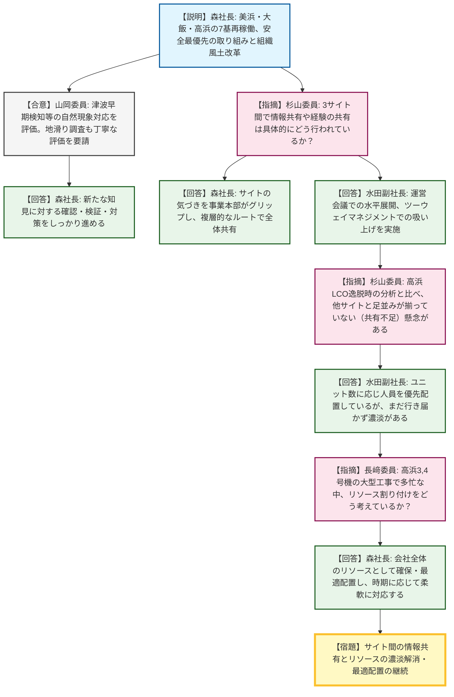
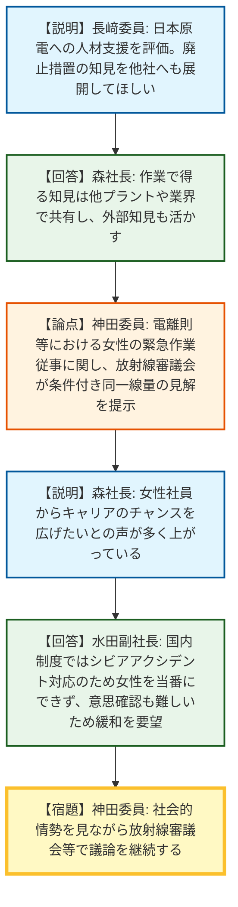
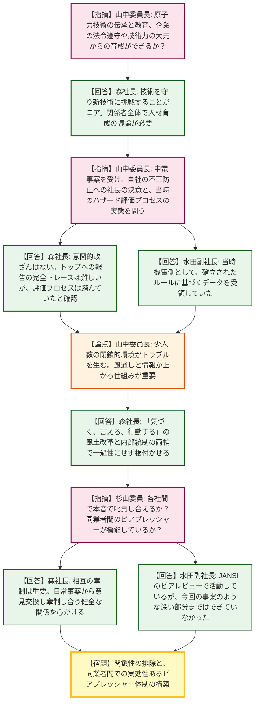
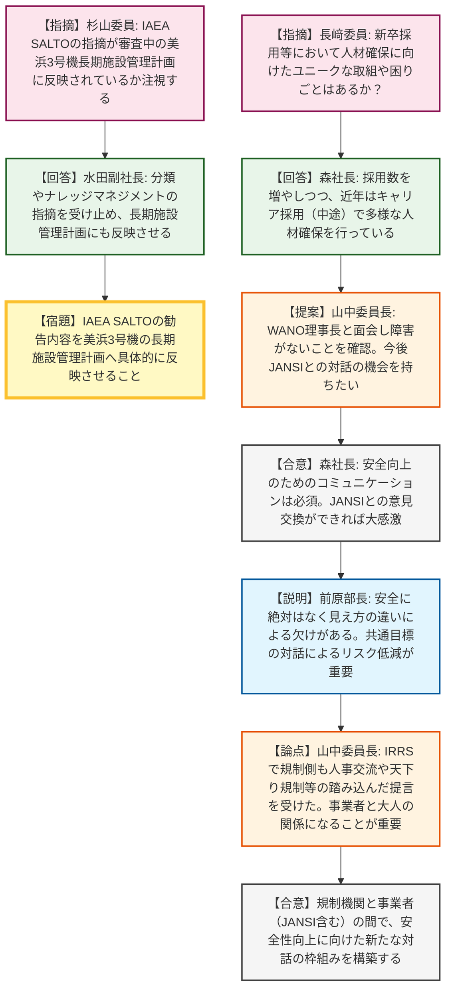

# 第6回原子力規制委員会臨時会議（令和8年4月22日）
> 出典 : https://youtube.com/live/8PBv2ngxu7Q?si=u69fR12PvR8YhacB

# 会合の概要
* **最大の争点（ピアプレッシャーと風土改革）:** 中部電力で発覚した不適切事案を念頭に、規制側（山中委員長、杉山委員）から関西電力における不正防止への社長の決意や、同業者間で「本音で叱責し合えるか（ピアプレッシャー）」の有無について厳しい追及が行われ、現場に強い緊張感が走りました。
* **安全性向上の取り組みと実態の乖離に対する懸念:** 関西電力から3サイト（美浜・大飯・高浜）の再稼働や安全文化の取り組みが報告されましたが、規制側からは各サイト間での情報共有の足並みの乱れや、リソース配分の「濃淡」による現場への負荷について鋭い懸念が示されました。
* **女性の放射線業務従事に関する制度上の課題:** シビアアクシデント対応時の当直体制において、女性作業員の線量限度（電離則・炉規法）と現場のニーズ（キャリア拡大）との間に乖離があることが議題に上り、規制側・事業者双方で問題意識が共有されました。
* **国際レビューを踏まえた「大人の関係」の構築:** 会合終盤、IAEAによるSALTOやIRRSのレビュー結果が話題となり、事業者だけでなく規制機関自身も課題を突きつけられていることが共有されました。対立構造を超え、信頼をベースに確認し合う「大人の関係」を目指すことで両者が合意し、JANSI（原子力安全推進協会）を含めた今後の積極的な対話の場を設けることが決定しました。

---

# 議題ごとの詳細整理

## 【議題1】関西電力の安全性向上に向けた取組とサイト間のマネジメント
* **議論の背景と論点:** 美浜・大飯・高浜の3サイトが稼働し、廃止措置や大型工事も控える中、現場の多忙さによる技術力低下や、サイト間での情報共有・リソース配分の足並みが揃っているかが争点となりました。
* **質疑応答（詳細）:**
    * 【説明者側】森社長から、美浜3号機事故や福島第一原発事故を教訓とした安全最優先の品質方針、高浜発電所での津波早期検知（潮位計追加）などの自然現象対応、および組織風土改革の現状について説明が行われました。
    * 【規制側】山岡委員は自然現象への対応を評価した上で、丹後半島の陸上地滑り調査についても丁寧な評価を要請しました。
    * 【説明者側】森社長は、新たな知見に対する確認・検証・対策をしっかり進めると同意しました。
    * 【規制側】杉山委員より、マネジメント体制において、3サイト間で経験や情報の共有が具体的にどのように行われているのか疑義が呈されました。
    * 【説明者側】森社長および水田副社長は、各サイトの気づきを事業本部がグリップし、毎月の運営会議での水平展開や「ツーウェイマネジメント（マネジメントオブザベーション）」により困りごとを吸い上げていると反論・根拠提示しました。
    * 【規制側】杉山委員は、過去の高浜でのLCO逸脱事案の分析（デスクワーク多忙による技術力低下）を引き合いに出し、高浜では改善が見られるものの、検査官の目からは他サイトと足並みが揃っていない（共有が徹底されていない）のではないかと再指摘しました。
    * 【説明者側】水田副社長は、ユニット数に応じて人員を優先配置しているものの、まだ行き届かず濃淡（アンバランス）が生じている現状を認めました。
    * 【規制側】長﨑委員からも、高浜3,4号機が大型工事を抱え多忙を極める中、リソースの割り付けをどう考えているか指摘がありました。
    * 【説明者側】森社長は、原子力事業本部内だけでなく会社全体のリソースとして確保・配置を最適化し、時期の経過に合わせて柔軟に対応していくと回答しました。
* **結論と宿題事項（アクションアイテム）:**
    * サイトごとの情報共有体制の枠組み自体は構築されているものの、現場へのリソース配分には依然として「濃淡」があることが確認され、会社全体での人員の最適配置とバランス調整を継続することが宿題事項となりました。

## 【議題2】女性の放射線業務従事に関する制度的課題と廃止措置の知見展開
* **議論の背景と論点:** シビアアクシデントを想定した体制構築において、法令（電離則・炉規法）における女性の線量限度規定が、実現場における女性のキャリア拡大（当直業務等への参加）を阻害している制度的課題が議論されました。
* **質疑応答（詳細）:**
    * 【規制側】長﨑委員から、日本原電への人材支援による安全性向上への寄与を評価するとともに、大飯1,2号機の廃止措置（第2段階）で得られる知見を他社へも展開するよう求めました。
    * 【説明者側】森社長は、作業で得る知見は他プラントや業界全体で共有し、外部知見も活かしながら進めると回答しました。
    * 【論点】神田委員より、電離則や炉規法における女性の緊急作業従事（線量限度）について、放射線審議会が「妊娠の意思のない旨を申し出た方には男性と同じ線量限度を適用すべき」との見解をまとめ、関係行政機関へ理解促進に努めている旨が説明されました。
    * 【説明者側】森社長は、女性社員から「事業が制約されずチャンスが欲しい」という声が多いことを説明しました。
    * 【説明者側】水田副社長が補足し、海外（フランスEDF等）では女性の発電所長や当直が存在するが、国内制度下ではシビアアクシデント対応要員として女性を当番に配置できないこと、また社会情勢上「妊娠の意思」の確認も困難である実態を挙げ、制度の緩和（見直し）を要望しました。
    * 【規制側】神田委員は、放射線審議会として過去に一度判断を下しているものの、社会的情勢を見ながら適宜議論を進めていくと応じました。
    * （※神田委員より「原子力安全検証委員会」の報告の重みについて追加で質問がありましたが、事業者側からの回答は今後の意見交換で提案を受けたい旨の簡素なやり取りに留まりました。）
* **結論と宿題事項（アクションアイテム）:**
    * 女性の放射線業務（緊急作業）従事に関する法令と現場実態の乖離について問題意識が共有され、放射線審議会および関係省庁を交えた社会情勢を踏まえた議論を継続することが宿題（持ち越し）となりました。

## 【議題3】人材育成と組織風土・不適切事案に対するピアプレッシャー
* **議論の背景と論点:** 中部電力の不適切事案を契機とし、関西電力において同様のデータ改ざんや不正が発生しない企業文化（風土）が構築されているか、また電力業界内での厳しい相互牽制（ピアプレッシャー）が機能しているかが強く問われました。
* **質疑応答（詳細）:**
    * 【規制側】山中委員長より、原子力技術は最先端であると同時に「古典芸能」的な伝承が必要であるとし、法令遵守や技術力を大元に戻って育成・徹底できるか事業者の考えを問いました。
    * 【説明者側】森社長は、技術を守り新技術に挑戦することがコアであり、国や関係者全体で人材を育成していく議論が待ったなしで必要だと回答しました。
    * 【規制側】山中委員長は「少し嫌な話をさせていただく」と前置きした上で、中部電力の事案を受け、関西電力において不正がないという社長の決意表明を求めました。同時に、当時の自然ハザード評価プロセスが社長の目から見えていたのかと鋭く指摘しました。
    * 【説明者側】森社長は、意図的なデータ入れ替えは行っていないことを確認済みであるとし、全社的な人員入替のため当時のトップへの報告ルートの完全なトレースは難しいものの、評価プロセス自体は間違いなく踏んでいたことを確認したと弁明しました。
    * 【説明者側】水田副社長も、当時は機電対応側として、確立されたルールに基づき作成されたデータを受け取っていたと根拠を提示しました。
    * 【規制側】山中委員長は、少人数で閉鎖的な環境が情報遮断とトラブルを生む（東電の事例等）と懸念を示し、風通しと情報が上がる仕組みの重要性を指摘しました。
    * 【説明者側】森社長は、「気づく、言える、行動する」の風土改革と、内部統制の仕組みを両輪で回し、一過性で終わらせないよう根付かせると回答しました。
    * 【規制側】杉山委員から、電力各社間で「お前さんのところは何をやらかしたんだ」と本音で言い合えるような、同業者間の「ピアプレッシャー」が本当に機能しているのか厳しい疑義が呈されました。
    * 【説明者側】森社長は、日常事案から意見交換し牽制し合う健全な関係を一層心がけると回答し、水田副社長は、JANSIでのピアレビュー活動で高め合ってはいるが、今回の事案のような深い部分までは踏み込めていなかったと限界を認めました。
* **結論と宿題事項（アクションアイテム）:**
    * 関西電力におけるデータの意図的改ざんはないとの明言が得られましたが、業界内での「ピアプレッシャー」の不足が露呈しました。閉鎖性を排除する内部統制の徹底と、同業者間での実効性のある相互牽制の強化が課題として持ち越されました。

## 【議題4】IAEAレビューへの対応と規制機関との今後のコミュニケーション
* **議論の背景と論点:** IAEAのSALTOやIRRSといった国際レビューからの厳しい勧告をどのように受け止め、事業の安全性向上および規制機関との「信頼」構築につなげていくかが議論されました。
* **質疑応答（詳細）:**
    * 【規制側】杉山委員より、IAEA SALTOのフォローアップミッションを控える中、現在審査中の美浜3号機の長期施設管理計画に、IAEAからのサジェスション・リコメンデーションが反映されているかを注視していると指摘がありました。
    * 【説明者側】水田副社長は、分類の仕方やナレッジマネジメント等の指摘を真摯に受け止め、長期施設管理計画にも確実に反映させると回答しました。
    * 【規制側】長﨑委員から、原子力部門への新卒採用等で、人材確保に向けたユニークな取組や困りごとがないか質問されました。
    * 【説明者側】森社長は、採用数を増やすとともに、近年はキャリア採用（中途）により多様な人材確保に努めていると回答しました。
    * 【規制側】山中委員長は、WANO理事長と面会し「WANOがJANSIと規制当局との対話を阻害している事実はない」と確認したことを明かし、今後JANSIとの積極的な対話の機会を持ちたいと提案しました。
    * 【説明者側】森社長は、安全向上のためのコミュニケーションは必須であり、JANSIとの意見交換ができれば大感激であると強く合意しました。
    * 【説明者側】前原部長は、原子力安全に「絶対」はなく見え方の違いによる「欠け」が存在するとし、共通目標による対話を通じたリスク低減プロセスが重要であると述べました。
    * 【論点】山中委員長は、先般のIRRSレビューにおいて、規制側も「事業者との人事交流」や「天下りルールの見直し」など踏み込んだ勧告を受けたことを明かし、独立性・中立性を保ちつつ国民の信頼を得て、事業者と「大人の関係（互いに信頼し、かつ確認し合う関係）」になることが求められていると総括しました。
* **結論と宿題事項（アクションアイテム）:**
    * IAEA SALTOの勧告内容を美浜3号機の長期施設管理計画へ反映させることがコミットされました（条件付き了承）。
    * 規制機関と事業者（およびJANSI）の間で、安全性向上に向けた新たな対話の枠組みを構築していくことが双方の合意事項として決定しました。

---

# 論理構造の可視化（Mermaid）

以下に各議題の議論のフローをMermaid形式で記述します。

