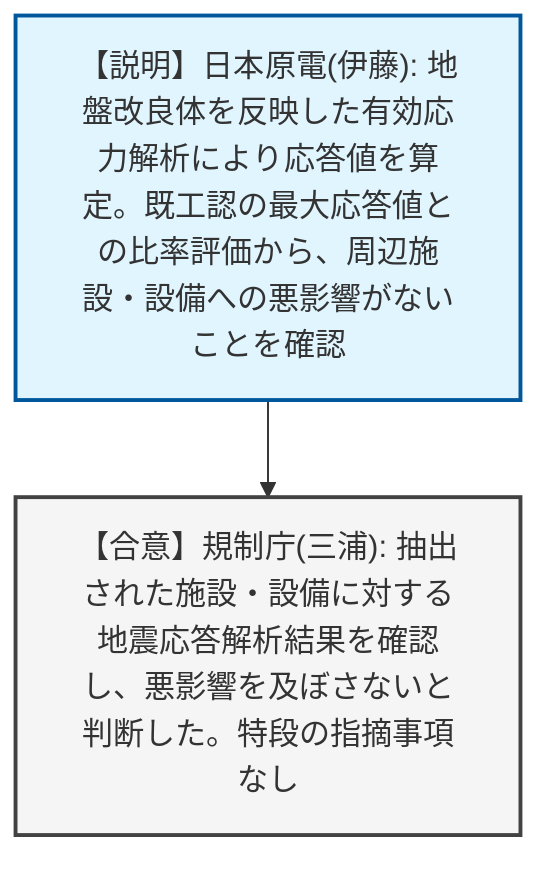
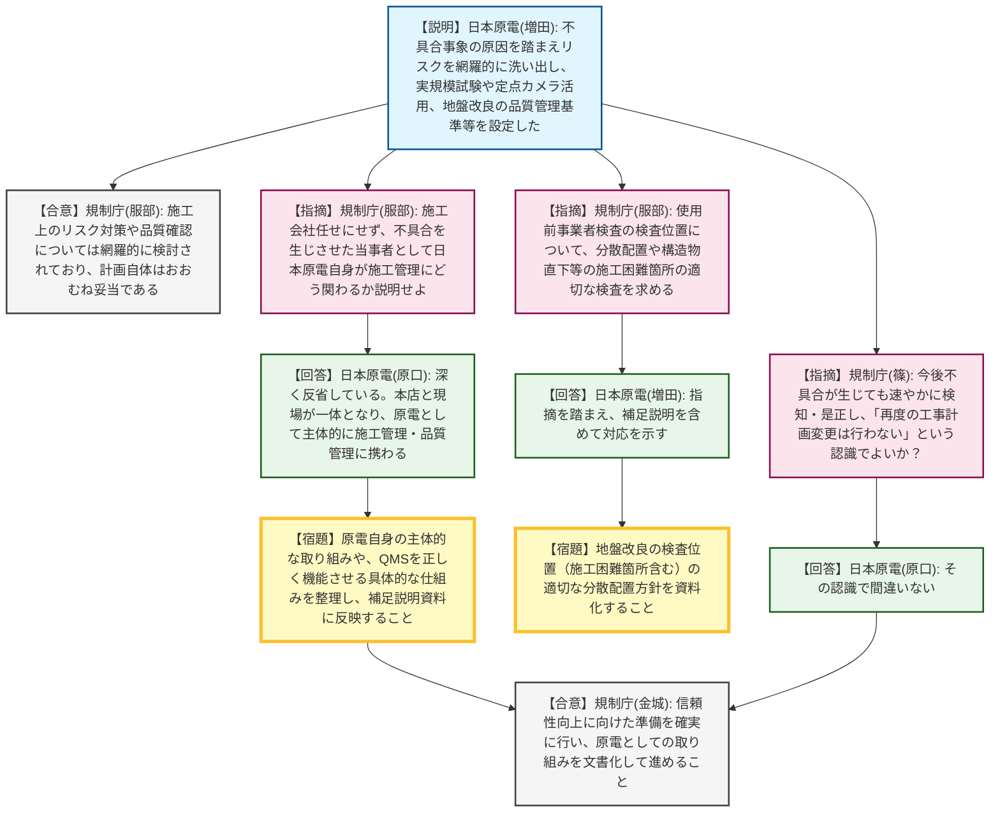

# 第1407回原子力発電所の新規制基準適合性に係る審査会合（令和8年4月23日）
> 出典 : https://youtube.com/live/T3BV8ewiBGw?si=Pcd-3a3XOQcLlZPD

# 会合の概要
* **不具合事象に対する厳しい指摘と主体性の要求:** 過去に発生した施工不良（鉄筋の変形やコンクリート未充填等）を重く受け止め、規制側から日本原子力発電に対し、「不具合を生じさせた当事者として、施工会社任せにせず自らが主体的にどう関与していくのか」という極めて厳しい追及がなされ、現場に強い緊張感が走りました。
* **「再度の工事計画変更は認めない」という強い念押し:** 今後の施工において万が一不具合が検知された場合でも、速やかに是正措置を講じて完遂させることが強く求められ、「再度の工事計画変更は行わない」という認識で事業者と規制側が合意しました。
* **周辺施設への波及影響および技術的対策の了承:** 追加の地盤改良や基礎が周辺施設・設備へ与える耐震上の影響については、既工認の最大応答値との比較等により「影響なし」と評価され、規制側もこれを妥当と判断しました。また、実規模試験や定点カメラを活用した品質管理の網羅的なリスク対策についても一定の評価を得ました。

---

# 議題ごとの詳細整理

## 【議題1-前半】防潮堤（鋼製防護壁）の設計変更に伴う周辺施設・設備への影響評価
* **議論の背景と論点:** 防潮堤の構造変更に伴い追加される地盤改良体（薬液注入、セメント系）や新規基礎が、周辺の耐震重要施設（取水構造物、貯留堰等）および設備に波及影響を与えないかの確認が論点となりました。
* **質疑応答（詳細）:**
    * 【説明者側】日本原電（伊藤）より、地盤改良体を反映した2次元有効応力解析モデルによる応答値等の算定結果が説明されました。既工認時の最大応答値に対する比率を計算し、許容限界を満足するか確認する保守的な評価手法を用いた結果、ZPA（最大応答加速度）およびFRS（床応答曲線）を含め、すべての施設・設備において耐震性への悪影響がないことを確認したと報告されました。
    * 【規制側】規制庁（三浦）は、追加された地盤改良を考慮した地震応答解析が適切に実施されており、既設の施設・設備に悪影響を及ぼさないことを確認したとして、本件に関する特段の指摘事項はないと述べました。
* **結論と宿題事項（アクションアイテム）:**
    * 周辺施設・設備への波及影響評価については、事業者の評価手法および結果が妥当であると認められ、特段の指摘なく了承されました。

## 【議題1-後半】施工計画・品質管理の方法および審査会合コメントへの回答
* **議論の背景と論点:** 過去の施工における不具合事象の再発防止策として、リスクの網羅的な洗い出しと品質管理体制の再構築が議論されました。特に、施工会社への丸投げを防ぐための事業者（日本原電）自身のQMS（品質マネジメントシステム）の機能性が厳しく問われました。
* **質疑応答（詳細）:**
    * 【説明者側】日本原電（増田）より、不具合の原因（リスク想定の不足、直接確認の欠如）を踏まえ、実規模の鉄筋組み立て試験や中詰コンクリートの打設試験、薬液注入の試験施工などを実施したことが報告されました。また、定点カメラを用いた管理の高度化や、シリカ含有量増分量を指標とした管理基準値の設定等について説明されました。
    * 【規制側】規制庁（服部）は、施工上のリスクを想定した対策や品質の確認方法が網羅的に講じられていることは確認し、計画自体はおおむね妥当であると評価しました。
    * 【指摘】しかし、規制庁（服部）は続けて、「これらの施工管理は施工会社自身が行うものである。不具合を生じさせた当事者として、日本原電自身がどのように関わり、取り組みを変えていこうとしているのか考えを説明せよ」と厳しく追及しました。
    * 【説明者側】日本原電（原口）は、過去の不具合を深く反省していると述べた上で、計画ができただけで満足せず、協力会社と連携しつつも日本原電が主体的に施工管理に関与し、本店と現場が一体となって品質管理に取り組むと回答しました。
    * 【指摘】規制庁（服部）は、その「日本原電自身の主体的な取り組み」と「QMSを正しく機能させるための仕組み」を具体的に整理し、補足説明資料に必ず反映させるよう指示しました。また、使用前事業者検査における地盤改良の検査位置について、構造物直下や薄い土層などの施工困難箇所を含め、適切に分散配置して検査するよう求めました。
    * 【説明者側】日本原電（原口、増田）は、指示内容を承知し、補足説明資料に追加して対応を示すと合意しました。
    * 【指摘】規制庁（篠）より、今後施工途中に何らかの不具合が生じた場合でも、速やかに是正措置を講じて工事計画通りに完遂させることとし、「再度の工事計画の変更は行わない予定である」という認識で間違いないか、強い念押しがありました。
    * 【説明者側】日本原電（原口）は、その認識で間違いないと明言しました。
    * 【規制側】規制庁（金城）は、不具合を速やかに検知・是正し工事の信頼性を向上させるための準備をしっかり行い、原電としての取り組みを文書化して進めるよう総括しました。
* **結論と宿題事項（アクションアイテム）:**
    * 施工計画および技術的な品質管理手法については妥当と認められました。
    * 今後、施工で不具合が生じた場合でも再度の工事計画変更は行わず、速やかに是正して完遂させることが両者間で合意されました。
    * **【宿題】** 日本原電自身が主体的に施工管理に関与する仕組みと、QMSを正しく機能させるための具体的な方法を整理し、補足説明資料に反映すること。
    * **【宿題】** 地盤改良の使用前事業者検査において、構造物直下等の施工困難箇所を含めた適切な検査位置の分散配置方針を提示すること。

---

# 論理構造の可視化（Mermaid）

以下に、前半・後半の議論のフローをMermaid形式で記述します。

