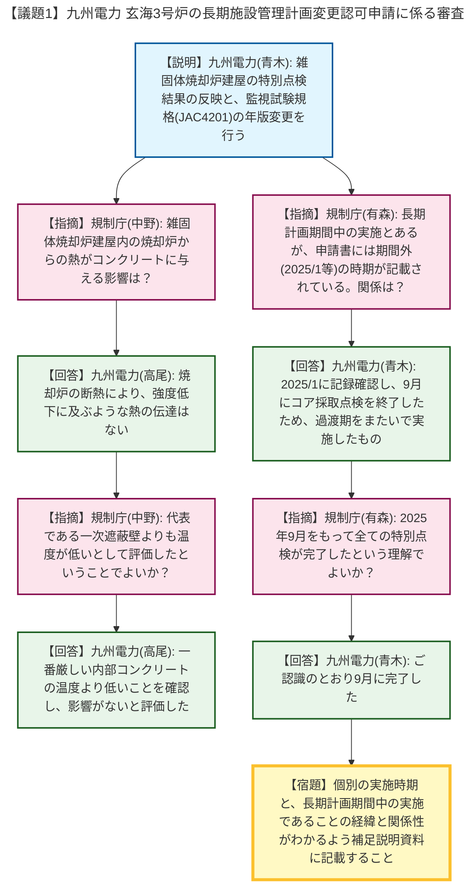
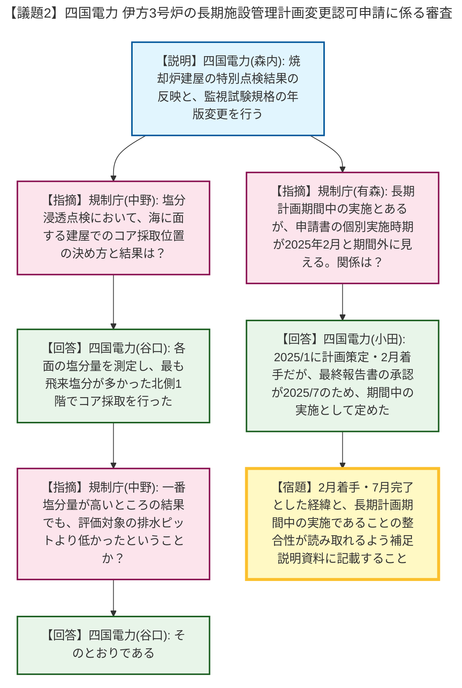

# 第29回実用発電用原子炉の長期施設管理計画等に係る審査会合（令和8年4月23日）
> 出典 : https://youtube.com/live/2lPRzByfw0w?si=xPCceezpjIpY3seG

# 会合の概要
* **新制度移行期における特別点検「実施時期」の厳密な整理の要求:** 玄海3号炉および伊方3号炉の両議題において、法改正（2025年6月6日施行）をまたぐ過渡期に実施された「特定共用施設（雑固体焼却炉建屋・焼却炉建屋）」の特別点検について、長期施設管理計画の「期間中」に実施したという法的立て付けと、実際の点検着手・完了時期との整合性が問われました。規制側から、事実関係が不明瞭であるとして、厳密な経緯の整理と補足説明資料への明記が強く求められました。
* **コンクリート構造物の技術的評価の妥当性確認:** 雑固体焼却炉からの熱影響（玄海）や、海に隣接する立地環境下での塩分浸透評価のためのコア採取位置の選定（伊方）などについて、規制側から質疑が行われました。事業者からの回答により、代表部位の評価に包絡されることなどが示され、技術的な懸念は払拭されました。
* **審査の今後の見通し:** 本会合での質疑により、申請書における技術的な主な内容は概ね確認されたと結論付けられ、今後は指摘された事実関係（スケジュール）の記載適正化を含め、事務方での詳細確認へ移行することとなりました。

---

# 議題ごとの詳細整理

## 【議題1】九州電力（株）玄海原子力発電所3号炉の長期施設管理計画変更認可申請に係る審査について
* **議論の背景と論点:** 玄海3号炉の長期施設管理計画変更認可申請において、特定共用施設である「雑固体焼却炉建屋」の初回の特別点検結果の反映と、監視試験規格（JEAC4201）の年版変更（2024年追補版エンドース対応）が論点となりました。特に、新制度への移行期に実施された特別点検の時期の整理が焦点となりました。
* **質疑応答（詳細）:**
    * 【説明者側】九州電力（青木）より、雑固体焼却炉建屋の特別点検を実施し技術評価へ反映したこと、また監視試験規格（JEAC4201-2007）の2024年追補版への年版変更を行う旨が説明されました。
    * 【規制側】規制庁（中野）から、雑固体焼却炉建屋内の焼却炉からの熱影響が、建屋のコンクリートにどのような影響を与えているか説明を求められました。
    * 【説明者側】九州電力（高尾）は、焼却炉の断熱設計により、コンクリートの強度低下に及ぶような熱の伝達はないと回答しました。
    * 【規制側】規制庁（中野）から、その温度測定結果をもって、内部コンクリートの代表である「一次遮蔽壁」よりも温度が低いとして健全性を評価したという理解でよいか確認されました。
    * 【説明者側】九州電力（高尾）は、一番厳しい内部コンクリートの温度よりも低いことを確認し、評価結果に影響がないと確認していると回答・根拠提示しました。
    * 【規制側】規制庁（有森）から、特別点検の実施時期について、長期施設管理計画の期間中（2025年6月6日が始期）に実施したとあるが、申請書の個別の点検結果には「2025年1月」など期間外の時期が示されているため、その関係を説明するよう求められました。
    * 【説明者側】九州電力（青木）は、2025年1月に実施済み劣化点検の記録確認を行い、9月にコアサンプル採取点検の作業を終了したため、法改正の施行日をまたぐ過渡期に実施したものと回答しました。
    * 【規制側】規制庁（有森）から、2025年9月をもって全ての特別点検が完了したという理解でよいか再確認されました。
    * 【説明者側】九州電力（青木）は、ご認識のとおり9月に完了したと同意しました。
    * 【規制側】規制庁（有森）は、申請書の個別の実施時期と、長期施設管理計画期間中の実施であることの関係がわかるよう、経緯とともに補足説明資料へまとめるよう指摘しました。
    * 【説明者側】九州電力（青木）は、承知したと回答しました。
* **結論と宿題事項（アクションアイテム）:**
    * 技術的な評価内容については概ね確認が取れましたが、特別点検の実施時期に関する事実関係の整理が求められました。
    * 【宿題】特別点検の個別の実施時期と、長期施設管理計画の期間中に実施・完了したことの整合性が明確にわかるよう、補足説明資料に経緯を記載すること。引き続き事務方での確認を行う。

## 【議題2】四国電力（株）伊方発電所3号炉の長期施設管理計画変更認可申請に係る審査について
* **議論の背景と論点:** 伊方3号炉の長期施設管理計画変更認可申請において、特定共用施設である「焼却炉建屋」の特別点検結果の反映と、監視試験規格の年版変更が論点となりました。玄海3号炉と同様、特別点検の実施時期の整理と、塩分浸透の評価方法（コア採取位置）が焦点となりました。
* **質疑応答（詳細）:**
    * 【説明者側】四国電力（森内）より、焼却炉建屋の特別点検結果の技術評価への反映と、監視試験規格の2024年追補版への年版変更を行う旨が説明されました。
    * 【規制側】規制庁（中野）から、海の目の前に立地する焼却炉建屋における、塩分浸透の点検のためのボーリングコア採取位置の決め方と、その結果について説明を求められました。
    * 【説明者側】四国電力（谷口）は、海に面する北面が飛来塩分の影響を最も厳しく受けると想定し、1階・2階の四方面の塩分量を測定した結果、北側1階の飛来塩分量が最も多かったため、その場所でコア採取を行ったと回答・根拠提示しました。
    * 【規制側】規制庁（中野）から、一番塩分量が高いところの結果をもってしても、評価対象の排水ピットより低かったという結果であったか確認されました。
    * 【説明者側】四国電力（谷口）は、そのとおりであると回答しました。
    * 【規制側】規制庁（有森）から、特別点検の実施時期について、長期施設管理計画の期間中に実施したとあるが、申請書の個別の実施時期が2025年2月と期間外に見えるため、その関係を説明するよう求められました。
    * 【説明者側】四国電力（小田）は、改正法の日以前の2025年1月に実施計画を策定し、2月に記録確認、2〜6月にコア採取を実施したが、最終的な報告書を作成し承認したのが2025年7月であったため、特別点検の期間中に完了したものとして6号措置に定めたと回答しました。
    * 【規制側】規制庁（有森）は、2月に着手し7月に完了したという経緯が申請書から読み取れないため、事実関係を補足説明資料に整理して記載するよう指摘しました。
    * 【説明者側】四国電力（小田）は、承知したと同意しました。
* **結論と宿題事項（アクションアイテム）:**
    * コンクリートへの塩分浸透の評価等は妥当と判断されましたが、玄海3号炉と同様に特別点検の実施時期の整理が求められました。
    * 【宿題】特別点検に2月着手・7月完了とした経緯と、長期施設管理計画期間中の実施であることの整合性が明確になるよう、補足説明資料に明記すること。引き続き事務方での確認を行う。

---

# 論理構造の可視化（Mermaid）

以下に、議題ごとの議論のフローをMermaid形式で記述します。どの議題に対応する図かがわかるよう、YAML frontmatterの `title` に議題名を明記しています。

