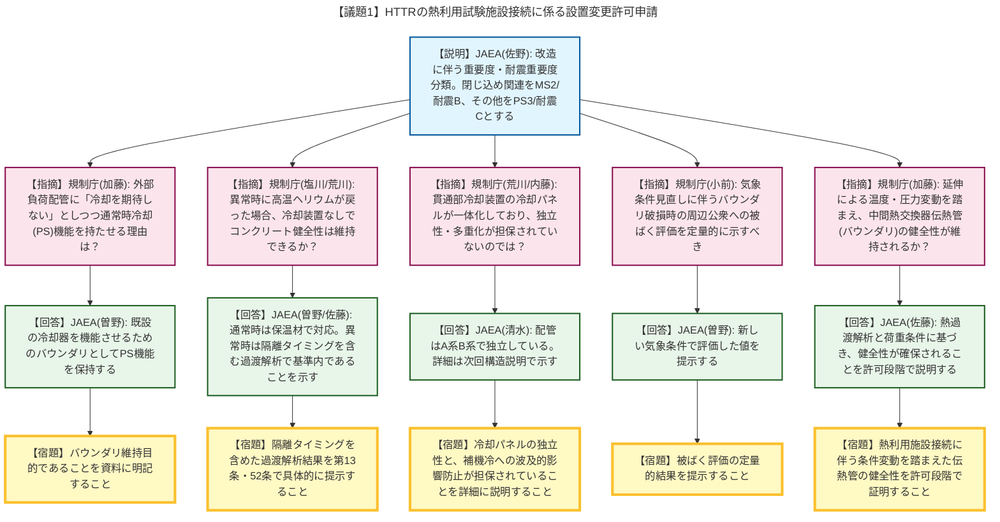
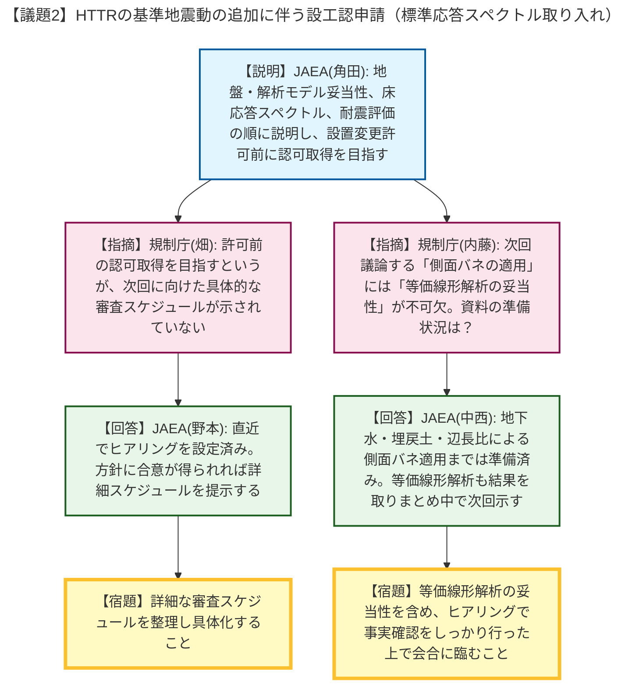

# 第578回核燃料施設等の新規制基準適合性に係る審査会合（令和8年4月23日）
> 出典 : https://youtube.com/live/gfkvrxNJMiI?si=xu3mnOIJq0r2neqR

# 会合の概要
* **熱利用施設接続に伴うバウンダリと構造物の健全性維持:** 議題1において、熱利用施設へ接続される二次ヘリウム配管等に関する安全重要度・耐震重要度分類が議論されました。異常時に熱消費ができず高温のままヘリウムが戻ってきた場合のコンクリート構造物の健全性維持や、圧力・温度条件の変動が中間熱交換器の伝熱管に与える影響について、規制側から過渡解析に基づく詳細な説明が強く求められました。
* **新設される貫通部冷却装置の独立性（多重化）に対する厳しい指摘:** 原子炉格納容器貫通部冷却装置について、JAEAは「冷却パネル方式」を提案しましたが、規制側から「配管が独立していてもパネルが一体では多重化（独立性）が担保されていないのではないか」「補機冷却水系統（補機冷）が他の動的機器へ悪影響を与えないか」と厳しく追及され、システム設計の根本的な確認が宿題となりました。
* **標準応答スペクトル取り入れ（設工認）の審査スケジュールの明確化:** 議題2において、JAEAは熱利用施設接続の「設置変更許可」の取得前に、標準応答スペクトルを取り入れた設工認の「認可」を目指すという強気の方針を示しました。これに対し規制庁は、側面バネの適用や等価線形解析の妥当性など、技術的根拠となる資料の確実な準備と、ヒアリングを含めた緻密なスケジュール管理を要求しました。

---

# 議題ごとの詳細整理

## 【議題1】HTTRの熱利用試験施設接続に係る設置変更許可申請
* **議論の背景と論点:** HTTR（高温工学試験研究炉）に熱利用試験施設を接続するための改造（二次ヘリウム配管の延伸、貫通部冷却装置の新設など）に伴い、追加・変更される設備の「安全上の機能別重要度分類」「重要安全施設の選定」および「耐震重要度分類」の妥当性が争点となりました。
* **質疑応答（詳細）:**
    * 【説明者側】JAEA（佐野）より、改造内容と各安全機能（通常時冷却、放射性物質の閉じ込め、差圧維持）に応じた重要度分類の説明が行われました。閉じ込め機能（MS2）に該当する格納容器貫通部や隔離弁までの配管等を耐震Bクラスとし、その他の二次ヘリウム配管等を耐震Cクラスに分類する方針が示されました。
    * 【規制側】規制庁（加藤）から、二次冷却系の通常時冷却について、資料に「熱供給の冷却は期待しない」と記載がある一方で、「通常時冷却」を安全機能として持たせている理由について疑義が呈されました。
    * 【説明者側】JAEA（曽野）は、延伸する部分は既設の二次加圧水冷却器（通常時冷却機能を持つ）のバウンダリとなるため、機能を維持する目的でPS機能を保持させると回答・根拠提示しました。
    * 【規制側】規制庁（加藤）から、その旨が明確に伝わるよう資料に注記するよう求められました。
    * 【規制側】規制庁（塩川、荒川）より、新設の格納容器貫通部冷却装置に関して、行き側配管のみ冷却し戻り側配管の冷却装置を設けない方針に対し、異常時に熱消費ができず高温のまま戻ってきた場合、コンクリート構造物が最高使用温度を超え、格納容器の関連機能が損なわれるのではないかと強い懸念が示されました。
    * 【説明者側】JAEA（曽野、佐藤）は、行き側は断熱材と冷却装置で対応し、戻り側も保温材で70℃程度に下げるため通常時は冷却不要であると回答しました。また異常時については、隔離のタイミングを含めた過渡解析により、温度が基準内に収まることを第13条や第52条の適合性説明で示すと反論しました。
    * 【規制側】規制庁（荒川、内藤）から、貫通部冷却装置は事故時に期待する動的機器であり多重化が必要だが、配管は2系統（A系・B系）あっても冷却パネルが一体化しているため独立性が担保されていないのではないか、また補機冷の系統間で冷却水が混合し他の機器へ影響を与えないかとの指摘がなされました。
    * 【説明者側】JAEA（清水）は、冷却パネル方式を採用しており系統は完全に独立していると回答しましたが、詳細は次回の構造説明時に示すと引き取りました。
    * 【規制側】規制庁（小前）より、新規制基準時からの気象条件の見直しに伴い、バウンダリ以外の破損時の周辺公衆への被ばく評価（約3mSv）がどう変化するのか定量的な説明が求められました。
    * 【説明者側】JAEA（曽野）は、新しい気象条件で評価した値を提示すると回答しました。
    * 【規制側】規制庁（加藤）から、二次ヘリウム冷却設備の耐震分類が「原子炉冷却材圧力バウンダリの健全性」を前提としている点について、一次・二次を隔てる中間熱交換器の伝熱管が、熱利用施設接続による圧力・温度変動の影響を受けても健全性を維持できるか、設計の成立性を許可段階で示すよう指摘されました。
    * 【説明者側】JAEA（佐藤）は、延伸に伴う熱過渡解析と荷重条件に基づき、伝熱管の健全性が確保されることを許可段階から説明していくと回答しました。
* **結論と宿題事項（アクションアイテム）:**
    * 【宿題】「原子炉の冷却を期待しない」外部負荷配管に通常時冷却（PS）機能を持たせる理由（バウンダリ維持目的）を資料に明記すること。
    * 【宿題】異常時に高温ヘリウムが戻ってきた場合のコンクリート構造物の健全性について、隔離タイミングを含めた過渡解析結果を第13条・52条で提示すること。
    * 【宿題】貫通部冷却装置の「冷却パネル」の構造について、A系・B系の独立性と補機冷への波及的影響防止が担保されていることを具体的に説明すること。
    * 【宿題】新しい気象条件に基づく被ばく評価の定量的結果を提示すること。
    * 【宿題】熱利用施設の追加に伴う熱過渡・荷重条件の変動を踏まえ、中間熱交換器の伝熱管（圧力バウンダリ）の健全性が維持されることを許可段階で説明すること。

## 【議題2】HTTRの基準地震動の追加に伴う設計及び工事の計画の認可申請
* **議論の背景と論点:** 標準応答スペクトルを取り入れるための設工認審査において、規制庁から求められている地盤物性値のばらつきを考慮した地震応答解析の現在の対応状況、今後の説明フロー、および後段規制の経過措置期間との関係性が議論されました。
* **質疑応答（詳細）:**
    * 【説明者側】JAEA（角田）より、今後のフローとして「地盤・解析モデルの妥当性」「床応答スペクトルの作成」「耐震評価」の順に説明を進めること、また、後段規制の経過措置期限（令和11年）を待たず、議題1の熱利用施設の「設置変更許可」が下りる前に本設工認の「認可」を目指す方針が説明されました。
    * 【規制側】規制庁（畑）から、許可前に認可を目指すという野心的な目標を掲げる一方で、次回の審査会合に向けた具体的なスケジュールが示されていないと指摘されました。
    * 【説明者側】JAEA（野本）は、来週月曜日にヒアリングを設定しており、本日の進め方に合意が得られればより詳細なスケジュールを提示すると回答しました。
    * 【規制側】規制庁（内藤）より、次回（第3回）予定の「側面バネの適用」などを議論するには「等価線形解析の妥当性」が不可欠であり、資料の準備状況はどうなっているか確認が行われました。
    * 【説明者側】JAEA（中西）は、地下水、埋戻土、建屋の辺長比による側面バネ適用までは準備済みであり、等価線形解析についても解析結果を取りまとめ中であるため、次回のヒアリングで提示できると回答しました。
    * 【規制側】規制庁（内藤）は、等価線形解析の妥当性も含め、事実確認をしっかり行った上で審査会合に進めるよう念押ししました。
* **結論と宿題事項（アクションアイテム）:**
    * JAEAが提示した審査パッケージ案（説明フロー）の順序に沿って審査を進めることで概ね合意しました。
    * 【宿題】ヒアリングを通じて等価線形解析を含む地盤・解析モデルの資料を確実に提示し、詳細な審査スケジュールを具体化すること。

---

# 論理構造の可視化（Mermaid）

以下に、議題ごとの議論のフローをMermaid形式で記述します。どの議題に対応する図かがわかるよう、YAML frontmatterの `title` に議題名を明記しています。

