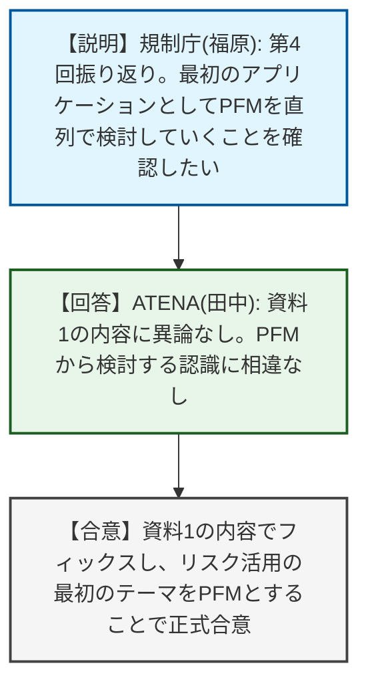
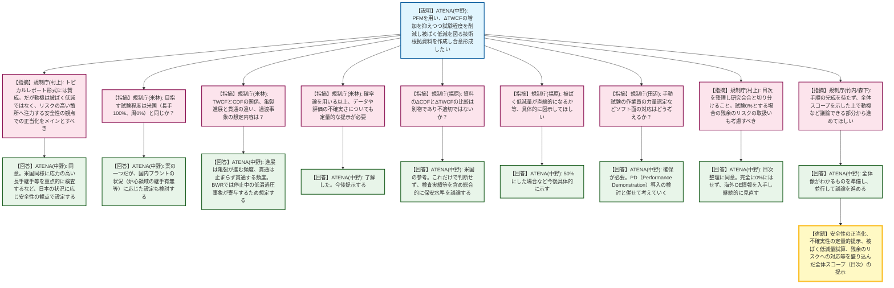
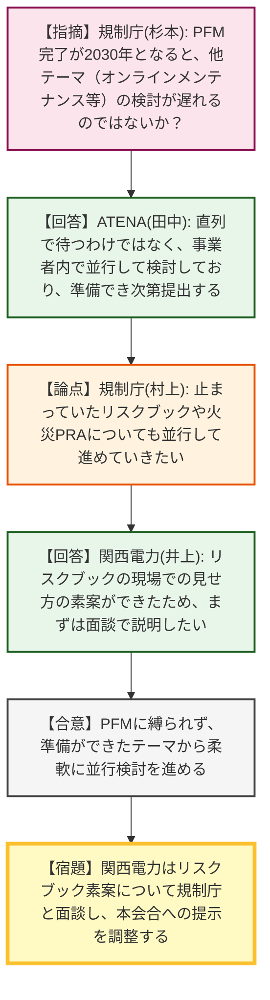

# 第5回リスク情報活用に関する事業者との実務レベルの技術的意見交換会（令和8年4月23日）
> 出典 : https://youtube.com/live/dvmE41OKnbo?si=ets8UhQ1MSNh_YiK

# 会合の概要
* **安全性向上に向けた動機付けの修正要求:** 確率論的破壊力学（PFM）を用いた原子炉圧力容器（RPV）の試験程度（検査範囲）削減について、事業者が「被ばく低減」を前面に押し出したのに対し、規制庁側は「リスクの高い箇所にリソースを集中させる」という安全性の観点からの正当化を議論の主軸に据えるよう強く釘を刺し、議論の方向性が軌道修正されました。
* **技術的議論の道筋と合理性の担保:** 試験程度を削減することの根拠として、データや評価の「不確実性」の定量的提示や、「残余のリスク（試験を0%にした場合のリスク）」への対応、力量管理（ソフト面）のあり方など、単なる解析結果の提示にとどまらない多角的な確認要求が規制側から次々と提示されました。
* **トピカルレポート形式の合意と研究会合との棲み分け:** 技術根拠資料を「トピカルレポート的」にまとめるアプローチについては規制側も賛同しました。ただし、解析コードのV&V（検証と妥当性確認）など基盤的な手法の議論は研究意見交換会に委ねつつ、実機適用の議論は本会合で並行して進めるという役割分担と、全体スコープの早期提示が求められました。
* **複数テーマの並行処理への合意:** PFMの適用完了が2030年度と長期にわたる計画が示されたことに対し、規制庁側から他のテーマ（オンラインメンテナンス、リスクブック等）が停滞する懸念が示されましたが、事業者が並行して準備を進めていると回答し、柔軟かつ同時並行で議論を進めることで合意しました。

---

# 議題ごとの詳細整理

## 【議題1】第4回会合の振り返りと今後のアプリケーション（PFM）選定の確認
* **議論の背景と論点:** 前回（第4回）の合意事項を振り返り、今後直列に検討していくリスク情報活用の最初のアプリケーションが「PFM」であることの認識合わせを行いました。
* **質疑応答（詳細）:**
  * 【説明者側】規制庁（福原）から、前回の概要として「PRAモデルのおおむね1年以内の共有」「デルタCDFの大きいところからの適切性確認」「現場活用を前提としたリスクブックの検討」について認識相違がなかったことを説明しました。そのうえで、第3回で合意した通り、最初のアプリケーションとしてPFMを選定したという認識でよいか確認を求めました。
  * 【回答】ATENA（田中）は、資料1の内容について特段の追加・コメントはなく、PFMから検討するという認識に相違はないと回答しました。
* **結論と宿題事項（アクションアイテム）:**
  * 前回資料の内容でフィックスし、リスク情報活用の最初のテーマとしてPFMを検討していくことで正式に合意しました。

## 【議題2】PFMを用いたRPV溶接継手試験程度の変更（技術根拠と進め方）
* **議論の背景と論点:** 技術基準規則の解釈改正により10年で100%の超音波探傷試験が要求されるようになったが、事業者（ATENA）はPFMを用いて、リスクが低い箇所の試験程度を合理化（削減）し、同時に被ばく低減を図ることを目指しています。その妥当性の証明方法と合意形成の進め方が争点となりました。
* **質疑応答（詳細）:**
  * 【説明者側】ATENA（中野）から、PFMを活用して試験程度を変更しても、亀裂貫通頻度（TWCF）の増加量（ΔTWCF）が無視できるほど小さく、被ばく量も低減できることを示す技術根拠資料を作成し、2030年度以降に試験程度変更を目指す旨が説明されました。また、資料の作成段階から本会合や研究の意見交換会を通じて規制当局と合意形成を図りたいと要望しました。
  * 【規制側】規制庁（村上）は、本意見交換会をベースとしつつ必要に応じ研究会合と連携する枠組みや、技術根拠資料を「トピカルレポート的」に進める手法には賛成しました。しかし、試験程度を下げる最大の動機は「被ばく低減」ではなく、明らかな危険箇所に注力するといった「安全性の観点からの正当化」をメインにして議論すべきだと強く指摘しました。
  * 【説明者側】ATENA（中野）はこれに同意し、米国のように応力が2倍高い長手継手を重点的に検査するなど、リスクの高いところにリソースをかけるという思いは同じであると回答しました。
  * 【規制側】規制庁（米林）から、目指す試験程度は米国と同じ（長手100%、周0%）か質問がありました。
  * 【説明者側】ATENA（中野）は、米国と同等を一つの案としつつも、国内の新しいプラントでは炉心領域に長手継手がない場合もあるため、プラント状況に応じた設定を検討すると回答しました。
  * 【規制側】規制庁（米林）から、TWCFは炉心損傷頻度（CDF）と同じか、大LOCAや小LOCAのように亀裂サイズで頻度を分けているか、また「亀裂進展頻度」と「亀裂貫通頻度」の違い、過渡事象の想定について立て続けに疑義が呈されました。
  * 【説明者側】ATENA（中野）は、初期亀裂の分布を与え、それが壊れるかどうかを評価するためLOCAサイズでの分類はしていないと説明しました。また、進展頻度は亀裂が進む頻度、貫通頻度は進み出した亀裂が止まらず貫通に至る頻度であると解説し、想定事象については、BWRでは停止中のポンプ誤起動による低温過圧事象がTWCFに大きく寄与するためそれを想定し、運転中の事象は影響が小さいと根拠を提示しました。
  * 【規制側】規制庁（米林）は、確率論を使う以上、平均値だけでなくデータや評価の「不確実さ」についても定量的な話をしてほしいと要求しました。
  * 【説明者側】ATENA（中野）はこれに同意しました。
  * 【規制側】規制庁（福原）は、資料内にあるΔCDF（10^-6）とΔTWCFを比較することは別物であり不適切ではないかと指摘しました。
  * 【説明者側】ATENA（中野）は、米国で判断基準として用いられているため参考として示したとし、これだけで判断するわけではなく、検査実績やOE情報を含めて総合的に保安水準を議論したいと反論しました。
  * 【規制側】規制庁（福原）は、被ばく低減量が直線的になるか等、具体的に図示してほしいと要求しました。
  * 【説明者側】ATENA（中野）は、試験を50%にした場合など今後具体的に示すと回答しました。
  * 【規制側】規制庁（田辺）は、手動の探傷試験を行う際の作業員の力量認定など、ソフト面での対応計画があるか確認しました。
  * 【説明者側】ATENA（中野）は、力量確保は必要であり、オーステナイト配管でのPD（Performance Demonstration）導入の検討と併せて考えていくと回答しました。
  * 【規制側】規制庁（村上）は、トピカルレポートの目次を先に整理し、研究会合等で既出の項目を切り分けることと、試験を0%とする場合の「残余のリスク」の取扱いも考慮すべきだと指摘しました。
  * 【説明者側】ATENA（中野）は、目次の整理に同意し、試験を完全に0%にして放置するわけではなく、海外のOE情報を入手し継続的に見直す判断をしていくと回答しました。
  * 【規制側】規制庁（竹内、森下）は、研究会合でのV&V手順策定と本会合での議論の分担について、全体のスコープを示した上で、手順の完成を待たずに「動機」など議論できる部分から並行して進めてほしいと要請しました。
  * 【説明者側】ATENA（中野）は、全体像がわかるものを準備し、並行して議論を進めると合意しました。
* **結論と宿題事項（アクションアイテム）:**
  * PFMを用いた試験程度変更の技術根拠資料（トピカルレポート形式）の作成を進めることで合意しました。
  * **宿題事項**: 
    1. ATENAは、研究会合との切り分けを含む全体スコープ（目次構成等）を整理し提示すること。
    2. 「安全性の観点からの正当化（リスクの高い箇所への注力）」を主軸とした動機付けの整理。
    3. 解析データ・評価の「不確実性」の定量的な提示。
    4. 被ばく低減量の具体的な試算の提示。
    5. 「残余のリスク」への継続的な対処方針の明示。
    6. $\Delta TWCF$と十分な保安水準の関連性についての論理構築。

## 【議題3】今後のリスク情報活用の進め方（他テーマの並行検討）
* **議論の背景と論点:** PFMを用いた試験程度変更の実機適用が2030年度と長期にわたる計画が示されたため、オンラインメンテナンスやリスクブックといった他のリスク情報活用テーマの検討が直列で待たされてしまうのではないかという懸念が示されました。
* **質疑応答（詳細）:**
  * 【規制側】規制庁（杉本）は、PFMの完了が2030年度となると、次のテーマに移るのが2029年度以降になるのか、事業者の考えを問いました。
  * 【説明者側】ATENA（田中）は、直列で待つわけではなく、各テーマは事業者内で並行して検討を進めており、準備ができ次第提出したいと回答・反論しました。
  * 【規制側】規制庁（村上）は、以前議論が止まっていたオンラインメンテナンスやリスクブック、火災PRAについても並行して進めていきたいと提案しました。
  * 【説明者側】関西電力（井上）は、リスクブックについて「現場でどう見せるべきか」の素案ができつつあるため、まずは面談で説明し、その後の本会合での取り扱いを相談したいと回答しました。
* **結論と宿題事項（アクションアイテム）:**
  * リスク情報活用の各テーマ（PFM、リスクブック等）を直列に縛られず、準備ができたものから並行して柔軟に検討を進めることで合意しました。
  * **宿題事項**: 関西電力は、リスクブックの素案について規制庁と面談を実施し、本会合への提示に向けた調整を行うこと。

---

# 論理構造の可視化（Mermaid）

以下に各議題の議論のフローをMermaid形式で記述します。

