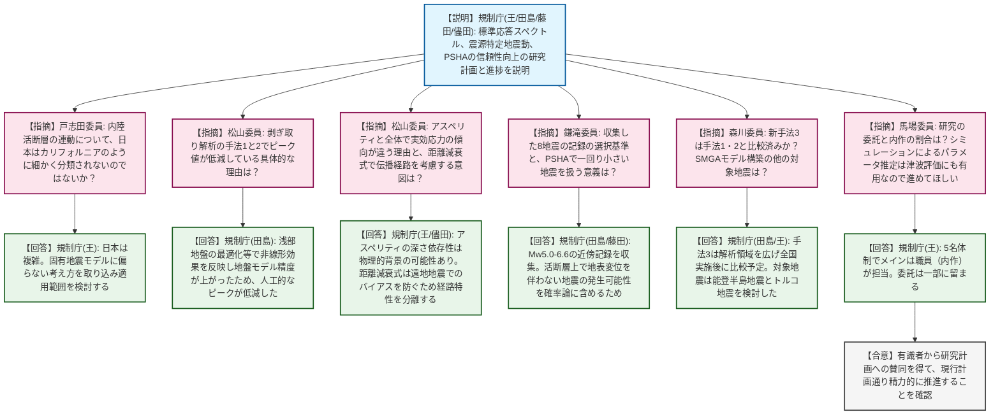

# 第19回地震・津波技術評価検討会（令和8年4月24日）
> 出典 : https://youtube.com/live/92rj1geRkqo?si=bJ63HsT0hio9dZau

# 会合の概要
* **最新知見を取り入れた意欲的な研究への評価と期待:** 令和6年度開始の安全研究プロジェクト（地震動評価手法および断層活動性評価手法）について、能登半島地震や熊本地震などの最新事例を取り込んだ研究計画に対し、外部有識者・専門技術者から「先進的かつ包括的な取り組みである」との高い評価と期待が寄せられました。
* **専門的視点からの手法とデータへの鋭い指摘:** 有識者から、剥ぎ取り解析における手法間の差異の根拠、海底コアを用いた火山灰年代指標の飛躍的な増加の見通し、地球化学分析における深部流体の影響など、高度な技術的視点からの質問が相次ぎ、活発な技術的議論が交わされました。
* **研究計画の進捗遅れに対する懸念とスケジュールの見直し:** 議題2において、断層露頭の探索に手間取っていることによるデータの蓄積遅れが指摘されました。規制側（事務局）はこれを真摯に受け止めつつ、新規テーマ（宇宙線生成核種等）の追加と合わせて、研究期間を令和11年度まで1年間延長する方針を示し、概ね了承されました。

---

# 議題ごとの詳細整理

## 【議題1】地震動評価手法の信頼性向上に関する研究 中間評価
* **議論の背景と論点:** 標準応答スペクトル（震源を特定しない地震動）、地域性を考慮する地震動（震源を特定する地震動）、および確率論的地震動ハザード評価（PSHA）の3つの柱について、手法の信頼性向上を図る研究の中間評価が行われました。剥ぎ取り解析手法の違い、距離減衰式の補正、小規模地震の扱いなどが論点となりました。
* **質疑応答（詳細）:**
    * 【説明者側】規制庁（王、田島、藤田、儘田）より、3つの研究項目の進捗について説明が行われました。最新の観測記録の収集、剥ぎ取り解析手法（手法1〜3）の比較、SMGAモデルの適用事例（熊本地震、能登半島地震等）、距離減衰式の補正などが報告されました。
    * 【規制側】戸志田委員（電中研）から、内陸活断層の連動に関して、カリフォルニアの事例（サンアンドレアス断層）と異なり、日本の内陸活断層は細かく分類されないのではないかとの疑問が呈されました。
    * 【説明者側】規制庁（王）は、日本は複雑であるため固有地震モデルに偏らない考え方を取り込み、適用できる範囲を目指すと回答しました。
    * 【規制側】松山委員（電中研）から、剥ぎ取り解析の手法1と2でピーク値が低減している具体的な理由について説明を求められました。
    * 【説明者側】規制庁（田島）は、手法1（鉛直入射）と手法2（斜め入射を考慮）はともに浅部地盤での最適化を考慮して非線形効果を実質的に反映しており、地盤モデルの精度が上がったため人工的なピークが低減する方向になっていると回答・根拠提示しました。
    * 【規制側】松山委員（電中研）から、相関図（実効応力と深さの関係）でアスペリティと全体とで傾向が異なる理由、および距離減衰式の影響において伝播経路特性（パス）を分離してチェックする意図について質問・コメントがありました。
    * 【説明者側】規制庁（王、儘田）は、アスペリティの深さ依存性については物理的背景の可能性があるが詳細な分析はこれからであること、距離減衰式については幾何減衰などに距離依存性が入り遠地地震でバイアスになるため伝播経路特性の分離チェックが必要であることを説明しました。
    * 【規制側】鎌滝委員（岡山理科大）から、収集した8地震の記録の選択基準と、PSHAにおいて「固有地震規模よりも一回り小さい地震」を扱う意義について質問がありました。
    * 【説明者側】規制庁（田島、藤田）は、Mw5.0〜6.6で地表断層が現れず、震央距離30km以内の近傍記録があるものを収集したと回答。また、活断層上で地表変位を伴わないMw6.4程度の地震が発生する可能性を確率論に含めるため、一回り小さい地震も対象にしていると回答しました。
    * 【規制側】森川委員（防災科研）から、新たな剥ぎ取り解析（手法3）は手法1・2と既に比較したのか、またSMGAモデル構築の対象地震として他に決まっているものはあるか質問がありました。
    * 【説明者側】規制庁（田島、王）は、手法3（スペクトルインバージョン）は解析領域を広げたことで課題も見つかっており全国実施後に比較予定であること、SMGAの対象地震は能登半島地震と2023年トルコ地震の2事例を検討したことを回答しました。
    * 【規制側】馬場委員（徳島大）から、研究の委託と内作（職員実施）の割合についての質問と、シミュレーションによるパラメータ推定が津波の確率論的評価にも有用であるため精力的に進めてほしいとの賛辞がありました。
    * 【説明者側】規制庁（王）は、5名体制のうちメインは職員（内作）が担当しており、委託は2項目程度であると回答しました。
* **結論と宿題事項（アクションアイテム）:**
    * 研究の方向性や手法の妥当性について有識者からの賛同を得て、現行の計画通り精力的に推進していくことが確認されました。

## 【議題2】断層の活動性評価手法に関する研究 中間評価
* **議論の背景と論点:** 鉱物脈法、地球化学的指標、海底コアを用いた火山灰年代評価の3つの手法による断層活動性評価の研究について中間評価が行われました。さらに、新規テーマ（宇宙線生成核種／ルミネッセンス法、地殻変動／連動性評価）の追加と、露頭探索の遅れに伴う研究期間の1年延長（令和11年度まで）が論点となりました。
* **質疑応答（詳細）:**
    * 【説明者側】規制庁（内田、林、松浦）より、各評価手法の進捗と、新規テーマの追加、および研究終了時期の1年延長について説明が行われました。
    * 【規制側】戸志田委員（電中研）から、アパタイト鉱物に対するウラン・トリウム年代測定など適用範囲が広い項目にも取り組むべきとの提案と、地球化学分析において先行研究（敦賀半島）と同様の結果が得られる可能性と他地域への適用について質問がありました。
    * 【説明者側】規制庁（内田、林）は、年代測定は高度な測定になるため適用可能か含め検討中であること、地球化学分析については先行研究とは別の岩体（花崗岩体）で調査しており、判別手法（ロジスティック回帰分析など）を含めてバリエーションを持って検討していくと回答しました。
    * 【規制側】松山委員（電中研）から、充実した内容である一方、断層露頭の探索に手間取っており2年間の結果が少なく見えること、新規テーマ追加が既存計画の遅れに影響しないかとの懸念が示されました。また、屈曲部の隆起・沈降は断層面形状を押さえれば既存の津波評価等で計算できているのではないかと質問がありました。
    * 【説明者側】規制庁（内田）は、テーマは人に紐づいており直接的な遅れの影響はないものの、1～2年目は調査メインのため結果が出るのは後半になるという事情を説明しました。また、隆起・沈降については、データを盲目的に使わず実務上の課題を意識するための整理であり、頻度論や破壊の重畳への影響が重要になると回答しました。
    * 【規制側】鎌滝委員（岡山理科大）から、地球化学的調査における風化の度合いについて、天水だけでなく深部流体や地下水流動の影響も検討しているか質問がありました。
    * 【説明者側】規制庁（林）は、下から上がってくる深部流体等の影響も当然考えており、最終的に地球化学的なモデリングを行う予定であると回答しました。
    * 【規制側】森川委員（防災科研）から、本研究は活動性（活断層か、いつ活動したか）の評価であり規模の検討はしないのかとの確認と、連動性評価の成果を地震動評価にも活用してほしいとの要望がありました。
    * 【説明者側】規制庁（内田）は、本プロジェクトは活動性評価に焦点を当てているが、津波プロジェクトとの連携を通じて特性化波源モデルの作成等に結びつき、間接的に規模評価にも寄与すると回答しました。
    * 【規制側】馬場委員（徳島大）から、海底コアの解析により年代指標となる火山灰がどの程度（何倍）増えると予想されるか質問がありました。また、屈曲部での隆起・沈降はメインの主断層の変動に比べれば大きな津波を発生させないのではないかとのコメントがありました。
    * 【説明者側】規制庁（松浦、内田）は、先行研究で8枚だったテフラに対し、本研究では圧倒的に多くの火山灰層序を検出しており、ブレイクスルーにつながると回答しました。津波については、サイト前面に屈曲部が位置する場合の確率論評価への影響や、主破壊との重畳を重要視していると説明しました。
* **結論と宿題事項（アクションアイテム）:**
    * 新規テーマの追加と、それに伴う研究期間の1年延長（令和11年度まで）が有識者から概ね妥当として了承されました。
    * 各委員は後日、本日の議論を踏まえた「評価シート及び意見シート」を提出することが確認されました。

---

# 論理構造の可視化（Mermaid）

以下に各議題の議論のフローをMermaid形式で記述します。



```mermaid
graph TD
    classDef desc fill:#e1f5fe,stroke:#01579b,stroke-width:2px;
    classDef point fill:#fce4ec,stroke:#880e4f,stroke-width:2px;
    classDef issue fill:#fff3e0,stroke:#e65100,stroke-width:2px;
    classDef ans fill:#e8f5e9,stroke:#1b5e20,stroke-width:2px;
    classDef task fill:#fff9c4,stroke:#fbc02d,stroke-width:4px;
    classDef agree fill:#f5f5f5,stroke:#424242,stroke-width:2px;

    %% 議題2：断層の活動性評価手法に関する研究
    N2_1["【説明】規制庁(内田/林/松浦): 鉱物脈法、地球化学的指標、火山灰年代評価の進捗と、新規2テーマ追加・期間1年延長を提案"]:::desc
    
    N2_2["【指摘】戸志田委員: アパタイトのウラン・トリウム年代測定の適用と、地球化学分析で先行研究と同じ結果になる可能性は？"]:::point
    N2_3["【回答】規制庁(内田/林): 年代測定は適用可能性を検討中。地球化学分析は先行研究と別の花崗岩体で実施し、判別手法もバリエーションを持たせる"]:::ans
    
    N2_4["【指摘】松山委員: 露頭探索の遅れが新規テーマ等の計画に影響しないか？屈曲部の隆起・沈降は既存手法で計算できているのでは？"]:::point
    N2_5["【回答】規制庁(内田): テーマは人に紐づき直接的影響はない。隆起・沈降は盲目的適用を防ぐ実務課題の整理であり、頻度論や重畳への影響が重要"]:::ans
    
    N2_6["【指摘】鎌滝委員: 地球化学的調査の風化度合いについて、天水だけでなく深部流体や地下水流動の影響も検討しているか？"]:::point
    N2_7["【回答】規制庁(林): 下からの深部流体等の影響も考慮し、最終的に地球化学的なモデリングを行う予定"]:::ans
    
    N2_8["【指摘】森川委員: 本研究は活動性評価であり規模の検討はしないのか？連動性評価の成果を地震動評価にも活用してほしい"]:::point
    N2_9["【回答】規制庁(内田): 規模評価は切り分けているが、津波プロジェクト等との連携を通じ間接的に規模評価にも寄与する"]:::ans
    
    N2_10

