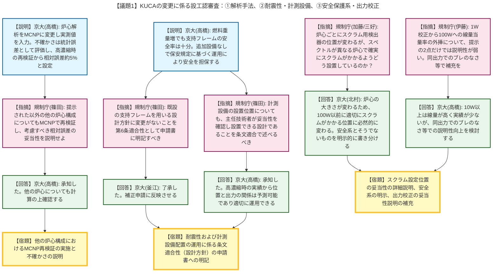
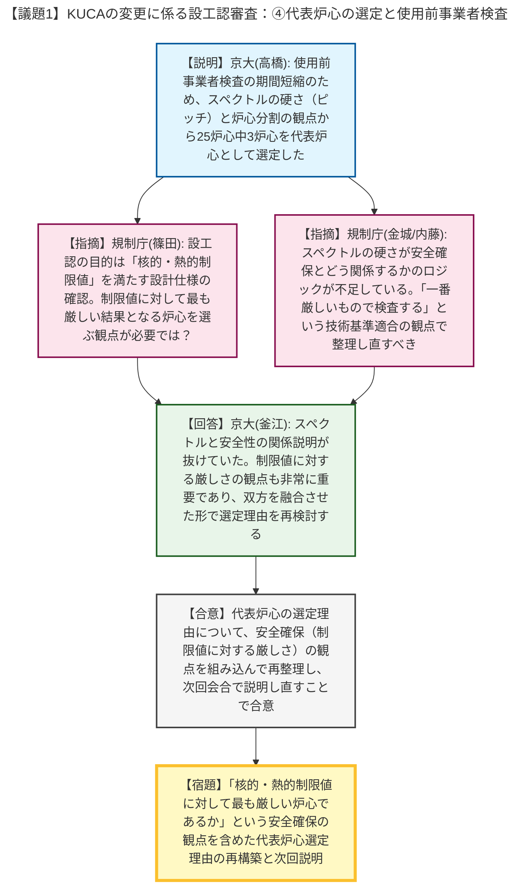

# 第579回核燃料施設等の新規制基準適合性に係る審査会合（令和8年4月24日）
> 出典 : https://youtube.com/live/ai2M5Qq95-8?si=JGe4cOW5VcreVRiG

# 会合の概要
* **検査対象炉心の合理化と代表性選定の厳格な要求:** 当初申請の「25炉心全てを使用前事業者検査の対象とする」方針に対し、京都大学は検査期間の長期化等を踏まえ、燃料ピッチ（中性子スペクトルの硬さ）と炉心分割の有無を基準に3炉心へ絞り込む案を提示しました。規制側は絞り込み自体は否定しなかったものの、「核的・熱的制限値に対して最も厳しい炉心であるか」という安全確保の観点からの選定理由が不足していると厳しく指摘し、論理の再構築を求めました。
* **解析手法の高度化と不確かさ評価の拡充:** 炉心解析コードを決定論的手法からモンテカルロ法（MCNP）へ変更し、実測値を用いることで評価精度が向上したことが説明されました。規制側は、高濃縮ウラン炉心を用いたMCNPの再検証結果（相対誤差約5%）が他の炉心構成でも成り立つか、対象を広げて再検証し説明するよう要求しました。
* **低出力炉特有の運用管理による安全担保への納得:** 崩壊熱除去や燃料取扱設備などの追加設備対応（第25条適合性）について、KUCA特有の低出力（最大100W）と手作業ベースの運用を踏まえ、保安規定・保安指示書に基づく厳格な手順（主任技術者による炉心配置や検出器位置の確認・承認プロセス等）で安全が担保されるとする京都大学の説明に、規制側は一定の理解を示しました。

---

# 議題ごとの詳細整理

## 【議題1】京都大学臨界実験装置（KUCA）の変更に係る設計及び工事の計画の承認申請について

### 議論の背景と論点
KUCAの軽水減速低濃縮ウラン炉心への変更に係る設工認審査において、前回会合での指摘に対する京都大学からの回答が行われました。主な論点は、①炉心解析手法（MCNP）の変更と不確かさの評価、②支持フレームの耐震安全性と計測設備の運用、③安全保護系検出器の配置と出力校正の妥当性、④使用前事業者検査の対象となる「代表炉心」の選定根拠、の4点です。

### 質疑応答（詳細）

#### ① 炉心解析手法の変更と不確かさの評価
* **【説明者側】京都大学（高橋）:** 設置変更承認時（決定論的手法）と異なり、本設工認ではモンテカルロ法（MCNP）による詳細計算に変更し、燃料の実測値を入力したことで非均質化を忠実に再現でき、反応度温度係数や制御棒価値の評価精度が向上した。不確かさはMCNPの統計誤差として評価しており、約30%の誤差は過去の決定論的手法のものであると説明。
* **【指摘】規制庁（篠田）:** 高濃縮ウラン炉心を用いたMCNPの再検証結果から相対誤差を約5%と見積もっているが、提示された例以外の炉心構成でも同様と言い切れるのか。他の4つの炉心などにも対象を広げて再検証し、考慮すべき相対誤差の大きさを説明してほしい。
* **【回答】京都大学（高橋）:** 承知した。他の炉心についても計算の上、確認する。

#### ② 支持フレームの耐震安全性と計測設備の運用
* **【説明者側】京都大学（高橋）:** 低濃縮燃料化に伴う重量増（約31%増）に対しても、支持フレームの耐震安全率は5.05を確保しており十分であると説明。また、第25条（設備対応）については、低出力特性と保安規定・保安指示書に基づく運用管理（組み立て場所の制限、炉心挿入物の厳格な反応度管理など）により、追加設備なしで安全を担保すると説明。
* **【指摘】規制庁（篠田）:** 既工認の設計方針・設計仕様から変更がなく、既設の支持フレームをそのまま用いて耐震性を確保する設計であることを、第6条への適合性として申請書に明記すべき。
* **【回答】京都大学（釜江）:** 承知した。補正申請に反映させる。
* **【指摘】規制庁（篠田）:** 計測設備の設置位置についても、運用管理の中で主任技術者が妥当性を確認し、適切な箇所に設置できる設計であることを条文適合の中で述べるべき。また、主任技術者はどのような観点で設置位置の妥当性を確認しているのか。
* **【回答】京都大学（高橋）:** 高濃縮時の実績から、炉心からの距離と検出器の値の関係はある程度予測可能であり、必要に応じて計算等を行って確認している。条文適合への反映も承知した。

#### ③ 安全保護系検出器の配置と出力校正の妥当性
* **【指摘】規制庁（加藤）:** 炉心が変わるごとに安全保護系の検出器の位置も変わるのか。安全上の観点から、検出器の位置を変えることの考え方を説明してほしい。
* **【回答】京都大学（北村）:** 炉心の大きさが様々に変わるため、100W以前に適切にスクラムがかかる位置に設置する必要があり、必然的に場所は変わる。
* **【指摘】規制庁（三好）:** ピッチ（スペクトル）が変わる炉心において、炉心タンク内の非補償型電離箱（UIC）で一定のスクラムをかけるのは実質難しいのではないか。110W等で早めにスクラムがかかるよう設置していることを詳しく説明してほしい。
* **【回答】京都大学（北村）:** 承知した。また、安全系（リニア出力計のフルレンジスクラム、ペリオドスクラム等）とそうでないものを明示的に書き分ける。
* **【指摘】規制庁（伊藤）:** 1Wでの出力校正結果を用いて、100Wの高出力運転時の線量当量率を評価しているが、バックグラウンドに対して正味の増加が3〜5割程度であり、提示された2点だけでは説明性が弱い。同出力程度でブレがないか等のデータで説明を補充できないか。
* **【回答】京都大学（高橋）:** 10W以上は線量が高く実績が少ないため10Wとしているが、同出力程度でのブレのなさ等の観点での説明性向上を検討する。

#### ④ 代表炉心の選定と使用前事業者検査
* **【説明者側】京都大学（高橋）:** 25炉心全てを検査対象とすると1年以上かかるため、燃料ピッチ（中性子スペクトルの硬さ）と二分割炉心の構成を代表する3炉心（C35G0, C60G0, C60G15H2O）を使用前事業者検査の対象として選定したと説明。
* **【指摘】規制庁（篠田）:** 選定自体は否定しないが、設工認の目的は「核的・熱的制限値に紐づく設計条件を満たす設計仕様であるかの確認」である。各制限値項目において解析上最も厳しい結果が得られる炉心をピックアップするなど、安全確保の観点が必要ではないか。
* **【指摘】規制庁（金城・内藤）:** なぜその3炉心を選んだのか、スペクトルの硬さが安全確保とどう関係するのか（ピッチとの関係等）のロジックが抜けている。「一番厳しいもので検査する」という設計上の観点を加え、トータルとしての技術基準適合をどう確認するか整理し直してほしい。
* **【回答】京都大学（釜江）:** 代表炉心で成立性を確認することは重要であり、厳しい結果が出ているものをチェックするという観点も非常に重要であると認識した。今回のスペクトルの観点と、安全性（制限値に対する厳しさ）の観点を融合させた形で再検討し、次回改めて説明し直す。

### 結論と宿題事項（アクションアイテム）
* **【宿題】** MCNPの不確かさ（相対誤差）の妥当性について、提示した例以外の他の炉心構成についても再検証を行い説明すること。
* **【宿題】** 既設の支持フレームをそのまま用いて耐震性を確保する設計であること、および運用管理下で適切な計測設備の設置位置を確保できる設計であることを、条文適合性（第6条等）として申請書に明記すること。
* **【宿題】** 炉心ごとのスクラム設定位置の妥当性（110W等で確実にスクラムがかかる設置であること）を詳細に説明するとともに、安全系と非安全系の検出器を明示的に書き分けること。
* **【宿題】** 出力校正と線量測定について、同出力程度での測定結果のブレのなさ等を示し、外挿評価の妥当性の説明を補充すること。
* **【宿題】** 使用前事業者検査の対象となる「代表炉心」の選定理由について、スペクトルの硬さと安全確保の関係性を明確にし、「核的・熱的制限値に対して最も厳しい炉心であるか」という観点を含めて再整理し、次回説明すること。

---

# 論理構造の可視化（Mermaid）

以下に各議題の議論のフローをMermaid形式で記述します。

