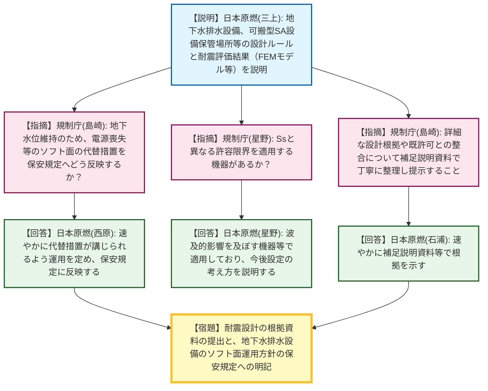
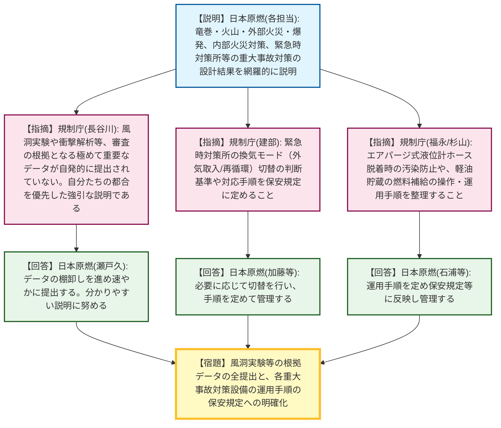
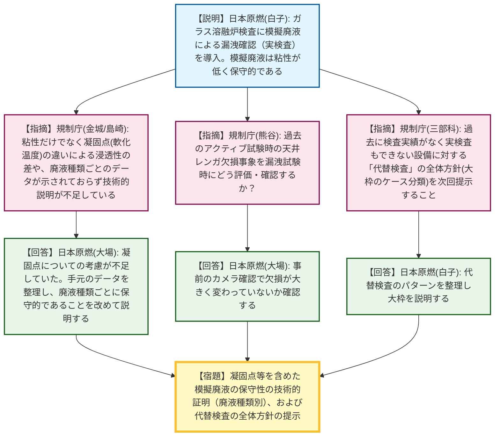
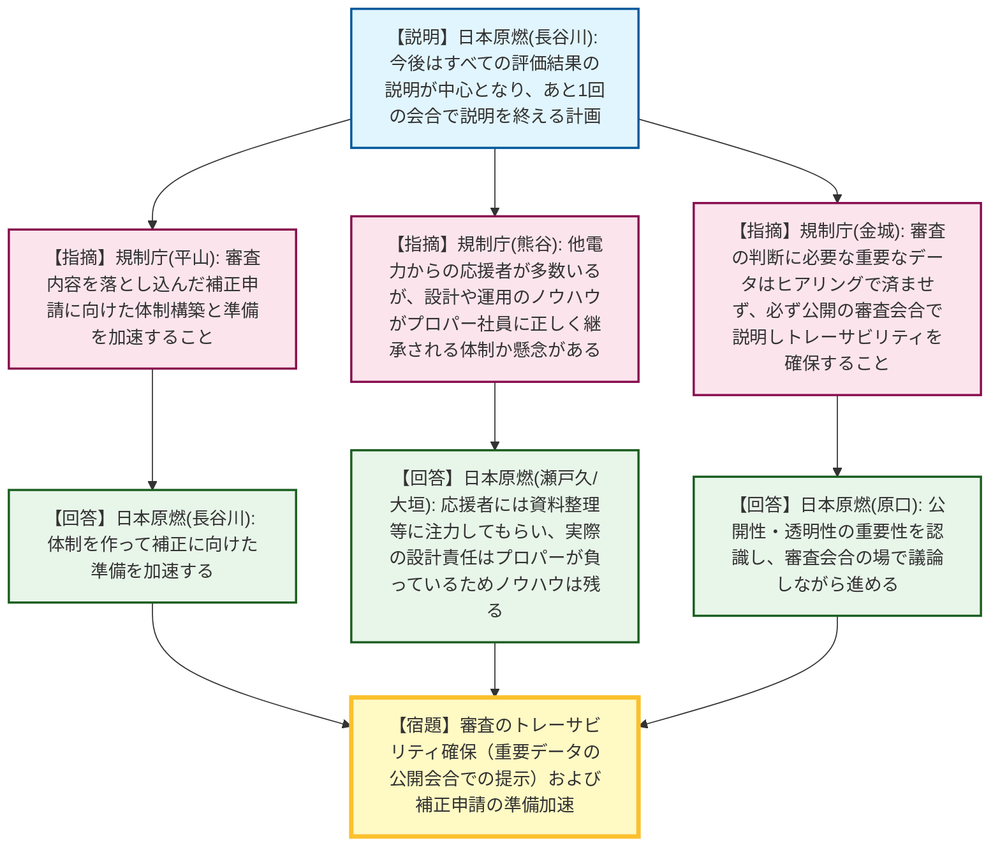

# 第580回核燃料施設等の新規制基準適合性に係る審査会合（令和8年4月27日）
> 出典 : https://youtube.com/live/-Ev8uSpCiCY?si=vNTgGCpGQDFroMms

# 会合の概要
* **重要データの提出遅れに対する極めて厳しい叱責:** 外部衝撃対策（竜巻の風洞実験や衝撃解析など）において、審査の根拠となる重要な実験データが事業者から自主的に説明されていなかったことに対し、規制庁から「自分たちの都合を優先した強引な説明である」と強い苦言が呈され、速やかな全データの提出と透明性の確保が厳しく要求されました。
* **ガラス溶融炉の実検査導入の評価と技術的根拠の不足:** 使用前事業者検査において、模擬廃液を用いたガラス溶融炉の漏洩確認（実検査）を導入する方針が示されました。これ自体は評価されたものの、模擬廃液が実廃液より保守的であることの技術的根拠（凝固点や軟化温度の違い）の提示が不十分であると指摘され、廃液の種類ごとの詳細データの提示が宿題となりました。
* **トレーサビリティと審査プロセスの透明性確保への強い念押し:** 会合終盤、他電力からの応援者頼みによるノウハウ喪失への懸念が示されたほか、「審査の判断に必要な情報は、ヒアリング等で済ませず必ず公開の審査会合で説明すること」というトレーサビリティと透明性確保の原則について、規制庁幹部から日本原燃へ強い念押しが行われました。

---

# 議題ごとの詳細整理

## 【議題1】耐震設計の設計・評価結果
* **議論の背景と論点:** 地下水排水設備や可搬型SA設備保管場所、建物・構築物および機器の耐震評価結果が説明されました。評価結果の妥当性や、電源喪失時等のソフト面の運用が論点となりました。
* **質疑応答（詳細）:**
    * 【説明者側】日本原燃（三上）より、地下水排水設備および可搬型SA設備保管場所（杭基礎・直接基礎）について、FEMモデル等を用いた地震応答解析の結果、発生応力が許容限界以内であることを説明しました。
    * 【規制側】規制庁（島崎）から、地下水位を維持するために、電源喪失時や設備故障時の代替措置といったソフト面の運用を保安規定等へどう反映するか質問がありました。
    * 【説明者側】日本原燃（西原）は、速やかに代替措置が講じられるよう運用を定め、保安規定に反映していくと回答しました。
    * 【規制側】規制庁（星野）から、基準地震動Ssと異なる許容限界を適用する機器があるか確認を求められました。
    * 【説明者側】日本原燃（星野）は、波及的影響を及ぼす機器等で異なる許容限界を適用しており、今後「6ポツ（評価）」の説明時に設定の考え方を示すと回答しました。
    * 【規制側】規制庁（島崎）から、設計結果の妥当性判断のため、詳細な設計根拠や既許可との整合について補足説明資料で丁寧に整理し提示するよう要求されました。
    * 【説明者側】日本原燃（石浦）は、速やかに補足説明資料等で根拠を示すと合意しました。
* **結論と宿題事項（アクションアイテム）:**
    * 【宿題】耐震設計の詳細な根拠や既許可との整合性について、補足説明資料を整理して提出すること。
    * 【宿題】地下水排水設備の機能維持に係るソフト面（代替措置等）の運用方針を明確化し、保安規定へ反映すること。

## 【議題2】外部衝撃・内部火災・重大事故対策に関する防護設計
* **議論の背景と論点:** 竜巻・火山・外部火災・爆発に対する防護設計、内部火災対策、および重大事故対策（緊急時対策所、軽油貯蔵、計装設備）の具体的な設計結果が説明されました。風洞実験データの未提出問題や、緊急時対策所の換気運用、計装設備のホース脱着時の汚染防止が論点となりました。
* **質疑応答（詳細）:**
    * 【説明者側】日本原燃（沼田、海老名、井倉、宇佐美、林、石川等）より、飛来物防護ネットの風洞実験（風力係数1.2の採用）、森林火災等の輻射熱評価、火災感知器の配置と耐火壁の設計、緊急時対策所の居住性確保、軽油貯蔵の容量、エアパージ式液位計測等の系統構成について網羅的に説明が行われました。
    * 【規制側】規制庁（長谷川）から、風洞実験や衝撃解析など審査の根拠となる極めて重要なデータが、1年近く事業者から自主的に説明されてこなかった事実に対し、「自分たちの都合が優先された強引な説明であり、分かりやすい説明に努めるべき」との強い叱責があり、全データの速やかな整理と提出が厳しく要求されました。
    * 【説明者側】日本原燃（瀬戸久）は、説明の仕方に不備があったことを認め、社内でデータの棚卸しを進め速やかに提出・説明すると回答しました。
    * 【規制側】規制庁（建部）から、緊急時対策所の換気設備について、外気取入モードと再循環モードを事故時の環境を踏まえて適切に切り替えて運用する想定か確認されました。
    * 【説明者側】日本原燃（加藤）は、必要に応じて切り替えを行うと回答しました。
    * 【規制側】規制庁（建部）は、切替の判断基準や対応手順について保安規定に定めて管理するよう求めました。
    * 【規制側】規制庁（福永）から、エアパージ式液位計測システムにおいて、測定用ホースの脱着時の汚染拡大防止対策はどうなっているか質問がありました。
    * 【説明者側】日本原燃（石浦）は、接続位置の工夫でセル雰囲気が上がらないよう配慮し、脱着時の汚染拡大防止は手順を定めて管理すると回答しました。
    * 【規制側】規制庁（杉山）から、軽油貯蔵の燃料補給について、人が確実に操作できる設計と運用手順の整理を求められました。
* **結論と宿題事項（アクションアイテム）:**
    * 【宿題】風洞実験、衝撃解析、爆発実験等の根拠データ（映像記録含む）を全て整理し、速やかに提出・説明すること。
    * 【宿題】緊急時対策所の換気モード切替の判断基準、エアパージ式液位計のホース脱着時の汚染防止手順、軽油貯蔵からの燃料取り出し手順を保安規定等に明確に定めること。

## 【議題3】ガラス溶融炉の使用前事業者検査と確認運転
* **議論の背景と論点:** 竣工前に実施する使用前事業者検査（実検査と記録検査の組み合わせ）と、竣工後に実施する確認運転（処理能力の確認）の切り分けが説明されました。模擬廃液を用いた漏洩確認の妥当性（実廃液との比較）や、過去の記録を用いる代替検査の枠組みが争点となりました。
* **質疑応答（詳細）:**
    * 【説明者側】日本原燃（白子）より、ガラス溶融炉の検査において、過去の記録だけでなく可能な限り実検査（模擬廃液を用いた漏洩確認等）を導入する方針が説明されました。模擬廃液は実廃液より粘性が低く、漏洩確認としてより保守的であると根拠を提示しました。
    * 【規制側】規制庁（佐向川）から、寸法検査において腐食による経年劣化を考慮しているか、また耐火レンガの適切な設置をどう確認するのか質問がありました。
    * 【説明者側】日本原燃（白子、大場）は、腐食代の余裕範囲内であることを確認して合否判定し、耐火レンガは過去の記録に加え、動かす前に炉内をカメラで確認すると回答しました。
    * 【規制側】規制庁（熊谷）から、過去のアクティブ試験時に天井レンガが一部欠損した事象について、漏洩試験時にどう評価するか確認がありました。
    * 【説明者側】日本原燃（大場）は、事前のカメラ確認で欠損状態が大きく変わっていないか確認し、温度上昇速度等の対策は取るが、それ以外に特段の措置はないと回答しました。
    * 【規制側】規制庁（金城、島崎）から、模擬廃液が実廃液より保守的であるとする根拠について、粘性だけでなく「凝固点（軟化温度）」の違いによる浸透性の差や、廃液の種類（高レベル、アルカリ等）ごとの詳細なデータが示されておらず、技術的説明が不足していると厳しく指摘されました。
    * 【説明者側】日本原燃（大場）は、凝固点についての考慮が不足していたことを認め、手元のデータを整理し、廃液の種類ごとに保守的であることを改めて説明すると回答しました。
    * 【規制側】規制庁（三部科）から、過去に検査を実施しておらず今回も実検査ができない設備に対する「代替検査」の全体方針（大枠のケース分類と対応方針）を次回提示するよう要求されました。
    * 【説明者側】日本原燃（白子）は、代替検査のパターンを整理しており、大枠について説明すると合意しました。
    * 【規制側】規制庁（金城、熊谷）から、確認運転を竣工後に回す変更に伴い、新たな使用済燃料の受け入れ（せん断開始）との関係をステークホルダーに説明する必要があること、また高レベル廃液を減らした状態に保つ運用を保安規定に明記するよう求められました。
    * 【説明者側】日本原燃（瀬戸久）は、ステークホルダーへの説明の必要性を認識し、廃液低減の運用は保安規定に宣言して規制検査で監視を受ける体制とすると回答しました。
* **結論と宿題事項（アクションアイテム）:**
    * 【宿題】模擬廃液による漏洩確認が実廃液よりも保守的であることの技術的根拠（凝固点・軟化温度の差など）を、廃液の種類ごとにデータを添えて説明すること。
    * 【宿題】実検査が不可能な設備に対する「代替検査」の全体方針（ケース分類と対応方針）を整理し、次回説明すること。
    * 【宿題】提出済みの「使用前事業者検査の実施方針」を、今回の実検査拡充の方針を反映した形に修正し再提出すること。

## 【議題4】全体計画および今後の審査・補正申請に向けた対応
* **議論の背景と論点:** 今後の審査スケジュールと、審査会合で議論された内容を反映する「補正申請」に向けた事業者の体制構築、および審査の透明性・トレーサビリティの確保が論点となりました。
* **質疑応答（詳細）:**
    * 【説明者側】日本原燃（長谷川）より、今後の説明は「6ポツ（すべての評価結果）」が中心となり、あと1回の会合で一通りの説明を終える計画であることが示されました。
    * 【規制側】規制庁（平山）から、審査内容を落とし込んだ補正申請に向けた体制構築と準備を加速するよう要求がありました。
    * 【規制側】規制庁（熊谷）から、他電力からの応援者が多数入っている状況において、設計や運用のノウハウがプロパー社員に正しく継承され残る体制になっているか懸念が示されました。
    * 【説明者側】日本原燃（瀬戸久、大垣）は、応援者には分かりやすい説明資料の整理等に注力してもらっており、実際の設計の責任はプロパー社員が負っているため、ノウハウは確実に残ると反論・説明しました。
    * 【規制側】規制庁（金城）から、審査の判断に必要な重要なデータや補足説明資料の内容について、ヒアリング等の非公開の場だけで済ませず、「必ず公開の審査会合で説明し、事実確認の記録を残すこと」というトレーサビリティと透明性確保の原則が強く念押しされました。
    * 【説明者側】日本原燃（原口等）は、公開性・透明性の重要性を認識し、必要な内容は審査会合で議論しながら進めると合意しました。
* **結論と宿題事項（アクションアイテム）:**
    * 全体計画に基づき、次回会合で残りの評価結果の説明を行うこととなりました。
    * 【宿題】審査の判断根拠となる補足説明資料や実験データ等については、必ず公開の審査会合の場で提示・説明し、審査のトレーサビリティを確保すること。
    * 【宿題】審査結果を反映した補正申請書の作成に向け、社内体制を強化し準備を加速すること。

---

# 論理構造の可視化（Mermaid）

以下に各議題の議論のフローをMermaid形式で記述します。

