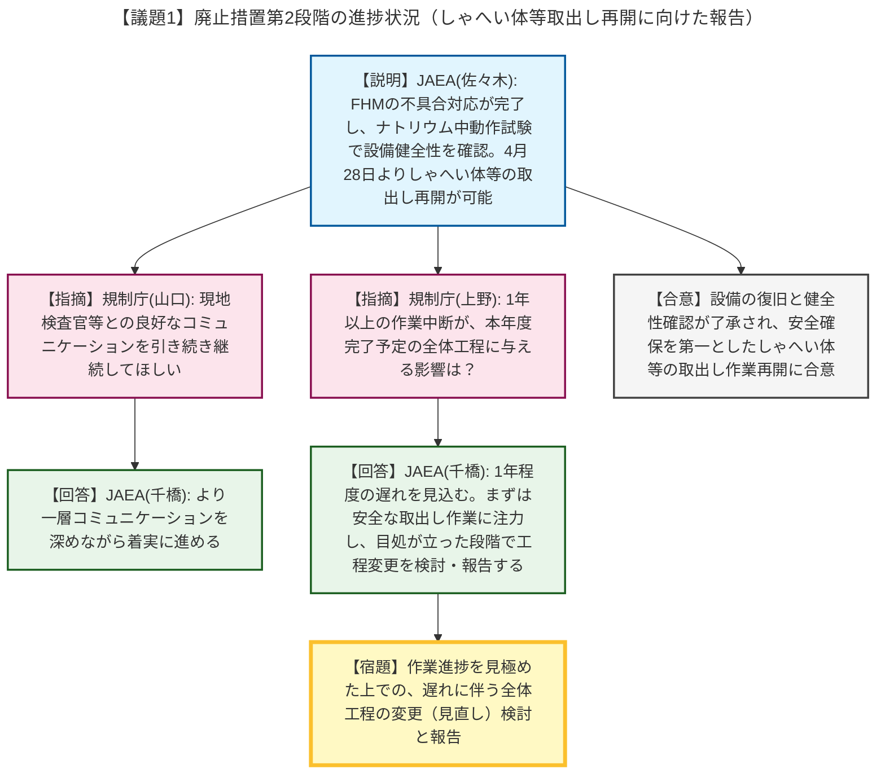

# 第52回もんじゅ廃止措置安全監視チーム（令和8年4月27日）
> 出典 : https://youtube.com/live/ai2M5Qq95-8?si=JGe4cOW5VcreVRiG

# 会合の概要
* **設備不具合からの復旧と作業再開への見通し:** 燃料交換装置（FHM）のグリッパー動作不可事象および爪開閉モーター破損事象に対する復旧作業、再発防止対策、ならびに気中およびナトリウム中での動作試験が完了したことが報告されました。設備の健全性が確認されたことで、1年以上中断していた「しゃへい体等」の取り出し作業が早ければ4月28日から再開可能と判断され、規制側もこれを了承しました。
* **工程への影響と今後の見直し:** 規制側から、長期間の中断が今年度完了予定の全体工程に与える影響について鋭い確認が行われました。JAEAは「当初計画から1年程度の遅れが見込まれる」と率直に認めた上で、まずは安全かつ確実な取り出し作業に全力を注ぎ、進捗の目処が立った段階で全体工程の見直しを検討・報告することで合意しました。
* **現場とのコミュニケーションの重視:** 規制側より、現地検査官等との円滑なコミュニケーションが図られている現状を評価しつつ、今後もそれを継続するよう要請があり、JAEA側も一層深めていく決意を示しました。

---

# 議題ごとの詳細整理

## 【議題1】廃止措置第2段階の進捗状況（しゃへい体等取出し再開に向けた報告）
* **議論の背景と論点:** 過去に発生したFHM（燃料交換装置）の不具合により、しゃへい体等の取り出し作業が1年以上にわたり中断していました。対策を講じた後の設備の健全性確認の結果と、作業再開に向けた準備状況、さらには長期間の中断に伴う全体スケジュール（工程）への影響が論点となりました。
* **質疑応答（詳細）:**
    * 【説明者側】JAEA（近藤・佐々木）より、FHMグリッパーの摺動傷対策（物理的制限、表面硬化処理等）や爪開閉モーターのクリアランス確保などの復旧対応を完了したことが説明されました。また、ナトリウム中での動作試験および定期事業者検査を通じてトルク値等に異常がないことを確認し、設備の健全性が担保されたため、早ければ4月28日よりしゃへい体等の取り出し作業を再開する準備が整ったと報告しました。
    * 【規制側】規制庁（山口）から、現地視察や検査官からの報告を通じて、現在現場でしっかりとしたコミュニケーションが取られていると認識しているとし、今後もこの良好なコミュニケーションを継続するよう要望がありました。
    * 【説明者側】JAEA（千橋）は、今後も一層コミュニケーションを深めながら、ハード・ソフト両面で着実に進めていくと同意しました。
    * 【規制側】規制庁（上野）から、本年度中に取り出しを完了させるという当初の工程に対し、1年以上の作業中断がどのような影響を与えると考えているか、説明を求められました。
    * 【説明者側】JAEA（千橋）は、当初計画から1年程度の遅れが見込まれると回答・根拠提示しました。その上で、まずは再開する取り出し作業を安全かつ確実に進めることに全力を注ぎ、進捗の目処が立った段階で工程の変更（見直し）を検討し、適時規制庁へ報告すると回答しました。
    * 【規制側】規制庁（上野）は、工程の見直しについて引き続き準備を進めるよう求めました。
* **結論と宿題事項（アクションアイテム）:**
    * 燃料交換装置の設備復旧および健全性が確認され、安全確保を第一としてしゃへい体等の取り出し作業を再開することが了承されました。
    * 【宿題】JAEAは、再開後の作業進捗状況を見極めた上で、1年程度の遅れが見込まれる全体工程の変更（見直し）について検討し、適時規制庁へ報告すること。

---

# 論理構造の可視化（Mermaid）

以下に本議題の議論のフローをMermaid形式で記述します。

